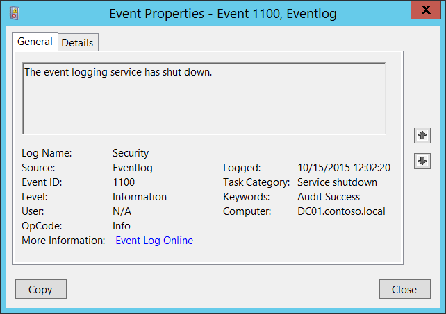

# 1100(S): イベント ログ サービスがシャットダウンしました。




***サブカテゴリ:***&nbsp;[その他のイベント](other-events.md)

***イベントの説明:***

このイベントは、Windows イベント ログ サービスがシャットダウンするたびに生成されます。

通常のシステム シャットダウン中にも生成されます。

このイベントは、緊急システム リセット中には生成されません。

> **注**&nbsp;&nbsp;推奨事項については、このイベントの[セキュリティ監視の推奨事項](#security-monitoring-recommendations)を参照してください。

<br clear="all">

***イベント XML:***
```
- <Event xmlns="http://schemas.microsoft.com/win/2004/08/events/event">
- <System>
 <Provider Name="Microsoft-Windows-Eventlog" Guid="{fc65ddd8-d6ef-4962-83d5-6e5cfe9ce148}" /> 
 <EventID>1100</EventID> 
 <Version>0</Version> 
 <Level>4</Level> 
 <Task>103</Task> 
 <Opcode>0</Opcode> 
 <Keywords>0x4020000000000000</Keywords> 
 <TimeCreated SystemTime="2015-10-15T07:02:20.010585400Z" /> 
 <EventRecordID>1048124</EventRecordID> 
 <Correlation /> 
 <Execution ProcessID="820" ThreadID="964" /> 
 <Channel>Security</Channel> 
 <Computer>DC01.contoso.local</Computer> 
 <Security /> 
 </System>
- <UserData>
 <ServiceShutdown xmlns="http://manifests.microsoft.com/win/2004/08/windows/eventlog" /> 
 </UserData>
 </Event>

```

***必要なサーバー ロール:*** なし。

***最小 OS バージョン:*** Windows Server 2008、Windows Vista。

***イベント バージョン:*** 0。

## セキュリティ監視の推奨事項

1100(S): イベント ログ サービスがシャットダウンしました。

-   このイベントを使用して、システムのシャットダウンと再起動を追跡できます。

-   このイベントは、誰かがログ サービスをシャットダウンして活動を隠そうとした場合の悪意のある行動の兆候である可能性もあります。
