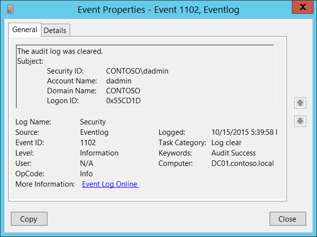

# 1102(S): 監査ログがクリアされました。



***サブカテゴリ:***&nbsp;[その他のイベント](other-events.md)

***イベントの説明:***

このイベントは、Windowsセキュリティ監査ログがクリアされるたびに生成されます。

> **注**&nbsp;&nbsp;推奨事項については、このイベントの[セキュリティ監視の推奨事項](#security-monitoring-recommendations)を参照してください。

<br clear="all">

***イベントXML:***
```
- <Event xmlns="http://schemas.microsoft.com/win/2004/08/events/event">
- <System>
 <Provider Name="Microsoft-Windows-Eventlog" Guid="{fc65ddd8-d6ef-4962-83d5-6e5cfe9ce148}" /> 
 <EventID>1102</EventID> 
 <Version>0</Version> 
 <Level>4</Level> 
 <Task>104</Task> 
 <Opcode>0</Opcode> 
 <Keywords>0x4020000000000000</Keywords> 
 <TimeCreated SystemTime="2015-10-16T00:39:58.656871200Z" /> 
 <EventRecordID>1087729</EventRecordID> 
 <Correlation /> 
 <Execution ProcessID="820" ThreadID="2644" /> 
 <Channel>Security</Channel> 
 <Computer>DC01.contoso.local</Computer> 
 <Security /> 
 </System>
- <UserData>
- <LogFileCleared xmlns="http://manifests.microsoft.com/win/2004/08/windows/eventlog">
 <SubjectUserSid>S-1-5-21-3457937927-2839227994-823803824-1104</SubjectUserSid> 
 <SubjectUserName>dadmin</SubjectUserName> 
 <SubjectDomainName>CONTOSO</SubjectDomainName> 
 <SubjectLogonId>0x55cd1d</SubjectLogonId> 
 </LogFileCleared>
 </UserData>
 </Event>

```

***必要なサーバー役割:*** なし。

***最小OSバージョン:*** Windows Server 2008, Windows Vista。

***イベントバージョン:*** 0。

***フィールドの説明:***

**サブジェクト:**

-   **セキュリティID** \[タイプ = SID\]**:** システムセキュリティ監査ログをクリアしたアカウントのSID。イベントビューアーは自動的にSIDを解決し、アカウント名を表示しようとします。SIDが解決できない場合、イベントにはソースデータが表示されます。

> **注**&nbsp;&nbsp;**セキュリティ識別子 (SID)** は、信託者（セキュリティプリンシパル）を識別するために使用される可変長の一意の値です。各アカウントには、Active Directoryドメインコントローラーなどの権限によって発行され、セキュリティデータベースに保存される一意のSIDがあります。ユーザーがログオンするたびに、システムはデータベースからそのユーザーのSIDを取得し、そのユーザーのアクセス トークンに配置します。システムは、アクセス トークン内のSIDを使用して、以降のすべてのWindowsセキュリティとのやり取りでユーザーを識別します。SIDがユーザーまたはグループの一意の識別子として使用された場合、それは他のユーザーまたはグループを識別するために再利用されることはありません。SIDの詳細については、[セキュリティ識別子](/windows/access-protection/access-control/security-identifiers)を参照してください。


-   **アカウント名** \[タイプ = UnicodeString\]**:** システムセキュリティ監査ログをクリアしたアカウントの名前。

-   **アカウントドメイン** \[タイプ = UnicodeString\]**:** サブジェクトのドメインまたはコンピュータ名。形式はさまざまで、以下のようなものがあります：

    -   ドメインNETBIOS名の例: CONTOSO

    -   小文字の完全ドメイン名: contoso.local

    -   大文字の完全ドメイン名: CONTOSO.LOCAL

    -   一部の[よく知られたセキュリティプリンシパル](/windows/security/identity-protection/access-control/security-identifiers)の場合、例えばLOCAL SERVICEやANONYMOUS LOGON、このフィールドの値は「NT AUTHORITY」となります。

    -   ローカルユーザーアカウントの場合、このフィールドにはこのアカウントが属するコンピュータまたはデバイスの名前が含まれます。例えば、「Win81」のように。

-   **ログオンID** \[タイプ = HexInt64\]**:** 16進数の値で、最近のイベントと同じログオンIDを含む可能性のあるイベントと関連付けるのに役立ちます。例えば、「[4624](event-4624.md): アカウントが正常にログオンされました。」

## セキュリティ監視の推奨事項

1102(S): 監査ログがクリアされました。

> **重要**&nbsp;&nbsp;このイベントについては、[付録A: 多くの監査イベントに対するセキュリティ監視の推奨事項](appendix-a-security-monitoring-recommendations-for-many-audit-events.md)も参照してください。

-   通常、このイベントは表示されないはずです。ほとんどの場合、セキュリティイベントログを手動でクリアする必要はありません。このイベントを監視し、このアクションが実行された理由を調査することをお勧めします。
