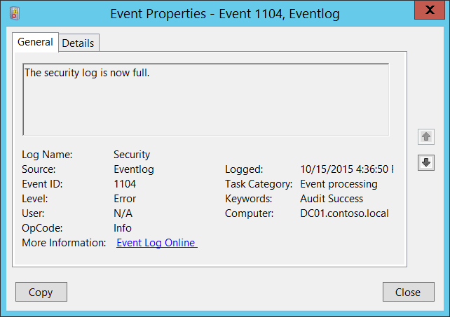

# 1104(S): セキュリティログがいっぱいになりました。



***サブカテゴリ:***&nbsp;[その他のイベント](other-events.md)

***イベントの説明:***

このイベントは、Windowsセキュリティログがいっぱいになるたびに生成されます。

たとえば、セキュリティイベントログファイルの最大サイズに達し、イベントログの保持方法が「[イベントを上書きしない（手動でログをクリア）](/previous-versions/windows/it-pro/windows-server-2003/cc778402(v=ws.10))」に設定されている場合に、このイベントが生成されます。

> **注**&nbsp;&nbsp;推奨事項については、このイベントの[セキュリティ監視の推奨事項](#security-monitoring-recommendations)を参照してください。

<br clear="all">

***イベント XML:***
```
- <Event xmlns="http://schemas.microsoft.com/win/2004/08/events/event">
- <System>
 <Provider Name="Microsoft-Windows-Eventlog" Guid="{fc65ddd8-d6ef-4962-83d5-6e5cfe9ce148}" /> 
 <EventID>1104</EventID> 
 <Version>0</Version> 
 <Level>2</Level> 
 <Task>101</Task> 
 <Opcode>0</Opcode> 
 <Keywords>0x4020000000000000</Keywords> 
 <TimeCreated SystemTime="2015-10-15T23:36:50.479431200Z" /> 
 <EventRecordID>1087728</EventRecordID> 
 <Correlation /> 
 <Execution ProcessID="820" ThreadID="4224" /> 
 <Channel>Security</Channel> 
 <Computer>DC01.contoso.local</Computer> 
 <Security /> 
 </System>
- <UserData>
 <FileIsFull xmlns="http://manifests.microsoft.com/win/2004/08/windows/eventlog" /> 
 </UserData>
 </Event>

```

***必要なサーバー役割:*** なし。

***最小 OS バージョン:*** Windows Server 2008, Windows Vista。

***イベントバージョン:*** 0。

## セキュリティ監視の推奨事項

-   セキュリティイベントログの保持方法が「[イベントを上書きしない（手動でログをクリア）](/previous-versions/windows/it-pro/windows-server-2003/cc778402(v=ws.10))」に設定されている場合、このイベントはログファイルがいっぱいであり、ログをアーカイブするかクリアするなどの即時のアクションが必要であることを示します。
