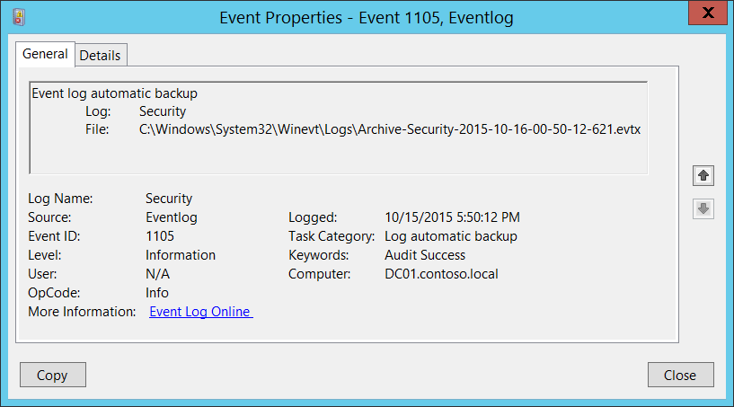

# 1105(S): イベントログの自動バックアップ



***サブカテゴリ:***&nbsp;[その他のイベント](other-events.md)

***イベントの説明:***

このイベントは、Windowsセキュリティログが満杯になり、新しいイベントログファイルが作成されるたびに生成されます。

例えば、セキュリティイベントログファイルの最大サイズに達し、イベントログの保持方法が「[満杯になったらログをアーカイブし、イベントを上書きしない](/previous-versions/windows/it-pro/windows-server-2008-R2-and-2008/cc721981(v=ws.11))」の場合、このイベントが生成されます。

> **注**&nbsp;&nbsp;推奨事項については、このイベントの[セキュリティ監視の推奨事項](#security-monitoring-recommendations)を参照してください。

<br clear="all">

***イベント XML:***
```xml
- <Event xmlns="http://schemas.microsoft.com/win/2004/08/events/event">
- <System>
 <Provider Name="Microsoft-Windows-Eventlog" Guid="{fc65ddd8-d6ef-4962-83d5-6e5cfe9ce148}" /> 
 <EventID>1105</EventID> 
 <Version>0</Version> 
 <Level>4</Level> 
 <Task>105</Task> 
 <Opcode>0</Opcode> 
 <Keywords>0x4020000000000000</Keywords> 
 <TimeCreated SystemTime="2015-10-16T00:50:12.715302700Z" /> 
 <EventRecordID>1128551</EventRecordID> 
 <Correlation /> 
 <Execution ProcessID="820" ThreadID="3660" /> 
 <Channel>Security</Channel> 
 <Computer>DC01.contoso.local</Computer> 
 <Security /> 
 </System>
- <UserData>
- <AutoBackup xmlns="http://manifests.microsoft.com/win/2004/08/windows/eventlog">
 <Channel>Security</Channel> 
 <BackupPath>C:\\Windows\\System32\\Winevt\\Logs\\Archive-Security-2015-10-16-00-50-12-621.evtx</BackupPath> 
 </AutoBackup>
 </UserData>
 </Event>

```

***必要なサーバー役割:*** なし。

***最小 OS バージョン:*** Windows Server 2008, Windows Vista。

***イベントバージョン:*** 0。

***フィールドの説明:***

**ログ** \[タイプ = UnicodeString\]: アーカイブされたログの名前（新しいイベントログファイルが作成され、以前のイベントログがアーカイブされました）。セキュリティイベントログの場合は常に「**Security**」。

**ファイル**: \[タイプ = FILETIME\]: アーカイブされたログファイルのフルパスとファイル名。

アーカイブされたログファイル名の形式は「Archive-LOG\_FILE\_NAME-YYYY-MM-DD-hh-mm-ss-nnn.evtx」です。ここで：

-   LOG\_FILE\_NAME – アーカイブされたファイルの名前。

-   Y – 年。

-   M – 月。

-   D – 日。

-   h – 時。

-   m – 分。

-   s – 秒。

-   n – 小数秒。

このイベントの時間は常に ***GMT+0/UTC+0*** タイムゾーンです。

## セキュリティ監視の推奨事項

1105(S): イベントログの自動バックアップ。

-   通常、これは情報提供のイベントであり、特にアクションは必要ありません。しかし、ベースライン設定が[ログがいっぱいになったときにアーカイブし、イベントを上書きしない](/previous-versions/windows/it-pro/windows-server-2008-R2-and-2008/cc721981(v=ws.11))に設定されていない場合、このイベントは一部の設定がベースライン設定に設定されていないか、変更されたことを示すサインとなります。
