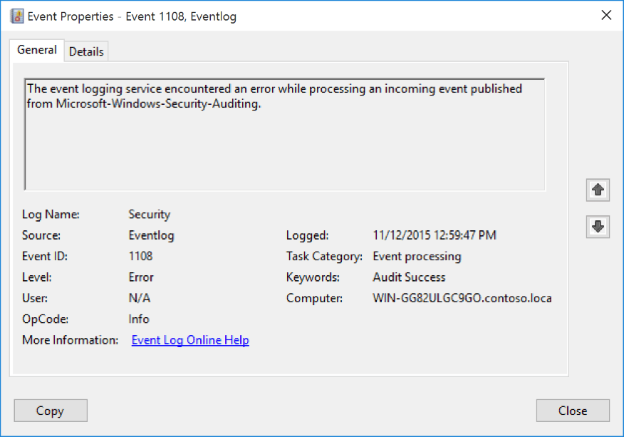
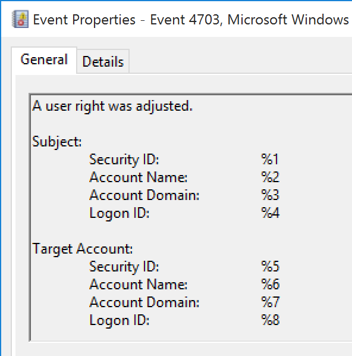

# 1108(S): イベント ロギング サービスが %1 から公開された受信イベントを処理中にエラーが発生しました。



***サブカテゴリ:***&nbsp;[その他のイベント](other-events.md)

***イベントの説明:***

このイベントは、イベント ロギング サービスが受信イベントを処理中にエラーが発生したときに生成されます。

通常、ロギング サービスがイベントをイベント ログに正しく書き込めない場合や、イベントを正しく記録するためのパラメーターがロギング サービスに渡されなかった場合に生成されます。通常、1108の前に欠陥のあるまたは不正確なイベントが表示されます。

たとえば、不正確な[4703](event-4703.md)イベントの後にイベント1108が生成されることがあります。



> **注**&nbsp;&nbsp;推奨事項については、このイベントの[セキュリティ監視の推奨事項](#security-monitoring-recommendations)を参照してください。

<br clear="all">

***イベント XML:***
```xml
- <Event xmlns="http://schemas.microsoft.com/win/2004/08/events/event">
- <System>
 <Provider Name="Microsoft-Windows-Eventlog" Guid="{fc65ddd8-d6ef-4962-83d5-6e5cfe9ce148}" /> 
 <EventID>1108</EventID> 
 <Version>0</Version> 
 <Level>2</Level> 
 <Task>101</Task> 
 <Opcode>0</Opcode> 
 <Keywords>0x4020000000000000</Keywords> 
 <TimeCreated SystemTime="2015-11-12T20:59:47.431979300Z" /> 
 <EventRecordID>5599</EventRecordID> 
 <Correlation /> 
 <Execution ProcessID="972" ThreadID="1320" /> 
 <Channel>Security</Channel> 
 <Computer>WIN-GG82ULGC9GO.contoso.local</Computer> 
 <Security /> 
 </System>
- <UserData>
- <EventProcessingFailure xmlns="http://manifests.microsoft.com/win/2004/08/windows/eventlog">
 <Error Code="15005" /> 
 <EventID>0</EventID> 
 <PublisherID>Microsoft-Windows-Security-Auditing</PublisherID> 
 </EventProcessingFailure>
 </UserData>
</Event>

```

***必要なサーバー ロール:*** なし。

***最小 OS バージョン:*** Windows Server 2008 R2、Windows 7。

***イベント バージョン:*** 0。

***フィールドの説明:***

**%1** \[タイプ = UnicodeString\]: 処理のためにイベントが受信された[セキュリティ イベント ソース](/windows/win32/eventlog/event-sources)の名前。このレジストリ パスで登録されているすべてのセキュリティ イベント ソース名を確認できます: “HKEY\_LOCAL\_MACHINE\\SYSTEM\\CurrentControlSet\\Services\\EventLog\\Security”。以下はその例です:


## セキュリティ監視の推奨事項

1108(S): イベント ログ サービスが %1 から公開された受信イベントの処理中にエラーに遭遇しました。

-   このタイプのすべてのイベントを監視し、エラーの原因を確認することをお勧めします。
