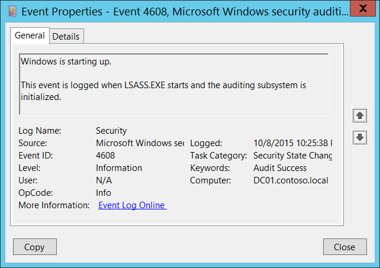

# 4608(S): Windows が起動しています。




***サブカテゴリ:***&nbsp;[セキュリティ状態の変更の監査](audit-security-state-change.md)

***イベントの説明:***

このイベントは、LSASS.EXE プロセスが開始され、監査サブシステムが初期化されたときに記録されます。

通常、オペレーティング システムの起動プロセス中に生成されます。

> [!NOTE]
> 推奨事項については、このイベントの[セキュリティ監視の推奨事項](#security-monitoring-recommendations)を参照してください。

<br clear="all">

***イベント XML:***
```xml
- <Event xmlns="http://schemas.microsoft.com/win/2004/08/events/event">
- <System>
 <Provider Name="Microsoft-Windows-Security-Auditing" Guid="{54849625-5478-4994-A5BA-3E3B0328C30D}" /> 
 <EventID>4608</EventID> 
 <Version>0</Version> 
 <Level>0</Level> 
 <Task>12288</Task> 
 <Opcode>0</Opcode> 
 <Keywords>0x8020000000000000</Keywords> 
 <TimeCreated SystemTime="2015-10-09T05:25:38.222242500Z" /> 
 <EventRecordID>1101704</EventRecordID> 
 <Correlation /> 
 <Execution ProcessID="508" ThreadID="512" /> 
 <Channel>Security</Channel> 
 <Computer>DC01.contoso.local</Computer> 
 <Security /> 
 </System>
 <EventData /> 
 </Event>

```

***必要なサーバー ロール:*** なし。

***最小 OS バージョン:*** Windows Server 2008、Windows Vista。

***イベント バージョン:*** 0。

## セキュリティ監視の推奨事項

4608(S): Windows が起動しています。

-   このイベントを使用して、システムの起動イベントを追跡できます。
