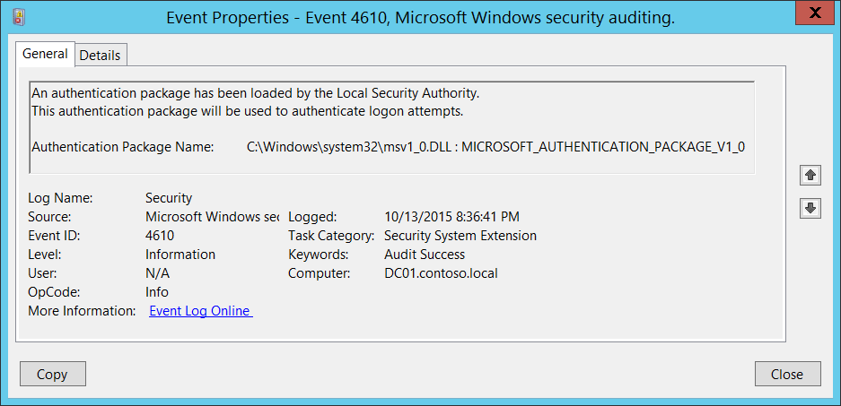

# 4610(S): ローカル セキュリティ機関によって認証パッケージが読み込まれました。




***サブカテゴリ:***&nbsp;[セキュリティ システム拡張の監査](audit-security-system-extension.md)

***イベントの説明:***

このイベントは、[認証パッケージ](/windows/win32/secauthn/authentication-packages) がローカル セキュリティ機関 ([LSA](/windows/win32/secauthn/lsa-authentication)) によって読み込まれるたびに生成されます。

システムが起動するたびに、LSA は **HKEY\_LOCAL\_MACHINE\\SYSTEM\\CurrentControlSet\\Control\\Lsa\\Authentication Packages** レジストリ値から認証パッケージ DLL を読み込み、これらの DLL にあるすべてのパッケージの初期化シーケンスを実行します。

> **注**&nbsp;&nbsp;推奨事項については、このイベントの[セキュリティ監視の推奨事項](#security-monitoring-recommendations)を参照してください。

<br clear="all">

***イベント XML:***
```
- <Event xmlns="http://schemas.microsoft.com/win/2004/08/events/event">
- <System>
 <Provider Name="Microsoft-Windows-Security-Auditing" Guid="{54849625-5478-4994-A5BA-3E3B0328C30D}" /> 
 <EventID>4610</EventID> 
 <Version>0</Version> 
 <Level>0</Level> 
 <Task>12289</Task> 
 <Opcode>0</Opcode> 
 <Keywords>0x8020000000000000</Keywords> 
 <TimeCreated SystemTime="2015-10-14T03:36:41.391489300Z" /> 
 <EventRecordID>1048138</EventRecordID> 
 <Correlation /> 
 <Execution ProcessID="516" ThreadID="520" /> 
 <Channel>Security</Channel> 
 <Computer>DC01.contoso.local</Computer> 
 <Security /> 
 </System>
- <EventData>
 <Data Name="AuthenticationPackageName">C:\\Windows\\system32\\msv1\_0.DLL : MICROSOFT\_AUTHENTICATION\_PACKAGE\_V1\_0</Data> 
 </EventData>
 </Event>

```

***必要なサーバー ロール:*** なし。

***最小 OS バージョン:*** Windows Server 2008, Windows Vista。

***イベント バージョン:*** 0。

***フィールドの説明:***

**認証パッケージ名** \[型 = UnicodeString\]**:** 読み込まれた [認証パッケージ](/windows/win32/secauthn/authentication-packages) の名前。形式は DLL\_PATH\_AND\_NAME: AUTHENTICATION\_PACKAGE\_NAME です。

デフォルトでは、Windows 10 によって読み込まれる唯一の認証パッケージは “[MICROSOFT\_AUTHENTICATION\_PACKAGE\_V1\_0](/windows/win32/secauthn/msv1-0-authentication-package)” です。

## セキュリティ監視の推奨事項

4610(S): ローカル セキュリティ機関によって認証パッケージが読み込まれました。

-   すべての「**Authentication Package Name**」が「C:\\Windows\\system32\\msv1\_0.DLL : MICROSOFT\_AUTHENTICATION\_PACKAGE\_V1\_0」と等しくない場合を報告します。なぜなら、デフォルトではこれがWindows 10によって読み込まれる唯一の認証パッケージだからです。

-   通常、このイベントは情報提供を目的としています。システム内で許可された認証パッケージの事前定義リストがある場合、「**Authentication Package Name**」が定義リストに含まれているかどうかを確認できます。
