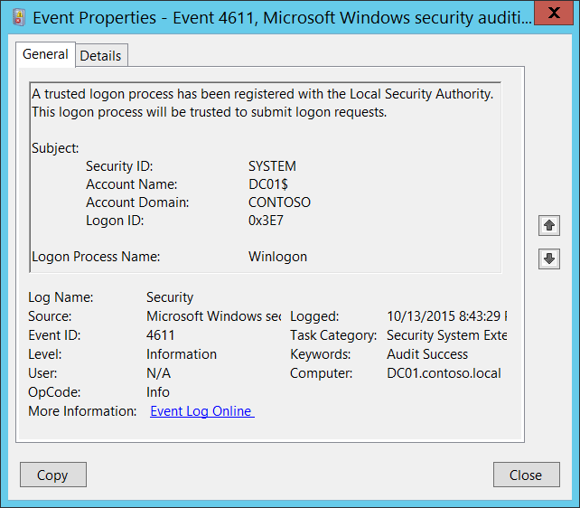

# 4611(S): 信頼されたログオンプロセスがローカルセキュリティ機関に登録されました。




***サブカテゴリ:***&nbsp;[セキュリティシステム拡張の監査](audit-security-system-extension.md)

***イベントの説明:***

このイベントは、ログオンプロセスがローカルセキュリティ機関 ([LSA](/windows/win32/secauthn/lsa-authentication)) に登録されたことを示します。また、これ以降、このソースからのログオン要求が受け入れられるようになります。

技術的なレベルでは、このイベントは信頼されたログオンプロセスの登録からではなく、そのプロセスが信頼されたログオンプロセスであることの確認から発生します。信頼されたログオンプロセスであれば、イベントが生成されます。

ログオンプロセスは、ネットワーク、インタラクティブなどの異なるログオン方法に対して全体的なログオン機能を処理するオペレーティングシステムの信頼された部分です。

通常、これらのイベントはオペレーティングシステムの起動時やユーザーのログオンおよび認証アクション中に表示されます。

> **注**&nbsp;&nbsp;推奨事項については、このイベントの[セキュリティ監視の推奨事項](#security-monitoring-recommendations)を参照してください。

<br clear="all">

***イベント XML:***
```xml
- <Event xmlns="http://schemas.microsoft.com/win/2004/08/events/event">
- <System>
 <Provider Name="Microsoft-Windows-Security-Auditing" Guid="{54849625-5478-4994-A5BA-3E3B0328C30D}" /> 
 <EventID>4611</EventID> 
 <Version>0</Version> 
 <Level>0</Level> 
 <Task>12289</Task> 
 <Opcode>0</Opcode> 
 <Keywords>0x8020000000000000</Keywords> 
 <TimeCreated SystemTime="2015-10-14T03:43:29.604031000Z" /> 
 <EventRecordID>1048175</EventRecordID> 
 <Correlation /> 
 <Execution ProcessID="516" ThreadID="548" /> 
 <Channel>Security</Channel> 
 <Computer>DC01.contoso.local</Computer> 
 <Security /> 
 </System>
- <EventData>
 <Data Name="SubjectUserSid">S-1-5-18</Data> 
 <Data Name="SubjectUserName">DC01$</Data> 
 <Data Name="SubjectDomainName">CONTOSO</Data> 
 <Data Name="SubjectLogonId">0x3e7</Data> 
 <Data Name="LogonProcessName">Winlogon</Data> 
 </EventData>
 </Event>

```

***必要なサーバー役割:*** なし。

***最小 OS バージョン:*** Windows Server 2008, Windows Vista。

***イベントバージョン:*** 0。

***フィールドの説明:***

**サブジェクト:**

-   **セキュリティ ID** \[タイプ = SID\]**:** 信頼されたログオンプロセスを登録したアカウントの SID。イベントビューアーは自動的に SID を解決してアカウント名を表示しようとします。SID を解決できない場合、イベントにソースデータが表示されます。

> **Note**&nbsp;&nbsp;**セキュリティ識別子 (SID)** は、トラスティ (セキュリティプリンシパル) を識別するために使用される可変長の一意の値です。各アカウントには、Active Directory ドメイン コントローラーなどの権限によって発行され、セキュリティ データベースに保存される一意の SID があります。ユーザーがログオンするたびに、システムはデータベースからそのユーザーの SID を取得し、そのユーザーのアクセス トークンに配置します。システムは、アクセス トークン内の SID を使用して、Windows セキュリティとのすべての後続のやり取りでユーザーを識別します。SID がユーザーまたはグループの一意の識別子として使用された場合、それは他のユーザーまたはグループを識別するために再び使用されることはありません。SID の詳細については、[セキュリティ識別子](/windows/access-protection/access-control/security-identifiers) を参照してください。

-   **アカウント名** \[タイプ = UnicodeString\]**:** 信頼されたログオン プロセスを登録したアカウントの名前。

-   **アカウント ドメイン** \[タイプ = UnicodeString\]**:** サブジェクトのドメインまたはコンピュータ名。形式はさまざまで、次のようなものがあります:

    -   ドメイン NETBIOS 名の例: CONTOSO

    -   小文字の完全なドメイン名: contoso.local

    -   大文字の完全なドメイン名: CONTOSO.LOCAL

    -   LOCAL SERVICE や ANONYMOUS LOGON などの[よく知られたセキュリティ プリンシパル](/windows/security/identity-protection/access-control/security-identifiers)の場合、このフィールドの値は「NT AUTHORITY」となります。

    -   ローカル ユーザー アカウントの場合、このフィールドには、このアカウントが属するコンピュータまたはデバイスの名前が含まれます。例: 「Win81」。

-   **ログオン ID** \[タイプ = HexInt64\]**:** このイベントを、同じログオン ID を含む可能性のある最近のイベントと関連付けるのに役立つ 16 進数値。例: 「[4624](event-4624.md): アカウントが正常にログオンされました。」

**ログオン プロセス名** \[タイプ = UnicodeString\]**:** 登録されたログオン プロセスの名前。

## セキュリティ監視の推奨事項

4611(S): 信頼されたログオン プロセスがローカル セキュリティ機関に登録されました。

> **重要**&nbsp;&nbsp;このイベントについては、[付録 A: 多くの監査イベントに対するセキュリティ監視の推奨事項](appendix-a-security-monitoring-recommendations-for-many-audit-events.md) も参照してください。

-   このイベントは通常、SYSTEMアカウントによってトリガーされるため、**「Subject\\Security ID」**がSYSTEMでない場合は報告することをお勧めします。

-   通常、このイベントは情報提供を目的としています。システムで許可されたログオンプロセスのリストを定義している場合、「**Logon Process Name**」フィールドの値が許可リストに含まれているかどうかを確認できます。

-
