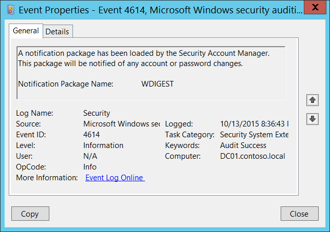

# 4614(S): セキュリティ アカウント マネージャーによって通知パッケージが読み込まれました。




***サブカテゴリー:***&nbsp;[セキュリティ システム拡張の監査](audit-security-system-extension.md)

***イベントの説明:***

このイベントは、[セキュリティ アカウント マネージャー](/previous-versions/windows/it-pro/windows-server-2003/cc756748(v=ws.10))によって通知パッケージが読み込まれるたびに生成されます。

実際には、Windows Vista 以降、通知パッケージは afs [パスワード フィルター](/windows/win32/secmgmt/password-filters)として解釈されるべきです。

パスワード フィルターは、パスワードが設定または変更されるときに読み込まれるか呼び出される DLL です。

システムが起動するたびに、**HKEY\_LOCAL\_MACHINE\\SYSTEM\\CurrentControlSet\\Control\\Lsa\\Notification Packages** レジストリ値から通知パッケージ DLL を読み込み、各パッケージの初期化シーケンスを実行します。

> **注**&nbsp;&nbsp;推奨事項については、このイベントの[セキュリティ監視の推奨事項](#security-monitoring-recommendations)を参照してください。

<br clear="all">

***イベント XML:***
```xml
- <Event xmlns="http://schemas.microsoft.com/win/2004/08/events/event">
- <System>
 <Provider Name="Microsoft-Windows-Security-Auditing" Guid="{54849625-5478-4994-A5BA-3E3B0328C30D}" /> 
 <EventID>4614</EventID> 
 <Version>0</Version> 
 <Level>0</Level> 
 <Task>12289</Task> 
 <Opcode>0</Opcode> 
 <Keywords>0x8020000000000000</Keywords> 
 <TimeCreated SystemTime="2015-10-14T03:36:43.073484900Z" /> 
 <EventRecordID>1048140</EventRecordID> 
 <Correlation /> 
 <Execution ProcessID="516" ThreadID="520" /> 
 <Channel>Security</Channel> 
 <Computer>DC01.contoso.local</Computer> 
 <Security /> 
 </System>
- <EventData>
 <Data Name="NotificationPackageName">WDIGEST</Data> 
 </EventData>
 </Event>

```

***必要なサーバーの役割:*** なし。

***最小 OS バージョン:*** Windows Server 2008, Windows Vista。

***イベントバージョン:*** 0。

***フィールドの説明:***

**通知パッケージ名** \[型 = UnicodeString\]**:** 読み込まれた通知パッケージの名前。

## セキュリティ監視の推奨事項

4614(S): セキュリティ アカウント マネージャーによって通知パッケージが読み込まれました。

-   通常、このイベントは情報提供を目的としています。システムで許可された通知パッケージのリストを定義している場合は、「**通知パッケージ名**」フィールドの値が許可リストに含まれているかどうかを確認できます。
