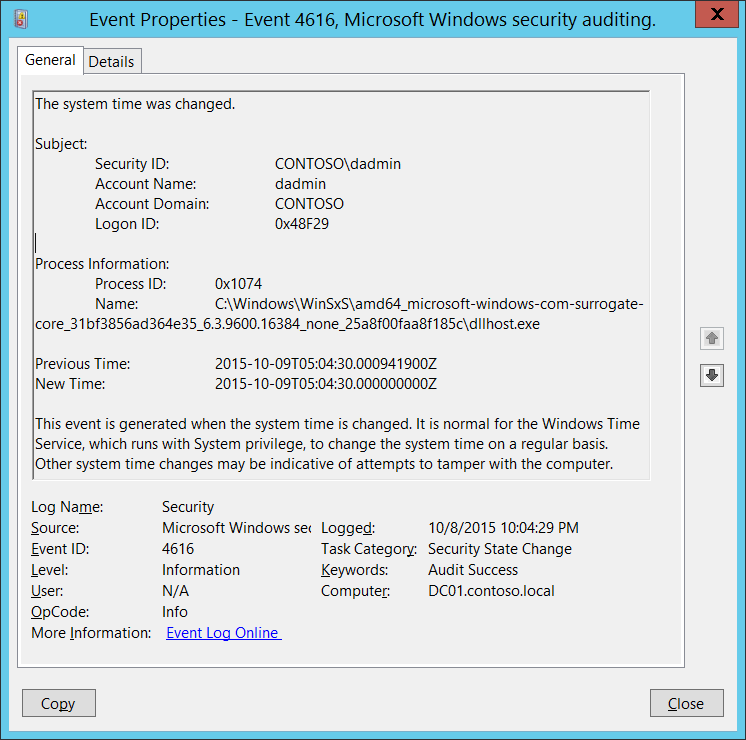

# 4616(S): システム時刻が変更されました。



***サブカテゴリ:***&nbsp;[セキュリティ状態変更の監査](audit-security-state-change.md)

***イベントの説明:***

このイベントはシステム時刻が変更されるたびに生成されます。

このイベントは「セキュリティ状態変更の監査」サブカテゴリの設定に関係なく常に記録されます。

通常、これらのイベントは「**Subject\\Security ID**」が「**LOCAL SERVICE**」であることが多く、これは正常な時刻修正アクションです。

> [!NOTE]
> 推奨事項については、このイベントの[セキュリティ監視の推奨事項](#security-monitoring-recommendations)を参照してください。

<br clear="all">

***イベント XML:***
```xml
- <Event xmlns="http://schemas.microsoft.com/win/2004/08/events/event">
- <System>
 <Provider Name="Microsoft-Windows-Security-Auditing" Guid="{54849625-5478-4994-A5BA-3E3B0328C30D}" /> 
 <EventID>4616</EventID> 
 <Version>1</Version> 
 <Level>0</Level> 
 <Task>12288</Task> 
 <Opcode>0</Opcode> 
 <Keywords>0x8020000000000000</Keywords> 
 <TimeCreated SystemTime="2015-10-09T05:04:29.995794600Z" /> 
 <EventRecordID>1101699</EventRecordID> 
 <Correlation /> 
 <Execution ProcessID="4" ThreadID="148" /> 
 <Channel>Security</Channel> 
 <Computer>DC01.contoso.local</Computer> 
 <Security /> 
 </System>
- <EventData>
 <Data Name="SubjectUserSid">S-1-5-21-3457937927-2839227994-823803824-1104</Data> 
 <Data Name="SubjectUserName">dadmin</Data> 
 <Data Name="SubjectDomainName">CONTOSO</Data> 
 <Data Name="SubjectLogonId">0x48f29</Data> 
 <Data Name="PreviousTime">2015-10-09T05:04:30.000941900Z</Data> 
 <Data Name="NewTime">2015-10-09T05:04:30.000000000Z</Data> 
 <Data Name="ProcessId">0x1074</Data> 
 <Data Name="ProcessName">C:\\Windows\\WinSxS\\amd64\_microsoft-windows-com-surrogate-core\_31bf3856ad364e35\_6.3.9600.16384\_none\_25a8f00faa8f185c\\dllhost.exe</Data> 
 </EventData>
 </Event>

```

***必要なサーバー役割:*** なし。

***最小 OS バージョン:*** Windows Server 2008, Windows Vista。

***イベントバージョン:***

-   0 - Windows Server 2008, Windows Vista。

-   1 - Windows Server 2008 R2, Windows 7。

    -   「プロセス情報」セクションが追加されました。

***フィールドの説明:***

**サブジェクト:**

-   **セキュリティ ID** \[タイプ = SID\]**:** 「システム時刻の変更」操作を要求したアカウントのSID。イベントビューアーは自動的にSIDを解決し、アカウント名を表示しようとします。SIDが解決できない場合、イベントにはソースデータが表示されます。

    > [!NOTE]
    > **セキュリティ識別子 (SID)** は、信託者（セキュリティプリンシパル）を識別するために使用される可変長の一意の値です。各アカウントには、Active Directoryドメインコントローラーなどの権限によって発行され、セキュリティデータベースに保存される一意のSIDがあります。ユーザーがログオンするたびに、システムはデータベースからそのユーザーのSIDを取得し、そのユーザーのアクセストークンに配置します。システムはアクセストークン内のSIDを使用して、以降のすべてのWindowsセキュリティとのやり取りでユーザーを識別します。SIDがユーザーまたはグループの一意の識別子として使用された場合、それは他のユーザーまたはグループを識別するために再利用されることはありません。SIDの詳細については、[セキュリティ識別子](/windows/access-protection/access-control/security-identifiers)を参照してください。

-   **アカウント名** \[タイプ = UnicodeString\]**:** 「システム時間の変更」操作を要求したアカウントの名前。

-   **アカウントドメイン** \[タイプ = UnicodeString\]**:** サブジェクトのドメインまたはコンピュータ名。形式は以下のように異なります：

    -   ドメインのNETBIOS名の例: CONTOSO

    -   小文字の完全なドメイン名: contoso.local

    -   大文字の完全なドメイン名: CONTOSO.LOCAL

    -   LOCAL SERVICEやANONYMOUS LOGONなどの[よく知られたセキュリティプリンシパル](/windows/security/identity-protection/access-control/security-identifiers)の場合、このフィールドの値は「NT AUTHORITY」となります。

    -   ローカルユーザーアカウントの場合、このフィールドにはこのアカウントが属するコンピュータまたはデバイスの名前が含まれます。例: 「Win81」。

-   **ログオンID** \[タイプ = HexInt64\]**:** 16進数の値で、最近のイベントと同じログオンIDを含む可能性のあるイベントとこのイベントを関連付けるのに役立ちます。例: 「[4624](event-4624.md): アカウントが正常にログオンされました。」

**プロセス情報** \[バージョン 1\]**:**

-   **プロセスID** \[タイプ = Pointer\] \[バージョン 1\]: システム時間を変更したプロセスの16進数のプロセスID。プロセスID（PID）は、オペレーティングシステムがアクティブなプロセスを一意に識別するために使用する番号です。特定のプロセスのPIDを確認するには、例えばタスクマネージャー（詳細タブ、PID列）を使用できます：

    

    16進数の値を10進数に変換すると、タスクマネージャーの値と比較できます。

    また、このプロセスIDを他のイベントのプロセスIDと関連付けることもできます。例: 「[4688](event-4688.md): 新しいプロセスが作成されました」 **プロセス情報\\新しいプロセスID**。

-   **名前** \[タイプ = UnicodeString\] \[バージョン 1\]**:** プロセスの実行可能ファイルのフルパスと名前。

**以前の時間** \[タイプ = FILETIME\]: ***UTC***タイムゾーンの以前の時間。形式は**YYYY-MM-DDThh:mm:ss.nnnnnnnZ**です：

-   Y - 年

-   M - 月

-   D - 日

-   T - [ISO 8601](http://www.iso.org/iso/home/standards/iso8601.htm)で指定されている時間要素の開始。

-   h - 時間

-   m - 分

-   s - 秒

-   n - 小数秒

-   Z - ゼロUTCオフセットのゾーン指定子。「09:30 UTC」は「09:30Z」と表されます。「14:45:15 UTC」は「14:45:15Z」となります。

**新しい時間** \[Type = FILETIME\]: ***UTC***タイムゾーンで設定された新しい時間。形式は**YYYY-MM-DDThh:mm:ss.nnnnnnnZ**です：

-   Y - 年

-   M - 月

-   D - 日

-   T - [ISO 8601](http://www.iso.org/iso/home/standards/iso8601.htm)で指定された時間要素の開始。

-   h - 時間

-   m - 分

-   s - 秒

-   n - 小数秒

-   Z - ゼロUTCオフセットのゾーン指定子。「09:30 UTC」は「09:30Z」と表されます。「14:45:15 UTC」は「14:45:15Z」となります。

## セキュリティ監視の推奨事項

4616(S): システム時間が変更されました。

> [!IMPORTANT]
> このイベントについては、[付録A: 多くの監査イベントのためのセキュリティ監視の推奨事項](appendix-a-security-monitoring-recommendations-for-many-audit-events.md)も参照してください。

-   「**Subject\\Security ID**」が**「LOCAL SERVICE」**と等しくないすべてのレポートを報告します。これは、時間変更がWindows Timeサービスによって行われなかったことを意味します。

-   「**Process Information\\Name**」が**「C:\\Windows\\System32\\svchost.exe」**と等しくないすべてのレポートを報告します（svchost.exeへのパスは異なる場合があります。「svchost.exe」の部分文字列を検索できます）。これは、時間変更がWindows Timeサービスによって行われなかったことを意味します。

<!-- -->

-   <span id="Reccomendations_Process_Name" class="anchor"></span>このイベントで報告されたプロセスの「**Process Name**」が事前に定義された値と等しくないすべてのイベントを監視します。

-   「**Process Name**」が標準フォルダ（例えば、**System32**や**Program Files**）にないか、制限されたフォルダ（例えば、**Temporary Internet Files**）にあるかを監視できます。

-   プロセス名に制限された部分文字列や単語（例えば、「**mimikatz**」や「**cain.exe**」）のリストが事前に定義されている場合、「**Process Name**」にこれらの部分文字列が含まれているかを確認します。
