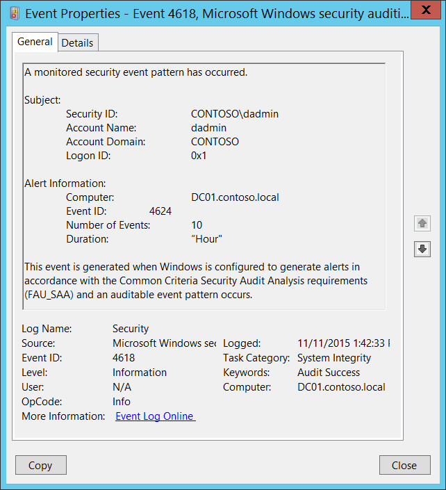

# 4618(S): 監視されたセキュリティイベントパターンが発生しました。

***サブカテゴリ:***&nbsp;[システム整合性の監査](audit-system-integrity.md)

このイベントは、次のコマンドを使用して外部からのみ生成（呼び出し）できます。

**%windir%\\system32\\rundll32 %windir%\\system32\\authz.dll,AuthziGenerateAdminAlertAudit OrgEventId ComputerName UserSid UserName UserDomain UserLogonId EventCount Duration**

このイベントを生成するには、アカウントに**SeAuditPrivilege**（セキュリティ監査の生成）が必要です。

- **UserSid**は、イベントビューアーでイベントを表示するときに解決されます。

- **OrgEventID**、**ComputerName**、および**EventCount**のみが必須で、他はオプションです。指定されていないフィールドは、イベント説明フィールドに「**-**」と表示されます。

- フィールドが期待されるデータ型と一致しない場合、イベントは生成されません。つまり、**EventCount** = “XYZ”の場合、イベントは生成されません。

- **UserSid**、**UserName**、および**UserDomain**は互いに関連していません（**SubjectUser**フィールドのように関連している場合を除く）

- パラメータはスペースで区切られ、パラメータが二重引用符で囲まれていても同様です。

- パラメータの期待されるデータ型は次のとおりです：

| パラメータ    | 期待されるデータ型                               |
|--------------|--------------------------------------------------|
| OrgEventID   | Ulong                                            |
| ComputerName | 文字列                                           |
| UserSid      | SID（文字列形式）                                |
| UserName     | 文字列                                           |
| UserDomain   | 文字列                                           |
| UserLogonID  | Luid（イベントでULongLongを16進数に変換したもの） |
| EventCount   | Ulong                                            |
| Duration     | 文字列                                           |



<br clear="all">

***Event XML:***
```
- <Event xmlns="http://schemas.microsoft.com/win/2004/08/events/event">
- <System>
 <Provider Name="Microsoft-Windows-Security-Auditing" Guid="{54849625-5478-4994-A5BA-3E3B0328C30D}" /> 
 <EventID>4618</EventID> 
 <Version>0</Version> 
 <Level>0</Level> 
 <Task>12290</Task> 
 <Opcode>0</Opcode> 
 <Keywords>0x8020000000000000</Keywords> 
 <TimeCreated SystemTime="2015-11-11T21:42:33.264246700Z" /> 
 <EventRecordID>1198759</EventRecordID> 
 <Correlation /> 
 <Execution ProcessID="500" ThreadID="528" /> 
 <Channel>Security</Channel> 
 <Computer>DC01.contoso.local</Computer> 
 <Security /> 
 </System>
- <EventData>
 <Data Name="EventId">4624</Data> 
 <Data Name="ComputerName">DC01.contoso.local</Data> 
 <Data Name="TargetUserSid">S-1-5-21-3457937927-2839227994-823803824-1104</Data> 
 <Data Name="TargetUserName">dadmin</Data> 
 <Data Name="TargetUserDomain">CONTOSO</Data> 
 <Data Name="TargetLogonId">0x1</Data> 
 <Data Name="EventCount">10</Data> 
 <Data Name="Duration">“Hour"</Data> 
 </EventData>
</Event>

```

***Required Server Roles:*** なし。

***Minimum OS Version:*** Windows Server 2008, Windows Vista。

***Event Versions:*** 0。

## セキュリティ監視の推奨事項

4618(S): 監視されたセキュリティイベントパターンが発生しました。

-   このイベントは手動/意図的にのみ呼び出すことができ、イベント内に入れる情報に応じて解釈するのはあなた次第です。
