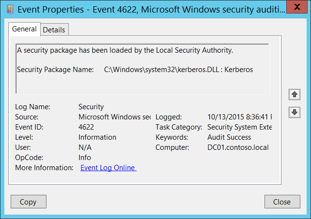

# 4622(S): ローカル セキュリティ機関によってセキュリティ パッケージが読み込まれました。



***サブカテゴリ:***&nbsp;[セキュリティ システム拡張の監査](audit-security-system-extension.md)

***イベントの説明:***

このイベントは、[セキュリティ パッケージ](/windows/win32/secauthn/ssp-aps-versus-ssps)がローカル セキュリティ機関 ([LSA](/windows/win32/secauthn/lsa-authentication)) によって読み込まれるたびに生成されます。

セキュリティ パッケージは、セキュリティ プロトコル (例えば Kerberos、NTLM) のソフトウェア実装です。セキュリティ パッケージは、セキュリティ サポート プロバイダー DLL またはセキュリティ サポート プロバイダー/認証パッケージ DLL に含まれています。

システムが起動するたびに、LSA は **HKEY\_LOCAL\_MACHINE\\SYSTEM\\CurrentControlSet\\Control\\Lsa\\OSConfig\\Security Packages** レジストリ値からセキュリティ パッケージ DLL を読み込み、これらの DLL にあるすべてのパッケージの初期化シーケンスを実行します。

また、システムの起動プロセス中だけでなく、[AddSecurityPackage](/windows/win32/api/sspi/nf-sspi-addsecuritypackagea) 関数を使用して動的にセキュリティ パッケージを追加することも可能です。

> **注**&nbsp;&nbsp;推奨事項については、このイベントの[セキュリティ監視の推奨事項](#security-monitoring-recommendations)を参照してください。

<br clear="all">

***イベント XML:***
```
- <Event xmlns="http://schemas.microsoft.com/win/2004/08/events/event">
- <System>
 <Provider Name="Microsoft-Windows-Security-Auditing" Guid="{54849625-5478-4994-A5BA-3E3B0328C30D}" /> 
 <EventID>4622</EventID> 
 <Version>0</Version> 
 <Level>0</Level> 
 <Task>12289</Task> 
 <Opcode>0</Opcode> 
 <Keywords>0x8020000000000000</Keywords> 
 <TimeCreated SystemTime="2015-10-14T03:36:41.359331100Z" /> 
 <EventRecordID>1048131</EventRecordID> 
 <Correlation /> 
 <Execution ProcessID="516" ThreadID="520" /> 
 <Channel>Security</Channel> 
 <Computer>DC01.contoso.local</Computer> 
 <Security /> 
 </System>
- <EventData>
 <Data Name="SecurityPackageName">C:\\Windows\\system32\\kerberos.DLL : Kerberos</Data> 
 </EventData>
 </Event>

```

***必要なサーバー ロール:*** なし。

***最小 OS バージョン:*** Windows Server 2008、Windows Vista。

***イベント バージョン:*** 0。

***フィールドの説明:***

**セキュリティ パッケージ名** \[タイプ = UnicodeString\]**:** 読み込まれたセキュリティ パッケージの名前。形式は DLL\_PATH\_AND\_NAME: SECURITY\_PACKAGE\_NAME です。

これらは、Windows 10でデフォルトで読み込まれるいくつかのセキュリティパッケージDLLです：

-   C:\\Windows\\system32\\schannel.DLL : Microsoft Unified Security Protocol Provider

-   C:\\Windows\\system32\\schannel.DLL : Schannel

-   C:\\Windows\\system32\\cloudAP.DLL : CloudAP

-   C:\\Windows\\system32\\wdigest.DLL : WDigest

-   C:\\Windows\\system32\\pku2u.DLL : pku2u

-   C:\\Windows\\system32\\tspkg.DLL : TSSSP

-   C:\\Windows\\system32\\msv1\_0.DLL : NTLM

-   C:\\Windows\\system32\\kerberos.DLL : Kerberos

-   C:\\Windows\\system32\\negoexts.DLL : NegoExtender

-   C:\\Windows\\system32\\lsasrv.dll : Negotiate

## セキュリティ監視の推奨事項

4622(S): ローカルセキュリティ機関によってセキュリティパッケージが読み込まれました。

-   通常、このイベントは情報提供を目的としています。システムで許可されたセキュリティパッケージのリストを定義している場合、「**セキュリティパッケージ名**」フィールドの値が許可リストにあるかどうかを確認できます。
