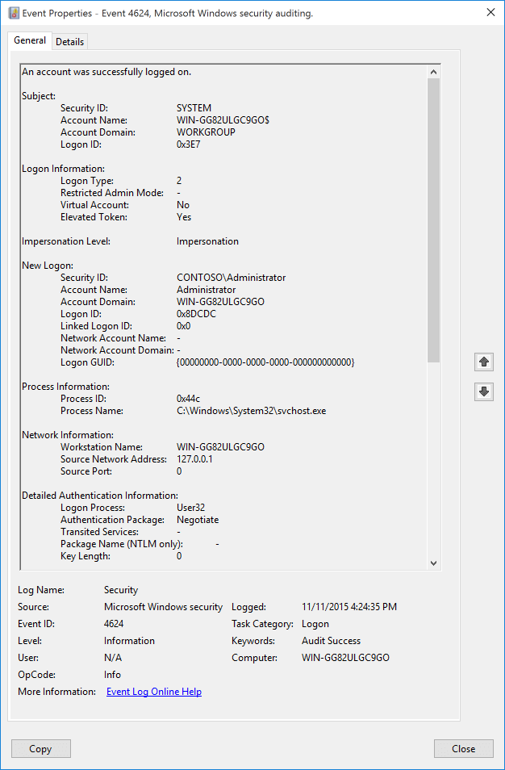

# 4624(S): アカウントが正常にログオンされました。 {/*examples*/}



***サブカテゴリ:***&nbsp;[ログオンの監査](audit-logon.md)

***イベントの説明:***

このイベントは、ログオンセッションが作成されたときに生成されます（宛先マシン上）。セッションが作成されたコンピュータで生成されます。

> [!NOTE]
> 推奨事項については、このイベントの[セキュリティ監視の推奨事項](#security-monitoring-recommendations)を参照してください。

<br clear="all">

***イベント XML:***
```xml
<?xml version="1.0"?>
<Event
    xmlns="http://schemas.microsoft.com/win/2004/08/events/event">
    <System>
        <Provider Name="Microsoft-Windows-Security-Auditing" Guid="{54849625-5478-4994-A5BA-3E3B0328C30D}"/>
        <EventID>4624</EventID>
        <Version>2</Version>
        <Level>0</Level>
        <Task>12544</Task>
        <Opcode>0</Opcode>
        <Keywords>0x8020000000000000</Keywords>
        <TimeCreated SystemTime="2015-11-12T00:24:35.079785200Z"/>
        <EventRecordID>211</EventRecordID>
        <Correlation ActivityID="{00D66690-1CDF-0000-AC66-D600DF1CD101}"/>
        <Execution ProcessID="716" ThreadID="760"/>
        <Channel>Security</Channel>
        <Computer>WIN-GG82ULGC9GO</Computer>
        <Security/>
    </System>
    <EventData>
        <Data Name="SubjectUserSid">S-1-5-18</Data>
        <Data Name="SubjectUserName">WIN-GG82ULGC9GO$</Data>
        <Data Name="SubjectDomainName">WORKGROUP</Data>
        <Data Name="SubjectLogonId">0x3e7</Data>
        <Data Name="TargetUserSid">S-1-5-21-1377283216-344919071-3415362939-500</Data>
        <Data Name="TargetUserName">Administrator</Data>
        <Data Name="TargetDomainName">WIN-GG82ULGC9GO</Data>
        <Data Name="TargetLogonId">0x8dcdc</Data>
        <Data Name="LogonType">2</Data>
        <Data Name="LogonProcessName">User32</Data>
        <Data Name="AuthenticationPackageName">Negotiate</Data>
        <Data Name="WorkstationName">WIN-GG82ULGC9GO</Data>
        <Data Name="LogonGuid">{00000000-0000-0000-0000-000000000000}</Data>
        <Data Name="TransmittedServices">-</Data>
        <Data Name="LmPackageName">-</Data>
        <Data Name="KeyLength">0</Data>
        <Data Name="ProcessId">0x44c</Data>
        <Data Name="ProcessName">C:\\Windows\\System32\\svchost.exe</Data>
        <Data Name="IpAddress">127.0.0.1</Data>
        <Data Name="IpPort">0</Data>
        <Data Name="ImpersonationLevel">%%1833</Data>
        <Data Name="RestrictedAdminMode">-</Data>
        <Data Name="TargetOutboundUserName">-</Data>
        <Data Name="TargetOutboundDomainName">-</Data>
        <Data Name="VirtualAccount">%%1843</Data>
        <Data Name="TargetLinkedLogonId">0x0</Data>
        <Data Name="ElevatedToken">%%1842</Data>
    </EventData>
</Event>
```

***必要なサーバー役割:*** なし。

***最小 OS バージョン:*** Windows Server 2008, Windows Vista。

***イベントバージョン:***

- 0 - Windows Server 2008, Windows Vista。

- 1 - Windows Server 2012, Windows 8。

  - 「偽装レベル」フィールドが追加されました。

- 2 - Windows 10。

    - 「ログオン情報:」セクションが追加されました。

    - **ログオンタイプ**が「ログオン情報:」セクションに移動しました。

    - 「制限付き管理者モード」フィールドが追加されました。

    - 「仮想アカウント」フィールドが追加されました。

    - 「昇格トークン」フィールドが追加されました。

    - 「リンクされたログオン ID」フィールドが追加されました。

    - 「ネットワークアカウント名」フィールドが追加されました。

    - 「ネットワークアカウントドメイン」フィールドが追加されました。

***フィールドの説明:***

**サブジェクト:**

- **セキュリティ ID** [タイプ = SID]**:** 成功したログオンについて報告したアカウントの SID またはそれを呼び出すアカウントの SID。イベントビューアーは自動的に SID を解決し、アカウント名を表示しようとします。SID を解決できない場合、イベントにはソースデータが表示されます。

    このフィールドには、サブジェクトユーザー情報が含まれない場合もありますが、NULL Sid「S-1-0-0」とユーザーまたはドメイン情報が含まれない場合もあります。

  > [!NOTE]
  > **セキュリティ識別子 (SID)** は、信託者 (セキュリティプリンシパル) を識別するために使用される可変長の一意の値です。各アカウントには、Active Directory ドメインコントローラーなどの権限によって発行され、セキュリティデータベースに保存される一意の SID があります。ユーザーがログオンするたびに、システムはデータベースからそのユーザーの SID を取得し、そのユーザーのアクセス トークンに配置します。システムは、以降のすべての Windows セキュリティとのやり取りで、アクセス トークン内の SID を使用してユーザーを識別します。SID がユーザーまたはグループの一意の識別子として使用された場合、それは他のユーザーまたはグループを識別するために再び使用されることはありません。SID の詳細については、[セキュリティ識別子](/windows/access-protection/access-control/security-identifiers) を参照してください。

- **アカウント名** [タイプ = UnicodeString]**:** 成功したログオンに関する情報を報告したアカウントの名前。

- **アカウントドメイン** [タイプ = UnicodeString]**:** サブジェクトのドメインまたはコンピュータ名。形式はさまざまで、以下の情報が含まれます：

    - ドメイン NETBIOS 名の例: CONTOSO

    - 小文字の完全なドメイン名: contoso.local

    - 大文字の完全なドメイン名: CONTOSO.LOCAL

    - LOCAL SERVICE や ANONYMOUS LOGON などの[よく知られたセキュリティプリンシパル](/windows/security/identity-protection/access-control/security-identifiers)の場合、このフィールドの値は "NT AUTHORITY" です。

    - ローカルユーザーアカウントの場合、このフィールドにはこのアカウントが属するコンピュータまたはデバイスの名前が含まれます。例: `Win81`。

- **ログオンID** [タイプ = HexInt64]**:** 16進数の値で、最近のイベントと同じログオンIDを含む可能性のあるイベントとこのイベントを関連付けるのに役立ちます。例: "[4672](event-4672.md)(S): 新しいログオンに特権が割り当てられました。"

**ログオン情報** [バージョン 2]**:**

- **ログオンタイプ** [バージョン 0, 1, 2] [タイプ = UInt32]**:** 発生したログオンのタイプ。このフィールドの可能な値のリストは以下の表に含まれています。

## ログオンタイプと説明

| ログオンタイプ | ログオンタイトル       | 説明                                                                                                                                                                                                                                                                                                                |
|:----------:|---------------------|----------------------------------------------------------------------------------------------------------------------------------------------------------------------------------------------------------------------------------------------------------------------------------------------------------------------------|
|  `0`       | `システム`            | システムアカウントのみが使用します。例えばシステム起動時。                                                                                                                                                                                                                                                            |
|  `2`       | `インタラクティブ`       | ユーザーがこのコンピュータにログオンしました。                                                                                                                                                                                                                                                                                         |
|  `3`       | `ネットワーク`           | ユーザーまたはコンピュータがネットワークからこのコンピュータにログオンしました。                                                                                                                                                                                                                                                            |
|  `4`       | `バッチ`             | バッチログオンタイプはバッチサーバーで使用され、ユーザーの直接の介入なしにプロセスを実行できます。                                                                                                                                                                                         |
|  `5`       | `サービス`           | サービスコントロールマネージャーがサービスを開始しました。                                                                                                                                                                                                                                                                      |
|  `7`       | `ロック解除`            | このワークステーションがロック解除されました。                                                                                                                                                                                                                                                                                             |
|  `8`       | `ネットワーククリアテキスト`  | ユーザーがネットワークからこのコンピュータにログオンしました。ユーザーのパスワードはハッシュされていない形式で認証パッケージに渡されました。組み込みの認証パッケージはすべて、資格情報をネットワークに送信する前にハッシュします。資格情報はプレーンテキスト（クリアテキストとも呼ばれます）でネットワークを通過しません。 |
|  `9`       | `新しい資格情報`    | 呼び出し元が現在のトークンをクローンし、アウトバウンド接続のために新しい資格情報を指定しました。新しいログオンセッションは同じローカルIDを持ちますが、他のネットワーク接続には異なる資格情報を使用します。                                                                                                                 |
| `10`       | `リモートインタラクティブ` | ユーザーがターミナルサービスまたはリモートデスクトップを使用してリモートでこのコンピュータにログオンしました。                                                                                                                                                                                                                                      |
| `11`       | `キャッシュされたインタラクティブ` | ユーザーがネットワーク資格情報を使用してこのコンピュータにログオンしましたが、その資格情報はコンピュータにローカルに保存されていました。ドメインコントローラーは資格情報を確認するために連絡されませんでした。                                                                                                                                                    |
| `12`       | `キャッシュされたリモートインタラクティブ` | リモートインタラクティブと同じです。このタイプは内部監査に使用されます。                                                                                                                                                                                                                                                        |
| `13`       | `キャッシュされたロック解除` | ワークステーションログオン。                                                                                                                                                                                                                                                                                                             |

- **制限付き管理者モード** [バージョン 2] [タイプ = UnicodeString]**:** **RemoteInteractive** ログオンタイプのセッションにのみ設定されます。この値は、提供された資格情報が制限付き管理者モードを使用して渡されたかどうかを示す Yes/No フラグです。制限付き管理者モードは Windows 8.1 および Windows Server 2012 R2 で追加されましたが、このフラグは Windows 10 のイベントに追加されました。

    参考: <https://blogs.technet.com/b/kfalde/archive/2013/08/14/restricted-admin-mode-for-rdp-in-windows-8-1-2012-r2.aspx>.

    **RemoteInteractive** ログオンでない場合、この値は文字列 `-` です。

- **仮想アカウント** [バージョン 2] [タイプ = UnicodeString]**:** アカウントが仮想アカウント（例えば、"[Managed Service Account](/previous-versions/windows/it-pro/windows-server-2008-R2-and-2008/dd560633(v=ws.10))"）であるかどうかを示す "Yes" または "No" フラグです。仮想アカウントは Windows 7 および Windows Server 2008 R2 で導入され、特定のサービスが使用するアカウントを識別するために使用されます。

- **昇格トークン** [バージョン 2] [タイプ = UnicodeString]**:** "Yes" または "No" フラグです。"Yes" の場合、このイベントが表すセッションは昇格されており、管理者権限を持っています。

**偽装レベル** [バージョン 1, 2] [タイプ = UnicodeString]: 次の4つの値のいずれかを持つことができます:

- SecurityAnonymous (表示は **空の文字列**): サーバープロセスはクライアントの識別情報を取得できず、クライアントを偽装することもできません。値が指定されていないため、ANSI C の規則によりデフォルトでゼロの値になります。

- SecurityIdentification (表示は "**Identification**"): サーバープロセスはセキュリティ識別子や特権などのクライアント情報を取得できますが、クライアントを偽装することはできません。この値は、独自のオブジェクトをエクスポートするサーバーに役立ちます。例えば、テーブルやビューをエクスポートするデータベース製品などです。取得したクライアントのセキュリティ情報を使用して、サーバーはアクセス検証の決定を行うことができますが、クライアントのセキュリティコンテキストを使用する他のサービスを使用することはできません。

- SecurityImpersonation (表示は "**Impersonation**"): サーバープロセスはローカルシステム上でクライアントのセキュリティコンテキストを偽装できます。サーバーはリモートシステム上でクライアントを偽装することはできません。このタイプが最も一般的です。

- SecurityDelegation (表示名 "**Delegation**"): サーバープロセスはリモートシステム上でクライアントのセキュリティコンテキストを偽装することができます。

**新しいログオン:**

- **セキュリティID** [Type = SID]**:** ログオンが実行されたアカウントのSID。イベントビューアーは自動的にSIDを解決し、アカウント名を表示しようとします。SIDが解決できない場合、イベントにソースデータが表示されます。

  > [!NOTE]
  > **セキュリティ識別子 (SID)** は、信託者（セキュリティプリンシパル）を識別するために使用される可変長の一意の値です。各アカウントには、Active Directoryドメインコントローラーなどの権限によって発行され、セキュリティデータベースに保存される一意のSIDがあります。ユーザーがログオンするたびに、システムはデータベースからそのユーザーのSIDを取得し、そのユーザーのアクセス トークンに配置します。システムは、後続のすべてのWindowsセキュリティとのやり取りでユーザーを識別するために、アクセス トークン内のSIDを使用します。ユーザーまたはグループの一意の識別子としてSIDが使用された場合、それは他のユーザーまたはグループを識別するために再び使用されることはありません。SIDの詳細については、[セキュリティ識別子](/windows/access-protection/access-control/security-identifiers)を参照してください。

- **アカウント名** [Type = UnicodeString]**:** ログオンが実行されたアカウントの名前。

- **アカウント ドメイン** [Type = UnicodeString]**:** サブジェクトのドメインまたはコンピューター名。形式はさまざまで、次の情報が含まれます:

    - ドメイン NETBIOS 名の例: CONTOSO

    - 小文字の完全なドメイン名: contoso.local

    - 大文字の完全なドメイン名: CONTOSO.LOCAL

    - LOCAL SERVICE や ANONYMOUS LOGON などの[よく知られたセキュリティプリンシパル](/windows/security/identity-protection/access-control/security-identifiers)の場合、このフィールドの値は "NT AUTHORITY" です。

    - ローカルユーザーアカウントの場合、このフィールドにはこのアカウントが属するコンピューターまたはデバイスの名前が含まれます。例: `Win81`.

- **ログオンID** [Type = HexInt64]**:** このイベントを最近のイベントと関連付けるのに役立つ16進数の値。例えば、"[4672](event-4672.md)(S): 新しいログオンに割り当てられた特権。"

- **リンクされたログオンID** [バージョン 2] [タイプ = HexInt64]**:** ペアになっているログオンセッションの16進数値。このログオンセッションに関連する他のログオンセッションがない場合、この値は "**0x0**" です。

- **ネットワークアカウント名** [バージョン 2] [タイプ = UnicodeString]**:** アウトバウンド（ネットワーク）接続に使用されるユーザー名。これは [NewCredentials](#logon-types-and-descriptions) ログオンタイプにのみ有効です。

    **NewCredentials** ログオンでない場合、この値は文字列 `-` になります。

- **ネットワークアカウントドメイン** [バージョン 2] [タイプ = UnicodeString]**:** アウトバウンド（ネットワーク）接続に使用されるユーザーのドメイン。これは [NewCredentials](#logon-types-and-descriptions) ログオンタイプにのみ有効です。

    **NewCredentials** ログオンでない場合、この値は文字列 `-` になります。

- **ログオンGUID** [タイプ = GUID]: このイベントを同じ **ログオンGUID** を含む他のイベントと関連付けるのに役立つGUIDです。例えば、ドメインコントローラー上での "[4769](event-4769.md)(S, F): Kerberosサービスチケットが要求されました" イベント。

    また、4624イベントと同じコンピューター上の他のいくつかのイベント（同じ **ログオンGUID** を含む）との関連付けにも使用できます。例えば、"[4648](event-4648.md)(S): 明示的な資格情報を使用してログオンが試行されました" や "[4964](event-4964.md)(S): 特別なグループが新しいログオンに割り当てられました" など。

    このパラメータはイベントでキャプチャされない場合があり、その場合は "{00000000-0000-0000-0000-000000000000}" と表示されます。

    > [!NOTE]
    > **GUID** は 'Globally Unique Identifier' の略です。これはリソース、アクティビティ、またはインスタンスを識別するために使用される128ビットの整数です。

**プロセス情報:**

- **プロセスID** [タイプ = ポインタ]: ログオンを試みたプロセスの16進数のプロセスID。プロセスID（PID）は、オペレーティングシステムがアクティブなプロセスを一意に識別するために使用する番号です。特定のプロセスのPIDを確認するには、例えばタスクマネージャー（詳細タブ、PID列）を使用できます。

    

    16進数の値を10進数に変換すると、タスクマネージャーの値と比較できます。

    また、このプロセスIDを他のイベントのプロセスIDと関連付けることができます。例えば、"[4688](event-4688.md): 新しいプロセスが作成されました" **プロセス情報\\新しいプロセスID**。

- **プロセス名** [型 = UnicodeString]**:** プロセスの実行ファイルのフルパスと名前。

**ネットワーク情報:**

- **ワークステーション名** [型 = UnicodeString]**:** ログオン試行が行われたマシンの名前。

- **ソースネットワークアドレス** [型 = UnicodeString]**:** ログオン試行が行われたマシンのIPアドレス。

    - クライアントのIPv6アドレスまたはIPv4アドレス。

    - `::1` または `127.0.0.1` はローカルホストを意味します。

- **ソースポート** [型 = UnicodeString]: リモートマシンからのログオン試行に使用されたソースポート。

    - インタラクティブログオンの場合は0。

> [!NOTE]
> IPアドレス/ポートおよびワークステーション名のフィールドは、認証コンテキストと使用されるプロトコルに応じて入力されます。LSASSは、認証サービスがLSASSと共有する情報を監査します。例えば、Kerberosを使用したネットワークログオンにはワークステーション情報が含まれないことが多く、NTLMログオンにはTCP/IPの詳細が含まれません。

**詳細な認証情報:**

- **ログオンプロセス** [型 = UnicodeString]**:** ログオンに使用された信頼されたログオンプロセスの名前。詳細については、イベント"[4611](event-4611.md): ローカルセキュリティ機関に信頼されたログオンプロセスが登録されました"の説明を参照してください。

- **認証パッケージ** [型 = UnicodeString]**:** ログオン認証プロセスに使用された認証パッケージの名前。LSAの起動時にロードされるデフォルトのパッケージは、"HKLM\\SYSTEM\\CurrentControlSet\\Control\\Lsa\\OSConfig"レジストリキーにあります。他のパッケージは実行時にロードされることがあります。新しいパッケージがロードされると、"[4610](event-4610.md): ローカルセキュリティ機関によって認証パッケージがロードされました"（通常はNTLM用）または"[4622](event-4622.md): ローカルセキュリティ機関によってセキュリティパッケージがロードされました"（通常はKerberos用）イベントが記録され、新しいパッケージがパッケージ名と共にロードされたことを示します。最も一般的な認証パッケージは次のとおりです:

- **NTLM** - NTLMファミリー認証

- **Kerberos** - Kerberos認証。

- **Negotiate** - Negotiateセキュリティパッケージは、KerberosとNTLMプロトコルの間で選択します。Negotiateは、認証に関与するシステムのいずれかが使用できない場合や、呼び出しアプリケーションがKerberosを使用するための十分な情報を提供しなかった場合を除き、Kerberosを選択します。

- **転送されたサービス** [Type = UnicodeString] [Kerberosのみ]**:** 転送されたサービスのリスト。転送されたサービスは、S4U（Service For User）ログオンプロセスの結果としてログオンが行われた場合に入力されます。S4Uは、アプリケーションサービスがユーザーに代わってKerberosサービスチケットを取得できるようにするためのMicrosoftの拡張機能であり、最も一般的にはフロントエンドのウェブサイトがユーザーに代わって内部リソースにアクセスするために行われます。S4Uの詳細については、<https://msdn.microsoft.com/library/cc246072.aspx>を参照してください。

- **パッケージ名 (NTLMのみ)** [Type = UnicodeString]**:** ログオン中に使用されたLAN Managerサブパッケージ（[NTLMファミリー](/openspecs/windows_protocols/ms-nlmp/c50a85f0-5940-42d8-9e82-ed206902e919)プロトコル名）の名前。可能な値は次の通りです：

    - "NTLM V1"

    - "NTLM V2"

    - "LM"

        **"Authentication Package" = "NTLM"**の場合にのみ入力されます。

- **キーの長さ** [Type = UInt32]**:** [NTLMセッションセキュリティ](/openspecs/windows_protocols/ms-nlmp/99d90ff4-957f-4c8a-80e4-5bfe5a9a9832)キーの長さ。通常は128ビットまたは56ビットの長さです。このパラメータは、**"Authentication Package" = "Kerberos"**の場合は常に0です。これはKerberosプロトコルには適用されないためです。また、**Negotiate**認証パッケージを使用してKerberosが交渉された場合も、このフィールドは`0`の値を持ちます。

## セキュリティ監視の推奨事項

4624(S): アカウントが正常にログオンされました。

| 必要な監視の種類 | 推奨事項 |
|-----------------------------|-------------------------|
| **高価値アカウント**: 各アクションを監視する必要がある高価値のドメインまたはローカルアカウントがあるかもしれません。<br>高価値アカウントの例としては、データベース管理者、組み込みのローカル管理者アカウント、ドメイン管理者、サービスアカウント、ドメインコントローラーアカウントなどがあります。       | 高価値アカウントまたはアカウントに対応する**"New Logon\\Security ID"**でこのイベントを監視します。                                                              |
| **異常または悪意のある行動**: 異常を検出したり、潜在的な悪意のある行動を監視するための特定の要件があるかもしれません。たとえば、勤務時間外にアカウントが使用されているかどうかを監視する必要があるかもしれません。                                                                                | 異常や悪意のある行動を監視する場合、特定のアカウントがどのようにまたはいつ使用されているかを監視するために、**"New Logon\\Security ID"**（他の情報と共に）を使用します。 |
| **非アクティブアカウント**: 非アクティブ、無効、またはゲストアカウント、または決して使用されるべきでない他のアカウントがあるかもしれません。                                                                                                                                                                                     | 使用されるべきでないアカウントに対応する**"New Logon\\Security ID"**でこのイベントを監視します。                                                          |
| **アカウント許可リスト**: 特定のイベントに対応するアクションを実行することが許可されているアカウントの特定の許可リストがあるかもしれません。                                                                                                                                                     | このイベントが「許可リストのみ」のアクションに対応する場合、許可リスト外のアカウントに対して**"New Logon\\Security ID"**を確認します。                                  |
| **異なる種類のアカウント**: 特定のアクションが特定のアカウントタイプによってのみ実行されることを確認します。たとえば、ローカルまたはドメインアカウント、マシンまたはユーザーアカウント、ベンダーまたは従業員アカウントなど。                                                                                 | このイベントが特定のアカウントタイプに対して監視したいアクションに対応する場合、アカウントタイプが期待通りであるかどうかを確認するために**"New Logon\\Security ID"**を確認します。 |
| **外部アカウント**: 別のドメインからのアカウントや、特定のアクション（特定のイベントで表される）を実行することが許可されていない「外部」アカウントを監視しているかもしれません。                                                                                                                     | 別のドメインからのアカウントや「外部」アカウントに対応する**"Subject\\Account Domain"**に対してこのイベントを監視します。                                                |
| **使用制限のあるコンピュータまたはデバイス**: 特定の人（アカウント）が通常はアクションを実行しない特定のコンピュータ、マシン、またはデバイスがあるかもしれません。                                                                                                                                      | 関心のある**"New Logon\\Security ID"**によって実行されたアクションに対して、ターゲット**コンピュータ:**（または他のターゲットデバイス）を監視します。                             |
| **アカウント命名規則**: 組織にはアカウント名の特定の命名規則があるかもしれません。                                                                                                                                                                                                       | 命名規則に準拠していない名前に対して**"Subject\\Account Name"**を監視します。                                                                                      |

- このイベントは通常 SYSTEM アカウントによってトリガーされるため、**"Subject\\Security ID"** が SYSTEM でない場合は報告することをお勧めします。

- 特定のアカウントによるログオンに **"Restricted Admin"** モードを使用する必要がある場合、このイベントを使用して **"New Logon\\Security ID"** と **"Logon Type"**=10 および **"Restricted Admin Mode"**="Yes" の関連を監視します。これらのアカウントに対して **"Restricted Admin Mode"**="No" の場合は、アラートをトリガーします。

- 管理者権限を持つアカウントのすべてのログオンイベントを監視する必要がある場合、このイベントを **"Elevated Token"**="Yes" で監視します。

- 管理サービスアカウントおよびグループ管理サービスアカウントのすべてのログオンイベントを監視する必要がある場合、**"Virtual Account"**="Yes" のイベントを監視します。

- ログオンタイプとそれを使用するアカウントの不一致を監視する場合（例えば、**Logon Type** 4-Batch または 5-Service がドメイン管理グループのメンバーによって使用される場合）、このイベントで **Logon Type** を監視します。

- 組織が以下の方法でログオンを制限している場合、このイベントを使用して適切に監視できます：

    - ユーザーアカウント **"New Logon\\Security ID"** が特定の **Computer:** からログオンに使用されるべきでない場合。

    - **New Logon\\Security ID** の資格情報が **Workstation Name** または **Source Network Address** から使用されるべきでない場合。

    - 特定のアカウント（例えばサービスアカウント）が内部 IP アドレスリスト（または他の IP アドレスリスト）からのみ使用されるべき場合。この場合、**Network Information\\Source Network Address** を監視し、ネットワークアドレスを IP アドレスリストと比較します。

    - 組織内で特定のバージョンの NTLM が常に使用される場合。この場合、このイベントを使用して **Package Name (NTLM only)** を監視し、例えば **Package Name (NTLM only)** が **NTLM V2** と等しくないイベントを見つけます。

    - 組織内で NTLM が使用されていない場合、または特定のアカウント（**New Logon\\Security ID**）によって使用されるべきでない場合。この場合、**Authentication Package** が NTLM であるすべてのイベントを監視します。

    - **認証パッケージ**がNTLMの場合。この場合、**キー長**が128でないことを監視します。なぜなら、Windows 2000以降のすべてのWindowsオペレーティングシステムは128ビットのキー長をサポートしているからです。

- 潜在的に悪意のあるソフトウェアや、ログオンアクションを要求する権限のないソフトウェアを監視する場合、このイベントの**プロセス名**を監視します。

- 信頼できるログオンプロセスのリストがある場合、そのリストにない**ログオンプロセス**を監視します。
