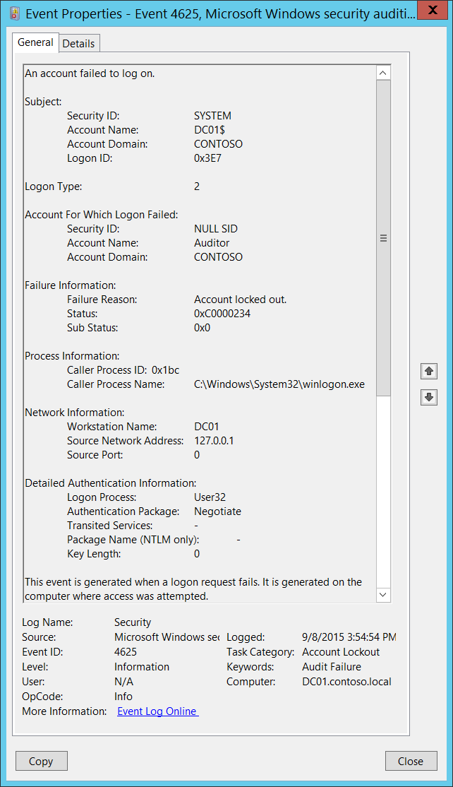

# 4625(F): アカウントのログオンに失敗しました。



***サブカテゴリ:***&nbsp;[アカウントロックアウトの監査](audit-account-lockout.md) および [ログオンの監査](audit-logon.md)

***イベントの説明:***

このイベントは、ログオン失敗時に記録されます。

ログオン試行が行われたコンピュータで生成されます。たとえば、ユーザーのワークステーションでログオン試行が行われた場合、このワークステーションにイベントが記録されます。

このイベントは、ドメインコントローラー、メンバーサーバー、およびワークステーションで生成されます。

> [!NOTE]
> 推奨事項については、このイベントの[セキュリティ監視の推奨事項](#security-monitoring-recommendations)を参照してください。

<br clear="all">

***イベント XML:***
```xml
- <Event xmlns="http://schemas.microsoft.com/win/2004/08/events/event">
- <System>
 <Provider Name="Microsoft-Windows-Security-Auditing" Guid="{54849625-5478-4994-A5BA-3E3B0328C30D}" /> 
 <EventID>4625</EventID> 
 <Version>0</Version> 
 <Level>0</Level> 
 <Task>12546</Task> 
 <Opcode>0</Opcode> 
 <Keywords>0x8010000000000000</Keywords> 
 <TimeCreated SystemTime="2015-09-08T22:54:54.962511700Z" /> 
 <EventRecordID>229977</EventRecordID> 
 <Correlation /> 
 <Execution ProcessID="516" ThreadID="3240" /> 
 <Channel>Security</Channel> 
 <Computer>DC01.contoso.local</Computer> 
 <Security /> 
 </System>
- <EventData>
 <Data Name="SubjectUserSid">S-1-5-18</Data> 
 <Data Name="SubjectUserName">DC01$</Data> 
 <Data Name="SubjectDomainName">CONTOSO</Data> 
 <Data Name="SubjectLogonId">0x3e7</Data> 
 <Data Name="TargetUserSid">S-1-0-0</Data> 
 <Data Name="TargetUserName">Auditor</Data> 
 <Data Name="TargetDomainName">CONTOSO</Data> 
 <Data Name="Status">0xc0000234</Data> 
 <Data Name="FailureReason">%%2307</Data> 
 <Data Name="SubStatus">0x0</Data> 
 <Data Name="LogonType">2</Data> 
 <Data Name="LogonProcessName">User32</Data> 
 <Data Name="AuthenticationPackageName">Negotiate</Data> 
 <Data Name="WorkstationName">DC01</Data> 
 <Data Name="TransmittedServices">-</Data> 
 <Data Name="LmPackageName">-</Data> 
 <Data Name="KeyLength">0</Data> 
 <Data Name="ProcessId">0x1bc</Data> 
 <Data Name="ProcessName">C:\\Windows\\System32\\winlogon.exe</Data> 
 <Data Name="IpAddress">127.0.0.1</Data> 
 <Data Name="IpPort">0</Data> 
 </EventData>
 </Event>
```

***必要なサーバーの役割:*** なし。

***最小 OS バージョン:*** Windows Server 2008, Windows Vista。

***イベントバージョン:*** 0。

***フィールドの説明:***

**サブジェクト:**

-   **セキュリティ ID** \[タイプ = SID\]**:** ログオン失敗に関する情報を報告したアカウントの SID。イベントビューアーは自動的に SID を解決し、アカウント名を表示しようとします。SID を解決できない場合、イベントにソースデータが表示されます。

    > [!NOTE]
    > **セキュリティ識別子 (SID)** は、トラスティ (セキュリティプリンシパル) を識別するために使用される可変長の一意の値です。各アカウントには、Active Directory ドメインコントローラーなどの権限によって発行され、セキュリティデータベースに保存される一意の SID があります。ユーザーがログオンするたびに、システムはデータベースからそのユーザーの SID を取得し、そのユーザーのアクセス トークンに配置します。システムは、アクセス トークン内の SID を使用して、以降のすべての Windows セキュリティとのやり取りでユーザーを識別します。ユーザーまたはグループの一意の識別子として SID が使用された場合、それ以降は他のユーザーまたはグループを識別するために再利用されることはありません。SID の詳細については、[セキュリティ識別子](/windows/access-protection/access-control/security-identifiers)を参照してください。

-   **アカウント名** \[タイプ = UnicodeString\]**:** ログオン失敗に関する情報を報告したアカウントの名前。

-   **アカウントドメイン** \[タイプ = UnicodeString\]**:** サブジェクトのドメインまたはコンピュータ名。以下はフォーマットの例です：

    -   ドメイン NETBIOS 名の例: CONTOSO

    -   小文字の完全ドメイン名: contoso.local

    -   大文字の完全ドメイン名: CONTOSO.LOCAL

    -   一部の[よく知られたセキュリティプリンシパル](/windows/security/identity-protection/access-control/security-identifiers)の場合、例えば LOCAL SERVICE や ANONYMOUS LOGON、このフィールドの値は "NT AUTHORITY" です。

    -   ローカルユーザーアカウントの場合、このフィールドにはこのアカウントが属するコンピュータまたはデバイスの名前が含まれます。例えば: "Win81"。

-   **ログオンタイプ** \[タイプ = UInt32\]**:** 実行されたログオンのタイプ。"表11. Windowsログオンタイプ" にはこのフィールドの可能な値のリストが含まれています。


    <span id="_Ref433822321" class="anchor"></span>**表11: Windowsログオンタイプ**

    | <span id="Windows_Logon_Types" class="anchor"></span>ログオンタイプ | ログオンタイトル       | 説明                                                                                                                                                                                                                                                                                                                |
    |-----------------------------------------------------------------|-------------------|----------------------------------------------------------------------------------------------------------------------------------------------------------------------------------------------------------------------------------------------------------------------------------------------------------------------------|
    | 2                                                               | インタラクティブ       | ユーザーがこのコンピュータにログオンしました。                                                                                                                                                                                                                                                                                         |
    | 3                                                               | ネットワーク           | ユーザーまたはコンピュータがネットワークからこのコンピュータにログオンしました。                                                                                                                                                                                                                                                            |
    | 4                                                               | バッチ             | バッチログオンタイプはバッチサーバーで使用され、プロセスがユーザーの直接の介入なしに実行される場合に使用されます。                                                                                                                                                                                         |
    | 5                                                               | サービス           | サービスコントロールマネージャによってサービスが開始されました。                                                                                                                                                                                                                                                                      |
    | 7                                                               | ロック解除            | このワークステーションのロックが解除されました。                                                                                                                                                                                                                                                                                             |
    | 8                                                               | ネットワーククリアテキスト  | ユーザーがネットワークからこのコンピュータにログオンしました。ユーザーのパスワードはハッシュされていない形式で認証パッケージに渡されました。組み込みの認証パッケージはすべて、資格情報をネットワークに送信する前にハッシュします。資格情報はプレーンテキスト（クリアテキストとも呼ばれる）でネットワークを通過しません。 |
    | 9                                                               | 新しい資格情報    | 呼び出し元が現在のトークンをクローンし、アウトバウンド接続のために新しい資格情報を指定しました。新しいログオンセッションは同じローカルIDを持ちますが、他のネットワーク接続には異なる資格情報を使用します。                                                                                                                 |
    | 10                                                              | リモートインタラクティブ | ユーザーがターミナルサービスまたはリモートデスクトップを使用してリモートでこのコンピュータにログオンしました。                                                                                                                                                                                                                                      |
    | 11                                                              | キャッシュされたインタラクティブ | ユーザーがネットワーク資格情報を使用してこのコンピュータにログオンしましたが、その資格情報はコンピュータにローカルに保存されていました。ドメインコントローラーは資格情報を確認するために連絡されませんでした。                                                                                                                                                    |

**ログオンに失敗したアカウント:**

-   **セキュリティID** \[タイプ = SID\]**:** ログオン試行で指定されたアカウントのSID。イベントビューアーは自動的にSIDを解決してアカウント名を表示しようとします。SIDが解決できない場合、イベントにソースデータが表示されます。

    > [!NOTE]
    > **セキュリティ識別子 (SID)** は、信託者（セキュリティプリンシパル）を識別するために使用される可変長の一意の値です。各アカウントには、Active Directoryドメインコントローラーなどの権限によって発行され、セキュリティデータベースに保存される一意のSIDがあります。ユーザーがログオンするたびに、システムはデータベースからそのユーザーのSIDを取得し、そのユーザーのアクセス トークンに配置します。システムは、以降のすべてのWindowsセキュリティとのやり取りでユーザーを識別するために、アクセス トークン内のSIDを使用します。SIDがユーザーまたはグループの一意の識別子として使用された場合、それは他のユーザーまたはグループを識別するために再利用されることはありません。SIDの詳細については、[セキュリティ識別子](/windows/access-protection/access-control/security-identifiers)を参照してください。

-   **アカウント名** \[タイプ = UnicodeString\]**:** ログオン試行で指定されたアカウントの名前。

-   **アカウント ドメイン** \[タイプ = UnicodeString\]**:** ドメインまたはコンピューター名。以下は形式の例です:

    -   ドメイン NETBIOS 名の例: CONTOSO

    -   小文字の完全なドメイン名: contoso.local

    -   大文字の完全なドメイン名: CONTOSO.LOCAL

    -   LOCAL SERVICE や ANONYMOUS LOGON などの[よく知られたセキュリティプリンシパル](/windows/security/identity-protection/access-control/security-identifiers)の場合、このフィールドの値は "NT AUTHORITY" です。

    -   ローカルユーザーアカウントの場合、このフィールドにはこのアカウントが属するコンピューターまたはデバイスの名前が含まれます。例: "Win81"。

-   **ログオンID** \[タイプ = HexInt64\]**:** このイベントを、同じログオンIDを含む可能性のある最近のイベントと関連付けるのに役立つ16進数の値。例: "[4624](event-4624.md): アカウントが正常にログオンされました。"

**失敗情報:**

-   **失敗理由** \[タイプ = UnicodeString\]**:** **ステータス**フィールド値のテキストによる説明。このイベントでは、通常「**アカウントがロックアウトされました**」という値を持ちます。

-   **ステータス** \[タイプ = HexInt32\]**:** ログオンが失敗した理由。このイベントでは、通常「**0xC0000234**」という値を持ちます。

-   **サブステータス** \[タイプ = HexInt32\]**:** ログオン失敗に関する追加情報。

> [!NOTE]
> さまざまなステータスまたはサブステータスコードの詳細については、[NTSTATUS 値](/openspecs/windows_protocols/ms-erref/596a1078-e883-4972-9bbc-49e60bebca55)を参照してください。

**プロセス情報:**

-   **呼び出し元プロセスID** \[タイプ = ポインタ\]: ログオンを試みたプロセスの16進数のプロセスID。プロセスID (PID) は、オペレーティングシステムがアクティブなプロセスを一意に識別するために使用する番号です。特定のプロセスのPIDを確認するには、例えばタスクマネージャー（詳細タブ、PID列）を使用します:<br/><br/>

    

    16進数の値を10進数に変換すると、タスクマネージャーの値と比較できます。

    また、このプロセスIDを他のイベントのプロセスIDと関連付けることもできます。例えば、「[4688](event-4688.md): 新しいプロセスが作成されました」**プロセス情報\\新しいプロセスID**。

-   **呼び出し元プロセス名** \[タイプ = UnicodeString\]**:** プロセスの実行可能ファイルのフルパスと名前。

**ネットワーク情報:**

-   **ワークステーション名** \[タイプ = UnicodeString\]**:** ログオン試行が行われたマシンの名前。

-   **ソースネットワークアドレス** \[タイプ = UnicodeString\]**:** ログオン試行が行われたマシンのIPアドレス。

    -   クライアントのIPv6アドレスまたは::ffff:IPv4アドレス。

    -   ::1または127.0.0.1はローカルホストを意味します。

-   **ソースポート** \[タイプ = UnicodeString\]: リモートマシンからのログオン試行に使用されたソースポート。

    -   インタラクティブログオンの場合は0。

**詳細な認証情報:**

-   **ログオンプロセス** \[タイプ = UnicodeString\]**:** ログオン試行に使用された信頼されたログオンプロセスの名前。詳細については、イベント「[4611](event-4611.md): ローカルセキュリティ機関に信頼されたログオンプロセスが登録されました」の説明を参照してください。

-   **認証パッケージ** \[種類 = UnicodeString\]**:** ログオン認証プロセスで使用された認証パッケージの名前。LSAの起動時にロードされるデフォルトのパッケージは、"HKLM\\SYSTEM\\CurrentControlSet\\Control\\Lsa\\OSConfig" レジストリキーにあります。他のパッケージは実行時にロードすることができます。新しいパッケージがロードされると、"[4610](event-4610.md): ローカルセキュリティ機関によって認証パッケージがロードされました"（通常はNTLM用）または"[4622](event-4622.md): ローカルセキュリティ機関によってセキュリティパッケージがロードされました"（通常はKerberos用）イベントが記録され、新しいパッケージがロードされたこととそのパッケージ名が示されます。最も一般的な認証パッケージは次のとおりです：

    -   **NTLM** – NTLMファミリー認証

    -   **Kerberos** – Kerberos認証

    -   **Negotiate** – Negotiateセキュリティパッケージは、KerberosとNTLMプロトコルの間で選択します。Negotiateは、認証に関与するシステムのいずれかがKerberosを使用できない場合や、呼び出しアプリケーションがKerberosを使用するための十分な情報を提供しなかった場合を除き、Kerberosを選択します。

-   **転送されたサービス** \[種類 = UnicodeString\] \[Kerberosのみ\]**:** 転送されたサービスのリスト。転送されたサービスは、S4U（Service For User）ログオンプロセスの結果としてログオンが行われた場合に入力されます。S4Uは、アプリケーションサービスがユーザーに代わってKerberosサービスチケットを取得できるようにするためのMicrosoftの拡張機能であり、最も一般的にはフロントエンドのウェブサイトがユーザーに代わって内部リソースにアクセスするために行われます。S4Uの詳細については、<https://msdn.microsoft.com/library/cc246072.aspx> を参照してください。

-   **パッケージ名 (NTLMのみ)** \[種類 = UnicodeString\]**:** ログオン試行中に使用されたLAN Managerサブパッケージ（[NTLMファミリー](/openspecs/windows_protocols/ms-nlmp/c50a85f0-5940-42d8-9e82-ed206902e919) プロトコル名）の名前。考えられる値は次のとおりです：

    -   "NTLM V1"

    -   "NTLM V2"

    -   "LM"

        **"認証パッケージ" = "NTLM"** の場合にのみ入力されます。

-   **キーの長さ** \[種類 = UInt32\]**:** [NTLMセッションセキュリティ](/openspecs/windows_protocols/ms-nlmp/99d90ff4-957f-4c8a-80e4-5bfe5a9a9832) キーの長さ。通常、128ビットまたは56ビットの長さです。このパラメータは、**"認証パッケージ" = "Kerberos"** の場合は常に0です。これは、Kerberosプロトコルには適用されないためです。また、**Negotiate** 認証パッケージを使用してKerberosがネゴシエートされた場合も、このフィールドは "0" の値を持ちます。

## セキュリティ監視の推奨事項

4625(F): アカウントのログオンに失敗しました。

> [!IMPORTANT]
> このイベントについては、[付録A: 多くの監査イベントに対するセキュリティ監視の推奨事項](appendix-a-security-monitoring-recommendations-for-many-audit-events.md)も参照してください。

- このイベントで報告されたプロセスの「**プロセス名**」が事前に定義されたものである場合、「**プロセス名**」が定義された値と異なるすべてのイベントを監視します。

- 「**プロセス名**」が標準フォルダー（例えば、**System32**や**Program Files**）にないか、制限されたフォルダー（例えば、**Temporary Internet Files**）にあるかを監視することができます。

<!-- -->

- プロセス名に制限されたサブストリングや単語（例えば、「**mimikatz**」や「**cain.exe**」）のリストが事前に定義されている場合、「**プロセス名**」にこれらのサブストリングが含まれているかを確認します。

- **Subject\\Account Name**がサービスアカウントやユーザーアカウントの名前である場合、そのアカウントが**Account For Which Logon Failed\\Security ID**のログオン要求を許可されているか（または期待されているか）を調査することが有用です。

- ログオンタイプとそれを使用するアカウントの不一致を監視するために（例えば、**Logon Type** 4-バッチまたは5-サービスがドメイン管理グループのメンバーによって使用されている場合）、このイベントの**Logon Type**を監視します。

- すべてのロックアウトを監視する必要がある高価値のドメインまたはローカルアカウントがある場合、そのアカウントに対応する**"Subject\\Security ID"**を持つすべての[4625](event-4625.md)イベントを監視します。

- ローカルアカウントは通常ロックアウトされるべきではないため、すべての[4625](event-4625.md)イベントを監視することをお勧めします。監視は特に重要なサーバー、管理用ワークステーション、およびその他の高価値資産に関連します。

- サービスアカウントはロックアウトされたり機能が停止されたりするべきではないため、すべての[4625](event-4625.md)イベントを監視することをお勧めします。監視は特に重要なサーバー、管理用ワークステーション、およびその他の高価値資産に関連します。

- 組織が以下の方法でログオンを制限している場合、このイベントを使用して適切に監視することができます。

    -   **"Account For Which Logon Failed \\Security ID"** が特定の **Network Information\\Workstation Name** からのログオンに使用されるべきでない場合。

    -   サービスアカウントなどの特定のアカウントが内部のIPアドレスリスト（または他のIPアドレスリスト）からのみ使用されるべき場合。この場合、**Network Information\\Source Network Address** を監視し、ネットワークアドレスをIPアドレスリストと比較します。

    -   組織内で特定のバージョンのNTLMが常に使用されている場合。この場合、このイベントを使用して **Package Name (NTLM only)** を監視し、例えば **Package Name (NTLM only)** が **NTLM V2** と等しくないイベントを見つけます。

    -   組織内でNTLMが使用されていない、または特定のアカウント（**New Logon\\Security ID**）によって使用されるべきでない場合。この場合、**Authentication Package** がNTLMであるすべてのイベントを監視します。

    -   **Authentication Package** がNTLMである場合。この場合、**Key Length** が128と等しくないことを監視します。すべてのWindowsオペレーティングシステムはWindows 2000以降、128ビットのキー長をサポートしています。

    -   **Logon Process** が信頼されたログオンプロセスリストにない場合。

-   以下の表のフィールドと値を持つすべてのイベントを監視します：

    |  フィールド                                                                         | 監視する値                                                                                                                                                                                |
    |----------------------------------------------------------------------------------|-----------------------------------------------------------------------------------------------------------------------------------------------------------------------------------------------------|
    | **Failure Information\\Status** または <br>**Failure Information\\Sub Status** | 0XC000005E – "現在、ログオン要求を処理するログオンサーバーが利用できません。" <br>この問題は通常、セキュリティの問題ではなく、インフラストラクチャや可用性の問題である可能性があります。 |
    | **Failure Information\\Status** または <br>**Failure Information\\Sub Status** | 0xC0000064 – "ユーザーのログオンが誤ったユーザーアカウントで行われました。" <br>特にこれらのイベントが連続して発生する場合、ユーザー列挙攻撃の兆候である可能性があります。                             |
    | **Failure Information\\Status** または <br>**Failure Information\\Sub Status** | 0xC000006A – "重要なアカウントまたはサービスアカウントの誤ったパスワードでのユーザーのログオン。" <br>特にこのようなイベントが連続して発生する場合に注意してください。                               |
    | **Failure Information\\Status** または <br>**Failure Information\\Sub Status** | 0XC000006D – "これは、誤ったユーザー名または認証情報によるものです。" 重要なアカウントまたはサービスアカウントの場合。 <br>特にこのようなイベントが連続して発生する場合に注意してください。       |
    | **Failure Information\\Status** または <br>**Failure Information\\Sub Status** | 0xC000006F – "許可された時間外のユーザーのログオン。"                                                                                                                                                 |
    | **Failure Information\\Status** または <br>**Failure Information\\Sub Status** | 0xC0000070 – "許可されていないワークステーションからのユーザーのログオン。"                                                                                                                                            |
    | **Failure Information\\Status** または <br>**Failure Information\\Sub Status** | 0xC0000072 – "管理者によって無効にされたアカウントへのユーザーのログオン。"                                                                                                                                     |
    | **Failure Information\\Status** または <br>**Failure Information\\Sub Status** | 0XC000015B – "このマシンで要求されたログオンタイプ（別名ログオン権限）がユーザーに付与されていません。"                                                                                            |
    | **Failure Information\\Status** または <br>**Failure Information\\Sub Status** | 0XC0000192 – "ログオンしようとしましたが、Netlogonサービスが開始されていませんでした。" <br>この問題は通常、セキュリティの問題ではなく、インフラストラクチャや可用性の問題である可能性があります。      |
    | **Failure Information\\Status** または <br>**Failure Information\\Sub Status** | 0xC0000193 – "期限切れのアカウントでのユーザーのログオン。"                                                                                                                                                     |
    | **Failure Information\\Status** または <br>**Failure Information\\Sub Status** | 0XC0000413 – "ログオン失敗：ログオンしようとしているマシンは認証ファイアウォールで保護されています。指定されたアカウントはこのマシンに認証することが許可されていません。"                     |

It seems like you haven't pasted the Markdown content yet. Please provide the content you want to be translated into Japanese.
