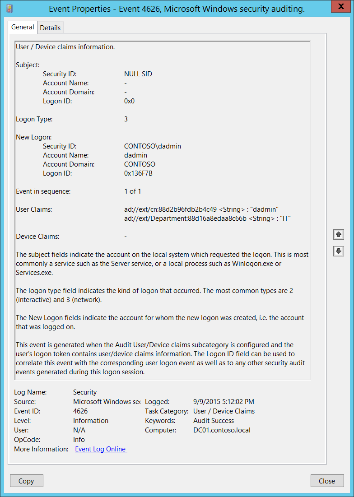

# 4626(S): ユーザー/デバイスのクレーム情報



***サブカテゴリ:***&nbsp;[ユーザー/デバイスのクレームの監査](audit-user-device-claims.md)

***イベントの説明:***

このイベントは新しいアカウントのログオンに対して生成され、新しいログオンセッションに関連付けられたユーザー/デバイスのクレームを含みます。

ユーザー/デバイスにクレームがない場合、このイベントは生成されません。

コンピューターアカウントのログオンの場合、「**ユーザーのクレーム**」フィールドにデバイスのクレームも表示されます。

通常、"[4624](event-4624.md): アカウントが正常にログオンされました"というイベントが生成され、その後に同じ情報を含む**サブジェクト**、**ログオンタイプ**、**新しいログオン**セクションを持つ4626イベントが生成されます。

このイベントはログオンが行われたコンピューター（ターゲットコンピューター）で生成されます。例えば、インタラクティブログオンの場合、同じコンピューターになります。

> **注**&nbsp;&nbsp;推奨事項については、このイベントの[セキュリティ監視の推奨事項](#security-monitoring-recommendations)を参照してください。

<br clear="all">

***イベント XML:***
```
- <Event xmlns="http://schemas.microsoft.com/win/2004/08/events/event">
- <System>
 <Provider Name="Microsoft-Windows-Security-Auditing" Guid="{54849625-5478-4994-A5BA-3E3B0328C30D}" /> 
 <EventID>4626</EventID> 
 <Version>0</Version> 
 <Level>0</Level> 
 <Task>12553</Task> 
 <Opcode>0</Opcode> 
 <Keywords>0x8020000000000000</Keywords> 
 <TimeCreated SystemTime="2015-09-10T00:12:02.243396300Z" /> 
 <EventRecordID>232648</EventRecordID> 
 <Correlation /> 
 <Execution ProcessID="516" ThreadID="1092" /> 
 <Channel>Security</Channel> 
 <Computer>DC01.contoso.local</Computer> 
 <Security /> 
 </System>
- <EventData>
 <Data Name="SubjectUserSid">S-1-0-0</Data> 
 <Data Name="SubjectUserName">-</Data> 
 <Data Name="SubjectDomainName">-</Data> 
 <Data Name="SubjectLogonId">0x0</Data> 
 <Data Name="TargetUserSid">S-1-5-21-3457937927-2839227994-823803824-1104</Data> 
 <Data Name="TargetUserName">dadmin</Data> 
 <Data Name="TargetDomainName">CONTOSO</Data> 
 <Data Name="TargetLogonId">0x136f7b</Data> 
 <Data Name="LogonType">3</Data> 
 <Data Name="EventIdx">1</Data> 
 <Data Name="EventCountTotal">1</Data> 
 <Data Name="UserClaims">ad://ext/cn:88d2b96fdb2b4c49 <%%1818> : "dadmin" ad://ext/Department:88d16a8edaa8c66b <%%1818> : "IT"</Data> 
 <Data Name="DeviceClaims">-</Data> 
 </EventData>
 </Event>
```

***必要なサーバーロール:*** なし。

***最小 OS バージョン:*** Windows Server 2012, Windows 8。

***イベントバージョン:*** 0。

***フィールドの説明:***

**サブジェクト:**

-   **セキュリティ ID** \[タイプ = SID\]**:** クレーム情報を報告したアカウントのSID。イベントビューアーは自動的にSIDを解決し、アカウント名を表示しようとします。SIDが解決できない場合、イベントにはソースデータが表示されます。

> **注**&nbsp;&nbsp;**セキュリティ識別子 (SID)** は、トラスティ（セキュリティプリンシパル）を識別するために使用される可変長の一意の値です。各アカウントには、Active Directoryドメインコントローラーなどの権限によって発行され、セキュリティデータベースに保存される一意のSIDがあります。ユーザーがログオンするたびに、システムはデータベースからそのユーザーのSIDを取得し、そのユーザーのアクセス トークンに配置します。システムはアクセス トークン内のSIDを使用して、以降のすべてのWindowsセキュリティとのやり取りでユーザーを識別します。SIDがユーザーまたはグループの一意の識別子として使用された場合、それは他のユーザーまたはグループを識別するために再び使用されることはありません。SIDの詳細については、[セキュリティ識別子](/windows/access-protection/access-control/security-identifiers)を参照してください。

-   **アカウント名** \[タイプ = UnicodeString\]**:** クレームに関する情報を報告したアカウントの名前。

-   **アカウントドメイン** \[タイプ = UnicodeString\]**:** サブジェクトのドメインまたはコンピュータ名。形式は以下のように異なります：

    -   ドメイン NETBIOS 名の例: CONTOSO

    -   小文字の完全ドメイン名: contoso.local

    -   大文字の完全ドメイン名: CONTOSO.LOCAL

    -   一部の[よく知られたセキュリティプリンシパル](/windows/security/identity-protection/access-control/security-identifiers)の場合、例えば LOCAL SERVICE や ANONYMOUS LOGON、このフィールドの値は “NT AUTHORITY” です。

    -   ローカルユーザーアカウントの場合、このフィールドにはこのアカウントが属するコンピュータまたはデバイスの名前が含まれます。例えば: “Win81”。

-   **ログオンID** \[タイプ = HexInt64\]**:** 16進数の値で、最近のイベントとこのイベントを関連付けるのに役立ちます。例えば、同じログオンIDを含むイベント “[4624](event-4624.md): アカウントが正常にログオンされました。”

**ログオンタイプ** \[タイプ = UInt32\]**:** 実行されたログオンのタイプ。このフィールドの可能な値のリストは以下の表に含まれています：

| ログオンタイプ | ログオンタイトル       | 説明                                                                                                                                                                                                                                                                                                                |
|------------|-------------------|----------------------------------------------------------------------------------------------------------------------------------------------------------------------------------------------------------------------------------------------------------------------------------------------------------------------------|
| 2          | インタラクティブ       | ユーザーがこのコンピュータにログオンしました。                                                                                                                                                                                                                                                                                         |
| 3          | ネットワーク           | ユーザーまたはコンピュータがネットワークからこのコンピュータにログオンしました。                                                                                                                                                                                                                                                            |
| 4          | バッチ             | バッチログオンタイプは、ユーザーの直接の介入なしにプロセスが実行されるバッチサーバーによって使用されます。                                                                                                                                                                                         |
| 5          | サービス           | サービスコントロールマネージャによってサービスが開始されました。                                                                                                                                                                                                                                                                      |
| 7          | ロック解除            | このワークステーションのロックが解除されました。                                                                                                                                                                                                                                                                                             |
| 8          | ネットワーククリアテキスト  | ユーザーがネットワークからこのコンピュータにログオンしました。ユーザーのパスワードはハッシュされていない形式で認証パッケージに渡されました。組み込みの認証パッケージはすべて、ネットワークを介して送信する前に資格情報をハッシュします。資格情報はプレーンテキスト（クリアテキストとも呼ばれる）でネットワークを横断しません。 |
| 9          | 新しい資格情報    | 呼び出し元が現在のトークンをクローンし、アウトバウンド接続のために新しい資格情報を指定しました。新しいログオンセッションは同じローカルIDを持ちますが、他のネットワーク接続には異なる資格情報を使用します。                                                                                                                 |
| 10         | リモートインタラクティブ | ユーザーがターミナルサービスまたはリモートデスクトップを使用してリモートでこのコンピュータにログオンしました。                                                                                                                                                                                                                                      |
| 11         | キャッシュされたインタラクティブ | ユーザーがローカルに保存されたネットワーク資格情報を使用してこのコンピュータにログオンしました。ドメインコントローラは資格情報を確認するために連絡されませんでした。                                                                                                                                                    |

**新しいログオン:**

-   **セキュリティID** \[タイプ = SID\]**:** ログオンが実行されたアカウントのSID。イベントビューアーは自動的にSIDを解決し、アカウント名を表示しようとします。SIDが解決できない場合、イベントにソースデータが表示されます。

> **注**&nbsp;&nbsp;**セキュリティ識別子 (SID)** は、トラスティ (セキュリティプリンシパル) を識別するために使用される可変長の一意の値です。各アカウントには、Active Directoryドメインコントローラーなどの権限によって発行され、セキュリティデータベースに保存される一意のSIDがあります。ユーザーがログオンするたびに、システムはデータベースからそのユーザーのSIDを取得し、そのユーザーのアクセス トークンに配置します。システムは、以降のすべてのWindowsセキュリティとのやり取りでユーザーを識別するために、アクセス トークン内のSIDを使用します。SIDがユーザーまたはグループの一意の識別子として使用された場合、それは他のユーザーまたはグループを識別するために再利用されることはありません。SIDの詳細については、[セキュリティ識別子](/windows/access-protection/access-control/security-identifiers)を参照してください。

-   **アカウント名** \[タイプ = UnicodeString\]**:** ログオンが実行されたアカウントの名前。

-   **アカウントドメイン** \[タイプ = UnicodeString\]**:** サブジェクトのドメインまたはコンピュータ名。形式はさまざまで、以下を含みます:

    -   ドメインNETBIOS名の例: CONTOSO

    -   小文字の完全なドメイン名: contoso.local

    -   大文字の完全なドメイン名: CONTOSO.LOCAL

    -   LOCAL SERVICEやANONYMOUS LOGONなどの[よく知られたセキュリティプリンシパル](/windows/security/identity-protection/access-control/security-identifiers)の場合、このフィールドの値は「NT AUTHORITY」です。

    -   ローカルユーザーアカウントの場合、このフィールドにはこのアカウントが属するコンピュータまたはデバイスの名前が含まれます。例: “Win81”。

-   **ログオンID** \[タイプ = HexInt64\]**:** 16進数の値で、最近のイベントとこのイベントを関連付けるのに役立ちます。たとえば、「[4624](event-4624.md): アカウントが正常にログオンされました。」などです。

**シーケンス内のイベント** \[タイプ = UInt32\]**:** すべてのクレームを1つのイベントに収めるのに十分なスペースがない場合、このフィールドに「**1 of N**」が表示され、追加のイベントが生成されます。通常、このフィールドには「**1 of 1**」の値が含まれます。

**ユーザー クレーム** \[タイプ = UnicodeString\]**:** 新しいログオン セッションのユーザー クレームのリスト。このフィールドには、ユーザー アカウントがログインした場合はユーザー クレームが、コンピューター アカウントがログインした場合はデバイス クレームが含まれます。このフィールドのエントリを解析する方法の例を次に示します。

-   ad://ext/cn:88d2b96fdb2b4c49 &lt;String&gt; : “dadmin”

    -   cn – クレーム表示名。

    -   88d2b96fdb2b4c49 – 一意のクレーム ID。

    -   &lt;String&gt; - クレーム タイプ。

    -   “dadmin” – クレーム値。

**デバイス クレーム** \[タイプ = UnicodeString\]**:** 新しいログオン セッションのデバイス クレームのリスト。ユーザー アカウントの場合、このフィールドには通常「**-**」の値が含まれます<b>。</b> コンピューター アカウントの場合、このフィールドにはデバイス クレームがリストされます。

## セキュリティ監視の推奨事項

4626(S): ユーザー/デバイス クレーム情報。

-   <span id="Reccomendations_Subject_NULLSID" class="anchor"></span>通常、このアクションは NULL SID アカウントによって報告されるため、**「Subject\\Security ID」** が「**NULL SID**」と等しくないすべてのイベントを報告することをお勧めします。

-   特定のクレームを持つアカウントのログオンを監視する必要がある場合は、[4626](event-4626.md) を監視し、**ユーザー クレーム**\\**デバイス クレーム** フィールドを確認できます。

-   特定の要件がある場合、例えば：

    -   特定のクレームを持つユーザーが特定のコンピューターにアクセスしてはならない;

    -   コンピューター アカウントが特定のクレームを持ってはならない;

    -   ユーザー アカウントが特定のクレームを持ってはならない;

    -   クレームが空であってはならない

    -   など…

        [4626](event-4626.md) を監視し、**ユーザー クレーム**\\**デバイス クレーム** フィールドを確認できます。

-   コンピューター/ユーザーのログオン試行のみを監視し、クレームに関する情報が不要な場合は、「[4624](event-4624.md): アカウントが正常にログオンされました。」を監視する方が良いです。
