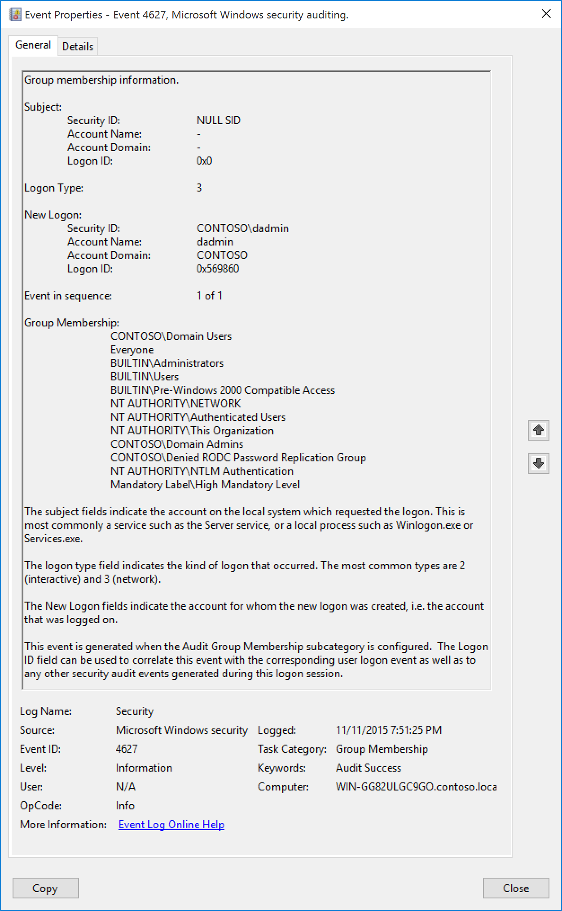

# 4627(S): グループメンバーシップ情報



***サブカテゴリ:***&nbsp;[グループメンバーシップの監査](audit-group-membership.md)

***イベントの説明:***

このイベントは「[4624](event-4624.md)(S): アカウントが正常にログオンされました」と共に生成され、ログオンしたアカウントが所属するグループのリストを表示します。

このイベントを取得するには、[ログオンの監査](audit-logon.md)サブカテゴリの成功監査も有効にする必要があります。

グループメンバーシップ情報が1つのセキュリティ監査イベントに収まらない場合、複数のイベントが生成されます。

> [!NOTE]
> 推奨事項については、このイベントの[セキュリティ監視の推奨事項](#security-monitoring-recommendations)を参照してください。

<br clear="all">

***イベント XML:***

```xml
- <Event xmlns="http://schemas.microsoft.com/win/2004/08/events/event">
- <System>
 <Provider Name="Microsoft-Windows-Security-Auditing" Guid="{54849625-5478-4994-A5BA-3E3B0328C30D}" /> 
 <EventID>4627</EventID> 
 <Version>0</Version> 
 <Level>0</Level> 
 <Task>12554</Task> 
 <Opcode>0</Opcode> 
 <Keywords>0x8020000000000000</Keywords> 
 <TimeCreated SystemTime="2015-11-12T03:51:25.843673000Z" /> 
 <EventRecordID>3081</EventRecordID> 
 <Correlation ActivityID="{913FBE70-1CE6-0000-67BF-3F91E61CD101}" /> 
 <Execution ProcessID="736" ThreadID="808" /> 
 <Channel>Security</Channel> 
 <Computer>WIN-GG82ULGC9GO.contoso.local</Computer> 
 <Security /> 
 </System>
- <EventData>
 <Data Name="SubjectUserSid">S-1-0-0</Data> 
 <Data Name="SubjectUserName">-</Data> 
 <Data Name="SubjectDomainName">-</Data> 
 <Data Name="SubjectLogonId">0x0</Data> 
 <Data Name="TargetUserSid">S-1-5-21-1377283216-344919071-3415362939-1104</Data> 
 <Data Name="TargetUserName">dadmin</Data> 
 <Data Name="TargetDomainName">CONTOSO</Data> 
 <Data Name="TargetLogonId">0x569860</Data> 
 <Data Name="LogonType">3</Data> 
 <Data Name="EventIdx">1</Data> 
 <Data Name="EventCountTotal">1</Data> 
 <Data Name="GroupMembership">%{S-1-5-21-1377283216-344919071-3415362939-513} %{S-1-1-0} %{S-1-5-32-544} %{S-1-5-32-545} %{S-1-5-32-554} %{S-1-5-2} %{S-1-5-11} %{S-1-5-15} %{S-1-5-21-1377283216-344919071-3415362939-512} %{S-1-5-21-1377283216-344919071-3415362939-572} %{S-1-5-64-10} %{S-1-16-12288}</Data> 
 </EventData>
</Event>

```

***必要なサーバーロール:*** なし。

***最小 OS バージョン:*** Windows Server 2016, Windows 10。

***イベントバージョン:*** 0。

***フィールドの説明:***

**サブジェクト:**

-   **セキュリティ ID** \[タイプ = SID\]**:** 成功したログオンについて情報を報告したアカウントの SID またはそれを呼び出すアカウントの SID。イベントビューアーは自動的に SID を解決し、アカウント名を表示しようとします。SID が解決できない場合、イベントにはソースデータが表示されます。

    > [!NOTE]
    >  **セキュリティ識別子 (SID)** は、信託者 (セキュリティプリンシパル) を識別するために使用される可変長の一意の値です。各アカウントには、Active Directory ドメインコントローラーなどの権限によって発行され、セキュリティデータベースに保存される一意の SID があります。ユーザーがログオンするたびに、システムはデータベースからそのユーザーの SID を取得し、そのユーザーのアクセス トークンに配置します。システムは、アクセス トークン内の SID を使用して、以降のすべての Windows セキュリティとのやり取りでユーザーを識別します。SID がユーザーまたはグループの一意の識別子として使用された場合、それは他のユーザーまたはグループを識別するために再利用されることはありません。SID の詳細については、[セキュリティ識別子](/windows/access-protection/access-control/security-identifiers)を参照してください。

-   **アカウント名** \[タイプ = UnicodeString\]**:** 成功したログオンについて情報を報告したアカウントの名前、またはそれを呼び出すアカウントの名前。

-   **アカウントドメイン** \[タイプ = UnicodeString\]**:** サブジェクトのドメインまたはコンピュータ名。形式は以下のように異なります：

    -   ドメインのNETBIOS名の例: CONTOSO

    -   小文字の完全なドメイン名: contoso.local

    -   大文字の完全なドメイン名: CONTOSO.LOCAL

    -   一部の[よく知られたセキュリティプリンシパル](/windows/security/identity-protection/access-control/security-identifiers)の場合、例えばLOCAL SERVICEやANONYMOUS LOGON、このフィールドの値は「NT AUTHORITY」となります。

    -   ローカルユーザーアカウントの場合、このフィールドにはこのアカウントが属するコンピュータまたはデバイスの名前が含まれます。例えば、「Win81」。

-   **ログオンID** \[タイプ = HexInt64\]**:** 16進数の値で、このイベントを最近のイベントと関連付けるのに役立ちます。同じログオンIDを含む可能性のあるイベント、例えば「[4672](event-4672.md)(S): 新しいログオンに割り当てられた特権」。

-   **ログオンタイプ** \[タイプ = UInt32\]**:** 実行されたログオンのタイプ。以下の表には、このフィールドの可能な値のリストが含まれています：

| ログオンタイプ | ログオンタイトル       | 説明 |
|------------|-------------------|----------------------|
| 2          | インタラクティブ       | ユーザーがこのコンピュータにログオンしました。                                                                                                                                                                                                                                                                                         |
| 3          | ネットワーク           | ユーザーまたはコンピュータがネットワークからこのコンピュータにログオンしました。                                                                                                                                                                                                                                                            |
| 4          | バッチ             | バッチログオンタイプは、ユーザーの直接の介入なしにプロセスが実行されるバッチサーバーで使用されます。                                                                                                                                                                                         |
| 5          | サービス           | サービスコントロールマネージャによってサービスが開始されました。                                                                                                                                                                                                                                                                      |
| 7          | ロック解除            | このワークステーションのロックが解除されました。                                                                                                                                                                                                                                                                                             |
| 8          | ネットワーククリアテキスト  | ユーザーがネットワークからこのコンピュータにログオンしました。ユーザーのパスワードはハッシュされていない形式で認証パッケージに渡されました。組み込みの認証パッケージはすべて、資格情報をネットワークに送信する前にハッシュします。資格情報はプレーンテキスト（クリアテキストとも呼ばれる）でネットワークを通過しません。 |
| 9          | 新しい資格情報    | 呼び出し元が現在のトークンをクローンし、アウトバウンド接続のために新しい資格情報を指定しました。新しいログオンセッションは同じローカルIDを持ちますが、他のネットワーク接続には異なる資格情報を使用します。                                                                                                                 |
| 10         | リモートインタラクティブ | ユーザーがターミナルサービスまたはリモートデスクトップを使用してリモートでこのコンピュータにログオンしました。                                                                                                                                                                                                                                      |
| 11         | キャッシュされたインタラクティブ | ユーザーがローカルに保存されたネットワーク資格情報を使用してこのコンピュータにログオンしました。ドメインコントローラーは資格情報を確認するために連絡されませんでした。                                                                                                                                                    |

**新しいログオン:**

-   **セキュリティID** \[タイプ = SID\]**:** ログオンが実行されたアカウントのSID。イベントビューアーは自動的にSIDを解決し、アカウント名を表示しようとします。SIDが解決できない場合、イベントにソースデータが表示されます。

    > [!NOTE]
    > **セキュリティ識別子 (SID)** は、信託者（セキュリティプリンシパル）を識別するために使用される可変長の一意の値です。各アカウントには、Active Directoryドメインコントローラーなどの権限によって発行され、セキュリティデータベースに保存される一意のSIDがあります。ユーザーがログオンするたびに、システムはデータベースからそのユーザーのSIDを取得し、そのユーザーのアクセス トークンに配置します。システムは、以降のすべてのWindowsセキュリティとのやり取りでユーザーを識別するために、アクセス トークン内のSIDを使用します。SIDがユーザーまたはグループの一意の識別子として使用された場合、それは他のユーザーまたはグループを識別するために再利用されることはありません。SIDの詳細については、[セキュリティ識別子](/windows/access-protection/access-control/security-identifiers)を参照してください。

-   **アカウント名** \[タイプ = UnicodeString\]**:** ログオンが実行されたアカウントの名前。

-   **アカウント ドメイン** \[タイプ = UnicodeString\]**:** サブジェクトのドメインまたはコンピュータ名。形式はさまざまで、以下を含みます:

    -   ドメイン NETBIOS 名の例: CONTOSO

    -   小文字の完全なドメイン名: contoso.local

    -   大文字の完全なドメイン名: CONTOSO.LOCAL

    -   LOCAL SERVICEやANONYMOUS LOGONなどの[よく知られたセキュリティプリンシパル](/windows/security/identity-protection/access-control/security-identifiers)の場合、このフィールドの値は「NT AUTHORITY」となります。

    -   ローカルユーザーアカウントの場合、このフィールドにはこのアカウントが属するコンピュータまたはデバイスの名前が含まれます。例: “Win81”。

-   **ログオンID** \[タイプ = HexInt64\]**:** このイベントを、同じログオンIDを含む最近のイベントと関連付けるのに役立つ16進数の値。例: “[4672](event-4672.md)(S): 新しいログオンに割り当てられた特権”。

**シーケンス内のイベント** \[タイプ = UInt32\]**:** すべてのグループを1つのイベントに収めるのに十分なスペースがない場合、このフィールドに「**1 of N**」が表示され、追加のイベントが生成されます。通常、このフィールドの値は「**1 of 1**」です。

**グループメンバーシップ** \[タイプ = UnicodeString\]**:** ログオンしたアカウントが所属するグループのSIDのリスト。イベントビューアーは自動的にSIDを解決し、アカウント名を表示しようとします。SIDが解決できない場合、イベントにはソースデータが表示されます。

## セキュリティ監視の推奨事項

4627(S): グループメンバーシップ情報について。

> [!IMPORTANT]
> このイベントについては、[付録A: 多くの監査イベントに対するセキュリティ監視の推奨事項](appendix-a-security-monitoring-recommendations-for-many-audit-events.md)も参照してください。

- 通常、このアクションはNULL SIDアカウントによって報告されるため、**「Subject\\Security ID」**が「**NULL SID**」と等しくないすべてのイベントを報告することをお勧めします。

<!-- -->

- 特定のグループのメンバーがコンピュータにログオンしたことを追跡する必要がある場合は、「**グループメンバーシップ**」フィールドを確認してください。
