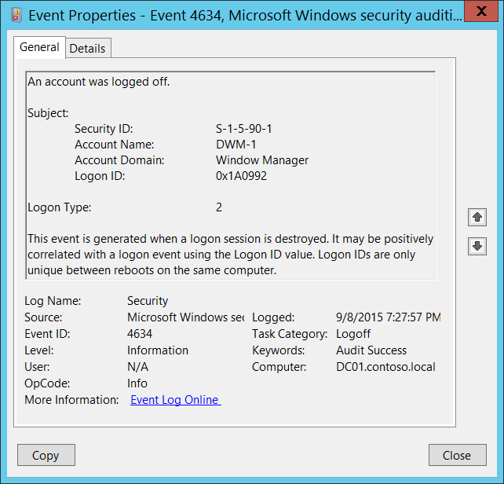

# 4634(S): アカウントがログオフされました。



***サブカテゴリ:***&nbsp;[ログオフの監査](audit-logoff.md)

***イベントの説明:***

このイベントは、ログオンセッションが終了し、存在しなくなったことを示します。

「[4647](event-4647.md): ユーザーがログオフを開始しました。」イベントと4634イベントの主な違いは、4647イベントは特定のアカウントがログオフ機能を使用してログオフ手続きを開始したときに生成され、4634イベントはセッションが終了し、存在しなくなったことを示します。

4647は、ユーザーが標準的な方法でログオフしたときに、**インタラクティブ**および**リモートインタラクティブ**ログオンタイプに対してより典型的です。ユーザーがログオフ手続きを開始したときには、通常、4647および4634の両方のイベントが表示されます。

これは、**ログオンID**値を使用して「[4624](event-4624.md): アカウントが正常にログオンされました。」イベントと正の相関があるかもしれません。ログオンIDは、同じコンピューターの再起動間でのみ一意です。

> **注**&nbsp;&nbsp;推奨事項については、このイベントの[セキュリティ監視の推奨事項](#security-monitoring-recommendations)を参照してください。

<br clear="all">

***イベントXML:***
```xml
- <Event xmlns="http://schemas.microsoft.com/win/2004/08/events/event">
- <System>
 <Provider Name="Microsoft-Windows-Security-Auditing" Guid="{54849625-5478-4994-A5BA-3E3B0328C30D}" /> 
 <EventID>4634</EventID> 
 <Version>0</Version> 
 <Level>0</Level> 
 <Task>12545</Task> 
 <Opcode>0</Opcode> 
 <Keywords>0x8020000000000000</Keywords> 
 <TimeCreated SystemTime="2015-09-09T02:27:57.877205900Z" /> 
 <EventRecordID>230019</EventRecordID> 
 <Correlation /> 
 <Execution ProcessID="516" ThreadID="832" /> 
 <Channel>Security</Channel> 
 <Computer>DC01.contoso.local</Computer> 
 <Security /> 
 </System>
- <EventData>
 <Data Name="TargetUserSid">S-1-5-90-1</Data> 
 <Data Name="TargetUserName">DWM-1</Data> 
 <Data Name="TargetDomainName">Window Manager</Data> 
 <Data Name="TargetLogonId">0x1a0992</Data> 
 <Data Name="LogonType">2</Data> 
 </EventData>
 </Event>

```

***必要なサーバー役割:*** なし。

***最小OSバージョン:*** Windows Server 2008, Windows Vista。

***イベントバージョン:*** 0。

***フィールドの説明:***

**サブジェクト:**

-   **セキュリティID** \[タイプ = SID\]**:** ログオフされたアカウントのSID。イベントビューアーは自動的にSIDを解決してアカウント名を表示しようとします。SIDが解決できない場合、イベントにはソースデータが表示されます。

> **注**&nbsp;&nbsp;**セキュリティ識別子 (SID)** は、トラスティ（セキュリティプリンシパル）を識別するために使用される可変長の一意の値です。各アカウントには、Active Directoryドメインコントローラーなどの権限によって発行され、セキュリティデータベースに保存される一意のSIDがあります。ユーザーがログオンするたびに、システムはデータベースからそのユーザーのSIDを取得し、そのユーザーのアクセストークンに配置します。システムは、アクセストークン内のSIDを使用して、以降のすべてのWindowsセキュリティとのやり取りでユーザーを識別します。SIDがユーザーまたはグループの一意の識別子として使用された場合、それは他のユーザーまたはグループを識別するために再び使用されることはありません。SIDの詳細については、[セキュリティ識別子](/windows/access-protection/access-control/security-identifiers)を参照してください。

-   **アカウント名** \[タイプ = UnicodeString\]**:** ログオフされたアカウントの名前。

-   **アカウントドメイン** \[タイプ = UnicodeString\]**:** サブジェクトのドメインまたはコンピュータ名。形式は以下のように異なります：

    -   ドメインのNETBIOS名の例: CONTOSO

    -   小文字の完全なドメイン名: contoso.local

    -   大文字の完全なドメイン名: CONTOSO.LOCAL

    -   LOCAL SERVICEやANONYMOUS LOGONなどの[よく知られたセキュリティプリンシパル](/windows/security/identity-protection/access-control/security-identifiers)の場合、このフィールドの値は「NT AUTHORITY」となります。

    -   ローカルユーザーアカウントの場合、このフィールドにはこのアカウントが属するコンピュータまたはデバイスの名前が含まれます。例: “Win81”。

-   **ログオンID** \[タイプ = HexInt64\]**:** 16進数の値で、最近のイベントと同じログオンIDを含む可能性のあるイベントとこのイベントを関連付けるのに役立ちます。例: “[4624](event-4624.md): アカウントが正常にログオンされました。”

**ログオンタイプ** \[タイプ = UInt32\]**:** 使用されたログオンのタイプ。以下の表には、このフィールドの可能な値のリストが含まれています：

| ログオンタイプ | ログオンタイトル       | 説明                                                                                                                                                                                                                                                                                                                |
|------------|-------------------|----------------------------------------------------------------------------------------------------------------------------------------------------------------------------------------------------------------------------------------------------------------------------------------------------------------------------|
| 2          | インタラクティブ       | ユーザーがこのコンピュータにログオンしました。                                                                                                                                                                                                                                                                                         |
| 3          | ネットワーク           | ユーザーまたはコンピュータがネットワークからこのコンピュータにログオンしました。                                                                                                                                                                                                                                                            |
| 4          | バッチ             | バッチログオンタイプは、ユーザーの直接の介入なしにプロセスが実行されるバッチサーバーで使用されます。                                                                                                                                                                                         |
| 5          | サービス           | サービスコントロールマネージャによってサービスが開始されました。                                                                                                                                                                                                                                                                      |
| 7          | ロック解除            | このワークステーションのロックが解除されました。                                                                                                                                                                                                                                                                                             |
| 8          | ネットワーククリアテキスト  | ユーザーがネットワークからこのコンピュータにログオンしました。ユーザーのパスワードはハッシュされていない形式で認証パッケージに渡されました。組み込みの認証パッケージはすべて、資格情報をネットワークに送信する前にハッシュします。資格情報はプレーンテキスト（クリアテキストとも呼ばれる）でネットワークを通過しません。 |
| 9          | 新しい資格情報    | 呼び出し元が現在のトークンをクローンし、アウトバウンド接続のために新しい資格情報を指定しました。新しいログオンセッションは同じローカルIDを持ちますが、他のネットワーク接続には異なる資格情報を使用します。                                                                                                                 |
| 10         | リモートインタラクティブ | ユーザーがターミナルサービスまたはリモートデスクトップを使用してリモートでこのコンピュータにログオンしました。                                                                                                                                                                                                                                      |
| 11         | キャッシュされたインタラクティブ | ユーザーがネットワーク資格情報を使用してこのコンピュータにログオンしましたが、その資格情報はコンピュータにローカルに保存されていました。ドメインコントローラは資格情報を確認するために連絡されませんでした。                                                                                                                                                    |

## セキュリティ監視の推奨事項

4634(S): アカウントがログオフされました。

> **重要**&nbsp;&nbsp;このイベントについては、[付録A: 多くの監査イベントに対するセキュリティ監視の推奨事項](appendix-a-security-monitoring-recommendations-for-many-audit-events.md)も参照してください。

- 特定の**ログオンタイプ**が特定のアカウントによって使用されるべきでない場合（例えば、ドメイン管理グループのメンバーが**ログオンタイプ**4-バッチまたは5-サービスを使用する場合）、そのようなアクションについてこのイベントを監視します。
