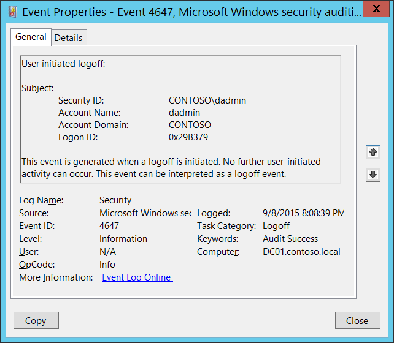

# 4647(S): ユーザーによるログオフの開始



***サブカテゴリ:***&nbsp;[ログオフの監査](audit-logoff.md)

***イベントの説明:***

このイベントはログオフが開始されたときに生成されます。ユーザーによるさらなる操作は行えません。このイベントはログオフイベントとして解釈できます。

「[4634](event-4634.md)(S): アカウントがログオフされました。」イベントとの主な違いは、4647イベントは特定のアカウントがログオフ機能を使用してログオフ手続きを開始したときに生成され、4634イベントはセッションが終了し、もはや存在しないことを示します。

4647は、ユーザーが標準的な方法でログオフしたときに、**インタラクティブ**および**リモートインタラクティブ**ログオンタイプに対してより典型的です。ユーザーがログオフ手続きを開始したときに、通常は4647および4634の両方のイベントが表示されます。

これは、**ログオンID**値を使用して「[4624](event-4624.md): アカウントが正常にログオンされました。」イベントと正の相関があるかもしれません。ログオンIDは同じコンピューター上で再起動間のみ一意です。

> **注**&nbsp;&nbsp;このイベントに関する推奨事項については、[セキュリティ監視の推奨事項](#security-monitoring-recommendations)を参照してください。

<br clear="all">

***イベント XML:***
```xml
- <Event xmlns="http://schemas.microsoft.com/win/2004/08/events/event">
- <System>
 <Provider Name="Microsoft-Windows-Security-Auditing" Guid="{54849625-5478-4994-A5BA-3E3B0328C30D}" /> 
 <EventID>4647</EventID> 
 <Version>0</Version> 
 <Level>0</Level> 
 <Task>12545</Task> 
 <Opcode>0</Opcode> 
 <Keywords>0x8020000000000000</Keywords> 
 <TimeCreated SystemTime="2015-09-09T03:08:39.126890800Z" /> 
 <EventRecordID>230200</EventRecordID> 
 <Correlation /> 
 <Execution ProcessID="516" ThreadID="3864" /> 
 <Channel>Security</Channel> 
 <Computer>DC01.contoso.local</Computer> 
 <Security /> 
 </System>
- <EventData>
 <Data Name="TargetUserSid">S-1-5-21-3457937927-2839227994-823803824-1104</Data> 
 <Data Name="TargetUserName">dadmin</Data> 
 <Data Name="TargetDomainName">CONTOSO</Data> 
 <Data Name="TargetLogonId">0x29b379</Data> 
 </EventData>
 </Event>

```

***必要なサーバーロール:*** なし。

***最小OSバージョン:*** Windows Server 2008, Windows Vista。

***イベントバージョン:*** 0。

***フィールドの説明:***

**サブジェクト:**

-   **セキュリティID** \[タイプ = SID\]**:** 「ログオフ」操作を要求したアカウントのSID。イベントビューアーは自動的にSIDを解決し、アカウント名を表示しようとします。SIDが解決できない場合、イベントにソースデータが表示されます。

> **注**&nbsp;&nbsp;**セキュリティ識別子 (SID)** は、トラスティ (セキュリティプリンシパル) を識別するために使用される可変長の一意の値です。各アカウントには、Active Directory ドメイン コントローラーなどの権限によって発行され、セキュリティ データベースに保存される一意の SID があります。ユーザーがログオンするたびに、システムはデータベースからそのユーザーの SID を取得し、そのユーザーのアクセス トークンに配置します。システムは、アクセス トークン内の SID を使用して、以降のすべての Windows セキュリティとのやり取りでユーザーを識別します。SID がユーザーまたはグループの一意の識別子として使用された場合、それは他のユーザーまたはグループを識別するために再利用されることはありません。SID の詳細については、[セキュリティ識別子](/windows/access-protection/access-control/security-identifiers) を参照してください。

-   **アカウント名** \[型 = UnicodeString\]**:** 「ログオフ」操作を要求したアカウントの名前。

-   **アカウント ドメイン** \[型 = UnicodeString\]**:** サブジェクトのドメインまたはコンピューター名。形式はさまざまで、以下のようなものがあります。

    -   ドメイン NETBIOS 名の例: CONTOSO

    -   小文字の完全なドメイン名: contoso.local

    -   大文字の完全なドメイン名: CONTOSO.LOCAL

    -   LOCAL SERVICE や ANONYMOUS LOGON などの[よく知られたセキュリティ プリンシパル](/windows/security/identity-protection/access-control/security-identifiers)の場合、このフィールドの値は「NT AUTHORITY」となります。

    -   ローカル ユーザー アカウントの場合、このフィールドには、このアカウントが属するコンピューターまたはデバイスの名前が含まれます。例: 「Win81」。

-   **ログオン ID** \[型 = HexInt64\]**:** このイベントを、同じログオン ID を含む可能性のある最近のイベントと関連付けるのに役立つ 16 進数の値。例: 「[4624](event-4624.md): アカウントが正常にログオンされました。」

## セキュリティ監視の推奨事項

4647(S): ユーザーがログオフを開始しました。

> **重要**&nbsp;&nbsp;このイベントについては、[付録 A: 多くの監査イベントに対するセキュリティ監視の推奨事項](appendix-a-security-monitoring-recommendations-for-many-audit-events.md) も参照してください。

It looks like you haven't pasted the Markdown content yet. Please provide the content you want translated into Japanese.
