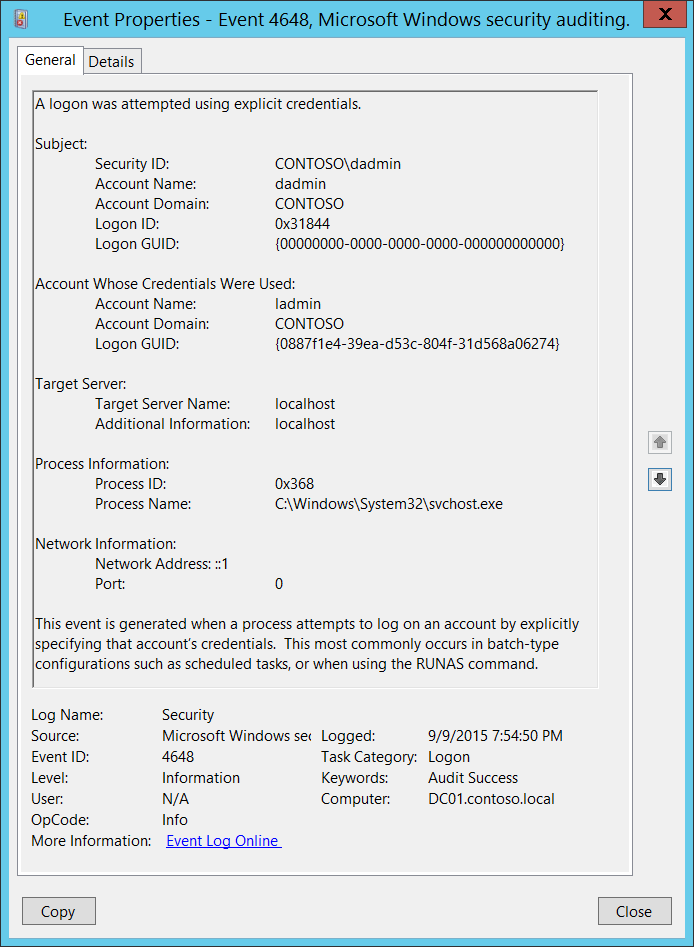

# 4648(S): 明示的な資格情報を使用してログオンが試行されました。



***サブカテゴリ:***&nbsp;[ログオンの監査](audit-logon.md)

***イベントの説明:***

このイベントは、プロセスが明示的にそのアカウントの資格情報を指定してアカウントのログオンを試行したときに生成されます。

これは、スケジュールされたタスクなどのバッチタイプの構成や、「RUNAS」コマンドを使用する場合に最も一般的に発生します。

また、通常のオペレーティングシステムの活動中に定期的に発生するルーチンイベントでもあります。

> **注**&nbsp;&nbsp;推奨事項については、このイベントの[セキュリティ監視の推奨事項](#security-monitoring-recommendations)を参照してください。

<br clear="all">

***イベント XML:***
```xml
- <Event xmlns="http://schemas.microsoft.com/win/2004/08/events/event">
- <System>
 <Provider Name="Microsoft-Windows-Security-Auditing" Guid="{54849625-5478-4994-A5BA-3E3B0328C30D}" /> 
 <EventID>4648</EventID> 
 <Version>0</Version> 
 <Level>0</Level> 
 <Task>12544</Task> 
 <Opcode>0</Opcode> 
 <Keywords>0x8020000000000000</Keywords> 
 <TimeCreated SystemTime="2015-09-10T02:54:50.771459000Z" /> 
 <EventRecordID>233200</EventRecordID> 
 <Correlation /> 
 <Execution ProcessID="516" ThreadID="1116" /> 
 <Channel>Security</Channel> 
 <Computer>DC01.contoso.local</Computer> 
 <Security /> 
 </System>
- <EventData>
 <Data Name="SubjectUserSid">S-1-5-21-3457937927-2839227994-823803824-1104</Data> 
 <Data Name="SubjectUserName">dadmin</Data> 
 <Data Name="SubjectDomainName">CONTOSO</Data> 
 <Data Name="SubjectLogonId">0x31844</Data> 
 <Data Name="LogonGuid">{00000000-0000-0000-0000-000000000000}</Data> 
 <Data Name="TargetUserName">ladmin</Data> 
 <Data Name="TargetDomainName">CONTOSO</Data> 
 <Data Name="TargetLogonGuid">{0887F1E4-39EA-D53C-804F-31D568A06274}</Data> 
 <Data Name="TargetServerName">localhost</Data> 
 <Data Name="TargetInfo">localhost</Data> 
 <Data Name="ProcessId">0x368</Data> 
 <Data Name="ProcessName">C:\\Windows\\System32\\svchost.exe</Data> 
 <Data Name="IpAddress">::1</Data> 
 <Data Name="IpPort">0</Data> 
 </EventData>
 </Event>

```

***必要なサーバー ロール:*** なし。

***最小 OS バージョン:*** Windows Server 2008, Windows Vista。

***イベント バージョン:*** 0。

***フィールドの説明:***

**サブジェクト:**

-   **セキュリティ ID** \[タイプ = SID\]**:** 明示的な資格情報で新しいログオン セッションを要求したアカウントの SID。イベント ビューアーは自動的に SID を解決してアカウント名を表示しようとします。SID を解決できない場合、イベントにはソース データが表示されます。

> **注**&nbsp;&nbsp;**セキュリティ識別子 (SID)** は、トラスティ (セキュリティ プリンシパル) を識別するために使用される可変長の一意の値です。各アカウントには、Active Directory ドメイン コントローラーなどの認証機関によって発行され、セキュリティ データベースに保存される一意の SID があります。ユーザーがログオンするたびに、システムはデータベースからそのユーザーの SID を取得し、そのユーザーのアクセストークンに配置します。システムは、アクセストークン内の SID を使用して、以降のすべての Windows セキュリティとのやり取りでユーザーを識別します。SID がユーザーまたはグループの一意の識別子として使用された場合、それは他のユーザーまたはグループを識別するために再び使用されることはありません。SID の詳細については、[セキュリティ識別子](/windows/access-protection/access-control/security-identifiers)を参照してください。

-   **アカウント名** \[タイプ = UnicodeString\]**:** 明示的な資格情報で新しいログオンセッションを要求したアカウントの名前。

-   **アカウントドメイン** \[タイプ = UnicodeString\]**:** サブジェクトのドメインまたはコンピュータ名。形式はさまざまで、以下を含みます：

    -   ドメインのNETBIOS名の例: CONTOSO

    -   小文字の完全なドメイン名: contoso.local

    -   大文字の完全なドメイン名: CONTOSO.LOCAL

    -   LOCAL SERVICEやANONYMOUS LOGONなどの[よく知られたセキュリティプリンシパル](/windows/security/identity-protection/access-control/security-identifiers)の場合、このフィールドの値は「NT AUTHORITY」となります。

    -   ローカルユーザーアカウントの場合、このフィールドにはこのアカウントが属するコンピュータまたはデバイスの名前が含まれます。例: 「Win81」。

-   **ログオンID** \[タイプ = HexInt64\]**:** 16進数の値で、同じログオンIDを含む可能性のある最近のイベントとこのイベントを関連付けるのに役立ちます。例: 「[4624](event-4624.md): アカウントが正常にログオンされました。」

-   **ログオンGUID** \[タイプ = GUID\]: 同じ**ログオンGUID**を含む可能性のある別のイベントとこのイベントを関連付けるのに役立つGUID。例: 「[4769](event-4769.md)(S, F): ドメインコントローラーでKerberosサービスチケットが要求されました。」

    また、4648イベントと同じコンピュータ上の他のいくつかのイベント（同じ**ログオンGUID**を含む可能性がある）との関連付けにも使用できます。例: 「[4624](event-4624.md)(S): アカウントが正常にログオンされました」および「[4964](event-4964.md)(S): 特別なグループが新しいログオンに割り当てられました。」

    このパラメータはイベントでキャプチャされない場合があり、その場合は「{00000000-0000-0000-0000-000000000000}」として表示されます。

> **注**&nbsp;&nbsp;**GUID**は「グローバル一意識別子」の略です。リソース、アクティビティ、またはインスタンスを識別するために使用される128ビットの整数です。

**使用された資格情報のアカウント:**

-   **アカウント名** \[タイプ = UnicodeString\]**:** 使用された資格情報のアカウントの名前。

-   **アカウントドメイン** \[タイプ = UnicodeString\]**:** サブジェクトのドメインまたはコンピュータ名。形式はさまざまで、以下を含みます：

-   ドメイン NETBIOS 名の例: CONTOSO

-   小文字の完全なドメイン名: contoso.local

-   大文字の完全なドメイン名: CONTOSO.LOCAL

-   LOCAL SERVICE や ANONYMOUS LOGON などの[よく知られたセキュリティプリンシパル](/windows/security/identity-protection/access-control/security-identifiers)の場合、このフィールドの値は "NT AUTHORITY" です。

-   ローカルユーザーアカウントの場合、このフィールドにはこのアカウントが属するコンピューターまたはデバイスの名前が含まれます。例: "Win81"。

-   **ログオン GUID** \[タイプ = GUID\]: このイベントを別のイベントと関連付けるのに役立つ GUID。別のイベントには同じ **ログオン GUID** が含まれることがあります。例えば、ドメインコントローラー上の "[4769](event-4769.md)(S, F): Kerberos サービスチケットが要求されたイベント" です。

    また、同じコンピューター上で同じ **ログオン GUID** を含む 4648 イベントと他のいくつかのイベントとの相関に使用することもできます。例えば、"[4624](event-4624.md)(S): アカウントが正常にログオンされました" や "[4964](event-4964.md)(S): 特別なグループが新しいログオンに割り当てられました" です。

    このパラメーターはイベントでキャプチャされない場合があり、その場合は "{00000000-0000-0000-0000-000000000000}" として表示されます。

> **注**&nbsp;&nbsp;**GUID** は 'Globally Unique Identifier' の略です。リソース、アクティビティ、またはインスタンスを識別するために使用される 128 ビットの整数です。

**ターゲットサーバー:**

-   **ターゲットサーバー名** \[タイプ = UnicodeString\]**:** 新しいプロセスが実行されたサーバーの名前。プロセスがローカルで実行された場合は "**localhost**" の値を持ちます。

-   **追加情報** \[タイプ = UnicodeString\]**:** このフィールドに関する詳細情報はこのドキュメントにはありません。

**プロセス情報:**

-   **プロセス ID** \[タイプ = ポインタ\]: 明示的な資格情報を使用して実行されたプロセスの 16 進数のプロセス ID。プロセス ID (PID) は、オペレーティングシステムがアクティブなプロセスを一意に識別するために使用する番号です。特定のプロセスの PID を確認するには、例えばタスクマネージャー (詳細タブ、PID 列) を使用できます:

    

    16進値を10進値に変換すると、タスクマネージャーの値と比較できます。

    また、このプロセスIDを他のイベントのプロセスIDと関連付けることもできます。例えば、「[4688](event-4688.md): 新しいプロセスが作成されました」**プロセス情報\\新しいプロセスID**。

-   **プロセス名** \[タイプ = UnicodeString\]**:** プロセスの実行可能ファイルのフルパスと名前。

**ネットワーク情報:**

-   **ネットワークアドレス** \[タイプ = UnicodeString\]**:** ログオン試行が行われたマシンのIPアドレス。

    -   クライアントのIPv6アドレスまたは::ffff:IPv4アドレス。

    -   ::1または127.0.0.1はローカルホストを意味します。

-   **ポート** \[タイプ = UnicodeString\]: リモートマシンからのログオン試行に使用されたソースポート。

    -   対話型ログオンの場合は0。

## セキュリティ監視の推奨事項

4648(S): 明示的な資格情報を使用してログオンが試行されました。

次の表は、[付録A: 多くの監査イベントに対するセキュリティ監視の推奨事項](appendix-a-security-monitoring-recommendations-for-many-audit-events.md)の表に似ていますが、「**資格情報が使用されたアカウント\\セキュリティID**」を使用した監視方法も説明しています。

| **必要な監視の種類**                                                                                                                                                                                                                                                                                   | **推奨事項**                                                                                                                                                                                                                                                                                                                                                   |
|-------------------------------------------------------------------------------------------------------------------------------------------------------------------------------------------------------------------------------------------------------------------------------------------------------------------|----------------------------------------------------------------------------------------------------------------------------------------------------------------------------------------------------------------------------------------------------------------------------------------------------------------------------------------------------------------------|
| **高価値アカウント**: 各アクションを監視する必要がある高価値のドメインまたはローカルアカウントがある場合があります。<br>高価値アカウントの例としては、データベース管理者、組み込みのローカル管理者アカウント、ドメイン管理者、サービスアカウント、ドメインコントローラーアカウントなどがあります。 | 高価値アカウントまたはアカウントに対応する**「サブジェクト\\セキュリティID」**または「**資格情報が使用されたアカウント\\セキュリティID**」でこのイベントを監視します。                                                                                                                                                                                              |
| **異常または悪意のある行動**: 異常を検出したり、潜在的な悪意のある行動を監視するための特定の要件がある場合があります。例えば、勤務時間外のアカウント使用を監視する必要があるかもしれません。                                                                                | 異常や悪意のある行動を監視する場合、**「サブジェクト\\セキュリティID」**および「**資格情報が使用されたアカウント\\セキュリティID**」（他の情報と共に）を使用して、特定のアカウントがどのように、またはいつ使用されているかを監視します。                                                                                                                               |
| **非アクティブアカウント**: 非アクティブ、無効、またはゲストアカウント、または使用されるべきではない他のアカウントがある場合があります。                                                                                                                                                                                     | 使用されるべきではないアカウントに対応する**「サブジェクト\\セキュリティID」**または「**資格情報が使用されたアカウント\\セキュリティID**」でこのイベントを監視します。                                                                                                                                                                                          |
| **アカウント許可リスト**: 特定のイベントに対応するアクションを実行することが許可されているアカウントの特定の許可リストがある場合があります。                                                                                                                                                                    | このイベントが「許可リストのみ」のアクションに対応する場合、許可リスト外のアカウントに対して**「サブジェクト\\セキュリティID」**および「**資格情報が使用されたアカウント\\セキュリティID**」を確認します。                                                                                                                                                                |
| **外部アカウント**: 別のドメインからのアカウントや、このイベントに対応するアクションを実行することが許可されていない「外部」アカウントを監視している場合があります。                                                                                                                                       | 別のドメインからのアカウントや「外部」アカウントに対応する**「サブジェクト\\アカウントドメイン」**または「**資格情報が使用されたアカウント\\セキュリティID**」を監視します。                                                                                                                                                                                        |
| **制限された使用のコンピュータまたはデバイス**: 特定の人（アカウント）が通常アクションを実行すべきではない特定のコンピュータ、マシン、またはデバイスがある場合があります。                                                                                                                                      | 関心のある**「サブジェクト\\セキュリティID」**または「**資格情報が使用されたアカウント\\セキュリティID**」によって実行されたアクションについて、対象の**コンピュータ:**（または他の対象デバイス）を監視します。<br>例えば、「**資格情報が使用されたアカウント\\セキュリティID**」が特定のコンピュータにログオンされないことを監視するかもしれません。 |
| **アカウント命名規則**: 組織にはアカウント名に関する特定の命名規則があるかもしれません。                                                                                                                                                                                                       | 命名規則に従わない名前について「**サブジェクト\\アカウント名」**および「**資格情報が使用されたアカウント\\セキュリティID**」を監視します。                                                                                                                                                                                                                  |

-   このイベントで報告されたプロセスに対して事前に定義された「**プロセス名**」がある場合、その定義された値と異なるすべてのイベントを監視します。

-   「**プロセス名**」が標準フォルダ（例えば、**System32** や **Program Files**）にないか、制限されたフォルダ（例えば、**Temporary Internet Files**）にあるかを監視することができます。

<!-- -->

-   プロセス名に含まれる制限された部分文字列や単語（例えば、「**mimikatz**」や「**cain.exe**」）の事前定義リストがある場合、「**プロセス名**」にこれらの部分文字列が含まれているかを確認します。

-   **Subject\\Security ID** が **Account Whose Credentials Were Used\\Account Name** の資格情報を知っているべきでない、または使用すべきでない場合、このイベントを監視します。

-   **Account Whose Credentials Were Used\\Account Name** の資格情報が **Network Information\\Network Address** から使用されるべきでない場合、このイベントを監視します。

-   **Network Information\\Network Address** が内部IPアドレスリストからのものであることを確認します。例えば、特定のアカウント（例えば、サービスアカウント）が特定のIPアドレスからのみ使用されるべきであることがわかっている場合、**Network Information\\Network Address** が許可されたIPアドレスのいずれでもないすべてのイベントを監視することができます。
