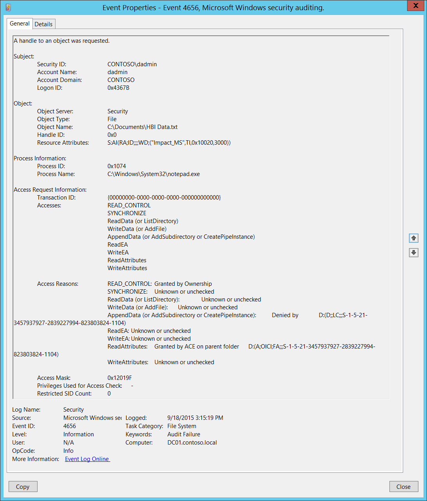
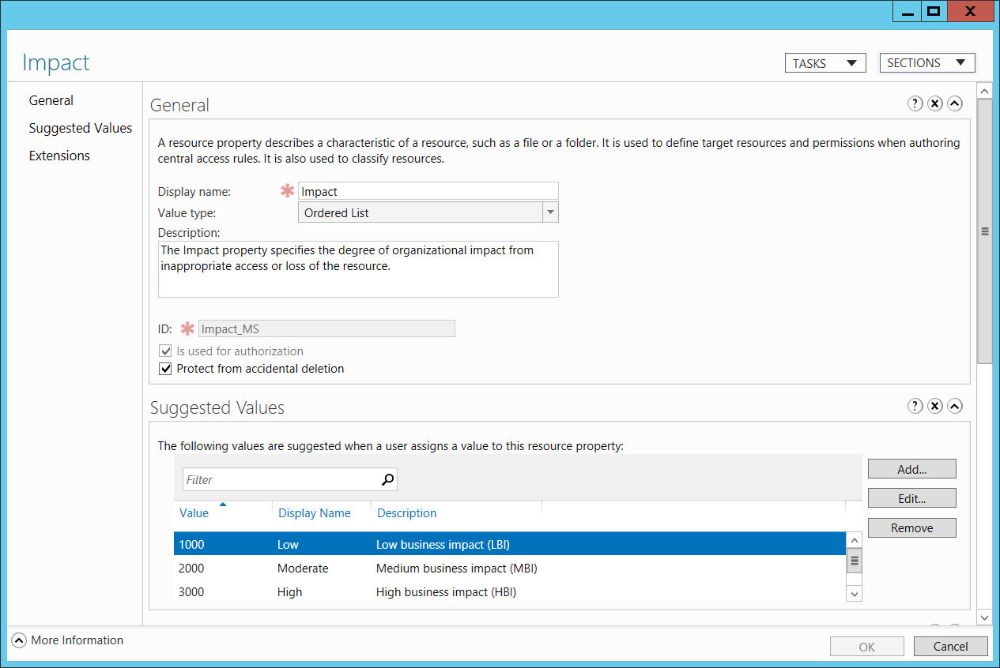

# 4656(S, F): オブジェクトへのハンドルが要求されました。



***サブカテゴリ:***&nbsp;[ファイルシステムの監査](audit-file-system.md)、[カーネルオブジェクトの監査](audit-kernel-object.md)、[レジストリの監査](audit-registry.md)、および [リムーバブルストレージの監査](audit-removable-storage.md)

***イベントの説明:***

このイベントは、オブジェクトに対して特定のアクセスが要求されたことを示します。オブジェクトはファイルシステム、カーネル、またはレジストリオブジェクト、またはリムーバブルストレージやデバイス上のファイルシステムオブジェクトである可能性があります。

アクセスが拒否された場合、失敗イベントが生成されます。

このイベントは、オブジェクトの [SACL](/windows/win32/secauthz/access-control-lists) が特定のアクセス権の使用を処理するために必要な ACE を持っている場合にのみ生成されます。

このイベントはアクセスが要求されたことと要求の結果を示しますが、操作が実行されたことを示すものではありません。操作が実行されたことを確認するには、「[4663](event-4663.md)(S): オブジェクトへのアクセスが試みられました」を確認してください。

> **注**&nbsp;&nbsp;推奨事項については、このイベントの [セキュリティ監視の推奨事項](#security-monitoring-recommendations) を参照してください。

***イベント XML***:
```xml
- <Event xmlns="http://schemas.microsoft.com/win/2004/08/events/event">
- <System>
 <Provider Name="Microsoft-Windows-Security-Auditing" Guid="{54849625-5478-4994-A5BA-3E3B0328C30D}" /> 
 <EventID>4656</EventID> 
 <Version>1</Version> 
 <Level>0</Level> 
 <Task>12800</Task> 
 <Opcode>0</Opcode> 
 <Keywords>0x8010000000000000</Keywords> 
 <TimeCreated SystemTime="2015-09-18T22:15:19.346776600Z" /> 
 <EventRecordID>274057</EventRecordID> 
 <Correlation /> 
 <Execution ProcessID="516" ThreadID="524" /> 
 <Channel>Security</Channel> 
 <Computer>DC01.contoso.local</Computer> 
 <Security /> 
 </System>
- <EventData>
 <Data Name="SubjectUserSid">S-1-5-21-3457937927-2839227994-823803824-1104</Data> 
 <Data Name="SubjectUserName">dadmin</Data> 
 <Data Name="SubjectDomainName">CONTOSO</Data> 
 <Data Name="SubjectLogonId">0x4367b</Data> 
 <Data Name="ObjectServer">Security</Data> 
 <Data Name="ObjectType">File</Data> 
 <Data Name="ObjectName">C:\\Documents\\HBI Data.txt</Data> 
 <Data Name="HandleId">0x0</Data> 
 <Data Name="TransactionId">{00000000-0000-0000-0000-000000000000}</Data> 
 <Data Name="AccessList">%%1538 %%1541 %%4416 %%4417 %%4418 %%4419 %%4420 %%4423 %%4424</Data> 
 <Data Name="AccessReason">%%1538: %%1804 %%1541: %%1809 %%4416: %%1809 %%4417: %%1809 %%4418: %%1802 D:(D;;LC;;;S-1-5-21-3457937927-2839227994-823803824-1104) %%4419: %%1809 %%4420: %%1809 %%4423: %%1811 D:(A;OICI;FA;;;S-1-5-21-3457937927-2839227994-823803824-1104) %%4424: %%1809</Data> 
 <Data Name="AccessMask">0x12019f</Data> 
 <Data Name="PrivilegeList">-</Data> 
 <Data Name="RestrictedSidCount">0</Data> 
 <Data Name="ProcessId">0x1074</Data> 
 <Data Name="ProcessName">C:\\Windows\\System32\\notepad.exe</Data> 
 <Data Name="ResourceAttributes">S:AI(RA;ID;;;;WD;("Impact\_MS",TI,0x10020,3000))</Data> 
 </EventData>
 </Event>

```

***必要なサーバー役割:*** なし。

***最小 OS バージョン:*** Windows Server 2008、Windows Vista。

***イベントバージョン:***

-   0 - Windows Server 2008、Windows Vista。

-   1 - Windows Server 2012、Windows 8。

    -   「リソース属性」フィールドが追加されました。

    -   「アクセス理由」フィールドが追加されました。

***フィールドの説明:***

**サブジェクト:**

-   **セキュリティ ID** \[タイプ = SID\]**:** オブジェクトへのハンドルを要求したアカウントの SID。イベントビューアーは自動的に SID を解決してアカウント名を表示しようとします。SID を解決できない場合、イベントにソースデータが表示されます。

> **注**&nbsp;&nbsp;**セキュリティ識別子 (SID)** は、トラスティ (セキュリティプリンシパル) を識別するために使用される可変長の一意の値です。各アカウントには、Active Directory ドメイン コントローラーなどの権限によって発行され、セキュリティ データベースに保存される一意の SID があります。ユーザーがログオンするたびに、システムはデータベースからそのユーザーの SID を取得し、そのユーザーのアクセス トークンに配置します。システムは、アクセス トークン内の SID を使用して、以降のすべての Windows セキュリティとのやり取りでユーザーを識別します。SID がユーザーまたはグループの一意の識別子として使用された場合、それは他のユーザーまたはグループを識別するために再び使用されることはありません。SID の詳細については、[セキュリティ識別子](/windows/access-protection/access-control/security-identifiers) を参照してください。

-   **アカウント名** \[タイプ = UnicodeString\]**:** オブジェクトへのハンドルを要求したアカウントの名前。

-   **アカウント ドメイン** \[タイプ = UnicodeString\]**:** サブジェクトのドメインまたはコンピューター名。形式はさまざまで、次のようなものがあります。

    -   ドメイン NETBIOS 名の例: CONTOSO

    -   小文字の完全なドメイン名: contoso.local

    -   大文字の完全なドメイン名: CONTOSO.LOCAL

    -   LOCAL SERVICE や ANONYMOUS LOGON などの[既知のセキュリティ プリンシパル](/windows/security/identity-protection/access-control/security-identifiers)の場合、このフィールドの値は「NT AUTHORITY」となります。

    -   ローカル ユーザー アカウントの場合、このフィールドには、このアカウントが属するコンピューターまたはデバイスの名前が含まれます。例: 「Win81」。

-   **ログオン ID** \[タイプ = HexInt64\]**:** このイベントを、同じログオン ID を含む可能性のある最近のイベントと関連付けるのに役立つ 16 進値。例: 「[4624](event-4624.md): アカウントのログオンに成功しました。」

**オブジェクト**:

-   **オブジェクト サーバー** \[タイプ = UnicodeString\]: このイベントの「**Security**」値。

-   **オブジェクト タイプ** \[タイプ = UnicodeString\]: 操作中にアクセスされたオブジェクトのタイプ。

    次の表には、最も一般的な**オブジェクト タイプ**のリストが含まれています:

| ディレクトリ           | イベント     | タイマー             | デバイス     |
|-------------------------|--------------|----------------------|--------------|
| ミュータント            | タイプ       | ファイル             | トークン     |
| スレッド                | セクション   | ウィンドウステーション | デバッグオブジェクト |
| フィルター通信ポート    | イベントペア | ドライバー           | Ioコンプリション |
| コントローラー          | シンボリックリンク | WmiGuid          | プロセス     |
| プロファイル            | デスクトップ | キードイベント       | アダプター   |
| キー                    | 待機可能ポート | コールバック         | セマフォ     |
| ジョブ                  | ポート       | フィルター接続ポート | ALPCポート   |

-   **オブジェクト名** \[タイプ = UnicodeString\]: アクセスが要求されたオブジェクトの名前およびその他の識別情報。例えば、ファイルの場合、パスが含まれます。

-   **ハンドルID** \[タイプ = ポインタ\]: **オブジェクト名**へのハンドルの16進数値。このフィールドは、同じハンドルIDを含む可能性のある他のイベントとこのイベントを関連付けるのに役立ちます。例えば、「[4663](event-4663.md)(S): オブジェクトへのアクセスが試みられました。」このパラメータはイベントでキャプチャされない場合があり、その場合は「0x0」と表示されます。

-   **リソース属性** \[タイプ = UnicodeString\] \[バージョン 1\]: オブジェクトに関連付けられた属性。一部のオブジェクトでは、このフィールドは適用されず、「-」が表示されます。

    例えば、ファイルの場合、次のように表示されることがあります: S:AI(RA;ID;;;;WD;("Impact\_MS",TI,0x10020,3000))

    -   Impact\_MS: リソースプロパティ ***ID***。

    -   3000: リソースプロパティ ***値***。



**プロセス情報:**

-   **プロセスID** \[タイプ = ポインタ\]: アクセスが要求されたプロセスの16進数プロセスID。プロセスID (PID) は、オペレーティングシステムがアクティブなプロセスを一意に識別するために使用する番号です。特定のプロセスのPIDを確認するには、例えば、タスクマネージャー（詳細タブ、PID列）を使用できます:

    

    16進数の値を10進数に変換すると、タスクマネージャーの値と比較することができます。

    また、このプロセスIDを他のイベントのプロセスIDと関連付けることもできます。例えば、「[4688](event-4688.md): 新しいプロセスが作成されました」**プロセス情報\\新しいプロセスID**などです。

-   **プロセス名** \[タイプ = UnicodeString\]**:** プロセスの実行ファイルのフルパスと名前。

**アクセス要求情報:**

-   **トランザクションID** \[タイプ = GUID\]: トランザクションの一意のGUID。このフィールドは、同じ**トランザクションID**を含む可能性のある他のイベントとこのイベントを関連付けるのに役立ちます。例えば、「[4660](event-4660.md)(S): オブジェクトが削除されました」などです。

    このパラメータはイベントでキャプチャされない場合があり、その場合は「{00000000-0000-0000-0000-000000000000}」として表示されます。

> **注**&nbsp;&nbsp;**GUID**は「Globally Unique Identifier（グローバル一意識別子）」の略です。リソース、アクティビティ、またはインスタンスを識別するために使用される128ビットの整数です。

-   **アクセス** \[タイプ = UnicodeString\]: **サブジェクト\\セキュリティID**によって要求されたアクセス権のリスト。これらのアクセス権は**オブジェクトタイプ**に依存します。以下の表には、ファイルシステムオブジェクトの最も一般的なアクセス権に関する情報が含まれています。レジストリオブジェクトのアクセス権はファイルシステムオブジェクトと似ていることが多いですが、表にはそれらがどのように異なるかについてのいくつかの注釈が含まれています。

| <span id="File_system_objects_access_rights" class="anchor"></span>アクセス             | 16進数の値,<br>スキーマ値  | 説明    |
|---------------------------------------------------------------------------------------|-------------------------------------|----------------|
| ReadData (または ListDirectory)<br><br>(レジストリオブジェクトの場合、これは「キー値のクエリ」です。) | 0x1,<br>%%4416                | **ReadData -** ファイルオブジェクトの場合、対応するファイルデータを読み取る権利。ディレクトリオブジェクトの場合、対応するディレクトリデータを読み取る権利。<br>**ListDirectory -** ディレクトリの場合、ディレクトリの内容をリストする権利。                                                                                     |
| WriteData (または AddFile)<br><br>(レジストリオブジェクトの場合、これは「キー値の設定」です。)        | 0x2,<br>%%4417                | **WriteData -** ファイルオブジェクトの場合、ファイルにデータを書き込む権利。ディレクトリオブジェクトの場合、ディレクトリにファイルを作成する権利（**FILE\_ADD\_FILE**）。<br>**AddFile -** ディレクトリの場合、ディレクトリにファイルを作成する権利。                                                                                         |
| AppendData (または AddSubdirectory または CreatePipeInstance)                                 | 0x4,<br>%%4418                | **AppendData -** ファイルオブジェクトの場合、ファイルにデータを追加する権利。（ローカルファイルの場合、このフラグが**FILE\_WRITE\_DATA**なしで指定されている場合、書き込み操作は既存のデータを上書きしません。）ディレクトリオブジェクトの場合、サブディレクトリを作成する権利（**FILE\_ADD\_SUBDIRECTORY**）。 <br>**AddSubdirectory -** ディレクトリの場合、サブディレクトリを作成する権利。<br>**CreatePipeInstance -** 名前付きパイプの場合、パイプを作成する権利。                                                                                                                                                                                                                                                              |
| ReadEA<br>(レジストリオブジェクトの場合、これは「サブキーの列挙」です。)                       | 0x8,<br>%%4419                | 拡張ファイル属性を読み取る権利。                                                                                                           |
| WriteEA                                                                               | 0x10,<br>%%4420               | 拡張ファイル属性を書き込む権利。                                                                                                          |
| Execute/Traverse                                                                      | 0x20,<br>%%4421               | **Execute** - ネイティブコードファイルの場合、ファイルを実行する権利。このアクセス権がスクリプトに与えられると、スクリプトインタープリタによってスクリプトが実行可能になる場合があります。<br>**Traverse -** ディレクトリの場合、ディレクトリをトラバースする権利。デフォルトでは、ユーザーには**BYPASS\_TRAVERSE\_CHECKING**&thinsp; [特権](/windows/win32/secauthz/privileges)が割り当てられており、これは**FILE\_TRAVERSE**&thinsp; [アクセス権](/windows/win32/secauthz/access-rights-and-access-masks)を無視します。詳細については、[ファイルセキュリティとアクセス権](/windows/win32/fileio/file-security-and-access-rights)の備考を参照してください。                                                                                      |
| DeleteChild                                                                            | 0x40,<br>%%4422              | ディレクトリの場合、ディレクトリとその中に含まれるすべてのファイル（読み取り専用ファイルを含む）を削除する権利。                                                                                                                                                        |
| ReadAttributes                                                                         | 0x80,<br>%%4423              | ファイル属性を読み取る権利。                                                                                                                    |
| WriteAttributes                                                                        | 0x100,<br>%%4424             | ファイル属性を書き込む権利。                                                                                                                   |
| DELETE                                                                                 | 0x10000,<br>%%1537           | オブジェクトを削除する権利。                                                                                                                       |
| READ\_CONTROL                                                                          | 0x20000,<br>%%1538           | オブジェクトのセキュリティ記述子の情報を読み取る権利（システムアクセス制御リスト（SACL）の情報を含まない）。                                                                                                                                                                                              |
| WRITE\_DAC                                                                             | 0x40000,<br>%%1539           | オブジェクトのセキュリティ記述子の任意アクセス制御リスト（DACL）を変更する権利。                                                                                                                                                                      |
| WRITE\_OWNER                                                                           | 0x80000,<br>%%1540           | オブジェクトのセキュリティ記述子の所有者を変更する権利。                                                                                                                                                                                              |
| SYNCHRONIZE                                                                            | 0x100000,<br>%%1541 | オブジェクトを同期に使用する権利。これにより、スレッドはオブジェクトがシグナル状態になるまで待機できます。一部のオブジェクトタイプはこのアクセス権をサポートしていません。                                                                                                                                                                         |
| ACCESS\_SYS\_SEC                                                                       | 0x1000000,<br>%%1542         | ACCESS\_SYS\_SECアクセス権は、オブジェクトのセキュリティ記述子のSACLを取得または設定する能力を制御します。                                         |

> <span id="_Ref433973578" class="anchor"></span>表14. ファイルシステムオブジェクトのアクセス権。

-   **アクセス理由** \[タイプ = UnicodeString\] \[バージョン 1\]: アクセスチェック結果のリスト。オブジェクトによって形式が異なります。カーネルオブジェクトの場合、このフィールドは適用されません。

-   **アクセスマスク** \[タイプ = HexInt32\]: 要求または実行された操作のための16進マスク。詳細については、前の表を参照してください。

<!-- -->

-   **アクセスチェックに使用された特権** \[タイプ = UnicodeString\]: 操作中に使用されたユーザー特権のリスト。例えば、SeBackupPrivilege。このパラメータはイベントにキャプチャされない場合があり、その場合は「-」として表示されます。ユーザー特権の完全なリストは以下の表を参照してください:

| 特権名                          | ユーザー権利グループポリシー名                                   | 説明                                                                                                                                                                                                                                                                                                                                                                                                                                                                                                                                                                                                                                                                                                                                                                                                                                                           |
|---------------------------------|----------------------------------------------------------------|-----------------------------------------------------------------------------------------------------------------------------------------------------------------------------------------------------------------------------------------------------------------------------------------------------------------------------------------------------------------------------------------------------------------------------------------------------------------------------------------------------------------------------------------------------------------------------------------------------------------------------------------------------------------------------------------------------------------------------------------------------------------------------------------------------------------------------------------------------------------------|
| SeAssignPrimaryTokenPrivilege   | プロセスレベルのトークンを置き換える                            | プロセスの[*プライマリトークン*](/windows/win32/secgloss/p-gly#_security_primary_token_gly)を割り当てるために必要です。<br>この特権を持つユーザーは、開始されたサブプロセスに関連付けられたデフォルトのトークンを置き換えるためにプロセスを開始できます。                                                                                                                                                                                                                                                                                                                                                                                                                                                                                                                                                                 |
| SeAuditPrivilege                | セキュリティ監査を生成する                                     | この特権を持つユーザーは、セキュリティログにエントリを追加できます。                                                                                                                                                                                                                                                                                                                                                                                                                                                                                                                                                                                                                                                                                                                                                                                                    |
| SeBackupPrivilege               | ファイルとディレクトリをバックアップする                        | - バックアップ操作を実行するために必要です。<br>この特権を持つユーザーは、システムをバックアップする目的でファイルやディレクトリ、レジストリ、その他の永続的なオブジェクトの権限をバイパスできます。<br>この特権により、システムはファイルに指定された[*アクセス制御リスト*](/windows/win32/secgloss/a-gly#_security_access_control_list_gly) (ACL) に関係なく、すべての読み取りアクセス権を付与します。読み取り以外のアクセス要求はACLで評価されます。この特権を持つ場合、次のアクセス権が付与されます:<br>READ\_CONTROL<br>ACCESS\_SYSTEM\_SECURITY<br>FILE\_GENERIC\_READ<br>FILE\_TRAVERSE                                                                                                                |
| SeChangeNotifyPrivilege         | トラバースチェックをバイパスする                                | ファイルやディレクトリの変更通知を受け取るために必要です。この特権により、システムはすべてのトラバースアクセスチェックをスキップします。<br>この特権を持つユーザーは、トラバースされたディレクトリに対する権限がなくてもディレクトリツリーをトラバースできます。この特権は、ユーザーがディレクトリの内容をリストすることを許可するものではなく、ディレクトリをトラバースするだけです。                                                                                                                                                                                                                                                                                                                                                                                                                                                             |
| SeCreateGlobalPrivilege         | グローバルオブジェクトを作成する                                | ターミナルサービスセッション中にグローバル名前空間に名前付きファイルマッピングオブジェクトを作成するために必要です。                                                                                                                                                                                                                                                                                                                                                                                                                                                                                                                                                                                                                                                                                                                                                              |
| SeCreatePagefilePrivilege       | ページファイルを作成する                                       | この特権を持つユーザーは、ページファイルのサイズを作成および変更できます。                                                                                                                                                                                                                                                                                                                                                                                                                                                                                                                                                                                                                                                                                                                                                                                           |
| SeCreatePermanentPrivilege      | 永続的な共有オブジェクトを作成する                              | 永続的なオブジェクトを作成するために必要です。<br>この特権は、オブジェクト名前空間を拡張するカーネルモードコンポーネントに役立ちます。カーネルモードで実行されているコンポーネントはすでにこの特権を持っているため、特権を割り当てる必要はありません。                                                                                                                                                                                                                                                                                                                                                                                                                                                                                                                                                                                            |
| SeCreateSymbolicLinkPrivilege   | シンボリックリンクを作成する                                   | シンボリックリンクを作成するために必要です。                                                                                                                                                                                                                                                                                                                                                                                                                                                                                                                                                                                                                                                                                                                                                                                                                                   |
| SeCreateTokenPrivilege          | トークンオブジェクトを作成する                                 | プロセスがNtCreateToken()や他のトークン作成APIを使用して、任意のローカルリソースにアクセスするために使用できるトークンを作成することを許可します。<br>プロセスがこの特権を必要とする場合、別のユーザーアカウントを作成してこの特権を割り当てるのではなく、ローカルシステムアカウント（すでにこの特権を含んでいる）を使用することをお勧めします。                                                                                                                                                                                                                                                                                                                                                                                                                                                                                |
| SeDebugPrivilege                | プログラムをデバッグする                                       | 他のアカウントが所有するプロセスのメモリをデバッグおよび調整するために必要です。<br>この特権を持つユーザーは、任意のプロセスまたはカーネルにデバッガをアタッチできます。自分のアプリケーションをデバッグしている開発者はこのユーザー権利を必要としません。新しいシステムコンポーネントをデバッグしている開発者はこのユーザー権利を必要とします。このユーザー権利は、機密性が高く重要なオペレーティングシステムコンポーネントへの完全なアクセスを提供します。                                                                                                                                                                                                                                                                                                                                                                                                                                |
| SeEnableDelegationPrivilege     | 委任のために信頼されるコンピュータおよびユーザーアカウントを有効にする | ユーザーおよびコンピュータアカウントを委任のために信頼されるようにマークするために必要です。<br>この特権を持つユーザーは、ユーザーまたはコンピュータオブジェクトに**委任のために信頼される**設定を設定できます。<br>この特権を持つユーザーまたはオブジェクトは、ユーザーまたはコンピュータオブジェクトのアカウント制御フラグに書き込みアクセス権を持っている必要があります。委任のために信頼されるコンピュータ（またはユーザーコンテキストで実行されているサーバープロセス）は、クライアントの委任された資格情報を使用して別のコンピュータ上のリソースにアクセスできます。ただし、クライアントのアカウントに**委任できないアカウント**のアカウント制御フラグが設定されていない場合に限ります。                                                                                                                                                                                                                      |
| SeImpersonatePrivilege          | 認証後にクライアントを偽装する                                 | この特権を持つユーザーは、他のアカウントを偽装できます。                                                                                                                                                                                                                                                                                                                                                                                                                                                                                                                                                                                                                                                                                                                                                                                                         |
| SeIncreaseBasePriorityPrivilege | スケジューリング優先度を上げる                                 | プロセスの基本優先度を上げるために必要です。<br>この特権を持つユーザーは、別のプロセスに対して書き込みプロパティアクセスを持つプロセスを使用して、他のプロセスに割り当てられた実行優先度を上げることができます。この特権を持つユーザーは、タスクマネージャーのユーザーインターフェイスを通じてプロセスのスケジューリング優先度を変更できます。                                                                                                                                                                                                                                                                                                                                                                                                                                                                                                                     |
| SeIncreaseQuotaPrivilege        | プロセスのメモリクォータを調整する                             | プロセスに割り当てられたクォータを増やすために必要です。<br>この特権を持つユーザーは、プロセスが消費できる最大メモリを変更できます。                                                                                                                                                                                                                                                                                                                                                                                                                                                                                                                                                                                                                                                                                                        |
| SeIncreaseWorkingSetPrivilege   | プロセスのワーキングセットを増やす                             | ユーザーのコンテキストで実行されるアプリケーションに対して、より多くのメモリを割り当てるために必要です。                                                                                                                                                                                                                                                                                                                                                                                                                                                                                                                                                                                                                                                                                                                                                                                   |
| SeLoadDriverPrivilege           | デバイスドライバをロードおよびアンロードする                   | デバイスドライバをロードまたはアンロードするために必要です。<br>この特権を持つユーザーは、デバイスドライバやその他のコードをカーネルモードに動的にロードおよびアンロードできます。このユーザー権利は、プラグアンドプレイデバイスドライバには適用されません。                                                                                                                                                                                                                                                                                                                                                                                                                                                                                                                                                                                                                                    |
| SeLockMemoryPrivilege           | メモリ内のページをロックする                                   | 物理ページをメモリにロックするために必要です。<br>この特権を持つユーザーは、プロセスを使用してデータを物理メモリに保持し、システムがデータをディスク上の仮想メモリにページングするのを防ぐことができます。この特権を行使すると、利用可能なランダムアクセスメモリ（RAM）の量が減少するため、システムパフォーマンスに大きな影響を与える可能性があります。                                                                                                                                                                                                                                                                                                                                                                                                                                                                                                             |
| SeMachineAccountPrivilege       | ドメインにワークステーションを追加する                         | この特権を持つユーザーは、コンピュータアカウントを作成できます。<br>この特権はドメインコントローラーでのみ有効です。                                                                                                                                                                                                                                                                                                                                                                                                                                                                                                                                                                                                                                                                                                                                             |
| SeManageVolumePrivilege         | ボリュームメンテナンスタスクを実行する                         | リモートデフラグメンテーションなどのボリュームメンテナンスタスクを実行するために必要です。                                                                                                                                                                                                                                                                                                                                                                                                                                                                                                                                                                                                                                                                                                                                                                                        |
| SeProfileSingleProcessPrivilege | 単一プロセスのプロファイルを作成する                           | 単一プロセスのプロファイル情報を収集するために必要です。<br>この特権を持つユーザーは、パフォーマンスモニタリングツールを使用して非システムプロセスのパフォーマンスを監視できます。                                                                                                                                                                                                                                                                                                                                                                                                                                                                                                                                                                                                                                                                       |
| SeRelabelPrivilege              | オブジェクトラベルを変更する                                   | オブジェクトの強制整合性レベルを変更するために必要です。                                                                                                                                                                                                                                                                                                                                                                                                                                                                                                                                                                                                                                                                                                                                                                                                        |
| SeRemoteShutdownPrivilege       | リモートシステムからのシャットダウンを強制する                 | ネットワークリクエストを使用してシステムをシャットダウンするために必要です。                                                                                                                                                                                                                                                                                                                                                                                                                                                                                                                                                                                                                                                                                                                                                                                                               |
| SeRestorePrivilege              | ファイルとディレクトリを復元する                                | 復元操作を実行するために必要です。この特権により、システムはファイルに指定されたACLに関係なく、すべての書き込みアクセス権を付与します。書き込み以外のアクセス要求はACLで評価されます。さらに、この特権により、任意の有効なユーザーまたはグループSIDをファイルの所有者として設定できます。この特権を持つ場合、次のアクセス権が付与されます:<br>WRITE\_DAC<br>WRITE\_OWNER<br>ACCESS\_SYSTEM\_SECURITY<br>FILE\_GENERIC\_WRITE<br>FILE\_ADD\_FILE<br>FILE\_ADD\_SUBDIRECTORY<br>DELETE<br>この特権を持つユーザーは、バックアップされたファイルやディレクトリを復元する際にファイル、ディレクトリ、レジストリ、その他の永続的なオブジェクトの権限をバイパスでき、任意の有効なセキュリティプリンシパルをオブジェクトの所有者として設定できるユーザーを決定します。 |
| SeSecurityPrivilege             | 監査およびセキュリティログを管理する                           | セキュリティイベントログで監査イベントを制御および表示するなど、いくつかのセキュリティ関連機能を実行するために必要です。<br>この特権を持つユーザーは、ファイル、Active Directoryオブジェクト、レジストリキーなどの個々のリソースに対してオブジェクトアクセス監査オプションを指定できます。<br>この特権を持つユーザーは、セキュリティログを表示およびクリアすることもできます。                                                                                                                                                                                                                                                                                                                                                                                                                                                                                 |
| SeShutdownPrivilege             | システムをシャットダウンする                                   | ローカルシステムをシャットダウンするために必要です。                                                                                                                                                                                                                                                                                                                                                                                                                                                                                                                                                                                                                                                                                                                                                                                                                                 |
| SeSyncAgentPrivilege            | ディレクトリサービスデータを同期する                             | この特権により、保有者はオブジェクトおよびプロパティの保護に関係なく、ディレクトリ内のすべてのオブジェクトおよびプロパティを読み取ることができます。デフォルトでは、ドメインコントローラーの管理者およびローカルシステムアカウントに割り当てられています。<br>この特権を持つユーザーは、すべてのディレクトリサービスデータを同期できます。これはActive Directory同期とも呼ばれます。                                                                                                                                                                                                                                                                                                                                                                                                                                                                        |
| SeSystemEnvironmentPrivilege    | ファームウェア環境値を変更する                                 | このタイプのメモリを使用して構成情報を保存するシステムの不揮発性RAMを変更するために必要です。                                                                                                                                                                                                                                                                                                                                                                                                                                                                                                                                                                                                                                                                                                                                                    |
| SeSystemProfilePrivilege        | システムパフォーマンスをプロファイルする                       | システム全体のプロファイル情報を収集するために必要です。<br>この特権を持つユーザーは、パフォーマンスモニタリングツールを使用してシステムプロセスのパフォーマンスを監視できます。                                                                                                                                                                                                                                                                                                                                                                                                                                                                                                                                                                                                                                                                          |
| SeSystemtimePrivilege           | システム時間を変更する                                         | システム時間を変更するために必要です。<br>この特権を持つユーザーは、コンピュータの内部時計の時間と日付を変更できます。このユーザー権利が割り当てられているユーザーは、イベントログの表示に影響を与える可能性があります。システム時間が変更されると、記録されたイベントは実際に発生した時間ではなく、この新しい時間を反映します。                                                                                                                                                                                                                                                                                                                                                                                                                                                                                                       |
| SeTakeOwnershipPrivilege        | ファイルやその他のオブジェクトの所有権を取得する               | 任意のアクセスを付与されることなくオブジェクトの所有権を取得するために必要です。この特権により、所有者の値をオブジェクトの所有者として正当に割り当てることができる値にのみ設定できます。<br>この特権を持つユーザーは、Active Directoryオブジェクト、ファイルおよびフォルダ、プリンタ、レジストリキー、プロセス、およびスレッドを含むシステム内の任意のセキュリティオブジェクトの所有権を取得できます。                                                                                                                                                                                                                                                                                                                                                                                                                                  |
| SeTcbPrivilege                  | オペレーティングシステムの一部として動作する                   | この特権は、その保有者を信頼されたコンピュータベースの一部として識別します。<br>このユーザー権利により、プロセスは認証なしで任意のユーザーを偽装できます。したがって、プロセスはそのユーザーと同じローカルリソースにアクセスできます。                                                                                                                                                                                                                                                                                                                                                                                                                                                                                                                                                                                                                  |
| SeTimeZonePrivilege             | タイムゾーンを変更する                                         | コンピュータの内部時計に関連付けられたタイムゾーンを調整するために必要です。                                                                                                                                                                                                                                                                                                                                                                                                                                                                                                                                                                                                                                                                                                                                                                                       |
| SeTrustedCredManAccessPrivilege | 信頼された呼び出し元として資格情報マネージャーにアクセスする    | 信頼された呼び出し元として資格情報マネージャーにアクセスするために必要です。                                                                                                                                                                                                                                                                                                                                                                                                                                                                                                                                                                                                                                                                                                                                                                                                            |
| SeUndockPrivilege               | ドッキングステーションからコンピュータを取り外す               | ラップトップを取り外すために必要です。<br>この特権を持つユーザーは、ログオンせずにポータブルコンピュータをドッキングステーションから取り外すことができます。                                                                                                                                                                                                                                                                                                                                                                                                                                                                                                                                                                                                                                                                                                                       |
| SeUnsolicitedInputPrivilege     | 該当なし                                                       | [*端末*](/windows/win32/secgloss/t-gly#_security_terminal_gly)デバイスからの未承諾の入力を読み取るために必要です。                                                                                                                                                                                                                                                                                                                                                                                                                                                                                                                                                                                                                                                                                                |

-   **制限されたSIDの数** \[型 = UInt32\]: トークン内の[制限されたSID](/windows/win32/api/securitybaseapi/nf-securitybaseapi-createrestrictedtoken)の数。特定の**オブジェクトタイプ**にのみ適用されます。

## セキュリティ監視の推奨事項

4656(S, F): オブジェクトへのハンドルが要求されました。

カーネルオブジェクトの場合、このイベントおよび他の監査イベントはセキュリティ関連性がほとんどなく、解析や分析が難しいです。カーネルオブジェクトレベルで監視する必要がある場合を除き、監査の推奨はありません。

他のタイプのオブジェクトについては、以下の推奨事項が適用されます。

> **重要**&nbsp;&nbsp;このイベントについては、[付録A: 多くの監査イベントに対するセキュリティ監視の推奨事項](appendix-a-security-monitoring-recommendations-for-many-audit-events.md)も参照してください。

-   このイベントで報告されたプロセスの「**プロセス名**」が事前に定義されたものである場合、定義された値と異なる「**プロセス名**」のすべてのイベントを監視します。

-   「**プロセス名**」が標準フォルダー（例：**System32**や**Program Files**）にない、または制限されたフォルダー（例：**Temporary Internet Files**）にあるかどうかを監視できます。

<!-- -->

-   プロセス名に制限された部分文字列や単語（例：「**mimikatz**」や「**cain.exe**」）のリストが事前に定義されている場合、「**プロセス名**」にこれらの部分文字列が含まれているかどうかを確認します。

-   **オブジェクト名**がアクセス試行を監視する必要がある機密または重要なオブジェクトである場合、すべての[4656](event-4656.md)イベントを監視します。

-   **オブジェクト名**が特定のアクセス試行（例：書き込みアクションのみ）を監視する必要がある機密または重要なオブジェクトである場合、対応する**アクセス要求情報\\アクセス**値を持つすべての[4656](event-4656.md)イベントを監視します。

-   特定のリソース属性値を持つファイルやフォルダーを監視する必要がある場合、特定の**リソース属性**フィールド値を持つすべての[4656](event-4656.md)イベントを監視します。

    ファイルシステムオブジェクトについては、これらの**アクセス要求情報\\アクセス**権（特に失敗イベントの場合）を監視することをお勧めします:

    -   データの書き込み (またはファイルの追加)

    -   データの追加 (またはサブディレクトリの追加、パイプインスタンスの作成)

    -   拡張属性の書き込み

    -   子の削除

    -   属性の書き込み

    -   削除

    -   DACの書き込み

    -   所有者の書き込み
