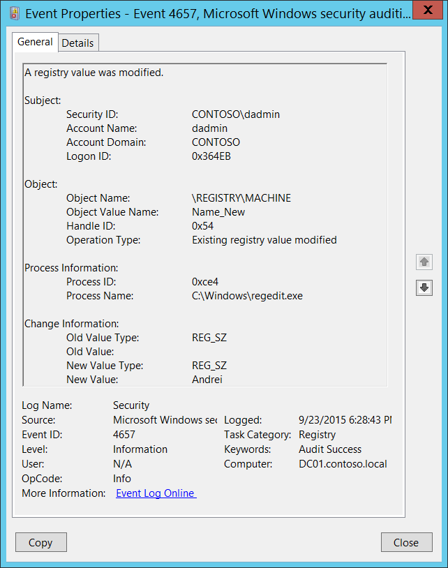

# 4657(S): レジストリ値が変更されました。



***サブカテゴリ:***&nbsp;[監査レジストリ](audit-registry.md)

***イベントの説明:***

このイベントは、レジストリキーの***値***が変更されたときに生成されます。レジストリキーが変更されたときには生成されません。

このイベントは、レジストリキーの[SACL](/windows/win32/secauthz/access-control-lists)に「値の設定」監査が設定されている場合にのみ生成されます。

> **注**&nbsp;&nbsp;推奨事項については、このイベントの[セキュリティ監視の推奨事項](#security-monitoring-recommendations)を参照してください。

<br clear="all">

***イベント XML:***
```
- <Event xmlns="http://schemas.microsoft.com/win/2004/08/events/event">
- <System>
 <Provider Name="Microsoft-Windows-Security-Auditing" Guid="{54849625-5478-4994-A5BA-3E3B0328C30D}" /> 
 <EventID>4657</EventID> 
 <Version>0</Version> 
 <Level>0</Level> 
 <Task>12801</Task> 
 <Opcode>0</Opcode> 
 <Keywords>0x8020000000000000</Keywords> 
 <TimeCreated SystemTime="2015-09-24T01:28:43.639634100Z" /> 
 <EventRecordID>744725</EventRecordID> 
 <Correlation /> 
 <Execution ProcessID="4" ThreadID="4824" /> 
 <Channel>Security</Channel> 
 <Computer>DC01.contoso.local</Computer> 
 <Security /> 
 </System>
- <EventData>
 <Data Name="SubjectUserSid">S-1-5-21-3457937927-2839227994-823803824-1104</Data> 
 <Data Name="SubjectUserName">dadmin</Data> 
 <Data Name="SubjectDomainName">CONTOSO</Data> 
 <Data Name="SubjectLogonId">0x364eb</Data> 
 <Data Name="ObjectName">\\REGISTRY\\MACHINE</Data> 
 <Data Name="ObjectValueName">Name\_New</Data> 
 <Data Name="HandleId">0x54</Data> 
 <Data Name="OperationType">%%1905</Data> 
 <Data Name="OldValueType">%%1873</Data> 
 <Data Name="OldValue" /> 
 <Data Name="NewValueType">%%1873</Data> 
 <Data Name="NewValue">Andrei</Data> 
 <Data Name="ProcessId">0xce4</Data> 
 <Data Name="ProcessName">C:\\Windows\\regedit.exe</Data> 
 </EventData>
 </Event>

```

***必要なサーバー役割:*** なし。

***最小 OS バージョン:*** Windows Server 2008, Windows Vista。

***イベントバージョン:*** 0。

***フィールドの説明:***

**サブジェクト:**

-   **セキュリティ ID** \[タイプ = SID\]**:** 「レジストリ値の変更」操作を要求したアカウントの SID。イベントビューアーは自動的に SID を解決し、アカウント名を表示しようとします。SID を解決できない場合、イベントにソースデータが表示されます。

> **注**&nbsp;&nbsp;**セキュリティ識別子 (SID)** は、トラスティ (セキュリティプリンシパル) を識別するために使用される可変長の一意の値です。各アカウントには、Active Directory ドメインコントローラーなどの権限によって発行され、セキュリティデータベースに保存される一意の SID があります。ユーザーがログオンするたびに、システムはデータベースからそのユーザーの SID を取得し、そのユーザーのアクセストークンに配置します。システムは、アクセストークン内の SID を使用して、以降のすべての Windows セキュリティとのやり取りでユーザーを識別します。SID がユーザーまたはグループの一意の識別子として使用された場合、それは他のユーザーまたはグループを識別するために再利用されることはありません。SID についての詳細は、[セキュリティ識別子](/windows/access-protection/access-control/security-identifiers)を参照してください。

-   **アカウント名** \[タイプ = UnicodeString\]**:** 「レジストリ値の変更」操作を要求したアカウントの名前。

-   **アカウントドメイン** \[タイプ = UnicodeString\]**:** サブジェクトのドメインまたはコンピュータ名。形式は以下のように異なります：

    -   ドメインのNETBIOS名の例: CONTOSO

    -   小文字の完全なドメイン名: contoso.local

    -   大文字の完全なドメイン名: CONTOSO.LOCAL

    -   LOCAL SERVICEやANONYMOUS LOGONなどの[よく知られたセキュリティプリンシパル](/windows/security/identity-protection/access-control/security-identifiers)の場合、このフィールドの値は「NT AUTHORITY」となります。

    -   ローカルユーザーアカウントの場合、このフィールドにはこのアカウントが属するコンピュータまたはデバイスの名前が含まれます。例：「Win81」。

-   **ログオンID** \[タイプ = HexInt64\]**:** 16進数の値で、最近のイベントと同じログオンIDを含む可能性のあるイベントとこのイベントを関連付けるのに役立ちます。例：「[4624](event-4624.md): アカウントが正常にログオンされました。」

**オブジェクト:**

-   **オブジェクト名** \[タイプ = UnicodeString\]: 値が変更されたレジストリキーのフルパスと名前。形式は \\REGISTRY\\HIVE\\PATH です。ここで：

    -   HIVE:

        -   HKEY\_LOCAL\_MACHINE = \\REGISTRY\\MACHINE

        -   HKEY\_CURRENT\_USER = \\REGISTRY\\USER\\\[USER\_SID\]、ここで\[USER\_SID\]は現在のユーザーのSIDです。

        -   HKEY\_CLASSES\_ROOT = \\REGISTRY\\MACHINE\\SOFTWARE\\Classes

        -   HKEY\_USERS = \\REGISTRY\\USER

        -   HKEY\_CURRENT\_CONFIG = \\REGISTRY\\MACHINE\\SYSTEM\\ControlSet001\\Hardware Profiles\\Current

    -   PATH – レジストリキーへのパス。

-   **オブジェクト値の名前** \[タイプ = UnicodeString\]**:** 変更されたレジストリキーの値の名前。

-   **ハンドルID** \[タイプ = Pointer\]: **オブジェクト名**へのハンドルの16進数の値。このフィールドは、同じハンドルIDを含む可能性のある他のイベントとこのイベントを関連付けるのに役立ちます。例：「[4656](event-4656.md): オブジェクトへのハンドルが要求されました。」このパラメータはイベントでキャプチャされない場合があり、その場合は「0x0」と表示されます。

-   **操作タイプ** \[Type = UnicodeString\]**:** レジストリキー値に対して実行された操作のタイプ。最も一般的な操作は以下の通りです：

    -   新しいレジストリ値が作成されました

    -   レジストリ値が削除されました

    -   既存のレジストリ値が変更されました

**プロセス情報:**

-   **プロセスID** \[Type = Pointer\]: レジストリキー値が変更されたプロセスの16進数のプロセスID。プロセスID (PID) は、オペレーティングシステムがアクティブなプロセスを一意に識別するために使用する番号です。特定のプロセスのPIDを確認するには、例えばタスクマネージャー（詳細タブ、PID列）を使用できます：

    

    16進数の値を10進数に変換すると、タスクマネージャーの値と比較できます。

    また、このプロセスIDを他のイベントのプロセスIDと関連付けることもできます。例えば、"[4688](event-4688.md): 新しいプロセスが作成されました" **プロセス情報\\新しいプロセスID**。

-   **プロセス名** \[Type = UnicodeString\]**:** プロセスの実行可能ファイルのフルパスと名前。

**変更情報:**

-   **旧値タイプ** \[Type = UnicodeString\]**:** 変更されたレジストリキー値の旧タイプ。レジストリキー値のタイプ：

| 値タイプ        | 説明                     |
|-----------------|-------------------------|
| REG\_SZ         | 文字列                   |
| REG\_BINARY     | バイナリ                 |
| REG\_DWORD      | DWORD (32ビット) 値      |
| REG\_QWORD      | QWORD (64ビット) 値      |
| REG\_MULTI\_SZ  | 複数文字列値             |
| REG\_EXPAND\_SZ | 展開可能な文字列値       |

-   **旧値** \[Type = UnicodeString\]: 変更されたレジストリキー値の旧値。

-   **新値タイプ** \[Type = UnicodeString\]**:** 変更されたレジストリキー値の新タイプ。可能な値については上記の表を参照してください。

-   **新値** \[Type = UnicodeString\]: 変更されたレジストリキー値の新値。

## セキュリティ監視の推奨事項

4657(S): レジストリ値が変更されました。

> **重要**&nbsp;&nbsp;このイベントについては、[付録A: 多くの監査イベントに対するセキュリティ監視の推奨事項](appendix-a-security-monitoring-recommendations-for-many-audit-events.md)も参照してください。

-   このイベントで報告されたプロセスに対して事前に定義された「**プロセス名**」がある場合、定義された値と異なる「**プロセス名**」のすべてのイベントを監視します。

-   「**プロセス名**」が標準フォルダ（例えば、**System32**や**Program Files**）にない、または制限されたフォルダ（例えば、**Temporary Internet Files**）にあるかどうかを監視できます。

<!-- -->

-   プロセス名に含まれる制限された部分文字列や単語（例えば、「**mimikatz**」や「**cain.exe**」）の事前定義リストがある場合、「**プロセス名**」にこれらの部分文字列が含まれているかどうかを確認します。

-   **オブジェクト名**が、その値の変更を監視する必要がある機密または重要なレジストリキーである場合、すべての[4657](event-4657.md)イベントを監視します。

-   **オブジェクト名**に特定の値（**オブジェクト値名**）があり、これらの値の変更を監視する必要がある場合、すべての[4657](event-4657.md)イベントを監視します。
