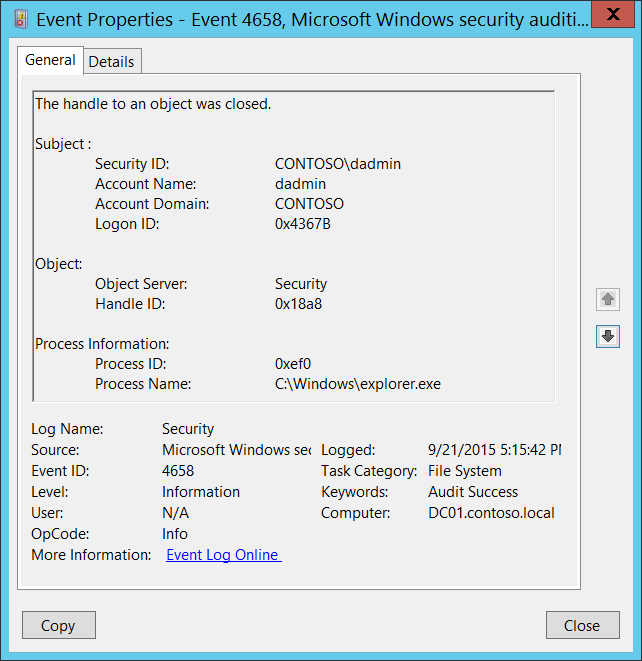

# 4658(S): オブジェクトのハンドルが閉じられました。



***サブカテゴリ:***&nbsp;[ファイルシステムの監査](audit-file-system.md)、[ハンドル操作の監査](audit-handle-manipulation.md)、[カーネルオブジェクトの監査](audit-kernel-object.md)、[レジストリの監査](audit-registry.md)、および[リムーバブルストレージの監査](audit-removable-storage.md)

***イベントの説明:***

このイベントは、オブジェクトのハンドルが閉じられたときに生成されます。オブジェクトはファイルシステム、カーネル、レジストリオブジェクト、またはリムーバブルストレージやデバイス上のファイルシステムオブジェクトである可能性があります。

このイベントは、[ハンドル操作の監査](audit-handle-manipulation.md)サブカテゴリの成功監査が有効になっている場合にのみ生成されます。

通常、このイベントはオブジェクトのハンドルがどれくらいの期間開いていたかを知る必要がある場合に必要です。それ以外の場合、セキュリティ上の関連性はないかもしれません。

> **注**&nbsp;&nbsp;推奨事項については、このイベントの[セキュリティ監視の推奨事項](#security-monitoring-recommendations)を参照してください。

<br clear="all">

***イベント XML:***
```
- <Event xmlns="http://schemas.microsoft.com/win/2004/08/events/event">
- <System>
 <Provider Name="Microsoft-Windows-Security-Auditing" Guid="{54849625-5478-4994-A5BA-3E3B0328C30D}" /> 
 <EventID>4658</EventID> 
 <Version>0</Version> 
 <Level>0</Level> 
 <Task>12800</Task> 
 <Opcode>0</Opcode> 
 <Keywords>0x8020000000000000</Keywords> 
 <TimeCreated SystemTime="2015-09-22T00:15:42.910428100Z" /> 
 <EventRecordID>276724</EventRecordID> 
 <Correlation /> 
 <Execution ProcessID="4" ThreadID="5056" /> 
 <Channel>Security</Channel> 
 <Computer>DC01.contoso.local</Computer> 
 <Security /> 
 </System>
- <EventData>
 <Data Name="SubjectUserSid">S-1-5-21-3457937927-2839227994-823803824-1104</Data> 
 <Data Name="SubjectUserName">dadmin</Data> 
 <Data Name="SubjectDomainName">CONTOSO</Data> 
 <Data Name="SubjectLogonId">0x4367b</Data> 
 <Data Name="ObjectServer">Security</Data> 
 <Data Name="HandleId">0x18a8</Data> 
 <Data Name="ProcessId">0xef0</Data> 
 <Data Name="ProcessName">C:\\Windows\\explorer.exe</Data> 
 </EventData>
 </Event>

```

***必要なサーバーの役割:*** なし。

***最小 OS バージョン:*** Windows Server 2008、Windows Vista。

***イベントバージョン:*** 0。

***フィールドの説明:***

**サブジェクト:**

-   **セキュリティ ID** \[タイプ = SID\]**:** 「オブジェクトのハンドルを閉じる」操作を要求したアカウントのSID。イベントビューアーは自動的にSIDを解決してアカウント名を表示しようとします。SIDが解決できない場合、イベントにソースデータが表示されます。

> **注**&nbsp;&nbsp;**セキュリティ識別子 (SID)** は、トラスティ（セキュリティプリンシパル）を識別するために使用される可変長の一意の値です。各アカウントには、Active Directoryドメインコントローラーなどの権限によって発行され、セキュリティデータベースに保存される一意のSIDがあります。ユーザーがログオンするたびに、システムはデータベースからそのユーザーのSIDを取得し、そのユーザーのアクセス トークンに配置します。システムは、アクセス トークン内のSIDを使用して、以降のすべてのWindowsセキュリティとのやり取りでユーザーを識別します。SIDがユーザーまたはグループの一意の識別子として使用された場合、それは他のユーザーまたはグループを識別するために再び使用されることはありません。SIDの詳細については、[セキュリティ識別子](/windows/access-protection/access-control/security-identifiers)を参照してください。

-   **アカウント名** \[タイプ = UnicodeString\]**:** “オブジェクトのハンドルを閉じる”操作を要求したアカウントの名前。

-   **アカウントドメイン** \[タイプ = UnicodeString\]**:** サブジェクトのドメインまたはコンピュータ名。形式はさまざまで、以下を含みます：

    -   ドメイン NETBIOS 名の例: CONTOSO

    -   小文字の完全なドメイン名: contoso.local

    -   大文字の完全なドメイン名: CONTOSO.LOCAL

    -   一部の[よく知られたセキュリティプリンシパル](/windows/security/identity-protection/access-control/security-identifiers)の場合、例えば LOCAL SERVICE や ANONYMOUS LOGON、このフィールドの値は “NT AUTHORITY” です。

    -   ローカルユーザーアカウントの場合、このフィールドにはこのアカウントが属するコンピュータまたはデバイスの名前が含まれます。例えば: “Win81”。

-   **ログオンID** \[タイプ = HexInt64\]**:** 16進数の値で、同じログオンIDを含む最近のイベントとこのイベントを関連付けるのに役立ちます。例えば、“[4624](event-4624.md): アカウントが正常にログオンされました。”

**オブジェクト**:

-   **オブジェクトサーバー** \[タイプ = UnicodeString\]: このイベントの値は “**Security**” です。

-   **ハンドルID** \[タイプ = Pointer\]: **オブジェクト名**へのハンドルの16進数値。このフィールドは、同じハンドルIDを含む他のイベントとこのイベントを関連付けるのに役立ちます。例えば、“[4663](event-4663.md)(S): オブジェクトにアクセスしようとしました。” このパラメータはイベントでキャプチャされない場合があり、その場合は “0x0” と表示されます。

**プロセス情報:**

-   **プロセスID** \[タイプ = Pointer\]: ハンドルを閉じることを要求したプロセスの16進数プロセスID。プロセスID (PID) は、オペレーティングシステムがアクティブなプロセスを一意に識別するために使用する番号です。特定のプロセスのPIDを確認するには、例えばタスクマネージャー（詳細タブ、PID列）を使用できます：

    

    16進数の値を10進数に変換すると、タスクマネージャーの値と比較できます。

    また、このプロセスIDを他のイベントのプロセスIDと関連付けることもできます。例えば、“[4688](event-4688.md): 新しいプロセスが作成されました” **プロセス情報\\新しいプロセスID**。

-   **プロセス名** \[Type = UnicodeString\]**:** プロセスの実行可能ファイルのフルパスと名前。

## セキュリティ監視の推奨事項

4658(S): オブジェクトのハンドルが閉じられました。

> **重要**&nbsp;&nbsp;このイベントについては、[付録A: 多くの監査イベントに対するセキュリティ監視の推奨事項](appendix-a-security-monitoring-recommendations-for-many-audit-events.md)も参照してください。

-   通常、このイベントはセキュリティ関連性がほとんどなく、解析や分析が難しいです。特定の監視対象が明確でない限り、このイベントに対する推奨事項はありません。

-   このイベントは、特定のオブジェクトハンドルに関連するすべてのアクションや操作を追跡するために使用できます。

-   このイベントで報告されたプロセスの「**プロセス名**」が事前に定義されたものである場合、定義された値と異なる「**プロセス名**」のすべてのイベントを監視します。

-   「**プロセス名**」が標準フォルダ（例：**System32** や **Program Files**）にない、または制限されたフォルダ（例：**Temporary Internet Files**）にあるかどうかを監視できます。

<!-- -->

-   プロセス名に含まれる制限されたサブストリングや単語の事前定義リスト（例：「**mimikatz**」や「**cain.exe**」）がある場合、「**プロセス名**」にこれらのサブストリングが含まれているかどうかを確認します。
