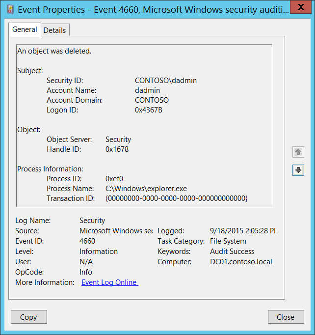

# 4660(S): オブジェクトが削除されました。



***サブカテゴリ:***&nbsp;[ファイルシステムの監査](audit-file-system.md)、[カーネルオブジェクトの監査](audit-kernel-object.md)、および[レジストリの監査](audit-registry.md)

***イベントの説明:***

このイベントはオブジェクトが削除されたときに生成されます。オブジェクトはファイルシステム、カーネル、またはレジストリオブジェクトである可能性があります。

このイベントは、オブジェクトの[SACL](/windows/win32/secauthz/access-control-lists)に「削除」監査が設定されている場合にのみ生成されます。

このイベントには削除されたオブジェクトの名前（**ハンドルID**のみ）が含まれていません。オブジェクトの削除を追跡するには、DELETEアクセスを使用した「[4663](event-4663.md)(S): オブジェクトにアクセスしようとしました」を使用する方が良いでしょう。

このイベントの利点は、実際の削除操作中にのみ生成されることです。対照的に、「4663(S): オブジェクトにアクセスしようとしました」は、オブジェクトの名前変更などの他のアクション中にも生成されます。

> **注**&nbsp;&nbsp;推奨事項については、このイベントの[セキュリティ監視の推奨事項](#security-monitoring-recommendations)を参照してください。

<br clear="all">

***イベントXML:***
```xml
- <Event xmlns="http://schemas.microsoft.com/win/2004/08/events/event">
- <System>
 <Provider Name="Microsoft-Windows-Security-Auditing" Guid="{54849625-5478-4994-A5BA-3E3B0328C30D}" /> 
 <EventID>4660</EventID> 
 <Version>0</Version> 
 <Level>0</Level> 
 <Task>12800</Task> 
 <Opcode>0</Opcode> 
 <Keywords>0x8020000000000000</Keywords> 
 <TimeCreated SystemTime="2015-09-18T21:05:28.677152100Z" /> 
 <EventRecordID>270188</EventRecordID> 
 <Correlation /> 
 <Execution ProcessID="4" ThreadID="3060" /> 
 <Channel>Security</Channel> 
 <Computer>DC01.contoso.local</Computer> 
 <Security /> 
 </System>
- <EventData>
 <Data Name="SubjectUserSid">S-1-5-21-3457937927-2839227994-823803824-1104</Data> 
 <Data Name="SubjectUserName">dadmin</Data> 
 <Data Name="SubjectDomainName">CONTOSO</Data> 
 <Data Name="SubjectLogonId">0x4367b</Data> 
 <Data Name="ObjectServer">Security</Data> 
 <Data Name="HandleId">0x1678</Data> 
 <Data Name="ProcessId">0xef0</Data> 
 <Data Name="ProcessName">C:\\Windows\\explorer.exe</Data> 
 <Data Name="TransactionId">{00000000-0000-0000-0000-000000000000}</Data> 
 </EventData>
 </Event>

```

***必要なサーバー役割:*** なし。

***最小OSバージョン:*** Windows Server 2008、Windows Vista。

***イベントバージョン:*** 0。

***フィールドの説明:***

**サブジェクト:**

-   **セキュリティID** \[タイプ = SID\]**:** 「オブジェクトの削除」操作を要求したアカウントのSID。イベントビューアーは自動的にSIDを解決し、アカウント名を表示しようとします。SIDが解決できない場合、イベントにはソースデータが表示されます。

> **注**&nbsp;&nbsp;**セキュリティ識別子 (SID)** は、トラスティ（セキュリティプリンシパル）を識別するために使用される可変長の一意の値です。各アカウントには、Active Directoryドメインコントローラーなどの権限によって発行され、セキュリティデータベースに保存される一意のSIDがあります。ユーザーがログオンするたびに、システムはデータベースからそのユーザーのSIDを取得し、そのユーザーのアクセストークンに配置します。システムはアクセストークン内のSIDを使用して、以降のすべてのWindowsセキュリティとのやり取りでユーザーを識別します。SIDがユーザーまたはグループの一意の識別子として使用された場合、それは他のユーザーまたはグループを識別するために再び使用されることはありません。SIDの詳細については、[セキュリティ識別子](/windows/access-protection/access-control/security-identifiers)を参照してください。

-   **アカウント名** \[タイプ = UnicodeString\]**:** “オブジェクトの削除”操作を要求したアカウントの名前。

-   **アカウント ドメイン** \[タイプ = UnicodeString\]**:** サブジェクトのドメインまたはコンピュータ名。形式はさまざまで、以下のようなものが含まれます：

    -   ドメイン NETBIOS 名の例: CONTOSO

    -   小文字の完全ドメイン名: contoso.local

    -   大文字の完全ドメイン名: CONTOSO.LOCAL

    -   一部の[よく知られたセキュリティ プリンシパル](/windows/security/identity-protection/access-control/security-identifiers)の場合、例えば LOCAL SERVICE や ANONYMOUS LOGON、このフィールドの値は “NT AUTHORITY” です。

    -   ローカル ユーザー アカウントの場合、このフィールドにはこのアカウントが属するコンピュータまたはデバイスの名前が含まれます。例えば: “Win81”。

-   **ログオン ID** \[タイプ = HexInt64\]**:** 16 進数の値で、最近のイベントと同じログオン ID を含む可能性のあるイベントとこのイベントを関連付けるのに役立ちます。例えば、“[4624](event-4624.md): アカウントが正常にログオンされました。”

**オブジェクト**:

-   **オブジェクト サーバー** \[タイプ = UnicodeString\]: このイベントの値は “**Security**” です。

-   **ハンドル ID** \[タイプ = Pointer\]: **オブジェクト名**へのハンドルの16進数値。このフィールドは、同じハンドル ID を含む可能性のある他のイベントとこのイベントを関連付けるのに役立ちます。例えば、“[4663](event-4663.md)(S): オブジェクトへのアクセスが試みられました。” このパラメーターはイベントでキャプチャされない場合があり、その場合は “0x0” と表示されます。

**プロセス情報:**

-   **プロセス ID** \[タイプ = Pointer\]: オブジェクトを削除したプロセスの16進数のプロセス ID。プロセス ID (PID) は、オペレーティング システムがアクティブなプロセスを一意に識別するために使用する番号です。特定のプロセスの PID を確認するには、例えばタスク マネージャー (詳細タブ、PID 列) を使用できます：

    

    16 進数の値を10進数に変換すると、タスク マネージャーの値と比較できます。

    また、このプロセス ID を他のイベントのプロセス ID と関連付けることもできます。例えば、“[4688](event-4688.md): 新しいプロセスが作成されました” **プロセス情報\\新しいプロセス ID**。

-   **プロセス名** \[タイプ = UnicodeString\]**:** プロセスの実行ファイルのフルパスと名前。

<!-- -->

-   **トランザクションID** \[タイプ = GUID\]: トランザクションの一意のGUID。このフィールドは、他のイベントと同じ**トランザクションID**を含む可能性のあるイベント（例: “[4656](event-4656.md)(S, F): オブジェクトへのハンドルが要求されました。”）とこのイベントを関連付けるのに役立ちます。

    このパラメータはイベントでキャプチャされない場合があり、その場合は「{00000000-0000-0000-0000-000000000000}」として表示されます。

> **注**&nbsp;&nbsp;**GUID**は「Globally Unique Identifier」の略です。これはリソース、アクティビティ、またはインスタンスを識別するために使用される128ビットの整数です。

## セキュリティ監視の推奨事項

4660(S): オブジェクトが削除されました。

-   このイベントには削除されたオブジェクトの名前（**ハンドルID**のみ）が含まれていません。オブジェクト削除アクションを追跡するには、DELETEアクセスを伴う“[4663](event-4663.md)(S): オブジェクトへのアクセスが試みられました。”イベントを使用する方が良いです。

-   カーネルオブジェクトの場合、このイベントおよび他の監査イベントはセキュリティ関連性がほとんどなく、解析や分析が困難です。カーネルオブジェクトレベルで何を監視する必要があるかを正確に把握していない限り、監査の推奨事項はありません。
