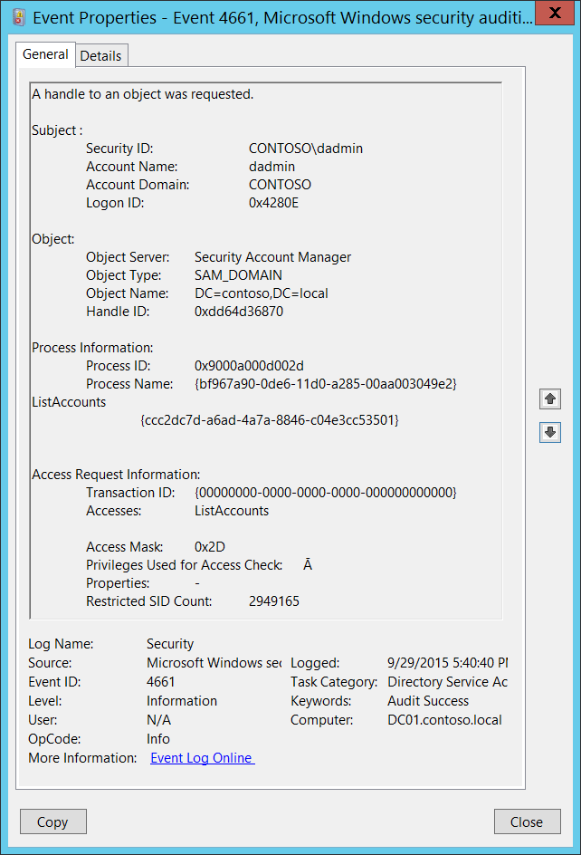

# 4661(S, F): オブジェクトへのハンドルが要求されました。



***サブカテゴリ:***&nbsp;[ディレクトリ サービス アクセスの監査](audit-directory-service-access.md) および [SAM の監査](audit-sam.md)

***イベントの説明:***

このイベントは、Active Directory オブジェクトまたはセキュリティ アカウント マネージャー (SAM) オブジェクトのハンドルが要求されたことを示します。

アクセスが拒否された場合、失敗イベントが生成されます。

このイベントは、[ハンドル操作の監査](audit-handle-manipulation.md) サブカテゴリの成功監査が有効になっている場合にのみ生成されます。

> **注**&nbsp;&nbsp;推奨事項については、このイベントの[セキュリティ監視の推奨事項](#security-monitoring-recommendations)を参照してください。

<br clear="all">

***イベント XML***:
```xml
- <Event xmlns="http://schemas.microsoft.com/win/2004/08/events/event">
- <System>
 <Provider Name="Microsoft-Windows-Security-Auditing" Guid="{54849625-5478-4994-A5BA-3E3B0328C30D}" /> 
 <EventID>4661</EventID> 
 <Version>0</Version> 
 <Level>0</Level> 
 <Task>14080</Task> 
 <Opcode>0</Opcode> 
 <Keywords>0x8020000000000000</Keywords> 
 <TimeCreated SystemTime="2015-09-30T00:11:56.547696700Z" /> 
 <EventRecordID>1048009</EventRecordID> 
 <Correlation /> 
 <Execution ProcessID="520" ThreadID="528" /> 
 <Channel>Security</Channel> 
 <Computer>DC01.contoso.local</Computer> 
 <Security /> 
 </System>
- <EventData>
 <Data Name="SubjectUserSid">S-1-5-21-3457937927-2839227994-823803824-1104</Data> 
 <Data Name="SubjectUserName">dadmin</Data> 
 <Data Name="SubjectDomainName">CONTOSO</Data> 
 <Data Name="SubjectLogonId">0x4280e</Data> 
 <Data Name="ObjectServer">Security Account Manager</Data> 
 <Data Name="ObjectType">SAM\_DOMAIN</Data> 
 <Data Name="ObjectName">DC=contoso,DC=local</Data> 
 <Data Name="HandleId">0xdd64d36870</Data> 
 <Data Name="TransactionId">{00000000-0000-0000-0000-000000000000}</Data> 
 <Data Name="AccessList">%%5400</Data> 
 <Data Name="AccessMask">0x2d</Data> 
 <Data Name="PrivilegeList">Ā</Data> 
 <Data Name="Properties">-</Data> 
 <Data Name="RestrictedSidCount">2949165</Data> 
 <Data Name="ProcessId">0x9000a000d002d</Data> 
 <Data Name="ProcessName">{bf967a90-0de6-11d0-a285-00aa003049e2} %%5400 {ccc2dc7d-a6ad-4a7a-8846-c04e3cc53501}</Data> 
 </EventData>
 </Event>
```

***必要なサーバー ロール:*** Active Directory オブジェクトの場合、ドメイン コントローラー ロールが必要です。SAM オブジェクトの場合、必要なロールはありません。

***最小 OS バージョン:*** Windows Server 2008, Windows Vista.

***イベント バージョン:*** 0.

***フィールドの説明:***

**サブジェクト:**

-   **セキュリティ ID** \[タイプ = SID\]**:** オブジェクトへのハンドルを要求したアカウントの SID。イベント ビューアーは自動的に SID を解決してアカウント名を表示しようとします。SID を解決できない場合、イベントにソース データが表示されます。

> **注**&nbsp;&nbsp;**セキュリティ識別子 (SID)** は、トラスティ (セキュリティ プリンシパル) を識別するために使用される可変長の一意の値です。各アカウントには、Active Directory ドメイン コントローラーなどの権限によって発行され、セキュリティ データベースに保存される一意の SID があります。ユーザーがログオンするたびに、システムはデータベースからそのユーザーの SID を取得し、そのユーザーのアクセス トークンに配置します。システムは、アクセス トークン内の SID を使用して、以降のすべての Windows セキュリティとのやり取りでユーザーを識別します。SID がユーザーまたはグループの一意の識別子として使用された場合、それは他のユーザーまたはグループを識別するために再利用されることはありません。SID の詳細については、[セキュリティ識別子](/windows/access-protection/access-control/security-identifiers) を参照してください。

-   **アカウント名** \[タイプ = UnicodeString\]**:** オブジェクトへのハンドルを要求したアカウントの名前。

-   **アカウントドメイン** \[タイプ = UnicodeString\]**:** サブジェクトのドメインまたはコンピュータ名。形式は以下のように異なります：

    -   ドメインのNETBIOS名の例: CONTOSO

    -   小文字の完全なドメイン名: contoso.local

    -   大文字の完全なドメイン名: CONTOSO.LOCAL

    -   一部の[よく知られたセキュリティプリンシパル](/windows/security/identity-protection/access-control/security-identifiers)の場合、例えばLOCAL SERVICEやANONYMOUS LOGON、このフィールドの値は「NT AUTHORITY」となります。

    -   ローカルユーザーアカウントの場合、このフィールドにはこのアカウントが属するコンピュータまたはデバイスの名前が含まれます。例えば、「Win81」。

-   **ログオンID** \[タイプ = HexInt64\]**:** 16進数の値で、最近のイベントと同じログオンIDを含む可能性のあるこのイベントを関連付けるのに役立ちます。例えば、「[4624](event-4624.md): アカウントが正常にログオンされました。」

**オブジェクト**:

-   **オブジェクトサーバー** \[タイプ = UnicodeString\]: このイベントの値は「**Security Account Manager**」。

-   **オブジェクトタイプ** \[タイプ = UnicodeString\]: アクセスされたオブジェクトのタイプまたはクラス。このフィールドの可能な値は以下の通りです：

    -   SAM\_ALIAS - ローカルグループ。

    -   SAM\_GROUP - ローカルグループではないグループ。

    -   SAM\_USER - ユーザーアカウント。

    -   SAM\_DOMAIN - ドメイン。Active Directoryイベントの場合、これは典型的な値です。

    -   SAM\_SERVER - コンピュータアカウント。

-   **オブジェクト名** \[タイプ = UnicodeString\]: アクセスが要求されたオブジェクトの名前。**オブジェクトタイプ**に依存します。このイベントは以下の形式を持つことができます：

    -   SAM\_ALIAS – グループのSID。

    -   SAM\_GROUP - グループのSID。

    -   SAM\_USER - アカウントのSID。

    -   SAM\_DOMAIN – アクセスされたオブジェクトの識別名。

    -   SAM\_SERVER - アクセスされたオブジェクトの識別名。

> **注**&nbsp;&nbsp;LDAP APIはLDAPオブジェクトをその**識別名 (DN)**で参照します。DNはカンマで接続された相対識別名 (RDN) のシーケンスです。
> 
> RDNは属性とその値が属性=値の形式で関連付けられたものです。これらはRDN属性の例です：
> 
> • DC - domainComponent
> 
> • CN - commonName
> 
> • OU - organizationalUnitName
> 
> • O - organizationName

-   **ハンドル ID** \[型 = ポインタ\]: **オブジェクト名**へのハンドルの16進数値。このフィールドは、同じハンドル ID を含む可能性のある他のイベントとこのイベントを関連付けるのに役立ちます。例えば、「[4662](event-4662.md): オブジェクトに対して操作が実行されました。」このパラメータはイベントでキャプチャされない場合があり、その場合は「0x0」と表示されます。

**プロセス情報:**

-   **プロセス ID** \[型 = ポインタ\]: ハンドルを要求したプロセスの16進数のプロセス ID。プロセス ID (PID) は、オペレーティング システムがアクティブなプロセスを一意に識別するために使用する番号です。特定のプロセスの PID を確認するには、例えばタスク マネージャー (詳細タブ、PID 列) を使用します。

    

    16進数値を10進数に変換すると、タスク マネージャーの値と比較できます。

-   **プロセス名** \[型 = UnicodeString\]**:** プロセスの実行可能ファイルのフルパスと名前。

**アクセス要求情報:**

-   **トランザクション ID** \[型 = GUID\]: トランザクションの一意の GUID。このフィールドは、同じ**トランザクション ID**を含む可能性のある他のイベントとこのイベントを関連付けるのに役立ちます。例えば、「[4660](event-4660.md)(S): オブジェクトが削除されました。」

    このパラメータはイベントでキャプチャされない場合があり、その場合は「{00000000-0000-0000-0000-000000000000}」と表示されます。

> **注**&nbsp;&nbsp;**GUID**は「グローバル一意識別子」の略です。リソース、アクティビティ、またはインスタンスを識別するために使用される128ビットの整数です。

-   **アクセス** \[型 = UnicodeString\]: **サブジェクト\\セキュリティ ID**によって要求されたアクセス権のリスト。これらのアクセス権は**オブジェクト タイプ**に依存します。ファイル アクセス権の詳細については、[ファイル アクセス コードの表](/windows/security/threat-protection/auditing/event-5145#table-of-file-access-codes)を参照してください。SAM オブジェクト アクセス権の詳細については、<https://technet.microsoft.com/> またはその他の情報リソースを参照してください。

-   **アクセス マスク** \[型 = HexInt32\]: 要求または実行された操作の16進数マスク。ファイル アクセス権の詳細については、[ファイル アクセス コードの表](/windows/security/threat-protection/auditing/event-5145#table-of-file-access-codes)を参照してください。SAM オブジェクト アクセス権の詳細については、<https://technet.microsoft.com/> またはその他の情報リソースを参照してください。

-   **アクセスチェックに使用される特権** \[Type = UnicodeString\]: 操作中に使用されたユーザー特権のリスト。例えば、SeBackupPrivilege。このパラメータはイベントにキャプチャされない場合があり、その場合は「-」として表示されます。ユーザー特権の完全なリストは以下の表を参照してください：

| 特権名                          | ユーザー権利グループポリシー名                                   | 説明                                                                                                                                                                                                                                                                                                                                                                                                                                                                                                                                                                                                                                                                                                                                                                                                                                                           |
|---------------------------------|----------------------------------------------------------------|-----------------------------------------------------------------------------------------------------------------------------------------------------------------------------------------------------------------------------------------------------------------------------------------------------------------------------------------------------------------------------------------------------------------------------------------------------------------------------------------------------------------------------------------------------------------------------------------------------------------------------------------------------------------------------------------------------------------------------------------------------------------------------------------------------------------------------------------------------------------------|
| SeAssignPrimaryTokenPrivilege   | プロセスレベルのトークンを置き換える                                  | プロセスの[*プライマリトークン*](/windows/win32/secgloss/p-gly#_security_primary_token_gly)を割り当てるために必要です。<br>この特権を持つユーザーは、開始されたサブプロセスに関連付けられたデフォルトのトークンを置き換えるためにプロセスを開始できます。                                                                                                                                                                                                                                                                                                                                                                                                                                                                                                                                                                 |
| SeAuditPrivilege                | セキュリティ監査を生成する                                       | この特権を持つユーザーは、セキュリティログにエントリを追加できます。                                                                                                                                                                                                                                                                                                                                                                                                                                                                                                                                                                                                                                                                                                                                                                                                    |
| SeBackupPrivilege               | ファイルとディレクトリをバックアップする                                  | -   バックアップ操作を実行するために必要です。<br>この特権を持つユーザーは、システムをバックアップする目的でファイルやディレクトリ、レジストリ、その他の永続的なオブジェクトの権限をバイパスできます。<br>この特権は、システムがファイルに対して指定された[*アクセス制御リスト*](/windows/win32/secgloss/a-gly#_security_access_control_list_gly) (ACL) に関係なく、すべての読み取りアクセスを許可します。読み取り以外のアクセス要求はACLで評価されます。この特権を持つ場合、次のアクセス権が付与されます:<br>READ\_CONTROL<br>ACCESS\_SYSTEM\_SECURITY<br>FILE\_GENERIC\_READ<br>FILE\_TRAVERSE                                                                                                                |
| SeChangeNotifyPrivilege         | トラバースチェックをバイパスする                                       | ファイルやディレクトリの変更通知を受け取るために必要です。この特権は、システムがすべてのトラバースアクセスチェックをスキップする原因にもなります。<br>この特権を持つユーザーは、トラバースされたディレクトリに対する権限がなくてもディレクトリツリーをトラバースできます。この特権は、ユーザーがディレクトリの内容をリストすることを許可するものではなく、ディレクトリをトラバースすることのみを許可します。                                                                                                                                                                                                                                                                                                                                                                                                                                                             |
| SeCreateGlobalPrivilege         | グローバルオブジェクトを作成する                                          | ターミナルサービスセッション中にグローバル名前空間で名前付きファイルマッピングオブジェクトを作成するために必要です。                                                                                                                                                                                                                                                                                                                                                                                                                                                                                                                                                                                                                                                                                                                                                              |
| SeCreatePagefilePrivilege       | ページファイルを作成する                                              | この特権を持つユーザーは、ページファイルのサイズを作成および変更できます。                                                                                                                                                                                                                                                                                                                                                                                                                                                                                                                                                                                                                                                                                                                                                                                           |
| SeCreatePermanentPrivilege      | 永続的な共有オブジェクトを作成する                                | 永続的なオブジェクトを作成するために必要です。<br>この特権は、オブジェクト名前空間を拡張するカーネルモードコンポーネントに役立ちます。カーネルモードで実行されているコンポーネントはすでにこの特権を持っているため、特権を割り当てる必要はありません。                                                                                                                                                                                                                                                                                                                                                                                                                                                                                                                                                                                            |
| SeCreateSymbolicLinkPrivilege   | シンボリックリンクを作成する                                          | シンボリックリンクを作成するために必要です。                                                                                                                                                                                                                                                                                                                                                                                                                                                                                                                                                                                                                                                                                                                                                                                                                                   |
| SeCreateTokenPrivilege          | トークンオブジェクトを作成する                                          | プロセスがNtCreateToken()や他のトークン作成APIを使用して任意のローカルリソースにアクセスするために使用できるトークンを作成することを許可します。<br>プロセスがこの特権を必要とする場合、別のユーザーアカウントを作成してこの特権を割り当てるのではなく、ローカルシステムアカウント（すでにこの特権を含んでいる）を使用することをお勧めします。                                                                                                                                                                                                                                                                                                                                                                                                                                                                                |
| SeDebugPrivilege                | プログラムをデバッグする                                                 | 他のアカウントが所有するプロセスのメモリをデバッグおよび調整するために必要です。<br>この特権を持つユーザーは、任意のプロセスまたはカーネルにデバッガをアタッチできます。自分のアプリケーションをデバッグしている開発者はこのユーザー権利を必要としません。新しいシステムコンポーネントをデバッグしている開発者はこのユーザー権利を必要とします。このユーザー権利は、敏感で重要なオペレーティングシステムコンポーネントへの完全なアクセスを提供します。                                                                                                                                                                                                                                                                                                                                                                                                                                |
| SeEnableDelegationPrivilege     | 委任のために信頼されるコンピュータおよびユーザーアカウントを有効にする | ユーザーおよびコンピュータアカウントを委任のために信頼されるようにマークするために必要です。<br>この特権を持つユーザーは、ユーザーまたはコンピュータオブジェクトの**委任のために信頼される**設定を設定できます。<br>この特権を付与されたユーザーまたはオブジェクトは、ユーザーまたはコンピュータオブジェクトのアカウント制御フラグに書き込みアクセス権を持っている必要があります。委任のために信頼されるコンピュータ（またはユーザーコンテキストで実行されているサーバープロセス）は、クライアントの委任された資格情報を使用して他のコンピュータ上のリソースにアクセスできます。ただし、クライアントのアカウントに**委任できないアカウント**のアカウント制御フラグが設定されていない場合に限ります。                                                                                                                                                                                                                      |
| SeImpersonatePrivilege          | 認証後にクライアントを偽装する                      | この特権を持つユーザーは、他のアカウントを偽装できます。                                                                                                                                                                                                                                                                                                                                                                                                                                                                                                                                                                                                                                                                                                                                                                                                         |
| SeIncreaseBasePriorityPrivilege | スケジューリング優先度を上げる                                   | プロセスの基本優先度を上げるために必要です。<br>この特権を持つユーザーは、別のプロセスに対して書き込みプロパティアクセスを持つプロセスを使用して、他のプロセスに割り当てられた実行優先度を上げることができます。この特権を持つユーザーは、タスクマネージャーのユーザーインターフェイスを通じてプロセスのスケジューリング優先度を変更できます。                                                                                                                                                                                                                                                                                                                                                                                                                                                                                                                     |
| SeIncreaseQuotaPrivilege        | プロセスのメモリクォータを調整する                             | プロセスに割り当てられたクォータを増やすために必要です。<br>この特権を持つユーザーは、プロセスが消費できる最大メモリを変更できます。                                                                                                                                                                                                                                                                                                                                                                                                                                                                                                                                                                                                                                                                                                        |
| SeIncreaseWorkingSetPrivilege   | プロセスのワーキングセットを増やす                                 | ユーザーのコンテキストで実行されるアプリケーションに対してより多くのメモリを割り当てるために必要です。                                                                                                                                                                                                                                                                                                                                                                                                                                                                                                                                                                                                                                                                                                                                                                                   |
| SeLoadDriverPrivilege           | デバイスドライバをロードおよびアンロードする                                 | デバイスドライバをロードまたはアンロードするために必要です。<br>この特権を持つユーザーは、デバイスドライバや他のコードをカーネルモードに動的にロードおよびアンロードできます。このユーザー権利は、プラグアンドプレイデバイスドライバには適用されません。                                                                                                                                                                                                                                                                                                                                                                                                                                                                                                                                                                                                                                    |
| SeLockMemoryPrivilege           | メモリ内のページをロックする                                           | 物理ページをメモリにロックするために必要です。<br>この特権を持つユーザーは、プロセスを使用してデータを物理メモリに保持し、システムがデータをディスク上の仮想メモリにページングするのを防ぐことができます。この特権を行使すると、利用可能なランダムアクセスメモリ（RAM）の量が減少するため、システムパフォーマンスに大きな影響を与える可能性があります。                                                                                                                                                                                                                                                                                                                                                                                                                                                                                                             |
| SeMachineAccountPrivilege       | ドメインにワークステーションを追加する                                     | この特権を持つユーザーは、コンピュータアカウントを作成できます。<br>この特権はドメインコントローラーでのみ有効です。                                                                                                                                                                                                                                                                                                                                                                                                                                                                                                                                                                                                                                                                                                                                             |
| SeManageVolumePrivilege         | ボリュームメンテナンスタスクを実行する                               | ボリューム上でメンテナンスタスクを実行するために必要です。例えば、リモートデフラグメンテーションなど。                                                                                                                                                                                                                                                                                                                                                                                                                                                                                                                                                                                                                                                                                                                                                                                        |
| SeProfileSingleProcessPrivilege | 単一プロセスのプロファイル                                         | 単一プロセスのプロファイル情報を収集するために必要です。<br>この特権を持つユーザーは、パフォーマンスモニタリングツールを使用して非システムプロセスのパフォーマンスを監視できます。                                                                                                                                                                                                                                                                                                                                                                                                                                                                                                                                                                                                                                                                       |
| SeRelabelPrivilege              | オブジェクトラベルを変更する                                         | オブジェクトの強制整合性レベルを変更するために必要です。                                                                                                                                                                                                                                                                                                                                                                                                                                                                                                                                                                                                                                                                                                                                                                                                        |
| SeRemoteShutdownPrivilege       | リモートシステムからの強制シャットダウン                            | ネットワークリクエストを使用してシステムをシャットダウンするために必要です。                                                                                                                                                                                                                                                                                                                                                                                                                                                                                                                                                                                                                                                                                                                                                                                                               |
| SeRestorePrivilege              | ファイルとディレクトリを復元する                                  | 復元操作を実行するために必要です。この特権は、システムがファイルに対して指定されたACLに関係なく、すべての書き込みアクセスを許可します。書き込み以外のアクセス要求はACLで評価されます。さらに、この特権は、ファイルの所有者として任意の有効なユーザーまたはグループSIDを設定することを可能にします。この特権を持つ場合、次のアクセス権が付与されます:<br>WRITE\_DAC<br>WRITE\_OWNER<br>ACCESS\_SYSTEM\_SECURITY<br>FILE\_GENERIC\_WRITE<br>FILE\_ADD\_FILE<br>FILE\_ADD\_SUBDIRECTORY<br>DELETE<br>この特権を持つユーザーは、バックアップされたファイルやディレクトリを復元する際にファイル、ディレクトリ、レジストリ、その他の永続的なオブジェクトの権限をバイパスでき、任意の有効なセキュリティプリンシパルをオブジェクトの所有者として設定できるユーザーを決定します。 |
| SeSecurityPrivilege             | 監査およびセキュリティログを管理する                               | セキュリティイベントログで監査イベントを制御および表示するなど、多くのセキュリティ関連機能を実行するために必要です。<br>この特権を持つユーザーは、ファイル、Active Directoryオブジェクト、レジストリキーなどの個々のリソースに対してオブジェクトアクセス監査オプションを指定できます。<br>この特権を持つユーザーは、セキュリティログを表示およびクリアすることもできます。                                                                                                                                                                                                                                                                                                                                                                                                                                                                                 |
| SeShutdownPrivilege             | システムをシャットダウンする                                           | ローカルシステムをシャットダウンするために必要です。                                                                                                                                                                                                                                                                                                                                                                                                                                                                                                                                                                                                                                                                                                                                                                                                                                 |
| SeSyncAgentPrivilege            | ディレクトリサービスデータを同期する                             | この特権は、オブジェクトおよびプロパティの保護に関係なく、ディレクトリ内のすべてのオブジェクトおよびプロパティを読み取ることを可能にします。デフォルトでは、ドメインコントローラーの管理者およびローカルシステムアカウントに割り当てられています。<br>この特権を持つユーザーは、すべてのディレクトリサービスデータを同期できます。これはActive Directory同期とも呼ばれます。                                                                                                                                                                                                                                                                                                                                                                                                                                                                        |
| SeSystemEnvironmentPrivilege    | ファームウェア環境値を変更する                             | このタイプのメモリを使用して構成情報を保存するシステムの不揮発性RAMを変更するために必要です。                                                                                                                                                                                                                                                                                                                                                                                                                                                                                                                                                                                                                                                                                                                                                    |
| SeSystemProfilePrivilege        | システムパフォーマンスをプロファイル                                     | システム全体のプロファイル情報を収集するために必要です。<br>この特権を持つユーザーは、パフォーマンスモニタリングツールを使用してシステムプロセスのパフォーマンスを監視できます。                                                                                                                                                                                                                                                                                                                                                                                                                                                                                                                                                                                                                                                                          |
| SeSystemtimePrivilege           | システム時間を変更する                                         | システム時間を変更するために必要です。<br>この特権を持つユーザーは、コンピュータの内部時計の時間と日付を変更できます。このユーザー権利が割り当てられたユーザーは、イベントログの表示に影響を与える可能性があります。システム時間が変更されると、ログに記録されたイベントは実際に発生した時間ではなく、この新しい時間を反映します。                                                                                                                                                                                                                                                                                                                                                                                                                                                                                                       |
| SeTakeOwnershipPrivilege        | ファイルやその他のオブジェクトの所有権を取得する                       | 任意のアクセス権を付与されることなくオブジェクトの所有権を取得するために必要です。この特権は、所有者の値を、所有者として正当に割り当てることができる値にのみ設定することを許可します。<br>この特権を持つユーザーは、Active Directoryオブジェクト、ファイルおよびフォルダ、プリンタ、レジストリキー、プロセス、およびスレッドを含むシステム内の任意のセキュリティオブジェクトの所有権を取得できます。                                                                                                                                                                                                                                                                                                                                                                                                                                  |
| SeTcbPrivilege                  | オペレーティングシステムの一部として動作する                            | この特権は、その所有者を信頼されたコンピュータベースの一部として識別します。<br>このユーザー権利は、プロセスが認証なしで任意のユーザーを偽装することを許可します。したがって、プロセスはそのユーザーと同じローカルリソースにアクセスできます。                                                                                                                                                                                                                                                                                                                                                                                                                                                                                                                                                                                                                  |
| SeTimeZonePrivilege             | タイムゾーンを変更する                                           | コンピュータの内部時計に関連付けられたタイムゾーンを調整するために必要です。                                                                                                                                                                                                                                                                                                                                                                                                                                                                                                                                                                                                                                                                                                                                                                                       |
| SeTrustedCredManAccessPrivilege | 信頼された呼び出し元として資格情報マネージャーにアクセスする                  | 信頼された呼び出し元として資格情報マネージャーにアクセスするために必要です。                                                                                                                                                                                                                                                                                                                                                                                                                                                                                                                                                                                                                                                                                                                                                                                                            |
| SeUndockPrivilege               | ドッキングステーションからコンピュータを取り外す                           | ラップトップをドッキングステーションから取り外すために必要です。<br>この特権を持つユーザーは、ログオンせずにポータブルコンピュータをドッキングステーションから取り外すことができます。                                                                                                                                                                                                                                                                                                                                                                                                                                                                                                                                                                                                                                                                                                                       |
| SeUnsolicitedInputPrivilege     | 該当なし                                                 | [*端末*](/windows/win32/secgloss/t-gly#_security_terminal_gly)デバイスからの未承諾の入力を読み取るために必要です。                                                                                                                                                                                                                                                                                                                                                                                                                                                                                                                                                                                                                                                                                                |

-   **プロパティ** \[タイプ = UnicodeString\]: **オブジェクトタイプ**に依存します。このフィールドは空であるか、アクセスされたオブジェクトのプロパティのリストを含むことができます。詳細については、[Audit SAM](audit-sam.md)サブカテゴリの「[4661](event-4661.md): オブジェクトへのハンドルが要求されました」を参照してください。

-   **制限付きSIDの数** \[タイプ = UInt32\]: トークン内の[制限付きSID](/windows/win32/api/securitybaseapi/nf-securitybaseapi-createrestrictedtoken)の数。特定の**オブジェクトタイプ**にのみ適用されます。

## セキュリティ監視の推奨事項

4661(S, F): オブジェクトへのハンドルが要求されました。

> **重要**&nbsp;&nbsp;このイベントについては、「[付録A: 多くの監査イベントに対するセキュリティ監視の推奨事項](appendix-a-security-monitoring-recommendations-for-many-audit-events.md)」も参照してください。

-   「[4662](event-4662.md): オブジェクトに対して操作が実行されました」からほぼ同じ情報を取得できます。このドキュメントには、このイベントに対する追加の推奨事項はありません。
