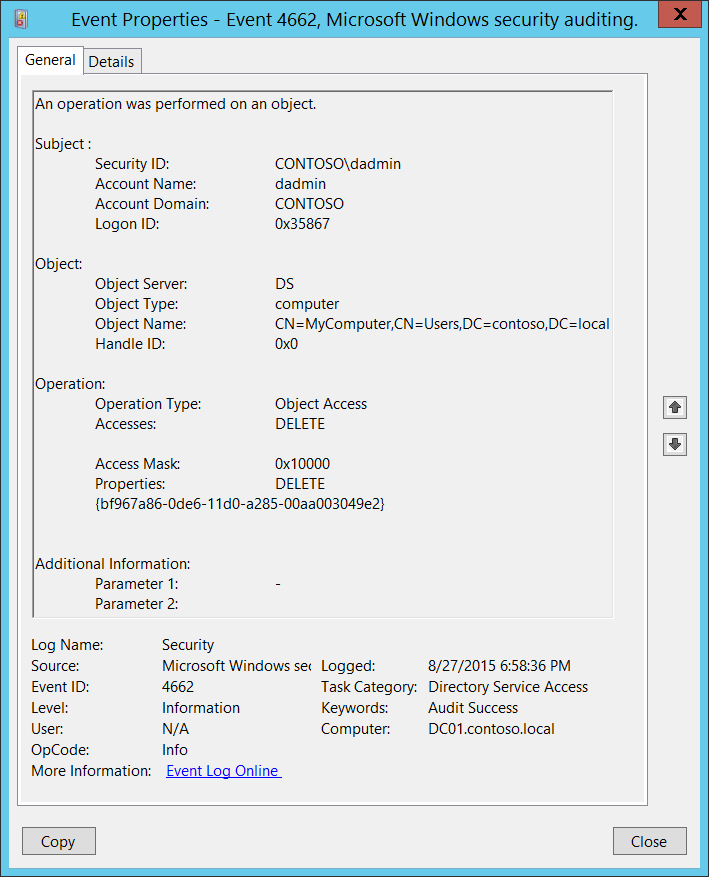
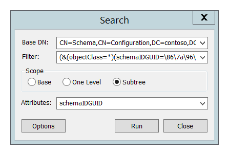

# 4662(S, F): オブジェクトに対して操作が実行されました。




***サブカテゴリ:***&nbsp;[ディレクトリ サービス アクセスの監査](audit-directory-service-access.md)

***イベントの説明:***

このイベントは、Active Directory オブジェクトに対して操作が実行されるたびに生成されます。

このイベントは、適切な [SACL](/windows/win32/secauthz/access-control-lists) が Active Directory オブジェクトに設定され、実行された操作がこの SACL に一致する場合にのみ生成されます。

操作が失敗した場合、失敗イベントが生成されます。

実行された操作の種類ごとに 4662 が生成されます。

> **注**&nbsp;&nbsp;推奨事項については、このイベントの [セキュリティ監視の推奨事項](#security-monitoring-recommendations) を参照してください。

<br clear="all">

***イベント XML:***
```
- <Event xmlns="http://schemas.microsoft.com/win/2004/08/events/event">
- <System>
 <Provider Name="Microsoft-Windows-Security-Auditing" Guid="{54849625-5478-4994-A5BA-3E3B0328C30D}" /> 
 <EventID>4662</EventID> 
 <Version>0</Version> 
 <Level>0</Level> 
 <Task>14080</Task> 
 <Opcode>0</Opcode> 
 <Keywords>0x8020000000000000</Keywords> 
 <TimeCreated SystemTime="2015-08-28T01:58:36.894922400Z" /> 
 <EventRecordID>407230</EventRecordID> 
 <Correlation /> 
 <Execution ProcessID="520" ThreadID="600" /> 
 <Channel>Security</Channel> 
 <Computer>DC01.contoso.local</Computer> 
 <Security /> 
 </System>
- <EventData>
 <Data Name="SubjectUserSid">S-1-5-21-3457937927-2839227994-823803824-1104</Data> 
 <Data Name="SubjectUserName">dadmin</Data> 
 <Data Name="SubjectDomainName">CONTOSO</Data> 
 <Data Name="SubjectLogonId">0x35867</Data> 
 <Data Name="ObjectServer">DS</Data> 
 <Data Name="ObjectType">%{bf967a86-0de6-11d0-a285-00aa003049e2}</Data> 
 <Data Name="ObjectName">%{38b3d2e6-9948-4dc1-ae90-1605d5eab9a2}</Data> 
 <Data Name="OperationType">Object Access</Data> 
 <Data Name="HandleId">0x0</Data> 
 <Data Name="AccessList">%%1537</Data> 
 <Data Name="AccessMask">0x10000</Data> 
 <Data Name="Properties">%%1537 {bf967a86-0de6-11d0-a285-00aa003049e2}</Data> 
 <Data Name="AdditionalInfo">-</Data> 
 <Data Name="AdditionalInfo2" /> 
 </EventData>
 </Event>
```

***必要なサーバー ロール:*** Active Directory ドメイン コントローラー。

***最小 OS バージョン:*** Windows Server 2008。

***イベント バージョン:*** 0。

***フィールドの説明:***

**サブジェクト:**

-   **セキュリティ ID** \[タイプ = SID\]**:** 操作を要求したアカウントの SID。イベント ビューアーは自動的に SID を解決してアカウント名を表示しようとします。SID を解決できない場合、イベントにはソース データが表示されます。

> **注**&nbsp;&nbsp;**セキュリティ識別子 (SID)** は、トラスティ (セキュリティ プリンシパル) を識別するために使用される可変長の一意の値です。各アカウントには、Active Directory ドメイン コントローラーなどの権限によって発行され、セキュリティ データベースに格納される一意の SID があります。ユーザーがログオンするたびに、システムはデータベースからそのユーザーの SID を取得し、そのユーザーのアクセストークンに配置します。システムは、アクセストークン内の SID を使用して、以降のすべての Windows セキュリティとのやり取りでユーザーを識別します。SID がユーザーまたはグループの一意の識別子として使用された場合、それが別のユーザーまたはグループを識別するために再利用されることはありません。SID の詳細については、[セキュリティ識別子](/windows/access-protection/access-control/security-identifiers) を参照してください。

-   **アカウント名** \[タイプ = UnicodeString\]**:** 操作を要求したアカウントの名前。

-   **アカウントドメイン** \[タイプ = UnicodeString\]**:** サブジェクトのドメインまたはコンピュータ名。形式は様々で、以下のようなものが含まれます：

    -   ドメインのNETBIOS名の例: CONTOSO

    -   小文字の完全ドメイン名: contoso.local

    -   大文字の完全ドメイン名: CONTOSO.LOCAL

    -   一部の[よく知られたセキュリティプリンシパル](/windows/security/identity-protection/access-control/security-identifiers)の場合、例えばLOCAL SERVICEやANONYMOUS LOGON、このフィールドの値は「NT AUTHORITY」となります。

    -   ローカルユーザーアカウントの場合、このフィールドにはこのアカウントが属するコンピュータまたはデバイスの名前が含まれます。例えば：「Win81」。

-   **ログオンID** \[タイプ = HexInt64\]**:** 16進数の値で、最近のイベントと同じログオンIDを含む可能性のあるイベントとこのイベントを関連付けるのに役立ちます。例えば、「[4624](event-4624.md): アカウントが正常にログオンされました。」

**オブジェクト:**

-   **オブジェクトサーバー** \[タイプ = UnicodeString\]: このイベントの値は「**DS**」です。

-   **オブジェクトタイプ** \[タイプ = UnicodeString\]: アクセスされたオブジェクトのタイプまたはクラス。一般的なActive Directoryオブジェクトのタイプとクラスには以下が含まれます：

    -   container – コンテナ用。

    -   user – ユーザー用。

    -   group – グループ用。

    -   domainDNS – ドメインオブジェクト用。

    -   groupPolicyContainer – グループポリシーオブジェクト用。

        **オブジェクトタイプ**のすべての可能な値については、Active Directoryスキーマスナップインを開きます（このスナップインを有効にする方法については、<https://technet.microsoft.com/library/Cc755885(v=WS.10).aspx>を参照）し、**Active Directoryスキーマ\\クラス**に移動します。または、このドキュメントを使用します：<https://msdn.microsoft.com/library/cc221630.aspx>

-   **オブジェクト名** \[タイプ = UnicodeString\]: アクセスされたオブジェクトの識別名。

> **注**&nbsp;&nbsp;LDAP APIはLDAPオブジェクトをその**識別名 (DN)**で参照します。DNはカンマで接続された相対識別名 (RDN) のシーケンスです。
> 
> RDNは、属性=値の形式で関連付けられた値を持つ属性です。これらはRDN属性の例です：
> 
> • DC - domainComponent
> 
> • CN - commonName
> 
> • OU - organizationalUnitName
> 
> • O - organizationName

-   **ハンドル ID** \[Type = Pointer\]: **オブジェクト名**へのハンドルの16進数値。このフィールドは、例えば「[4661](event-4661.md): オブジェクトへのハンドルが要求されました。」のように、同じハンドル ID を含む他のイベントとこのイベントを関連付けるのに役立ちます。このパラメータはイベントでキャプチャされない場合があり、その場合は「0x0」と表示されます。

**操作:**

-   **操作タイプ** \[Type = UnicodeString\]: オブジェクトに対して実行された操作のタイプ。このイベントでは通常「**オブジェクトアクセス**」の値を持ちます。

-   **アクセス** \[Type = UnicodeString\]: 操作に使用されたアクセスのタイプ。詳細については「表9. Active Directory アクセスコードと権利」を参照してください。

-   **アクセスマスク** \[Type = HexInt32\]: 操作に使用されたアクセスのタイプの16進数マスク。詳細については「表9. Active Directory アクセスコードと権利」を参照してください。

| <span id="Active_Directory_Access_Codes_and_Types" class="anchor"></span>アクセスマスク | アクセス名                          | 説明                                                                                                                                                                                                                                                                                           |
|--------------------------------------------------------------------------------------|--------------------------------------|-------------------------------------------------------------------------------------------------------------------------------------------------------------------------------------------------------------------------------------------------------------------------------------------------------|
| 0x1                                                                                  | 子オブジェクトの作成                 | オブジェクトの子オブジェクトを作成する権利。                                                                                                                                                                                                                                                      |
| 0x2                                                                                  | 子オブジェクトの削除                 | オブジェクトの子オブジェクトを削除する権利。                                                                                                                                                                                                                                                      |
| 0x4                                                                                  | コンテンツの一覧                     | このオブジェクトの子オブジェクトを一覧表示する権利。                                                                                                                                                                                                                                               |
| 0x8                                                                                  | SELF                                 | 検証済みの書き込みアクセス権によって制御される操作を実行する権利。                                                                                                                                                                                                                               |
| 0x10                                                                                 | プロパティの読み取り                 | オブジェクトのプロパティを読み取る権利。                                                                                                                                                                                                                                                           |
| 0x20                                                                                 | プロパティの書き込み                 | オブジェクトのプロパティを書き込む権利。                                                                                                                                                                                                                                                          |
| 0x40                                                                                 | ツリーの削除                         | 子オブジェクトの権限に関係なく、このオブジェクトのすべての子オブジェクトを削除する権利。削除時に「サブツリー削除サーバーコントロールを使用する」チェックボックスがオンになっていることを示します。この操作は、サブツリー内のすべてのオブジェクト（削除保護されたオブジェクトを含む）が削除されることを意味します。 |
| 0x80                                                                                 | オブジェクトの一覧                   | 特定のオブジェクトを一覧表示する権利。                                                                                                                                                                                                                                                            |
| 0x100                                                                                | アクセス制御                         | オブジェクトによってサポートされる拡張権利チェックが実行された後にのみ許可されるアクセス。<br>拡張アクセス権によって制御される操作を実行する権利。                                                                                                                                            |
| 0x10000                                                                              | 削除                                 | オブジェクトを削除する権利。<br>オブジェクトが移動されたときにも DELETE が生成されます。                                                                                                                                                                                                        |
| 0x20000                                                                              | READ\_CONTROL                        | SACL のデータを除いて、オブジェクトのセキュリティ記述子からデータを読み取る権利。                                                                                                                                                                                                                |
| 0x40000                                                                              | WRITE\_DAC                           | オブジェクトのセキュリティ記述子の任意アクセス制御リスト (DACL) を変更する権利。                                                                                                                                                                                                                   |
| 0x80000                                                                              | WRITE\_OWNER                         | オブジェクトの所有権を取得する権利。ユーザーはオブジェクトの受託者でなければなりません。ユーザーは所有権を他のユーザーに譲渡することはできません。                                                                                                                                               |
| 0x100000                                                                             | 同期                                 | 同期のためにオブジェクトを使用する権利。これにより、スレッドはオブジェクトがシグナル状態になるまで待機できます。                                                                                                                                                                                 |
| 0x1000000                                                                            | ADS\_RIGHT\_ACCESS\_SYSTEM\_SECURITY | オブジェクトのセキュリティ記述子で SACL を取得または設定する権利。                                                                                                                                                                                                                               |
| 0x80000000                                                                           | ADS\_RIGHT\_GENERIC\_READ            | このオブジェクトの権限を読み取り、このオブジェクトのすべてのプロパティを読み取り、親コンテナが一覧表示されたときにこのオブジェクト名を一覧表示し、このオブジェクトがコンテナである場合はその内容を一覧表示する権利。                                                                                   |
| 0x40000000                                                                           | ADS\_RIGHT\_GENERIC\_WRITE           | このオブジェクトの権限を読み取り、このオブジェクトのすべてのプロパティを書き込み、このオブジェクトに対してすべての検証済みの書き込みを実行する権利。                                                                                                                                               |
| 0x20000000                                                                           | ADS\_RIGHT\_GENERIC\_EXECUTE         | コンテナオブジェクトの権限を読み取り、その内容を一覧表示する権利。                                                                                                                                                                                                                               |
| 0x10000000                                                                           | ADS\_RIGHT\_GENERIC\_ALL             | 子オブジェクトの作成または削除、サブツリーの削除、プロパティの読み取りおよび書き込み、子オブジェクトおよびオブジェクト自体の検査、ディレクトリからのオブジェクトの追加および削除、拡張権利による読み取りまたは書き込みを行う権利。                                                            |

> <span id="_Ref433797298" class="anchor"></span>表9. Active Directoryアクセスコードと権限。

-   **プロパティ** \[タイプ = UnicodeString\]: 最初の部分は使用されたアクセスのタイプです。通常、**アクセス**フィールドと同じ値を持ちます。

    2番目の部分は、操作が実行されたActive Directoryクラスまたはプロパティセットの**GUID**値のツリーです。

> **注**&nbsp;&nbsp;**GUID**は「Globally Unique Identifier」の略です。リソース、アクティビティ、またはインスタンスを識別するために使用される128ビットの整数です。

このGUIDを翻訳するには、次の手順を使用します：

-   LDP.exeツールを使用して次のLDAP検索を実行します：

    -   ベースDN: CN=Schema,CN=Configuration,DC=XXX,DC=XXX

    -   フィルター: (&(objectClass=\*)(schemaIDGUID=GUID))

        -   検索リクエストで使用する前に、GUIDに対して次の操作を実行します：

            -   検索するGUIDは次のとおりです: bf967a86-0de6-11d0-a285-00aa003049e2

            -   最初の3つのセクションを取り出します: bf967a86-0de6-11d0。

            -   これらの3つのセクションの各バイトの順序を逆にします: 867a96bf-e60d-d011

            -   最後の2つのセクションを変換せずに追加します: 867a96bf-e60d-d011-a285-00aa003049e2

            -   ハイフンを削除します: 867a96bfe60dd011a28500aa003049e2

            -   バイトをバックスラッシュで区切ります: \\86\\7a\\96\\bf\\e6\\0d\\d0\\11\\a2\\85\\00\\aa\\00\\30\\49\\e2

        -   フィルターの例: (&(objectClass=\*)(schemaIDGUID=\\86\\7a\\96\\bf\\e6\\0d\\d0\\11\\a2\\85\\00\\aa\\00\\30\\49\\e2))

    -   スコープ: サブツリー

    -   属性: schemaIDGUID



GUIDが事前定義されたActive Directoryプロパティセットを指す場合があります。GUID（**Rights-GUID**フィールド）、"プロパティセット名"および詳細はこちらで確認できます: <https://msdn.microsoft.com/library/ms683990(v=vs.85).aspx>。

**プロパティ**フィールドのデコード例は次のとおりです：

| プロパティ                                                                                                                                                                                                                                | 翻訳                                                                                                                                            |
|-------------------------------------------------------------------------------------------------------------------------------------------------------------------------------------------------------------------------------------------|--------------------------------------------------------------------------------------------------------------------------------------------------------|
| {bf967a86-0de6-11d0-a285-00aa003049e2}<br>{91e647de-d96f-4b70-9557-d63ff4f3ccd8}<br> {6617e4ac-a2f1-43ab-b60c-11fbd1facf05}<br> {b3f93023-9239-4f7c-b99c-6745d87adbc2}<br> {b8dfa744-31dc-4ef1-ac7c-84baf7ef9da7} | コンピュータ<br>プライベート情報プロパティセット<br>ms-PKI-RoamingTimeStamp<br>ms-PKI-DPAPIMasterKeys<br>ms-PKI-AccountCredentials |

**追加情報:**

-   **パラメータ 1** \[タイプ = UnicodeString\]**:** このフィールドに関する情報はこのドキュメントにはありません。

-   **パラメータ 2** \[タイプ = UnicodeString\]**:** このフィールドに関する情報はこのドキュメントにはありません。

## セキュリティ監視の推奨事項

4662(S, F): オブジェクトに対して操作が実行されました。

> **重要**&nbsp;&nbsp;このイベントについては、[付録A: 多くの監査イベントに対するセキュリティ監視の推奨事項](appendix-a-security-monitoring-recommendations-for-many-audit-events.md)も参照してください。

-   特定のActive Directoryクラスへの操作試行を監視する必要がある場合は、特定のクラス名を持つ**オブジェクトタイプ**フィールドを監視してください。例えば、**domainDNS**クラスへのすべての操作試行を監視することをお勧めします。

-   特定のActive Directoryオブジェクトへの操作試行を監視する必要がある場合は、特定のオブジェクト名を持つ**オブジェクト名**フィールドを監視してください。例えば、「**CN=AdminSDHolder,CN=System,DC=domain,DC=com**」オブジェクトへのすべての操作試行を監視することをお勧めします。

-   いくつかのアクセスタイプは監視する上でより重要です。例えば：

    -   プロパティの書き込み

    -   アクセスの制御

    -   削除

    -   WRITE\_DAC

    -   WRITE\_OWNER

        これら（またはこれらのいずれか）のアクセスタイプを特定のActive Directoryオブジェクトに対して監視することを決定できます。そのためには、特定のアクセスタイプを持つ**アクセス**フィールドを監視してください。

-   特定のActive Directoryプロパティへの操作試行を監視する必要がある場合は、特定のプロパティGUIDを持つ**プロパティ**フィールドを監視してください。

-   **失敗**試行も監査する上で非常に重要であることを忘れないでください。前述の推奨事項に基づいて、どこで失敗試行を監視するかを決定してください。
