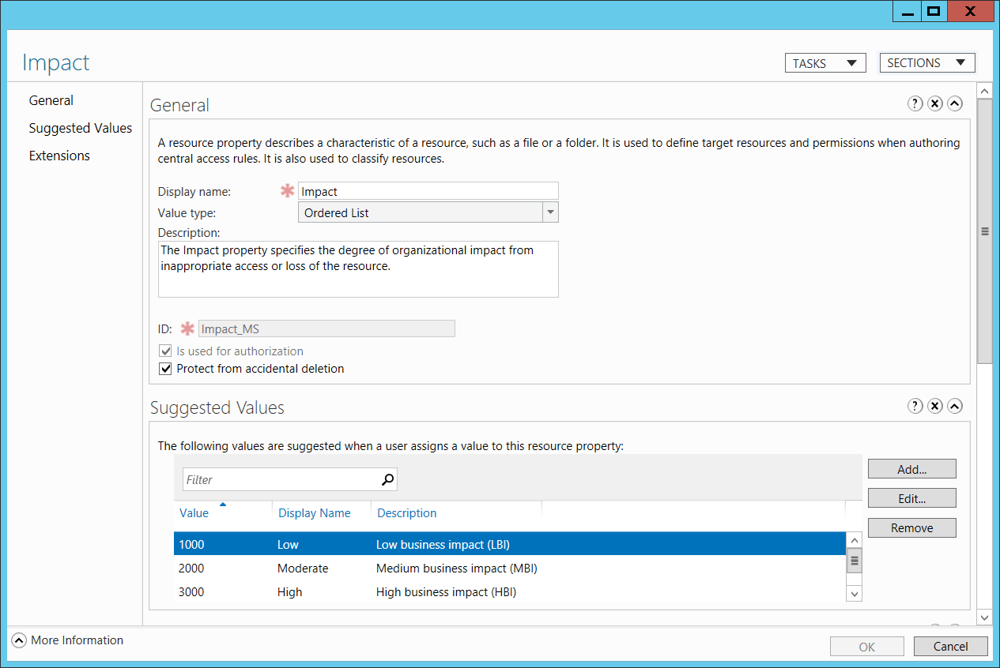

# 4663(S): オブジェクトにアクセスしようとしました。


***サブカテゴリ:***&nbsp;[ファイル システムの監査](audit-file-system.md)、[カーネル オブジェクトの監査](audit-kernel-object.md)、[レジストリの監査](audit-registry.md)、および [リムーバブル ストレージの監査](audit-removable-storage.md)

***イベントの説明:***

このイベントは、オブジェクトに対して特定の操作が実行されたことを示します。オブジェクトは、ファイル システム、カーネル、またはレジストリ オブジェクト、またはリムーバブル ストレージやデバイス上のファイル システム オブジェクトである可能性があります。

このイベントは、オブジェクトの [SACL](/windows/win32/secauthz/access-control-lists) に特定のアクセス権の使用を処理するための必要な ACE がある場合にのみ生成されます。

「[4656](event-4656.md): オブジェクトへのハンドルが要求されました。」イベントとの主な違いは、4663 がアクセス権が要求されたのではなく使用されたことを示しており、4663 には失敗イベントがないことです。

> **注**&nbsp;&nbsp;推奨事項については、このイベントの [セキュリティ監視の推奨事項](#security-monitoring-recommendations) を参照してください。

<br clear="all">

***イベント XML:***
```xml
- <Event xmlns="http://schemas.microsoft.com/win/2004/08/events/event">
- <System>
 <Provider Name="Microsoft-Windows-Security-Auditing" Guid="{54849625-5478-4994-A5BA-3E3B0328C30D}" /> 
 <EventID>4663</EventID> 
 <Version>1</Version> 
 <Level>0</Level> 
 <Task>12800</Task> 
 <Opcode>0</Opcode> 
 <Keywords>0x8020000000000000</Keywords> 
 <TimeCreated SystemTime="2015-09-18T22:13:54.770429700Z" /> 
 <EventRecordID>273866</EventRecordID> 
 <Correlation /> 
 <Execution ProcessID="516" ThreadID="524" /> 
 <Channel>Security</Channel> 
 <Computer>DC01.contoso.local</Computer> 
 <Security /> 
 </System>
- <EventData>
 <Data Name="SubjectUserSid">S-1-5-21-3457937927-2839227994-823803824-1104</Data> 
 <Data Name="SubjectUserName">dadmin</Data> 
 <Data Name="SubjectDomainName">CONTOSO</Data> 
 <Data Name="SubjectLogonId">0x4367b</Data> 
 <Data Name="ObjectServer">Security</Data> 
 <Data Name="ObjectType">File</Data> 
 <Data Name="ObjectName">C:\\Documents\\HBI Data.txt</Data> 
 <Data Name="HandleId">0x1bc</Data> 
 <Data Name="AccessList">%%4417 %%4418</Data> 
 <Data Name="AccessMask">0x6</Data> 
 <Data Name="ProcessId">0x458</Data> 
 <Data Name="ProcessName">C:\\Windows\\System32\\notepad.exe</Data> 
 <Data Name="ResourceAttributes">S:AI(RA;ID;;;;WD;("Impact\_MS",TI,0x10020,3000))</Data> 
 </EventData>
 </Event>

```

***必要なサーバー ロール:*** なし。

***最小 OS バージョン:*** Windows Server 2008、Windows Vista。

***イベント バージョン:***

-   0 - Windows Server 2008、Windows Vista。

-   1 - Windows Server 2012、Windows 8。

    -   「リソース属性」フィールドが追加されました。

***フィールドの説明:***

**サブジェクト:**

-   **セキュリティ ID** \[タイプ = SID\]**:** オブジェクトにアクセスしようとしたアカウントの SID。イベント ビューアーは自動的に SID を解決し、アカウント名を表示しようとします。SID を解決できない場合、イベントにソース データが表示されます。

> **Note**&nbsp;&nbsp;**セキュリティ識別子 (SID)** は、トラスティ (セキュリティプリンシパル) を識別するために使用される可変長の一意の値です。各アカウントには、Active Directory ドメインコントローラーなどの権限によって発行され、セキュリティデータベースに保存される一意の SID があります。ユーザーがログオンするたびに、システムはデータベースからそのユーザーの SID を取得し、そのユーザーのアクセス トークンに配置します。システムは、アクセス トークン内の SID を使用して、Windows セキュリティとのすべての後続のやり取りでユーザーを識別します。SID がユーザーまたはグループの一意の識別子として使用された場合、それは他のユーザーまたはグループを識別するために再び使用されることはありません。SID の詳細については、[セキュリティ識別子](/windows/access-protection/access-control/security-identifiers) を参照してください。

-   **アカウント名** \[タイプ = UnicodeString\]**:** オブジェクトへのアクセスを試みたアカウントの名前。

-   **アカウント ドメイン** \[タイプ = UnicodeString\]**:** サブジェクトのドメインまたはコンピューター名。形式はさまざまで、次のようなものがあります:

    -   ドメイン NETBIOS 名の例: CONTOSO

    -   小文字の完全なドメイン名: contoso.local

    -   大文字の完全なドメイン名: CONTOSO.LOCAL

    -   LOCAL SERVICE や ANONYMOUS LOGON などの[よく知られたセキュリティプリンシパル](/windows/security/identity-protection/access-control/security-identifiers)の場合、このフィールドの値は「NT AUTHORITY」となります。

    -   ローカル ユーザー アカウントの場合、このフィールドには、このアカウントが属するコンピューターまたはデバイスの名前が含まれます。例: 「Win81」。

-   **ログオン ID** \[タイプ = HexInt64\]**:** このイベントを、同じログオン ID を含む可能性のある最近のイベントと関連付けるのに役立つ 16 進値。例: 「[4624](event-4624.md): アカウントが正常にログオンされました。」

**オブジェクト**:

-   **オブジェクト サーバー** \[タイプ = UnicodeString\]: このイベントの「**Security**」値を持ちます。

-   **オブジェクト タイプ** \[タイプ = UnicodeString\]: 操作中にアクセスされたオブジェクトの種類。

    次の表には、最も一般的な**オブジェクト タイプ**のリストが含まれています:

| ディレクトリ           | イベント     | タイマー             | デバイス     |
|-------------------------|--------------|----------------------|--------------|
| ミュータント            | タイプ       | ファイル             | トークン     |
| スレッド                | セクション   | ウィンドウステーション | デバッグオブジェクト |
| フィルター通信ポート    | イベントペア | ドライバー           | Ioコンプリション |
| コントローラー          | シンボリックリンク | Wmiガイド           | プロセス     |
| プロファイル            | デスクトップ | キードイベント       | アダプター   |
| キー                    | 待機可能ポート | コールバック         | セマフォ     |
| ジョブ                  | ポート       | フィルター接続ポート | ALPCポート   |

-   **オブジェクト名** \[タイプ = UnicodeString\]: アクセスが要求されたオブジェクトの名前およびその他の識別情報。例えば、ファイルの場合、パスが含まれます。

-   **ハンドルID** \[タイプ = ポインタ\]: **オブジェクト名**へのハンドルの16進数値。このフィールドは他のイベントとの相関に使用できます。例えば、"[4656](event-4656.md)(S, F): オブジェクトへのハンドルが要求されました。"の**ハンドルID**フィールドと相関させることができます。このパラメータはイベントでキャプチャされない場合があり、その場合は「0x0」と表示されます。

-   **リソース属性** \[タイプ = UnicodeString\] \[バージョン 1\]: オブジェクトに関連付けられた属性。一部のオブジェクトでは、このフィールドは適用されず、「-」が表示されます。

    例えば、ファイルの場合、次のように表示されることがあります: S:AI(RA;ID;;;;WD;("Impact\_MS",TI,0x10020,3000))

    -   Impact\_MS: リソースプロパティ ***ID***。

    -   3000: リソースプロパティ ***値***。



**プロセス情報:**

-   **プロセスID** \[タイプ = ポインタ\]: オブジェクトにアクセスしたプロセスの16進数プロセスID。プロセスID (PID) は、オペレーティングシステムがアクティブなプロセスを一意に識別するために使用する番号です。特定のプロセスのPIDを確認するには、例えばタスクマネージャー（詳細タブ、PID列）を使用できます:

```markdown


16進数の値を10進数に変換すると、タスクマネージャーの値と比較できます。

このプロセスIDを他のイベントのプロセスIDと関連付けることもできます。例えば、「[4688](event-4688.md): 新しいプロセスが作成されました」**プロセス情報\\新しいプロセスID**。

- **プロセス名** \[タイプ = UnicodeString\]**:** プロセスの実行可能ファイルのフルパスと名前。

**アクセス要求情報:**

- **アクセス** \[タイプ = UnicodeString\]: **サブジェクト\\セキュリティID**によって使用されたアクセス権のリスト。これらのアクセス権は**オブジェクトタイプ**に依存します。以下の表には、ファイルシステムオブジェクトの最も一般的なアクセス権に関する情報が含まれています。レジストリオブジェクトのアクセス権はファイルシステムオブジェクトと似ていることが多いですが、表にはそれらがどのように異なるかについてのいくつかの注釈が含まれています。

| アクセス                                                                                 | 16進値,<br>スキーマ値  | 説明         |
|----------------------------------------------------------------------------------------|-----------------------------|---------------------|
| ReadData (または ListDirectory) <br><br>(レジストリオブジェクトの場合、これは「キー値のクエリ」です。) | 0x1,<br>%%4416              | **ReadData -** ファイルオブジェクトの場合、対応するファイルデータを読み取る権利。ディレクトリオブジェクトの場合、対応するディレクトリデータを読み取る権利。<br>**ListDirectory -** ディレクトリの場合、ディレクトリの内容をリストする権利。                                                                                                                                                                                                                       |
| WriteData (または AddFile) <br><br>(レジストリオブジェクトの場合、これは「キー値の設定」です。)        | 0x2,<br>%%4417              | **WriteData -** ファイルオブジェクトの場合、ファイルにデータを書き込む権利。ディレクトリオブジェクトの場合、ディレクトリにファイルを作成する権利 (**FILE\_ADD\_FILE**)。<br>**AddFile -** ディレクトリの場合、ディレクトリにファイルを作成する権利。                                                                                                                                                                                                                                                            |
| AppendData (または AddSubdirectory または CreatePipeInstance)                                  | 0x4,<br>%%4418              | **AppendData -** ファイルオブジェクトの場合、ファイルにデータを追加する権利。（ローカルファイルの場合、このフラグが**FILE\_WRITE\_DATA**なしで指定されている場合、書き込み操作は既存のデータを上書きしません。）ディレクトリオブジェクトの場合、サブディレクトリを作成する権利 (**FILE\_ADD\_SUBDIRECTORY**)。 <br>**AddSubdirectory -** ディレクトリの場合、サブディレクトリを作成する権利。<br>**CreatePipeInstance -** 名前付きパイプの場合、パイプを作成する権利。                                                                                                                                                                                                                                                              |
| ReadEA<br>(レジストリオブジェクトの場合、これは「サブキーの列挙」です。)                        | 0x8,<br>%%4419               | 拡張ファイル属性を読み取る権利。                                                                                                                             |
| WriteEA                                                                                | 0x10,<br>%%4420              | 拡張ファイル属性を書き込む権利。                                                                                                                                                                                                                                               |
| Execute/Traverse                                                                       | 0x20,<br>%%4421               | **Execute** - ネイティブコードファイルの場合、ファイルを実行する権利。このアクセス権がスクリプトに与えられると、スクリプトインタープリタによってスクリプトが実行可能になる場合があります。<br>**Traverse -** ディレクトリの場合、ディレクトリをトラバースする権利。デフォルトでは、ユーザーには**BYPASS\_TRAVERSE\_CHECKING**&thinsp; [特権](/windows/win32/secauthz/privileges)が割り当てられており、これは**FILE\_TRAVERSE**&thinsp; [アクセス権](/windows/win32/secauthz/access-rights-and-access-masks)を無視します。詳細については、[ファイルセキュリティとアクセス権](/windows/win32/fileio/file-security-and-access-rights)の注釈を参照してください。                                                       |
| DeleteChild                                                                            | 0x40,<br>%%4422               | ディレクトリの場合、ディレクトリとそれが含むすべてのファイル（読み取り専用ファイルを含む）を削除する権利。                                                                                                                                                                                                                               |
| ReadAttributes                                                                         | 0x80,<br>%%4423               | ファイル属性を読み取る権利。                                                                                                                                                                              |
| WriteAttributes                                                                        | 0x100,<br>%%4424              | ファイル属性を書き込む権利。                                                                                                                                     |
| DELETE                                                                                 | 0x10000,<br>%%1537            | オブジェクトを削除する権利。                                                                                                                                         |
| READ\_CONTROL                                                                          | 0x20000,<br>%%1538            | オブジェクトのセキュリティ記述子の情報を読み取る権利（システムアクセス制御リスト（SACL）の情報を含まない）。                                                                                                                                                                                                    |
| WRITE\_DAC                                                                             | 0x40000,<br>%%1539            | オブジェクトのセキュリティ記述子の任意アクセス制御リスト（DACL）を変更する権利。                                                                                                                                                                                                                      |
| WRITE\_OWNER                                                                           | 0x80000,<br>%%1540            | オブジェクトのセキュリティ記述子の所有者を変更する権利。                                                                                                                                                                                                                                    |
| SYNCHRONIZE                                                                            | 0x100000,<br>%%1541           | オブジェクトを同期に使用する権利。これにより、スレッドがオブジェクトがシグナル状態になるまで待機できるようになります。一部のオブジェクトタイプはこのアクセス権をサポートしていません。                                                                                                                                                                               |
| ACCESS\_SYS\_SEC                                                                       | 0x1000000,<br>%%1542          | ACCESS\_SYS\_SECアクセス権は、オブジェクトのセキュリティ記述子のSACLを取得または設定する能力を制御します。                                                                                                                                                                                                                                           |
```

> 表15. ファイルシステムオブジェクトのアクセス権。

-   **アクセスマスク** \[Type = HexInt32\]: 要求または実行された操作の16進数マスク。詳細については、前の表を参照してください。

## セキュリティ監視の推奨事項

4663(S): オブジェクトへのアクセスが試みられました。

カーネルオブジェクトの場合、このイベントおよび他の監査イベントはセキュリティ関連性がほとんどなく、解析や分析が困難です。カーネルオブジェクトレベルで何を監視する必要があるかを正確に把握していない限り、これらを監査することは推奨されません。

他の種類のオブジェクトについては、以下の推奨事項が適用されます。

> **重要**&nbsp;&nbsp;このイベントについては、[付録A: 多くの監査イベントに対するセキュリティ監視の推奨事項](appendix-a-security-monitoring-recommendations-for-many-audit-events.md)も参照してください。

-   すべてのアクセス試行を監視する必要がある重要なファイルシステムオブジェクトがある場合、**オブジェクト名**に対してこのイベントを監視します。

-   特定のアクセス試行（例えば、書き込みアクション）を監視する必要がある重要なファイルシステムオブジェクトがある場合、**アクセス要求情報\\アクセス**に関連して**オブジェクト名**に対してこのイベントを監視します。

-   特定の属性を持つファイルシステムオブジェクトに対するアクセス試行を監視する必要がある場合、**リソース属性**に対してこのイベントを監視します。

-   **オブジェクト名**が特定のアクセス試行（例えば、書き込みアクションのみ）を監視する必要がある機密または重要なレジストリキーである場合、対応する**アクセス要求情報\\アクセス**を持つすべての[4663](event-4663.md)イベントを監視します。

<!-- -->

-   このイベントで報告されたプロセスに対して事前に定義された「**プロセス名**」がある場合、定義された値と異なる「**プロセス名**」を持つすべてのイベントを監視します。

-   「**プロセス名**」が標準フォルダー（例えば、**System32**や**Program Files**）にないか、制限されたフォルダー（例えば、**Temporary Internet Files**）にあるかを監視することができます。

<!-- -->

-   プロセス名に含まれる制限されたサブストリングや単語（例えば、「**mimikatz**」や「**cain.exe**」）の事前定義リストがある場合、「**プロセス名**」にこれらのサブストリングが含まれているかを確認します。

-   ファイルシステムオブジェクトについては、次の**アクセス要求情報\\アクセス権**を監視することをお勧めします：

    -   WriteData (または AddFile)

    -   AppendData (または AddSubdirectory または CreatePipeInstance)

    -   WriteEA

    -   DeleteChild

    -   WriteAttributes

    -   DELETE

    -   WRITE\_DAC

    -   WRITE\_OWNER
