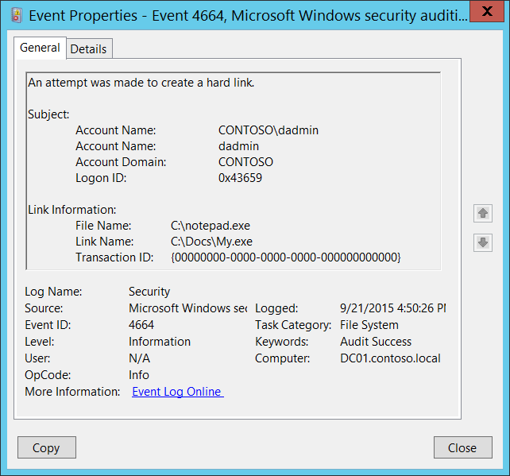

# 4664(S): ハードリンクの作成が試みられました。



***サブカテゴリ:***&nbsp;[ファイルシステムの監査](audit-file-system.md)

***イベントの説明:***

このイベントは、NTFSハードリンクが正常に作成されたときに生成されます。

> **注**&nbsp;&nbsp;推奨事項については、このイベントの[セキュリティ監視の推奨事項](#security-monitoring-recommendations)を参照してください。

<br clear="all">

***イベント XML:***
```xml
- <Event xmlns="http://schemas.microsoft.com/win/2004/08/events/event">
- <System>
 <Provider Name="Microsoft-Windows-Security-Auditing" Guid="{54849625-5478-4994-A5BA-3E3B0328C30D}" /> 
 <EventID>4664</EventID> 
 <Version>0</Version> 
 <Level>0</Level> 
 <Task>12800</Task> 
 <Opcode>0</Opcode> 
 <Keywords>0x8020000000000000</Keywords> 
 <TimeCreated SystemTime="2015-09-21T23:50:26.871375900Z" /> 
 <EventRecordID>276680</EventRecordID> 
 <Correlation /> 
 <Execution ProcessID="4" ThreadID="2624" /> 
 <Channel>Security</Channel> 
 <Computer>DC01.contoso.local</Computer> 
 <Security /> 
 </System>
- <EventData>
 <Data Name="SubjectUserSid">S-1-5-21-3457937927-2839227994-823803824-1104</Data> 
 <Data Name="SubjectUserName">dadmin</Data> 
 <Data Name="SubjectDomainName">CONTOSO</Data> 
 <Data Name="SubjectLogonId">0x43659</Data> 
 <Data Name="FileName">C:\\notepad.exe</Data> 
 <Data Name="LinkName">C:\\Docs\\My.exe</Data> 
 <Data Name="TransactionId">{00000000-0000-0000-0000-000000000000}</Data> 
 </EventData>
 </Event>

```

***必要なサーバー役割:*** なし。

***最小 OS バージョン:*** Windows Server 2008, Windows Vista。

***イベントバージョン:*** 0。

***フィールドの説明:***

**サブジェクト:**

-   **セキュリティ ID** \[タイプ = SID\]**:** ハードリンクの作成を試みたアカウントのSID。イベントビューアーは自動的にSIDを解決してアカウント名を表示しようとします。SIDが解決できない場合、イベントにソースデータが表示されます。

> **注**&nbsp;&nbsp;**セキュリティ識別子 (SID)** は、信託者 (セキュリティプリンシパル) を識別するために使用される可変長の一意の値です。各アカウントには、Active Directoryドメインコントローラーなどの権限によって発行され、セキュリティデータベースに保存される一意のSIDがあります。ユーザーがログオンするたびに、システムはデータベースからそのユーザーのSIDを取得し、そのユーザーのアクセス トークンに配置します。システムは、以降のすべてのWindowsセキュリティとのやり取りでユーザーを識別するために、アクセス トークン内のSIDを使用します。ユーザーまたはグループの一意の識別子としてSIDが使用された場合、それは他のユーザーまたはグループを識別するために再利用されることはありません。SIDの詳細については、[セキュリティ識別子](/windows/access-protection/access-control/security-identifiers)を参照してください。

-   **アカウント名** \[タイプ = UnicodeString\]**:** ハードリンクの作成を試みたアカウントの名前。

-   **アカウントドメイン** \[タイプ = UnicodeString\]**:** サブジェクトのドメインまたはコンピュータ名。形式は以下のように異なります：

    -   ドメインのNETBIOS名の例: CONTOSO

    -   小文字の完全なドメイン名: contoso.local

    -   大文字の完全なドメイン名: CONTOSO.LOCAL

    -   LOCAL SERVICEやANONYMOUS LOGONなどの[よく知られたセキュリティプリンシパル](/windows/security/identity-protection/access-control/security-identifiers)の場合、このフィールドの値は「NT AUTHORITY」となります。

    -   ローカルユーザーアカウントの場合、このフィールドにはこのアカウントが属するコンピュータまたはデバイスの名前が含まれます。例：「Win81」。

-   **ログオンID** \[タイプ = HexInt64\]**:** 16進数の値で、同じログオンIDを含む最近のイベントとこのイベントを関連付けるのに役立ちます。例：「[4624](event-4624.md): アカウントが正常にログオンされました。」

**リンク情報:**

-   **ファイル名** \[タイプ = UnicodeString\]**:** 新しいハードリンクが参照するファイルまたはフォルダの名前。

-   **リンク名** \[タイプ = UnicodeString\]**:** 新しいハードリンクファイル名を含むフルパス名。

-   **トランザクションID** \[タイプ = GUID\]: トランザクションの一意のGUID。このフィールドは、同じ**トランザクションID**を含む他のイベントとこのイベントを関連付けるのに役立ちます。例：「[4660](event-4660.md)(S): オブジェクトが削除されました。」

    このパラメータはイベントでキャプチャされない場合があり、その場合は「{00000000-0000-0000-0000-000000000000}」として表示されます。

> **注**&nbsp;&nbsp;**GUID**は「Globally Unique Identifier」の略です。リソース、アクティビティ、またはインスタンスを識別するために使用される128ビットの整数です。

## セキュリティ監視の推奨事項

4664(S): ハードリンクの作成が試みられました。

-   [4664](event-4664.md)イベントを監視することをお勧めします。このアクションは通常のオペレーティングシステムの動作には典型的ではなく、悪意のある活動の兆候である可能性があるためです。
