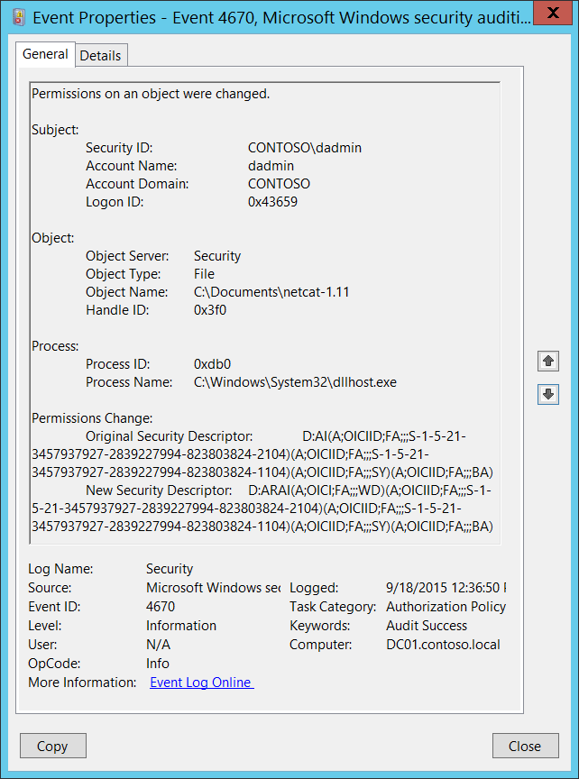

# 4670(S): オブジェクトの権限が変更されました。



***サブカテゴリ:***&nbsp;[ファイルシステムの監査](audit-file-system.md)、[レジストリの監査](audit-registry.md)、[認証ポリシー変更の監査](audit-authentication-policy-change.md)、および[認可ポリシー変更の監査](audit-authorization-policy-change.md)

***イベントの説明:***

このイベントは、オブジェクトの権限が変更されたときに生成されます。オブジェクトはファイルシステム、レジストリ、またはセキュリティトークンオブジェクトである可能性があります。

[SACL](/windows/win32/secauthz/access-control-lists) (監査ACL) が変更された場合、このイベントは生成されません。

このイベントが生成される前に、オブジェクトの[SACL](/windows/win32/secauthz/access-control-lists)に特定のACEが設定されている必要があります。例えば、ファイルシステムオブジェクトの場合、「権限の変更」および/または「所有権の取得」がオブジェクトのSACLに設定されている場合にのみ生成されます。レジストリキーの場合、「DACの書き込み」および/または「所有者の書き込み」がオブジェクトのSACLに設定されている場合にのみ生成されます。

> **注**&nbsp;&nbsp;推奨事項については、このイベントの[セキュリティ監視の推奨事項](#security-monitoring-recommendations)を参照してください。

<br clear="all">

***イベント XML:***
```xml
- <Event xmlns="http://schemas.microsoft.com/win/2004/08/events/event">
- <System>
 <Provider Name="Microsoft-Windows-Security-Auditing" Guid="{54849625-5478-4994-A5BA-3E3B0328C30D}" /> 
 <EventID>4670</EventID> 
 <Version>0</Version> 
 <Level>0</Level> 
 <Task>13570</Task> 
 <Opcode>0</Opcode> 
 <Keywords>0x8020000000000000</Keywords> 
 <TimeCreated SystemTime="2015-09-18T19:36:50.187044600Z" /> 
 <EventRecordID>269529</EventRecordID> 
 <Correlation /> 
 <Execution ProcessID="516" ThreadID="524" /> 
 <Channel>Security</Channel> 
 <Computer>DC01.contoso.local</Computer> 
 <Security /> 
 </System>
- <EventData>
 <Data Name="SubjectUserSid">S-1-5-21-3457937927-2839227994-823803824-1104</Data> 
 <Data Name="SubjectUserName">dadmin</Data> 
 <Data Name="SubjectDomainName">CONTOSO</Data> 
 <Data Name="SubjectLogonId">0x43659</Data> 
 <Data Name="ObjectServer">Security</Data> 
 <Data Name="ObjectType">File</Data> 
 <Data Name="ObjectName">C:\\Documents\\netcat-1.11</Data> 
 <Data Name="HandleId">0x3f0</Data> 
 <Data Name="OldSd">D:AI(A;OICIID;FA;;;S-1-5-21-3457937927-2839227994-823803824-2104)(A;OICIID;FA;;;S-1-5-21-3457937927-2839227994-823803824-1104)(A;OICIID;FA;;;SY)(A;OICIID;FA;;;BA)</Data> 
 <Data Name="NewSd">D:ARAI(A;OICI;FA;;;WD)(A;OICIID;FA;;;S-1-5-21-3457937927-2839227994-823803824-2104)(A;OICIID;FA;;;S-1-5-21-3457937927-2839227994-823803824-1104)(A;OICIID;FA;;;SY)(A;OICIID;FA;;;BA)</Data> 
 <Data Name="ProcessId">0xdb0</Data> 
 <Data Name="ProcessName">C:\\Windows\\System32\\dllhost.exe</Data> 
 </EventData>
 </Event>
```

***必要なサーバーロール:*** なし。

***最小 OS バージョン:*** Windows Server 2008、Windows Vista。

***イベントバージョン:*** 0。

***フィールドの説明:***

**サブジェクト:**

-   **セキュリティ ID** \[タイプ = SID\]**:** 「オブジェクトの権限変更」操作を要求したアカウントのSID。イベントビューアーは自動的にSIDを解決し、アカウント名を表示しようとします。SIDが解決できない場合、イベントにソースデータが表示されます。

> **注**&nbsp;&nbsp;**セキュリティ識別子 (SID)** は、トラスティ (セキュリティプリンシパル) を識別するために使用される可変長の一意の値です。各アカウントには、Active Directory ドメイン コントローラーなどの権限によって発行され、セキュリティ データベースに保存される一意の SID があります。ユーザーがログオンするたびに、システムはデータベースからそのユーザーの SID を取得し、そのユーザーのアクセス トークンに配置します。システムは、アクセス トークン内の SID を使用して、以降のすべての Windows セキュリティとのやり取りでユーザーを識別します。SID がユーザーまたはグループの一意の識別子として使用された場合、それは他のユーザーまたはグループを識別するために再び使用されることはありません。SID の詳細については、[セキュリティ識別子](/windows/access-protection/access-control/security-identifiers) を参照してください。

-   **アカウント名** \[型 = UnicodeString\]**:** 「オブジェクトの権限変更」操作を要求したアカウントの名前。

-   **アカウント ドメイン** \[型 = UnicodeString\]**:** サブジェクトのドメインまたはコンピューター名。形式はさまざまで、次のようなものが含まれます:

    -   ドメイン NETBIOS 名の例: CONTOSO

    -   小文字の完全なドメイン名: contoso.local

    -   大文字の完全なドメイン名: CONTOSO.LOCAL

    -   LOCAL SERVICE や ANONYMOUS LOGON などの[よく知られたセキュリティ プリンシパル](/windows/security/identity-protection/access-control/security-identifiers)の場合、このフィールドの値は「NT AUTHORITY」となります。

    -   ローカル ユーザー アカウントの場合、このフィールドには、このアカウントが属するコンピューターまたはデバイスの名前が含まれます。例: 「Win81」。

-   **ログオン ID** \[型 = HexInt64\]**:** 最近のイベントとこのイベントを関連付けるのに役立つ 16 進数値。たとえば、「[4624](event-4624.md): アカウントのログオンに成功しました。」など。

**オブジェクト**:

-   **オブジェクト サーバー** \[型 = UnicodeString\]: このイベントの「**セキュリティ**」値を持ちます。

-   **オブジェクト タイプ** \[型 = UnicodeString\]: 操作中にアクセスされたオブジェクトのタイプ。

    次の表には、最も一般的な**オブジェクト タイプ**のリストが含まれています:

| ディレクトリ           | イベント     | タイマー             | デバイス     |
|-------------------------|--------------|----------------------|--------------|
| ミュータント            | タイプ       | ファイル             | トークン     |
| スレッド                | セクション   | ウィンドウステーション | デバッグオブジェクト |
| フィルター通信ポート    | イベントペア | ドライバー           | Ioコンプリション |
| コントローラー          | シンボリックリンク | WmiGuid          | プロセス     |
| プロファイル            | デスクトップ | キードイベント       | アダプター   |
| キー                    | 待機可能ポート | コールバック         | セマフォ     |
| ジョブ                  | ポート       | フィルター接続ポート | ALPCポート   |

-   **オブジェクト名** \[タイプ = UnicodeString\]: 権限が変更されたオブジェクトの名前およびその他の識別情報。例えば、ファイルの場合はパスが含まれます。トークンオブジェクトの場合、このフィールドは通常「-」となります。

-   **ハンドルID** \[タイプ = ポインタ\]: **オブジェクト名**へのハンドルの16進数値。このフィールドは、同じハンドルIDを含む可能性のある他のイベントとこのイベントを関連付けるのに役立ちます。例えば、「[4663](event-4663.md)(S): オブジェクトへのアクセスが試みられました。」このパラメータはイベントでキャプチャされない場合があり、その場合は「0x0」と表示されます。

**プロセス:**

-   **プロセスID** \[タイプ = ポインタ\]: 権限が変更されたプロセスの16進数プロセスID。プロセスID (PID) は、オペレーティングシステムがアクティブなプロセスを一意に識別するために使用する番号です。特定のプロセスのPIDを確認するには、例えばタスクマネージャー（詳細タブ、PID列）を使用できます。

    

    16進数値を10進数に変換すると、タスクマネージャーの値と比較できます。

    また、このプロセスIDを他のイベントのプロセスIDと関連付けることもできます。例えば、「[4688](event-4688.md): 新しいプロセスが作成されました」 **プロセス情報\\新しいプロセスID**。

-   **プロセス名** \[タイプ = UnicodeString\]**:** プロセスの実行ファイルのフルパスと名前。

**権限の変更:**

-   **元のセキュリティ記述子** \[タイプ = UnicodeString\]**:** オブジェクトの古いセキュリティ記述子定義言語 (SDDL) 値。

-   **新しいセキュリティ記述子** \[タイプ = UnicodeString\]**:** オブジェクトの新しいセキュリティ記述子定義言語 (SDDL) 値。

> **注**&nbsp;&nbsp;**セキュリティ記述子定義言語 (SDDL)** は、セキュリティ記述子に含まれる情報を列挙するための文字列要素を定義します。
> 
> 例:
> 
> *O*:BA*G*:SY*D*:(D;;0xf0007;;;AN)(D;;0xf0007;;;BG)(A;;0xf0007;;;SY)(A;;0×7;;;BA)*S*:ARAI(AU;SAFA;DCLCRPCRSDWDWO;;;WD)
> 
> - *O*: = 所有者。特定のセキュリティプリンシパルのSID、または予約済み（事前定義された）値。例: BA (BUILTIN\_ADMINISTRATORS)、WD (Everyone)、SY (LOCAL\_SYSTEM) など。可能な値のリストは以下の表を参照してください:

| 値    | 説明                                   | 値    | 説明                             |
|-------|----------------------------------------|-------|----------------------------------|
| "AO"  | アカウントオペレーター                 | "PA"  | グループポリシー管理者           |
| "RU"  | 以前のWindows 2000を許可するエイリアス | "IU"  | 対話的にログオンしたユーザー     |
| "AN"  | 匿名ログオン                           | "LA"  | ローカル管理者                   |
| "AU"  | 認証されたユーザー                     | "LG"  | ローカルゲスト                   |
| "BA"  | 組み込み管理者                         | "LS"  | ローカルサービスアカウント       |
| "BG"  | 組み込みゲスト                         | "SY"  | ローカルシステム                 |
| "BO"  | バックアップオペレーター               | "NU"  | ネットワークログオンユーザー     |
| "BU"  | 組み込みユーザー                       | "NO"  | ネットワーク構成オペレーター     |
| "CA"  | 証明書サーバー管理者                   | "NS"  | ネットワークサービスアカウント   |
| "CG"  | クリエーターグループ                   | "PO"  | プリンターオペレーター           |
| "CO"  | クリエーターオーナー                   | "PS"  | 個人自身                         |
| "DA"  | ドメイン管理者                         | "PU"  | パワーユーザー                   |
| "DC"  | ドメインコンピューター                 | "RS"  | RASサーバーグループ              |
| "DD"  | ドメインコントローラー                 | "RD"  | ターミナルサーバーユーザー       |
| "DG"  | ドメインゲスト                         | "RE"  | レプリケーター                   |
| "DU"  | ドメインユーザー                       | "RC"  | 制限付きコード                   |
| "EA"  | エンタープライズ管理者                 | "SA"  | スキーマ管理者                   |
| "ED"  | エンタープライズドメインコントローラー | "SO"  | サーバーオペレーター             |
| "WD"  | すべてのユーザー                       | "SU"  | サービストログオンユーザー       |

- *G*: = プライマリグループ。
- *D*: = DACLエントリ。
- *S*: = SACLエントリ。

*DACL/SACLエントリ形式:* entry\_type:inheritance\_flags(ace\_type;ace\_flags;rights;object\_guid;inherit\_object\_guid;account\_sid)

例: D:(A;;FA;;;WD)

- entry\_type:

「D」 - DACL

「S」 - SACL

- inheritance\_flags:

「P」 - SDDL\_PROTECTED、フォルダ階層の上位にあるコンテナからの継承がブロックされます。

「AI」 - SDDL\_AUTO\_INHERITED、継承が許可されます。ただし、「P」が設定されていない場合に限ります。

「AR」 - SDDL\_AUTO\_INHERIT\_REQ、子オブジェクトはこのオブジェクトから権限を継承します。

- ace\_type:

「A」 - アクセス許可

「D」 - アクセス拒否

「OA」 - オブジェクトアクセス許可: オブジェクトのサブセットにのみ適用されます。

「OD」 - オブジェクトアクセス拒否: オブジェクトのサブセットにのみ適用されます。

「AU」 - システム監査

「A」 - システムアラーム

「OU」 - オブジェクトシステム監査

「OL」 - オブジェクトシステムアラーム

- ace\_flags:

「CI」 - コンテナ継承: ディレクトリなどのコンテナである子オブジェクトは、ACEを明示的なACEとして継承します。

「OI」 - オブジェクト継承: コンテナでない子オブジェクトは、ACEを明示的なACEとして継承します。

「NP」 - 継承しない: 直接の子オブジェクトのみがこのACEを継承します。

「IO」 - 継承のみ: ACEはこのオブジェクトには適用されませんが、継承を通じて子オブジェクトに影響を与える可能性があります。

「ID」 - ACEが継承されました

「SA」 - 成功したアクセス監査

「FA」 - 失敗したアクセス監査

- rights: アクセスマスクまたは予約値を示す16進文字列。例: FA (ファイル全アクセス)、FX (ファイル実行)、FW (ファイル書き込み) など。

| 値                        | 説明                             | 値                  | 説明                      |
|---------------------------|----------------------------------|---------------------|---------------------------|
| 一般的なアクセス権        | ディレクトリサービスアクセス権   |
| 「GA」                    | 一般全アクセス                   | 「RC」              | 読み取り権限              |
| 「GR」                    | 一般読み取り                     | 「SD」              | 削除                      |
| 「GW」                    | 一般書き込み                     | 「WD」              | 権限の変更                |
| 「GX」                    | 一般実行                         | 「WO」              | 所有者の変更              |
| ファイルアクセス権        |                                  | 「RP」              | すべてのプロパティの読み取り |
| 「FA」                    | ファイル全アクセス               | 「WP」              | すべてのプロパティの書き込み |
| 「FR」                    | ファイル一般読み取り             | 「CC」              | すべての子オブジェクトの作成 |
| 「FW」                    | ファイル一般書き込み             | 「DC」              | すべての子オブジェクトの削除 |
| 「FX」                    | ファイル一般実行                 | 「LC」              | コンテンツのリスト         |
| レジストリキーアクセス権  |                                  | 「SW」              | 自己書き込み               |
| 「KA」                    | キー全アクセス                   | 「LO」              | オブジェクトのリスト       |
| 「KR」                    | キー読み取り                     | 「DT」              | サブツリーの削除           |
| 「KW」                    | キー書き込み                     | 「CR」              | すべての拡張権限           |
| 「KX」                    | キー実行                         |                     |                           |

- object\_guid: N/A
- inherit\_object\_guid: N/A
- account\_sid: 特定のセキュリティプリンシパルのSID、または予約された値、例えば: AN (匿名)、WD (全員)、SY (LOCAL\_SYSTEM)など。詳細は上記の表を参照してください。

SDDL構文の詳細については、次の記事を参照してください: <https://msdn.microsoft.com/library/cc230374.aspx>, <https://msdn.microsoft.com/library/windows/hardware/aa374892(v=vs.85).aspx>.

## セキュリティ監視の推奨事項

4670(S): オブジェクトの権限が変更されました。

トークンオブジェクトの場合、これは通常情報提供のイベントであり、同時にどのトークンの権限が変更されたかを特定するのは困難です。このドキュメントでは、トークンオブジェクトに対するこのイベントの監視推奨事項はありません。

ファイルシステムおよびレジストリオブジェクトについては、以下の推奨事項が適用されます。

> **重要**&nbsp;&nbsp;このイベントについては、[付録A: 多くの監査イベントに対するセキュリティ監視の推奨事項](appendix-a-security-monitoring-recommendations-for-many-audit-events.md)も参照してください。

-   このイベントで報告されたプロセスの「**プロセス名**」が事前に定義されたものである場合、定義された値と異なる「**プロセス名**」のすべてのイベントを監視します。

-   「**プロセス名**」が標準フォルダ（例えば、**System32**や**Program Files**）にないか、制限されたフォルダ（例えば、**Temporary Internet Files**）にあるかを監視することができます。

<!-- -->

- プロセス名に制限されたサブストリングや単語のリスト（例えば、「**mimikatz**」や「**cain.exe**」）がある場合、「**プロセス名**」にこれらのサブストリングが含まれているかを確認します。

- すべての変更（特に権限の変更や所有者の変更）を監視する必要がある重要なレジストリオブジェクトがある場合、特定の**Object\\Object Name**を監視します。

- すべてのオブジェクトまたは特定のオブジェクト（例えば、ファイルシステムやレジストリオブジェクト）のすべての変更を監視する必要がある高価値のコンピュータがある場合、これらのコンピュータ上のすべての[4670](event-4670.md)イベントを監視します。例えば、ドメインコントローラ上の**ntds.dit**ファイルを監視することができます。

It looks like you haven't pasted the Markdown content yet. Please provide the content you want translated into Japanese.
