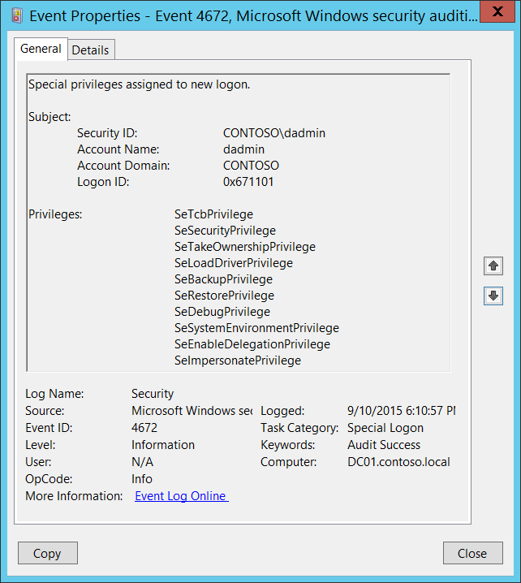

# 4672(S): 新しいログオンに割り当てられた特権


</br>
<b><em>サブカテゴリ:</em></b>&nbsp;<a href="audit-special-logon.md" data-raw-source="[Audit Special Logon](audit-special-logon.md)">特別なログオンの監査</a>

***イベントの説明:***

次のいずれかの機密特権が新しいログオンセッションに割り当てられている場合、このイベントは新しいアカウントのログオンに対して生成されます:

-   SeTcbPrivilege - オペレーティングシステムの一部として動作する

-   SeBackupPrivilege - ファイルとディレクトリのバックアップ

-   SeCreateTokenPrivilege - トークンオブジェクトの作成

-   SeDebugPrivilege - プログラムのデバッグ

-   SeEnableDelegationPrivilege - 委任のためにコンピュータおよびユーザーアカウントを信頼できるようにする

-   SeAuditPrivilege - セキュリティ監査の生成

-   SeImpersonatePrivilege - 認証後にクライアントを偽装する

-   SeLoadDriverPrivilege - デバイスドライバのロードおよびアンロード

-   SeSecurityPrivilege - 監査およびセキュリティログの管理

-   SeSystemEnvironmentPrivilege - ファームウェア環境値の変更

-   SeAssignPrimaryTokenPrivilege - プロセスレベルのトークンの置換

-   SeRestorePrivilege - ファイルおよびディレクトリの復元

-   SeTakeOwnershipPrivilege - ファイルまたは他のオブジェクトの所有権を取得する

このイベントは、SYSTEM（ローカルシステム）アカウントのすべてのログオンがこのイベントをトリガーするため、イベントログに多く表示されることが一般的です。

> **注**&nbsp;&nbsp;推奨事項については、このイベントの[セキュリティ監視の推奨事項](#security-monitoring-recommendations)を参照してください。

<br clear="all">

***イベントXML:***
```xml
- <Event xmlns="http://schemas.microsoft.com/win/2004/08/events/event">
- <System>
 <Provider Name="Microsoft-Windows-Security-Auditing" Guid="{54849625-5478-4994-A5BA-3E3B0328C30D}" /> 
 <EventID>4672</EventID> 
 <Version>0</Version> 
 <Level>0</Level> 
 <Task>12548</Task> 
 <Opcode>0</Opcode> 
 <Keywords>0x8020000000000000</Keywords> 
 <TimeCreated SystemTime="2015-09-11T01:10:57.091809600Z" /> 
 <EventRecordID>237692</EventRecordID> 
 <Correlation /> 
 <Execution ProcessID="504" ThreadID="524" /> 
 <Channel>Security</Channel> 
 <Computer>DC01.contoso.local</Computer> 
 <Security /> 
 </System>
- <EventData>
 <Data Name="SubjectUserSid">S-1-5-21-3457937927-2839227994-823803824-1104</Data> 
 <Data Name="SubjectUserName">dadmin</Data> 
 <Data Name="SubjectDomainName">CONTOSO</Data> 
 <Data Name="SubjectLogonId">0x671101</Data> 
 <Data Name="PrivilegeList">SeTcbPrivilege SeSecurityPrivilege SeTakeOwnershipPrivilege SeLoadDriverPrivilege SeBackupPrivilege SeRestorePrivilege SeDebugPrivilege SeSystemEnvironmentPrivilege SeEnableDelegationPrivilege SeImpersonatePrivilege</Data> 
 </EventData>
 </Event>
```

***必要なサーバーロール:*** なし。

***最小OSバージョン:*** Windows Server 2008, Windows Vista.

***イベントバージョン:*** 0.

***フィールドの説明:***

**サブジェクト:**

-   **セキュリティID** \[タイプ = SID\]**:** 特別な特権が割り当てられたアカウントのSID。イベントビューアーは自動的にSIDを解決し、アカウント名を表示しようとします。SIDが解決できない場合、イベントにはソースデータが表示されます。

> **注**&nbsp;&nbsp;**セキュリティ識別子 (SID)** は、信託者（セキュリティプリンシパル）を識別するために使用される可変長の一意の値です。各アカウントには、Active Directoryドメインコントローラーなどの権限によって発行され、セキュリティデータベースに保存される一意のSIDがあります。ユーザーがログオンするたびに、システムはデータベースからそのユーザーのSIDを取得し、そのユーザーのアクセス トークンに配置します。システムは、以降のすべてのWindowsセキュリティとのやり取りでユーザーを識別するために、アクセス トークン内のSIDを使用します。ユーザーまたはグループの一意の識別子としてSIDが使用された場合、それは他のユーザーまたはグループを識別するために再利用されることはありません。SIDの詳細については、[セキュリティ識別子](/windows/access-protection/access-control/security-identifiers)を参照してください。

-   **アカウント名** \[タイプ = UnicodeString\]**:** 特別な特権が割り当てられたアカウントの名前。

-   **アカウントドメイン** \[タイプ = UnicodeString\]**:** サブジェクトのドメインまたはコンピュータ名。形式はさまざまで、以下を含みます:

    -   ドメインNETBIOS名の例: CONTOSO

    -   小文字の完全なドメイン名: contoso.local

    -   大文字の完全なドメイン名: CONTOSO.LOCAL

    -   LOCAL SERVICEやANONYMOUS LOGONなどの[よく知られたセキュリティプリンシパル](/windows/security/identity-protection/access-control/security-identifiers)の場合、このフィールドの値は「NT AUTHORITY」となります。

    -   ローカルユーザーアカウントの場合、このフィールドにはこのアカウントが属するコンピュータまたはデバイスの名前が含まれます。例: “Win81”。

-   **ログオンID** \[タイプ = HexInt64\]**:** このイベントを、同じログオンIDを含む可能性のある最近のイベントと関連付けるのに役立つ16進数の値。例: “[4624](event-4624.md): アカウントが正常にログオンされました。”

**特権** \[Type = UnicodeString\]**:** 新しいログオンに割り当てられた機密特権のリスト。このイベントに対する可能な特権のリストは以下の通りです:

| 特権名                        | ユーザー権利グループポリシー名                                   | 説明                                                                                                                                                                                                                                                                                                                                                                                                                                                                                                                                                                                                                                                                                                                                                                                                                                                           |
|-------------------------------|----------------------------------------------------------------|-----------------------------------------------------------------------------------------------------------------------------------------------------------------------------------------------------------------------------------------------------------------------------------------------------------------------------------------------------------------------------------------------------------------------------------------------------------------------------------------------------------------------------------------------------------------------------------------------------------------------------------------------------------------------------------------------------------------------------------------------------------------------------------------------------------------------------------------------------------------------|
| SeAssignPrimaryTokenPrivilege | プロセスレベルのトークンを置き換える                                  | プロセスの[*プライマリトークン*](/windows/win32/secgloss/p-gly#_security_primary_token_gly)を割り当てるために必要です。<br>この特権を持つユーザーは、開始されたサブプロセスに関連付けられたデフォルトのトークンを置き換えるためにプロセスを開始できます。                                                                                                                                                                                                                                                                                                                                                                                                                                                                                                                                                                 |
| SeAuditPrivilege              | セキュリティ監査を生成                                       | この特権を持つユーザーは、セキュリティログにエントリを追加できます。                                                                                                                                                                                                                                                                                                                                                                                                                                                                                                                                                                                                                                                                                                                                                                                                    |
| SeBackupPrivilege             | ファイルとディレクトリをバックアップ                                  | - バックアップ操作を実行するために必要です。<br>この特権を持つユーザーは、システムをバックアップする目的でファイルやディレクトリ、レジストリ、その他の永続的なオブジェクトの権限をバイパスできます。<br>この特権は、システムがファイルに対して指定された[*アクセス制御リスト*](/windows/win32/secgloss/a-gly#_security_access_control_list_gly) (ACL)に関係なく、すべての読み取りアクセス権を付与する原因となります。読み取り以外のアクセス要求はACLで評価されます。この特権が保持されている場合、以下のアクセス権が付与されます:<br>READ\_CONTROL<br>ACCESS\_SYSTEM\_SECURITY<br>FILE\_GENERIC\_READ<br>FILE\_TRAVERSE                                                                                                                |
| SeCreateTokenPrivilege        | トークンオブジェクトを作成                                          | プロセスがNtCreateToken()や他のトークン作成APIを使用する際に、任意のローカルリソースにアクセスするためのトークンを作成できるようにします。<br>プロセスがこの特権を必要とする場合、別のユーザーアカウントを作成してこの特権を割り当てるのではなく、LocalSystemアカウント（既にこの特権を含んでいる）を使用することをお勧めします。                                                                                                                                                                                                                                                                                                                                                                                                                                                                                |
| SeDebugPrivilege              | プログラムをデバッグ                                                 | 他のアカウントが所有するプロセスのメモリをデバッグおよび調整するために必要です。<br>この特権を持つユーザーは、任意のプロセスまたはカーネルにデバッガをアタッチできます。SeDebugPrivilegeは常に管理者に付与され、管理者のみに付与されることをお勧めします。自分のアプリケーションをデバッグしている開発者はこのユーザー権利を必要としません。新しいシステムコンポーネントをデバッグしている開発者はこのユーザー権利を必要とします。このユーザー権利は、機密性が高く重要なオペレーティングシステムコンポーネントへの完全なアクセスを提供します。                                                                                                                                                                                                                                                                                                                                                                                                                                |
| SeEnableDelegationPrivilege   | 委任のために信頼されるコンピュータおよびユーザーアカウントを有効にする | ユーザーおよびコンピュータアカウントを委任のために信頼されるようにマークするために必要です。<br>この特権を持つユーザーは、ユーザーまたはコンピュータオブジェクトに**委任のために信頼される**設定を行うことができます。<br>この特権を付与されたユーザーまたはオブジェクトは、ユーザーまたはコンピュータオブジェクトのアカウント制御フラグに書き込みアクセスを持っている必要があります。委任のために信頼されるコンピュータ（またはユーザーコンテキストで実行されているサーバープロセス）は、クライアントの委任された資格情報を使用して別のコンピュータ上のリソースにアクセスできます。ただし、クライアントのアカウントに**委任できないアカウント**のアカウント制御フラグが設定されていない場合に限ります。                                                                                                                                                                                                                      |
| SeImpersonatePrivilege        | 認証後にクライアントを偽装する                      | この特権を持つユーザーは、他のアカウントを偽装できます。                                                                                                                                                                                                                                                                                                                                                                                                                                                                                                                                                                                                                                                                                                                                                                                                         |
| SeLoadDriverPrivilege         | デバイスドライバをロードおよびアンロードする                                 | デバイスドライバをロードまたはアンロードするために必要です。<br>この特権を持つユーザーは、デバイスドライバや他のコードをカーネルモードに動的にロードおよびアンロードできます。このユーザー権利は、プラグアンドプレイデバイスドライバには適用されません。                                                                                                                                                                                                                                                                                                                                                                                                                                                                                                                                                                                                                                    |
| SeRestorePrivilege            | ファイルとディレクトリを復元する                                  | 復元操作を実行するために必要です。この特権は、システムがファイルに対して指定されたACLに関係なく、すべての書き込みアクセス権を付与する原因となります。書き込み以外のアクセス要求はACLで評価されます。さらに、この特権は、任意の有効なユーザーまたはグループSIDをファイルの所有者として設定できるようにします。この特権が保持されている場合、以下のアクセス権が付与されます:<br>WRITE\_DAC<br>WRITE\_OWNER<br>ACCESS\_SYSTEM\_SECURITY<br>FILE\_GENERIC\_WRITE<br>FILE\_ADD\_FILE<br>FILE\_ADD\_SUBDIRECTORY<br>DELETE<br>この特権を持つユーザーは、バックアップされたファイルやディレクトリを復元する際にファイル、ディレクトリ、レジストリ、および他の永続的なオブジェクトの権限をバイパスでき、任意の有効なセキュリティプリンシパルをオブジェクトの所有者として設定できるユーザーを決定します。 |
| SeSecurityPrivilege           | 監査およびセキュリティログを管理する                               | セキュリティイベントログで監査イベントを制御および表示するなど、多くのセキュリティ関連機能を実行するために必要です。<br>この特権を持つユーザーは、ファイル、Active Directoryオブジェクト、およびレジストリキーなどの個々のリソースに対してオブジェクトアクセス監査オプションを指定できます。<br>この特権を持つユーザーは、セキュリティログを表示およびクリアすることもできます。                                                                                                                                                                                                                                                                                                                                                                                                                                                                                 |
| SeSystemEnvironmentPrivilege  | ファームウェア環境値を変更する                             | このタイプのメモリを使用して構成情報を保存するシステムの不揮発性RAMを変更するために必要です。                                                                                                                                                                                                                                                                                                                                                                                                                                                                                                                                                                                                                                                                                                                                                    |
| SeTakeOwnershipPrivilege      | ファイルや他のオブジェクトの所有権を取得する                       | 任意のアクセスを付与されることなくオブジェクトの所有権を取得するために必要です。この特権は、所有者の値を保持者が正当に所有者として割り当てることができる値にのみ設定できるようにします。<br>この特権を持つユーザーは、Active Directoryオブジェクト、ファイルおよびフォルダ、プリンタ、レジストリキー、プロセス、およびスレッドを含むシステム内の任意のセキュリティオブジェクトの所有権を取得できます。                                                                                                                                                                                                                                                                                                                                                                                                                                  |
| SeTcbPrivilege                | オペレーティングシステムの一部として動作する                            | この特権は、その保持者を信頼されたコンピュータベースの一部として識別します。<br>このユーザー権利は、プロセスが認証なしで任意のユーザーを偽装できるようにします。したがって、プロセスはそのユーザーと同じローカルリソースにアクセスできます。                                                                                                                                                                                                                                                                                                                                                                                                                                                                                                                                                                                                                  |

## セキュリティ監視の推奨事項

4672(S): 新しいログオンに割り当てられた特権。

> **重要**&nbsp;&nbsp;このイベントについては、[付録A: 多くの監査イベントに対するセキュリティ監視の推奨事項](appendix-a-security-monitoring-recommendations-for-many-audit-events.md)も参照してください。

-   「**Subject\\Security ID**」が、LOCAL SYSTEM、NETWORK SERVICE、LOCAL SERVICEなどのよく知られたセキュリティプリンシパルのいずれでも*ない*場合、また「**Subject\\Security ID**」がリストされた**Privileges**を持つことが予想される管理者アカウントで*ない*場合、このイベントを監視します。

-   決して付与されるべきでない、または少数のアカウントにのみ付与されるべき特定の特権（例：SeDebugPrivilege）のリストがある場合、このイベントを使用してそれらの「**Privileges**」を監視します。

<!-- -->

-   このイベントの[イベント説明](event-4672.md)に記載されている機密特権のいずれかを監視する必要がある場合、そのイベント内で特定の特権を検索します。
