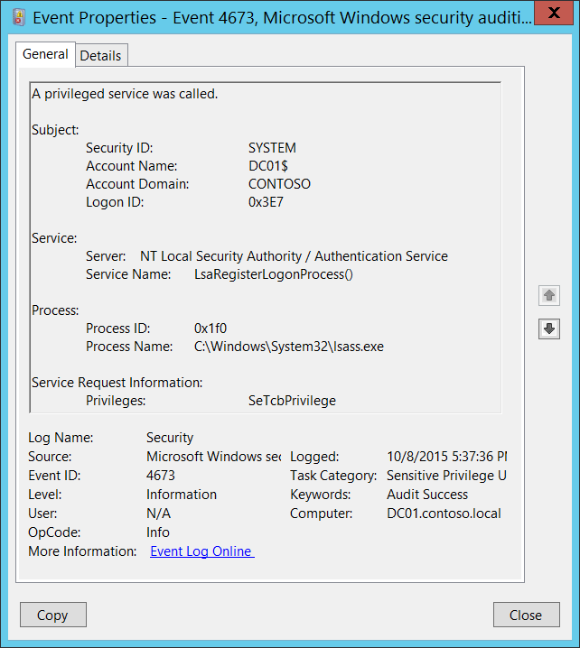

# 4673(S, F): 特権サービスが呼び出されました。



***サブカテゴリ:***&nbsp;[機密特権使用の監査](audit-sensitive-privilege-use.md) および [非機密特権使用の監査](audit-non-sensitive-privilege-use.md)

***イベントの説明:***

このイベントは、特権システムサービス操作を実行しようとした試みがあったときに生成されます。

例えば、**SeSystemtimePrivilege**、**SeCreateGlobalPrivilege**、または **SeTcbPrivilege** 特権が使用されたときにこのイベントが生成されます。

サービス呼び出しの試みが失敗した場合、失敗イベントが生成されます。

> **注**&nbsp;&nbsp;推奨事項については、このイベントの [セキュリティ監視の推奨事項](#security-monitoring-recommendations) を参照してください。

<br clear="all">

***イベント XML:***
```xml
- <Event xmlns="http://schemas.microsoft.com/win/2004/08/events/event">
- <System>
 <Provider Name="Microsoft-Windows-Security-Auditing" Guid="{54849625-5478-4994-A5BA-3E3B0328C30D}" /> 
 <EventID>4673</EventID> 
 <Version>0</Version> 
 <Level>0</Level> 
 <Task>13056</Task> 
 <Opcode>0</Opcode> 
 <Keywords>0x8020000000000000</Keywords> 
 <TimeCreated SystemTime="2015-10-09T00:37:36.434836600Z" /> 
 <EventRecordID>1099777</EventRecordID> 
 <Correlation /> 
 <Execution ProcessID="496" ThreadID="504" /> 
 <Channel>Security</Channel> 
 <Computer>DC01.contoso.local</Computer> 
 <Security /> 
 </System>
- <EventData>
 <Data Name="SubjectUserSid">S-1-5-18</Data> 
 <Data Name="SubjectUserName">DC01$</Data> 
 <Data Name="SubjectDomainName">CONTOSO</Data> 
 <Data Name="SubjectLogonId">0x3e7</Data> 
 <Data Name="ObjectServer">NT Local Security Authority / Authentication Service</Data> 
 <Data Name="Service">LsaRegisterLogonProcess()</Data> 
 <Data Name="PrivilegeList">SeTcbPrivilege</Data> 
 <Data Name="ProcessId">0x1f0</Data> 
 <Data Name="ProcessName">C:\\Windows\\System32\\lsass.exe</Data> 
 </EventData>
 </Event>
```

***必要なサーバー ロール:*** なし。

***最小 OS バージョン:*** Windows Server 2008、Windows Vista。

***イベント バージョン:*** 0。

***フィールドの説明:***

**サブジェクト:**

-   **セキュリティ ID** \[タイプ = SID\]**:** 特権操作を要求したアカウントの SID。イベント ビューアーは自動的に SID を解決してアカウント名を表示しようとします。SID を解決できない場合、イベントにソース データが表示されます。

> **注**&nbsp;&nbsp;**セキュリティ識別子 (SID)** は、信託者 (セキュリティ プリンシパル) を識別するために使用される可変長の一意の値です。各アカウントには、Active Directory ドメイン コントローラーなどの権限によって発行され、セキュリティ データベースに保存される一意の SID があります。ユーザーがログオンするたびに、システムはデータベースからそのユーザーの SID を取得し、そのユーザーのアクセス トークンに配置します。システムは、アクセス トークン内の SID を使用して、以降のすべての Windows セキュリティとのやり取りでユーザーを識別します。SID がユーザーまたはグループの一意の識別子として使用された場合、それが再び別のユーザーまたはグループを識別するために使用されることはありません。SID の詳細については、[セキュリティ識別子](/windows/access-protection/access-control/security-identifiers) を参照してください。

-   **アカウント名** \[タイプ = UnicodeString\]**:** 特権操作を要求したアカウントの名前。

-   **アカウントドメイン** \[タイプ = UnicodeString\]**:** サブジェクトのドメインまたはコンピュータ名。形式は以下のように異なります：

    -   ドメインのNETBIOS名の例: CONTOSO

    -   小文字の完全なドメイン名: contoso.local

    -   大文字の完全なドメイン名: CONTOSO.LOCAL

    -   一部の[よく知られたセキュリティプリンシパル](/windows/security/identity-protection/access-control/security-identifiers)の場合、例えばLOCAL SERVICEやANONYMOUS LOGON、このフィールドの値は「NT AUTHORITY」となります。

    -   ローカルユーザーアカウントの場合、このフィールドにはこのアカウントが属するコンピュータまたはデバイスの名前が含まれます。例えば、「Win81」。

-   **ログオンID** \[タイプ = HexInt64\]**:** 16進数の値で、同じログオンIDを含む最近のイベントとこのイベントを関連付けるのに役立ちます。例えば、「[4624](event-4624.md): アカウントが正常にログオンされました。」

**サービス**:

-   **サーバー** \[タイプ = UnicodeString\]: ルーチンを呼び出しているWindowsサブシステムの名前を含みます。サブシステムの例は以下の通りです：

    -   セキュリティ

    -   セキュリティアカウントマネージャー

    -   NTローカルセキュリティ機関 / 認証サービス

    -   SCマネージャー

    -   Win32システムシャットダウンモジュール

    -   LSA

-   **サービス名** \[タイプ = UnicodeString\] \[オプション\]: 特権サブシステムサービスまたは機能の名前を提供します。例えば、「RESET RUNTIME LOCAL SECURITY」はローカルセキュリティポリシーデータベースを更新するために使用される**ローカルセキュリティ機関**サービスによって指定されるかもしれませんし、**LsaRegisterLogonProcess()**は新しいログオンプロセスを登録するために使用される**NTローカルセキュリティ機関 / 認証サービス**によって指定されるかもしれません。

**プロセス:**

-   **プロセスID** \[タイプ = ポインタ\]: 特権サービスを呼び出そうとしたプロセスの16進数のプロセスID。プロセスID（PID）は、オペレーティングシステムがアクティブなプロセスを一意に識別するために使用する番号です。特定のプロセスのPIDを確認するには、例えばタスクマネージャー（詳細タブ、PID列）を使用できます。


16進数の値を10進数に変換すると、タスクマネージャーの値と比較できます。

このプロセスIDを他のイベントのプロセスIDと関連付けることもできます。例えば、「[4688](event-4688.md): 新しいプロセスが作成されました」**プロセス情報\\新しいプロセスID**。

- **プロセス名** \[タイプ = UnicodeString\]**:** プロセスの実行可能ファイルのフルパスと名前。

**サービス要求情報**:

- **特権** \[タイプ = UnicodeString\]: 要求されたユーザー特権のリスト。可能な特権は、以下の2つのサブカテゴリに依存します。**監査非機密特権使用**または**監査機密特権使用**。以下の2つの表に示されています。

|     **イベントのサブカテゴリ**      |                        **特権名: <br>ユーザー権利グループポリシー名**                         |                                                                                                                                                                                           **説明**                                                                                                                                                                                           |
|-----------------------------------|-----------------------------------------------------------------------------------------------------|-----------------------------------------------------------------------------------------------------------------------------------------------------------------------------------------------------------------------------------------------------------------------------------------------------------------------------------------------------------------------------------------------------|
| 監査非機密特権使用 |               <b>SeChangeNotifyPrivilege: <br></b>トラバースチェックのバイパス                | ファイルやディレクトリの変更通知を受け取るために必要です。この特権は、システムがすべてのトラバースアクセスチェックをスキップする原因にもなります。<br>この特権を持つユーザーは、トラバースされたディレクトリに対する権限がなくてもディレクトリツリーをトラバースできます。この特権は、ユーザーがディレクトリの内容を一覧表示することを許可するものではなく、ディレクトリをトラバースするだけです。 |
| 監査非機密特権使用 |                 <b>SeCreateGlobalPrivilege: <br></b>グローバルオブジェクトの作成                 |                                                                                                                                              ターミナルサービスセッション中にグローバル名前空間で名前付きファイルマッピングオブジェクトを作成するために必要です。                                                                                                                                               |
| 監査非機密特権使用 |                  <b>SeCreatePagefilePrivilege: <br></b>ページファイルの作成                  |                                                                                                                                                             この特権を持つユーザーは、ページファイルを作成およびサイズ変更できます。                                                                                                                                                             |
| 監査非機密特権使用 |          <b>SeCreatePermanentPrivilege: <br></b>永続的な共有オブジェクトの作成           |                                                                永続的なオブジェクトを作成するために必要です。<br>この特権は、オブジェクト名前空間を拡張するカーネルモードコンポーネントに役立ちます。カーネルモードで実行されているコンポーネントはすでにこの特権を持っているため、特権を割り当てる必要はありません。                                                                 |
| 監査非機密特権使用 |              <b>SeCreateSymbolicLinkPrivilege: <br></b>シンボリックリンクの作成              |                                                                                                                                                                                 シンボリックリンクを作成するために必要です。                                                                                                                                                                                 |
| 監査非機密特権使用 |         <b>SeIncreaseBasePriorityPrivilege: <br></b>スケジューリング優先度の増加          |                            プロセスの基本優先度を増加させるために必要です。<br>この特権を持つユーザーは、他のプロセスに対して書き込みプロパティアクセスを持つプロセスを使用して、他のプロセスに割り当てられた実行優先度を増加させることができます。この特権を持つユーザーは、タスクマネージャーのユーザーインターフェイスを通じてプロセスのスケジューリング優先度を変更できます。                             |
| 監査非機密特権使用 |          <b>SeIncreaseQuotaPrivilege: <br></b>プロセスのメモリクォータの調整          |                                                                                                                      プロセスに割り当てられたクォータを増加させるために必要です。<br>この特権を持つユーザーは、プロセスが消費できる最大メモリを変更できます。                                                                                                                       |
| 監査非機密特権使用 |         <b>SeIncreaseWorkingSetPrivilege: <br></b>プロセスのワーキングセットの増加          |                                                                                                                                                         ユーザーのコンテキストで実行されるアプリケーションのためにより多くのメモリを割り当てるために必要です。                                                                                                                                                         |
| 監査非機密特権使用 |                  <b>SeLockMemoryPrivilege: <br></b>メモリ内のページのロック                   |                         物理ページをメモリにロックするために必要です。<br>この特権を持つユーザーは、プロセスを使用してデータを物理メモリに保持し、システムがデータをディスク上の仮想メモリにページングするのを防ぐことができます。この特権を行使すると、利用可能なランダムアクセスメモリ（RAM）の量が減少するため、システムパフォーマンスに大きな影響を与える可能性があります。                         |
| 監査非機密特権使用 |             <b>SeMachineAccountPrivilege: <br></b>ワークステーションのドメインへの追加              |                                                                                                                                        この特権を持つユーザーは、コンピュータアカウントを作成できます。<br>この特権はドメインコントローラーでのみ有効です。                                                                                                                                         |
| 監査非機密特権使用 |           <b>SeManageVolumePrivilege: <br></b>ボリュームメンテナンスタスクの実行            |                                                                                                                                                           ボリューム上でメンテナンスタスクを実行するために必要です。例えば、リモートデフラグメンテーションなど。                                                                                                                                                            |
| 監査非機密特権使用 |            <b>SeProfileSingleProcessPrivilege: <br></b>単一プロセスのプロファイル             |                                                                                                      単一プロセスのプロファイリング情報を収集するために必要です。<br>この特権を持つユーザーは、パフォーマンスモニタリングツールを使用して非システムプロセスのパフォーマンスを監視できます。                                                                                                      |
| 監査非機密特権使用 |                   <b>SeRelabelPrivilege: <br></b>オブジェクトラベルの変更                   |                                                                                                                                                                   オブジェクトの強制整合性レベルを変更するために必要です。                                                                                                                                                                    |
| 監査非機密特権使用 |         <b>SeRemoteShutdownPrivilege: <br></b>リモートシステムからの強制シャットダウン         |                                                                                                                                                                       ネットワークリクエストを使用してシステムをシャットダウンするために必要です。                                                                                                                                                                       |
| 監査非機密特権使用 |                   <b>SeShutdownPrivilege: <br></b>システムのシャットダウン                    |                                                                                                                                                                                ローカルシステムをシャットダウンするために必要です。                                                                                                                                                                                |
| 監査非機密特権使用 |            <b>SeSyncAgentPrivilege: <br></b>ディレクトリサービスデータの同期            |      この特権により、保持者はオブジェクトおよびプロパティの保護に関係なく、ディレクトリ内のすべてのオブジェクトおよびプロパティを読み取ることができます。デフォルトでは、ドメインコントローラーの管理者およびLocalSystemアカウントに割り当てられます。<br>この特権を持つユーザーは、すべてのディレクトリサービスデータを同期できます。これはActive Directoryの同期とも呼ばれます。       |
| 監査非機密特権使用 |              <b>SeSystemProfilePrivilege: <br></b>システムパフォーマンスのプロファイル              |                                                                                                       システム全体のプロファイリング情報を収集するために必要です。<br>この特権を持つユーザーは、パフォーマンスモニタリングツールを使用してシステムプロセスのパフォーマンスを監視できます。                                                                                                        |
| 監査非機密特権使用 |                 <b>SeSystemtimePrivilege: <br></b>システム時間の変更                  |                     システム時間を変更するために必要です。この特権を持つユーザーは、コンピュータの内部時計の時間と日付を変更できます。このユーザー権利が割り当てられたユーザーは、イベントログの表示に影響を与える可能性があります。<br>システム時間が変更されると、ログに記録されるイベントは実際に発生した時間ではなく、この新しい時間を反映します。                      |
| 監査非機密特権使用 |                   <b>SeTimeZonePrivilege: <br></b>タイムゾーンの変更                    |                                                                                                                                                           コンピュータの内部時計に関連付けられたタイムゾーンを調整するために必要です。                                                                                                                                                           |
| 監査非機密特権使用 | <b>SeTrustedCredManAccessPrivilege: <br></b>信頼された呼び出し元として資格情報マネージャーにアクセス |                                                                                                                                                                     信頼された呼び出し元として資格情報マネージャーにアクセスするために必要です。                                                                                                                                                                      |
| 監査非機密特権使用 |            <b>SeUndockPrivilege: <br></b>ドッキングステーションからコンピュータを取り外す             |                                                                                                                             ラップトップを取り外すために必要です。<br>この特権を持つユーザーは、ログオンせずにポータブルコンピュータをドッキングステーションから取り外すことができます。                                                                                                                              |

|   **イベントのサブカテゴリ**    |                               **特権名: <br>ユーザー権利グループポリシー名**                               |                                                                                                                                                                                                                                                                                                        **説明**                                                                                                                                                                                                                                                                                                         |
|-------------------------------|------------------------------------------------------------------------------------------------------------------|--------------------------------------------------------------------------------------------------------------------------------------------------------------------------------------------------------------------------------------------------------------------------------------------------------------------------------------------------------------------------------------------------------------------------------------------------------------------------------------------------------------------------------------------------------------------------------------------------------------------------------|
| 機密特権の使用の監査 |                <b>SeAssignPrimaryTokenPrivilege: <br></b>プロセスレベルのトークンを置き換える                 |                                                                                                                                                                     プロセスの[*プライマリトークン*](/windows/win32/secgloss/p-gly#_security_primary_token_gly)を割り当てるために必要です。この特権を持つユーザーは、開始されたサブプロセスに関連付けられたデフォルトのトークンを置き換えるためにプロセスを開始できます。                                                                                                                                                                      |
| 機密特権の使用の監査 |                         <b>SeAuditPrivilege: <br></b>セキュリティ監査を生成する                          |                                                                                                                                                                                                                                                                               この特権を持つユーザーは、セキュリティログにエントリを追加できます。                                                                                                                                                                                                                                                                               |
| 機密特権の使用の監査 |                        <b>SeCreateTokenPrivilege: <br></b>トークンオブジェクトを作成する                        |                                                                                                                         プロセスがNtCreateToken()や他のトークン作成APIを使用する際に、任意のローカルリソースにアクセスするためのトークンを作成できるようにします。プロセスがこの特権を必要とする場合、別のユーザーアカウントを作成してこの特権を割り当てるのではなく、既にこの特権を含むLocalSystemアカウントを使用することをお勧めします。                                                                                                                          |
| 機密特権の使用の監査 |                              <b>SeDebugPrivilege: <br></b>プログラムをデバッグする                               |                                                                                                 他のアカウントが所有するプロセスのメモリをデバッグおよび調整するために必要です。この特権を持つユーザーは、任意のプロセスまたはカーネルにデバッガをアタッチできます。自分のアプリケーションをデバッグしている開発者はこのユーザー権利を必要としません。新しいシステムコンポーネントをデバッグしている開発者はこのユーザー権利を必要とします。このユーザー権利は、機密性が高く重要なオペレーティングシステムコンポーネントへの完全なアクセスを提供します。                                                                                                  |
| 機密特権の使用の監査 |              <b>SeImpersonatePrivilege: <br></b>認証後にクライアントを偽装する              |                                                                                                                                                                                                                                                                                 この特権を持つユーザーは、他のアカウントを偽装できます。                                                                                                                                                                                                                                                                                  |
| 機密特権の使用の監査 |                    <b>SeLoadDriverPrivilege: <br></b>デバイスドライバをロードおよびアンロードする                    |                                                                                                                                                                                                   デバイスドライバをロードまたはアンロードするために必要です。この特権を持つユーザーは、デバイスドライバや他のコードをカーネルモードに動的にロードおよびアンロードできます。このユーザー権利は、プラグアンドプレイデバイスドライバには適用されません。                                                                                                                                                                                                    |
| 機密特権の使用の監査 |                         <b>SeLockMemoryPrivilege: <br></b>メモリ内のページをロックする                         |                                                                                                                                        物理ページをメモリにロックするために必要です。この特権を持つユーザーは、プロセスを使用してデータを物理メモリに保持し、システムがデータをディスク上の仮想メモリにページングするのを防ぐことができます。この特権を行使すると、利用可能なランダムアクセスメモリ（RAM）の量が減少するため、システムパフォーマンスに大きな影響を与える可能性があります。                                                                                                                                         |
| 機密特権の使用の監査 |              <b>SeSystemEnvironmentPrivilege: <br></b>ファームウェア環境値を変更する               |                                                                                                                                                                                                                                                       このタイプのメモリを使用して構成情報を保存するシステムの不揮発性RAMを変更するために必要です。                                                                                                                                                                                                                                                       |
| 機密特権の使用の監査 |                     <b>SeTcbPrivilege: <br></b>オペレーティングシステムの一部として動作する                     |                                                                                                                                                                                          この特権は、その保持者を信頼されたコンピュータベースの一部として識別します。このユーザー権利により、プロセスは認証なしで任意のユーザーを偽装できます。したがって、プロセスはそのユーザーと同じローカルリソースにアクセスできます。                                                                                                                                                                                           |
| 機密特権の使用の監査 | <b>SeEnableDelegationPrivilege: <br></b>委任のために信頼されるコンピュータおよびユーザーアカウントを有効にする | ユーザーおよびコンピュータアカウントを委任のために信頼されるようにマークするために必要です。この特権を持つユーザーは、ユーザーまたはコンピュータオブジェクトに**委任のために信頼される**設定を行うことができます。この特権が付与されたユーザーまたはオブジェクトは、ユーザーまたはコンピュータオブジェクトのアカウント制御フラグに書き込みアクセス権を持っている必要があります。委任のために信頼されるコンピュータ（またはユーザーコンテキストで実行されているサーバープロセス）は、クライアントの委任された資格情報を使用して別のコンピュータ上のリソースにアクセスできますが、クライアントのアカウントに**委任できないアカウント**のアカウント制御フラグが設定されていない限りです。 |

## セキュリティ監視の推奨事項

4673(S, F): 特権サービスが呼び出されました。

> **重要**&nbsp;&nbsp;このイベントについては、[付録A: 多くの監査イベントに対するセキュリティ監視の推奨事項](appendix-a-security-monitoring-recommendations-for-many-audit-events.md)も参照してください。

-   「**Subject\\Security ID**」が以下のよく知られたセキュリティプリンシパルのいずれでも*ない*場合、このイベントを監視します: LOCAL SYSTEM、NETWORK SERVICE、LOCAL SERVICE。また、「**Subject\\Security ID**」がリストされた**Privileges**を持つことが期待される管理アカウントでない場合も監視します。詳細については、サブカテゴリ[監査センシティブ特権の使用](/windows/security/threat-protection/auditing/audit-sensitive-privilege-use)および[監査非センシティブ特権の使用](/windows/security/threat-protection/auditing/audit-non-sensitive-privilege-use)を参照してください。

-   特定のWindowsサブシステム（「**Service\\Server**」）に関連するイベントを監視する必要がある場合、例えば**NT Local Security Authority / Authentication Service**や**Security Account Manager**、対応する「**Service\\Server**」のこのイベントを監視します。

-   特定のWindowsセキュリティサービスや機能（「**Service\\Service Name**」）に関連するイベントを監視する必要がある場合、例えば**LsaRegisterLogonProcess()**、対応する「**Service\\Service Name**」のこのイベントを監視します。

<!-- -->

-   このイベントで報告されたプロセスの「**Process Name**」が事前に定義されたものである場合、定義された値と異なる「**Process Name**」のすべてのイベントを監視します。

-   「**Process Name**」が標準フォルダー（例えば、**System32**や**Program Files**）にないか、制限されたフォルダー（例えば、**Temporary Internet Files**）にあるかを監視することができます。

<!-- -->

-   プロセス名に制限されたサブストリングや単語（例えば、「**mimikatz**」や「**cain.exe**」）の事前定義リストがある場合、「**Process Name**」にこれらのサブストリングが含まれているかを確認します。

-   特定の「**Subject\\Security ID**」に対して、許可された特権の定義リストがある場合、その「**Privileges**」を使用できないはずのものを監視します。

- 特定のユーザー権限のリストがあり、それが決して使用されるべきでない、または少数のアカウントのみで使用されるべき場合（例：SeDebugPrivilege）、それらの「**Privileges**」に対してアラートをトリガーします。

- 特定のユーザー権限のリストがあり、そのすべての使用が報告または監視されるべき場合（例：SeRemoteShutdownPrivilege）、それらの「**Privileges**」に対してアラートをトリガーします。
