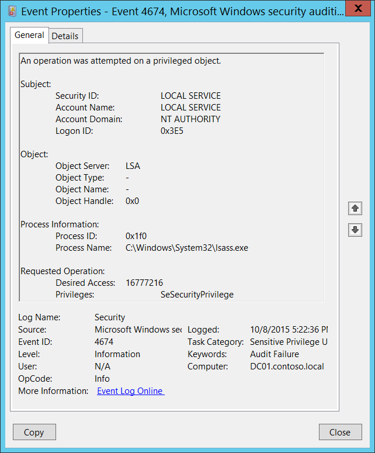

# 4674(S, F): 特権オブジェクトに対して操作が試みられました。



***サブカテゴリ:***&nbsp;[機密特権使用の監査](audit-sensitive-privilege-use.md) および [非機密特権使用の監査](audit-non-sensitive-privilege-use.md)

***イベントの説明:***

このイベントは、オブジェクトが既に開かれた後に保護されたサブシステムオブジェクトに対して特権操作を実行しようとしたときに生成されます。

例えば、SeShutdownPrivilege、SeRemoteShutdownPrivilege、または SeSecurityPrivilege が使用されたときにこのイベントが生成されます。

操作の試行が失敗した場合、失敗イベントが生成されます。

> **注**&nbsp;&nbsp;推奨事項については、このイベントの [セキュリティ監視の推奨事項](#security-monitoring-recommendations) を参照してください。

<br clear="all">

***イベント XML:***
```
- <Event xmlns="http://schemas.microsoft.com/win/2004/08/events/event">
- <System>
 <Provider Name="Microsoft-Windows-Security-Auditing" Guid="{54849625-5478-4994-A5BA-3E3B0328C30D}" /> 
 <EventID>4674</EventID> 
 <Version>0</Version> 
 <Level>0</Level> 
 <Task>13056</Task> 
 <Opcode>0</Opcode> 
 <Keywords>0x8010000000000000</Keywords> 
 <TimeCreated SystemTime="2015-10-09T00:22:36.237816000Z" /> 
 <EventRecordID>1099680</EventRecordID> 
 <Correlation /> 
 <Execution ProcessID="496" ThreadID="504" /> 
 <Channel>Security</Channel> 
 <Computer>DC01.contoso.local</Computer> 
 <Security /> 
 </System>
- <EventData>
 <Data Name="SubjectUserSid">S-1-5-19</Data> 
 <Data Name="SubjectUserName">LOCAL SERVICE</Data> 
 <Data Name="SubjectDomainName">NT AUTHORITY</Data> 
 <Data Name="SubjectLogonId">0x3e5</Data> 
 <Data Name="ObjectServer">LSA</Data> 
 <Data Name="ObjectType">-</Data> 
 <Data Name="ObjectName">-</Data> 
 <Data Name="HandleId">0x0</Data> 
 <Data Name="AccessMask">16777216</Data> 
 <Data Name="PrivilegeList">SeSecurityPrivilege</Data> 
 <Data Name="ProcessId">0x1f0</Data> 
 <Data Name="ProcessName">C:\\Windows\\System32\\lsass.exe</Data> 
 </EventData>
 </Event>
```

***必要なサーバー役割:*** なし。

***最小 OS バージョン:*** Windows Server 2008, Windows Vista。

***イベントバージョン:*** 0。

***フィールドの説明:***

**サブジェクト:**

-   **セキュリティ ID** \[タイプ = SID\]**:** 特権操作を要求したアカウントの SID。イベントビューアーは自動的に SID を解決してアカウント名を表示しようとします。SID を解決できない場合、イベントにソースデータが表示されます。

> **注**&nbsp;&nbsp;**セキュリティ識別子 (SID)** は、信託者 (セキュリティプリンシパル) を識別するために使用される可変長の一意の値です。各アカウントには、Active Directory ドメインコントローラーなどの権限によって発行され、セキュリティデータベースに保存される一意の SID があります。ユーザーがログオンするたびに、システムはデータベースからそのユーザーの SID を取得し、そのユーザーのアクセストークンに配置します。システムは、アクセストークン内の SID を使用して、以降のすべての Windows セキュリティとのやり取りでユーザーを識別します。SID がユーザーまたはグループの一意の識別子として使用された場合、それは他のユーザーまたはグループを識別するために再利用されることはありません。SID についての詳細は、[セキュリティ識別子](/windows/access-protection/access-control/security-identifiers) を参照してください。

-   **アカウント名** \[タイプ = UnicodeString\]**:** 特権操作を要求したアカウントの名前。

-   **アカウントドメイン** \[タイプ = UnicodeString\]**:** サブジェクトのドメインまたはコンピュータ名。形式は以下のように異なります：

    -   ドメインのNETBIOS名の例: CONTOSO

    -   小文字の完全なドメイン名: contoso.local

    -   大文字の完全なドメイン名: CONTOSO.LOCAL

    -   一部の[よく知られたセキュリティプリンシパル](/windows/security/identity-protection/access-control/security-identifiers)の場合、例えばLOCAL SERVICEやANONYMOUS LOGON、このフィールドの値は「NT AUTHORITY」となります。

    -   ローカルユーザーアカウントの場合、このフィールドにはこのアカウントが属するコンピュータまたはデバイスの名前が含まれます。例えば「Win81」のように。

-   **ログオンID** \[タイプ = HexInt64\]**:** 16進数の値で、最近のイベントと同じログオンIDを含む可能性のあるイベントとこのイベントを関連付けるのに役立ちます。例えば、「[4624](event-4624.md): アカウントが正常にログオンされました。」

**オブジェクト**:

-   **オブジェクトサーバー** \[タイプ = UnicodeString\] \[オプション\]: ルーチンを呼び出しているWindowsサブシステムの名前を含みます。サブシステムの例は以下の通りです：

    -   セキュリティ

    -   セキュリティアカウントマネージャー

    -   NTローカルセキュリティ機関 / 認証サービス

    -   SCマネージャー

    -   Win32システムシャットダウンモジュール

    -   LSA

-   **オブジェクトタイプ** \[タイプ = UnicodeString\] \[オプション\]: 操作中にアクセスされたオブジェクトのタイプ。

    以下の表には、最も一般的な**オブジェクトタイプ**のリストが含まれています：

| ディレクトリ           | イベント      | タイマー            | デバイス           |
|-------------------------|--------------|----------------------|--------------------|
| ミュータント            | タイプ        | ファイル             | トークン           |
| スレッド                | セクション    | ウィンドウステーション | デバッグオブジェクト |
| フィルター通信ポート    | イベントペア  | ドライバー           | IoCompletion       |
| コントローラー          | シンボリックリンク | WmiGuid              | プロセス           |
| プロファイル            | デスクトップ  | キードイベント       | SC\_MANAGERオブジェクト |
| キー                    | 待機可能ポート | コールバック         |                    |
| ジョブ                  | ポート        | フィルター接続ポート |                    |
| ALPCポート              | セマフォ      | アダプター           |                    |

-   **オブジェクト名** \[型 = UnicodeString\] \[オプション\]: 操作中にアクセスされたオブジェクトの名前。

-   **オブジェクトハンドル** \[型 = ポインタ\]: **オブジェクト名**へのハンドルの16進数値。このフィールドは、同じハンドルIDを含む他のイベントとこのイベントを関連付けるのに役立ちます。例えば、適切な/他のサブカテゴリの「4656: オブジェクトへのハンドルが要求されました」イベント。このパラメータはイベントでキャプチャされない場合があり、その場合は「0x0」として表示されます。

**プロセス情報:**

-   **プロセスID** \[型 = ポインタ\]: 特権オブジェクトに対して操作を試みたプロセスの16進数のプロセスID。プロセスID (PID) は、オペレーティングシステムがアクティブなプロセスを一意に識別するために使用する番号です。特定のプロセスのPIDを確認するには、例えばタスクマネージャー（詳細タブ、PID列）を使用できます:

    

    16進数の値を10進数に変換すると、タスクマネージャーの値と比較できます。

    また、このプロセスIDを他のイベントのプロセスIDと関連付けることもできます。例えば、「[4688](event-4688.md): 新しいプロセスが作成されました」**プロセス情報\\新しいプロセスID**。

-   **プロセス名** \[型 = UnicodeString\]**:** プロセスの実行可能ファイルのフルパスと名前。

**要求された操作**:

-   **希望するアクセス** \[型 = UnicodeString\]: 希望するアクセスマスク。このマスクは**オブジェクトサーバー**および**オブジェクトタイプ**パラメータの値に依存します。このパラメータの値は10進数形式です。このドキュメントにはこのパラメータに関する詳細情報はありません。**希望するアクセス**が表示されない場合、このパラメータは「**0**」の値を持ちます。

-   **特権** \[型 = UnicodeString\]: 要求されたユーザー特権のリスト。可能な特権は、**監査非機密特権使用**または**監査機密特権使用**のいずれかのサブカテゴリに依存します。以下の2つの表に示されています:

|     **イベントのサブカテゴリ**      |                        **特権名: <br>ユーザー権利グループポリシー名**                         |                                                                                                                                                                                           **説明**                                                                                                                                                                                           |
|-----------------------------------|-----------------------------------------------------------------------------------------------------|-----------------------------------------------------------------------------------------------------------------------------------------------------------------------------------------------------------------------------------------------------------------------------------------------------------------------------------------------------------------------------------------------------|
| 監査非機密特権使用 |               <b>SeChangeNotifyPrivilege: <br></b>トラバースチェックのバイパス                | ファイルまたはディレクトリの変更通知を受け取るために必要です。この特権は、システムがすべてのトラバースアクセスチェックをスキップする原因にもなります。 <br>この特権を持つユーザーは、トラバースされたディレクトリに対する権限を持っていなくてもディレクトリツリーをトラバースできます。この特権は、ユーザーがディレクトリの内容をリストすることを許可するものではなく、ディレクトリをトラバースするだけです。 |
| 監査非機密特権使用 |                 <b>SeCreateGlobalPrivilege: <br></b>グローバルオブジェクトの作成                 |                                                                                                                                              ターミナルサービスセッション中にグローバル名前空間で名前付きファイルマッピングオブジェクトを作成するために必要です。                                                                                                                                               |
| 監査非機密特権使用 |                  <b>SeCreatePagefilePrivilege: <br></b>ページファイルの作成                  |                                                                                                                                                             この特権を持つユーザーは、ページファイルを作成およびサイズ変更できます。                                                                                                                                                             |
| 監査非機密特権使用 |          <b>SeCreatePermanentPrivilege: <br></b>永続的な共有オブジェクトの作成           |                                                                永続的なオブジェクトを作成するために必要です。 <br>この特権は、オブジェクト名前空間を拡張するカーネルモードコンポーネントに役立ちます。カーネルモードで実行されているコンポーネントはすでにこの特権を持っているため、特権を割り当てる必要はありません。                                                                 |
| 監査非機密特権使用 |              <b>SeCreateSymbolicLinkPrivilege: <br></b>シンボリックリンクの作成              |                                                                                                                                                                                 シンボリックリンクを作成するために必要です。                                                                                                                                                                                 |
| 監査非機密特権使用 |         <b>SeIncreaseBasePriorityPrivilege: <br></b>スケジューリング優先度の増加          |                             プロセスの基本優先度を増加させるために必要です。<br>この特権を持つユーザーは、別のプロセスに対して書き込みプロパティアクセスを持つプロセスを使用して、他のプロセスに割り当てられた実行優先度を増加させることができます。この特権を持つユーザーは、タスクマネージャーのユーザーインターフェイスを通じてプロセスのスケジューリング優先度を変更できます。                             |
| 監査非機密特権使用 |          <b>SeIncreaseQuotaPrivilege: <br></b>プロセスのメモリクォータの調整          |                                                                                                                      プロセスに割り当てられたクォータを増加させるために必要です。 <br>この特権を持つユーザーは、プロセスが消費できる最大メモリを変更できます。                                                                                                                       |
| 監査非機密特権使用 |         <b>SeIncreaseWorkingSetPrivilege: <br></b>プロセスのワーキングセットの増加          |                                                                                                                                                         ユーザーのコンテキストで実行されるアプリケーションに対してより多くのメモリを割り当てるために必要です。                                                                                                                                                         |
| 監査非機密特権使用 |                  <b>SeLockMemoryPrivilege: <br></b>メモリ内のページのロック                   |                         物理ページをメモリにロックするために必要です。 <br>この特権を持つユーザーは、プロセスを使用してデータを物理メモリに保持し、システムがデータをディスク上の仮想メモリにページングするのを防ぎます。この特権を行使すると、利用可能なランダムアクセスメモリ（RAM）の量が減少するため、システムパフォーマンスに大きな影響を与える可能性があります。                         |
| 監査非機密特権使用 |             <b>SeMachineAccountPrivilege: <br></b>ワークステーションをドメインに追加              |                                                                                                                                          この特権を持つユーザーは、コンピュータアカウントを作成できます。この特権はドメインコントローラーでのみ有効です。                                                                                                                                           |
| 監査非機密特権使用 |           <b>SeManageVolumePrivilege: <br></b>ボリュームメンテナンスタスクの実行            |                                                                                                                                                           ボリューム上でメンテナンスタスクを実行するために必要です。例えば、リモートデフラグメンテーションなど。                                                                                                                                                            |
| 監査非機密特権使用 |            <b>SeProfileSingleProcessPrivilege: <br></b>単一プロセスのプロファイル             |                                                                                                      単一プロセスのプロファイル情報を収集するために必要です。 <br>この特権を持つユーザーは、パフォーマンスモニタリングツールを使用して非システムプロセスのパフォーマンスを監視できます。                                                                                                      |
| 監査非機密特権使用 |                   <b>SeRelabelPrivilege: <br></b>オブジェクトラベルの変更                   |                                                                                                                                                                   オブジェクトの強制整合性レベルを変更するために必要です。                                                                                                                                                                    |
| 監査非機密特権使用 |         <b>SeRemoteShutdownPrivilege: <br></b>リモートシステムからの強制シャットダウン         |                                                                                                                                                                       ネットワーク要求を使用してシステムをシャットダウンするために必要です。                                                                                                                                                                       |
| 監査非機密特権使用 |                   <b>SeShutdownPrivilege: <br></b>システムのシャットダウン                    |                                                                                                                                                                                ローカルシステムをシャットダウンするために必要です。                                                                                                                                                                                |
| 監査非機密特権使用 |            <b>SeSyncAgentPrivilege: <br></b>ディレクトリサービスデータの同期            |      この特権を持つ者は、オブジェクトおよびプロパティの保護に関係なく、ディレクトリ内のすべてのオブジェクトおよびプロパティを読み取ることができます。デフォルトでは、ドメインコントローラー上の管理者およびLocalSystemアカウントに割り当てられます。 <br>この特権を持つユーザーは、すべてのディレクトリサービスデータを同期できます。これはActive Directoryの同期とも呼ばれます。       |
| 監査非機密特権使用 |              <b>SeSystemProfilePrivilege: <br></b>システムパフォーマンスのプロファイル              |                                                                                                       システム全体のプロファイル情報を収集するために必要です。 <br>この特権を持つユーザーは、パフォーマンスモニタリングツールを使用してシステムプロセスのパフォーマンスを監視できます。                                                                                                        |
| 監査非機密特権使用 |                 <b>SeSystemtimePrivilege: <br></b>システム時間の変更                  |                     システム時間を変更するために必要です。 <br>この特権を持つユーザーは、コンピュータの内部時計の時間と日付を変更できます。このユーザー権利が割り当てられているユーザーは、イベントログの表示に影響を与える可能性があります。システム時間が変更されると、ログに記録されるイベントは実際に発生した時間ではなく、この新しい時間を反映します。                      |
| 監査非機密特権使用 |                   <b>SeTimeZonePrivilege: <br></b>タイムゾーンの変更                    |                                                                                                                                                           コンピュータの内部時計に関連付けられたタイムゾーンを調整するために必要です。                                                                                                                                                           |
| 監査非機密特権使用 | <b>SeTrustedCredManAccessPrivilege: <br></b>信頼された呼び出し元として資格情報マネージャーにアクセス |                                                                                                                                                                     信頼された呼び出し元として資格情報マネージャーにアクセスするために必要です。                                                                                                                                                                      |
| 監査非機密特権使用 |            <b>SeUndockPrivilege: <br></b>ドッキングステーションからコンピュータを取り外す             |                                                                                                                             ラップトップを取り外すために必要です。 <br>この特権を持つユーザーは、ログオンせずにポータブルコンピュータをドッキングステーションから取り外すことができます。                                                                                                                              |

|   **イベントのサブカテゴリ**    |                  **特権名: <br>ユーザー権利グループポリシー名**                   |                                                                                                                                                                                                                                                                                                                                                                                                    **説明**                                                                                                                                                                                                                                                                                                                                                                                                    |
|-------------------------------|-----------------------------------------------------------------------------------------|-----------------------------------------------------------------------------------------------------------------------------------------------------------------------------------------------------------------------------------------------------------------------------------------------------------------------------------------------------------------------------------------------------------------------------------------------------------------------------------------------------------------------------------------------------------------------------------------------------------------------------------------------------------------------------------------------------------------------------------------------------------------------------------------------------------------------|
| 機密特権の使用の監査 |    <b>SeAssignPrimaryTokenPrivilege: <br></b>プロセスレベルのトークンを置き換える    |                                                                                                                                                                                                                                                               プロセスの[*プライマリトークン*](/windows/win32/secgloss/p-gly#_security_primary_token_gly)を割り当てるために必要です。<br>この特権を持つユーザーは、開始されたサブプロセスに関連付けられたデフォルトのトークンを置き換えるためにプロセスを開始できます。                                                                                                                                                                                                                                                               |
| 機密特権の使用の監査 |             <b>SeAuditPrivilege: <br></b>セキュリティ監査を生成する             |                                                                                                                                                                                                                                                                                                                                                                          この特権を持つユーザーは、セキュリティログにエントリを追加できます。                                                                                                                                                                                                                                                                                                                                                                           |
| 機密特権の使用の監査 |          <b>SeBackupPrivilege: <br></b>ファイルとディレクトリをバックアップする          |                                                     -   バックアップ操作を実行するために必要です。<br>この特権を持つユーザーは、システムをバックアップする目的でファイルやディレクトリ、レジストリ、その他の永続的なオブジェクトの権限をバイパスできます。この特権により、システムはファイルに指定された[*アクセス制御リスト*](/windows/win32/secgloss/a-gly#_security_access_control_list_gly) (ACL)に関係なく、すべての読み取りアクセス権を付与します。読み取り以外のアクセス要求はACLで評価されます。<br>この特権が保持されている場合、次のアクセス権が付与されます:<br>READ\_CONTROL<br>ACCESS\_SYSTEM\_SECURITY<br>FILE\_GENERIC\_READ<br>FILE\_TRAVERSE                                                     |
| 機密特権の使用の監査 |           <b>SeCreateTokenPrivilege: <br></b>トークンオブジェクトを作成する            |                                                                                                                                                                                                                   プロセスがNtCreateToken()や他のトークン作成APIを使用する際に、任意のローカルリソースにアクセスするためのトークンを作成できます。<br>この特権が必要なプロセスには、別のユーザーアカウントを作成してこの特権を割り当てるのではなく、既にこの特権を含むLocalSystemアカウントを使用することをお勧めします。                                                                                                                                                                                                                   |
| 機密特権の使用の監査 |                  <b>SeDebugPrivilege: <br></b>プログラムをデバッグする                  |                                                                                                                                                                                         他のアカウントが所有するプロセスのメモリをデバッグおよび調整するために必要です。<br>この特権を持つユーザーは、任意のプロセスまたはカーネルにデバッガをアタッチできます。自分のアプリケーションをデバッグしている開発者にはこのユーザー権利は必要ありません。新しいシステムコンポーネントをデバッグしている開発者にはこのユーザー権利が必要です。<br>このユーザー権利は、機密性が高く重要なオペレーティングシステムコンポーネントへの完全なアクセスを提供します。                                                                                                                                                                                         |
| 機密特権の使用の監査 | <b>SeImpersonatePrivilege: <br></b>認証後にクライアントを偽装する  |                                                                                                                                                                                                                                                                                                                                                                             この特権を持つユーザーは、他のアカウントを偽装できます。                                                                                                                                                                                                                                                                                                                                                                             |
| 機密特権の使用の監査 |       <b>SeLoadDriverPrivilege: <br></b>デバイスドライバをロードおよびアンロードする        |                                                                                                                                                                                                                                                                                             デバイスドライバをロードまたはアンロードするために必要です。<br>この特権を持つユーザーは、デバイスドライバや他のコードをカーネルモードに動的にロードおよびアンロードできます。このユーザー権利は、プラグアンドプレイデバイスドライバには適用されません。                                                                                                                                                                                                                                                                                             |
| 機密特権の使用の監査 |            <b>SeLockMemoryPrivilege: <br></b>メモリ内のページをロックする             |                                                                                                                                                                                                                                  物理ページをメモリにロックするために必要です。<br>この特権を持つユーザーは、プロセスを使用してデータを物理メモリに保持し、システムがデータをディスク上の仮想メモリにページングするのを防ぎます。この特権を行使すると、利用可能なランダムアクセスメモリ（RAM）の量が減少し、システムのパフォーマンスに大きな影響を与える可能性があります。                                                                                                                                                                                                                                  |
| 機密特権の使用の監査 |         <b>SeRestorePrivilege: <br></b>ファイルとディレクトリを復元する          | 復元操作を実行するために必要です。この特権により、システムはファイルに指定されたACLに関係なく、すべての書き込みアクセス権を付与します。書き込み以外のアクセス要求はACLで評価されます。さらに、この特権により、任意の有効なユーザーまたはグループSIDをファイルの所有者として設定できます。この特権が保持されている場合、次のアクセス権が付与されます:<br>WRITE\_DAC<br>WRITE\_OWNER<br>ACCESS\_SYSTEM\_SECURITY<br>FILE\_GENERIC\_WRITE<br>FILE\_ADD\_FILE<br>FILE\_ADD\_SUBDIRECTORY<br>DELETE<br>この特権を持つユーザーは、バックアップされたファイルやディレクトリを復元する際にファイル、ディレクトリ、レジストリ、その他の永続的なオブジェクトの権限をバイパスでき、任意の有効なセキュリティプリンシパルをオブジェクトの所有者として設定できるユーザーを決定します。 |
| 機密特権の使用の監査 |       <b>SeSecurityPrivilege: <br></b>監査およびセキュリティログを管理する        |                                                                                                                                                                                                                        セキュリティイベントログで監査イベントを制御および表示するなど、多くのセキュリティ関連機能を実行するために必要です。<br>この特権を持つユーザーは、ファイル、Active Directoryオブジェクト、レジストリキーなどの個々のリソースに対してオブジェクトアクセス監査オプションを指定できます。この特権を持つユーザーは、セキュリティログを表示およびクリアすることもできます。                                                                                                                                                                                                                        |
| 機密特権の使用の監査 |  <b>SeSystemEnvironmentPrivilege: <br></b>ファームウェア環境値を変更する  |                                                                                                                                                                                                                                                                                                                                                  このタイプのメモリを使用して構成情報を保存するシステムの不揮発性RAMを変更するために必要です。                                                                                                                                                                                                                                                                                                                                                   |
| 機密特権の使用の監査 | <b>SeTakeOwnershipPrivilege: <br></b>ファイルやその他のオブジェクトの所有権を取得する |                                                                                                                                                                                            任意のアクセスを付与されずにオブジェクトの所有権を取得するために必要です。この特権により、所有者の値を、保持者が正当にオブジェクトの所有者として割り当てることができる値にのみ設定できます。<br>この特権を持つユーザーは、Active Directoryオブジェクト、ファイルとフォルダ、プリンタ、レジストリキー、プロセス、およびスレッドを含むシステム内の任意のセキュリティオブジェクトの所有権を取得できます。                                                                                                                                                                                            |

## セキュリティ監視の推奨事項

4674(S, F): 特権オブジェクトに対する操作が試行されました。

> **重要**&nbsp;&nbsp;このイベントについては、[付録A: 多くの監査イベントに対するセキュリティ監視の推奨事項](appendix-a-security-monitoring-recommendations-for-many-audit-events.md)も参照してください。

-   「**Subject\\Security ID**」が以下のよく知られたセキュリティプリンシパルのいずれでも*ない*場合、つまりLOCAL SYSTEM、NETWORK SERVICE、LOCAL SERVICEでなく、「**Subject\\Security ID**」がリストされた**Privileges**を持つことが期待される管理者アカウントでもない場合、このイベントを監視します。特に失敗イベントを監視します。

<!-- -->

-   特定のWindowsサブシステム（「**Object Server**」）に関連するイベントを監視する必要がある場合、例えば**LSA**や**Security Account Manager**、対応する「**Object Server**」のこのイベントを監視します。

-   <span id="Reccomendations_Object_Type" class="anchor"></span>特定のWindowsオブジェクトタイプ（「**Object Type**」）に関連するイベントを監視する必要がある場合、例えば**File**や**Key**、対応する「**Object Type**」のこのイベントを監視します。

-   このイベントで報告されたプロセスの「**Process Name**」が事前に定義されたものである場合、定義された値と異なる「**Process Name**」のすべてのイベントを監視します。

-   「**Process Name**」が標準フォルダ（例えば、**System32**や**Program Files**）にない、または制限されたフォルダ（例えば、**Temporary Internet Files**）にあるかどうかを監視できます。

<!-- -->

-   プロセス名に含まれる制限された部分文字列や単語の事前定義リストがある場合（例えば、「**mimikatz**」や「**cain.exe**」）、これらの部分文字列が「**Process Name**」に含まれているかどうかを確認します。

<!-- -->

-   特定の「**Subject\\Security ID**」が事前定義リストにある特権のみを使用できるべきであることがわかっている場合、そのリストにない「**Privileges**」を使用した「**Subject\\Security ID**」のイベントを監視します。

<!-- -->

-   決して使用されるべきでない、または少数のアカウントのみが使用すべき特定のユーザー権限のリストがある場合（例えば、SeDebugPrivilege）、それらの「**Privileges**」に対してアラートをトリガーします。

-   特定のユーザー権限のリストがあり、その使用が報告または監視される必要がある場合（例：SeRemoteShutdownPrivilege）、それらの「**権限**」に対してアラートをトリガーします。
