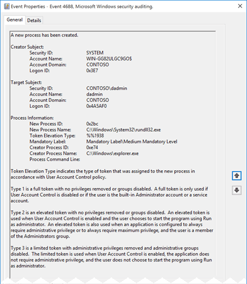
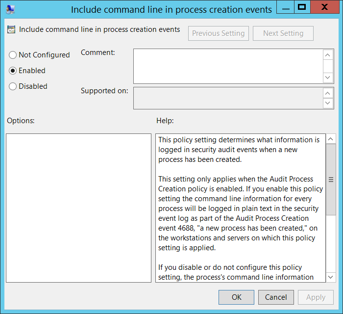

# 4688(S): 新しいプロセスが作成されました。(Windows 10)




***サブカテゴリ:***&nbsp;[プロセス作成の監査](audit-process-creation.md)

***イベントの説明:***

このイベントは新しいプロセスが開始されるたびに生成されます。

> [Note]
> 推奨事項については、このイベントの[セキュリティ監視の推奨事項](#security-monitoring-recommendations)を参照してください。

<br clear="all">

***イベント XML:***
```
- <Event xmlns="http://schemas.microsoft.com/win/2004/08/events/event">
- <System>
 <Provider Name="Microsoft-Windows-Security-Auditing" Guid="{54849625-5478-4994-A5BA-3E3B0328C30D}" /> 
 <EventID>4688</EventID> 
 <Version>2</Version> 
 <Level>0</Level> 
 <Task>13312</Task> 
 <Opcode>0</Opcode> 
 <Keywords>0x8020000000000000</Keywords> 
 <TimeCreated SystemTime="2015-11-12T02:24:52.377352500Z" /> 
 <EventRecordID>2814</EventRecordID> 
 <Correlation /> 
 <Execution ProcessID="4" ThreadID="400" /> 
 <Channel>Security</Channel> 
 <Computer>WIN-GG82ULGC9GO.contoso.local</Computer> 
 <Security /> 
 </System>
- <EventData>
 <Data Name="SubjectUserSid">S-1-5-18</Data> 
 <Data Name="SubjectUserName">WIN-GG82ULGC9GO$</Data> 
 <Data Name="SubjectDomainName">CONTOSO</Data> 
 <Data Name="SubjectLogonId">0x3e7</Data> 
 <Data Name="NewProcessId">0x2bc</Data> 
 <Data Name="NewProcessName">C:\\Windows\\System32\\rundll32.exe</Data> 
 <Data Name="TokenElevationType">%%1938</Data> 
 <Data Name="ProcessId">0xe74</Data> 
 <Data Name="CommandLine" /> 
 <Data Name="TargetUserSid">S-1-5-21-1377283216-344919071-3415362939-1104</Data> 
 <Data Name="TargetUserName">dadmin</Data> 
 <Data Name="TargetDomainName">CONTOSO</Data> 
 <Data Name="TargetLogonId">0x4a5af0</Data> 
 <Data Name="ParentProcessName">C:\\Windows\\explorer.exe</Data> 
 <Data Name="MandatoryLabel">S-1-16-8192</Data> 
 </EventData>
</Event>
```

***必要なサーバー役割:*** なし。

***最小 OS バージョン:*** Windows Server 2008, Windows Vista。

***イベントバージョン:***

-   0 - Windows Server 2008, Windows Vista。

-   1 - Windows Server 2012 R2, Windows 8.1。

    -   「プロセスコマンドライン」フィールドが追加されました。

-   2 - Windows 10。

    -   **Subject** が **Creator Subject** に改名されました。

    -   「**Target Subject**」セクションが追加されました。

    -   「**Mandatory Label**」フィールドが追加されました。

    -   「**Creator Process Name**」フィールドが追加されました。

***フィールドの説明:***

**Creator Subject** \[バージョン0および1の値 – **Subject**\]**:**

-   **セキュリティID** \[タイプ = SID\]**:** 「プロセス作成」操作を要求したアカウントのSID。イベントビューアーは自動的にSIDを解決し、アカウント名を表示しようとします。SIDが解決できない場合、イベントにはソースデータが表示されます。

> [Note]
> **セキュリティ識別子 (SID)** は、トラスティ（セキュリティプリンシパル）を識別するために使用される可変長の一意の値です。各アカウントには、Active Directoryドメインコントローラーなどの権限によって発行され、セキュリティデータベースに保存される一意のSIDがあります。ユーザーがログオンするたびに、システムはデータベースからそのユーザーのSIDを取得し、そのユーザーのアクセストークンに配置します。システムはアクセストークン内のSIDを使用して、Windowsセキュリティとのすべての後続のやり取りでユーザーを識別します。SIDがユーザーまたはグループの一意の識別子として使用された場合、それは他のユーザーまたはグループを識別するために再び使用されることはありません。SIDの詳細については、[セキュリティ識別子](/windows/access-protection/access-control/security-identifiers)を参照してください。

-   **アカウント名** \[タイプ = UnicodeString\]**:** "プロセス作成"操作を要求したアカウントの名前。

-   **アカウントドメイン** \[タイプ = UnicodeString\]**:** サブジェクトのドメインまたはコンピュータ名。形式は以下のように異なります：

    -   ドメインのNETBIOS名の例: CONTOSO

    -   小文字の完全ドメイン名: contoso.local

    -   大文字の完全ドメイン名: CONTOSO.LOCAL

    -   一部の[既知のセキュリティプリンシパル](/windows/security/identity-protection/access-control/security-identifiers)の場合、例えばLOCAL SERVICEやANONYMOUS LOGON、このフィールドの値は "NT AUTHORITY" です。

    -   ローカルユーザーアカウントの場合、このフィールドにはこのアカウントが属するコンピュータまたはデバイスの名前が含まれます。例えば: "Win81"。

-   **ログオンID** \[タイプ = HexInt64\]**:** 16進数の値で、同じログオンIDを含む最近のイベントとこのイベントを関連付けるのに役立ちます。例えば、"[4624](event-4624.md): アカウントが正常にログオンされました。"。

**ターゲットサブジェクト** \[バージョン 2\]**:**

> [Note]
> このイベントにはプロセス作成者のプリンシパルが含まれますが、ターゲットコンテキストが作成者コンテキストと異なる場合には十分ではありません。その場合、プロセス終了イベントで指定されたサブジェクトは、プロセス作成イベントのサブジェクトと一致しませんが、両方のイベントが同じプロセスIDを参照しているにもかかわらずです。したがって、プロセスの作成者に加えて、作成者とターゲットが同じログオンを共有していない場合にはターゲットプリンシパルも含めます。

-   **セキュリティID** \[タイプ = SID\] \[バージョン 2\]**:** ターゲットアカウントのSID。イベントビューアは自動的にSIDを解決し、アカウント名を表示しようとします。SIDが解決できない場合、イベントにはソースデータが表示されます。

> [Note]
> **セキュリティ識別子 (SID)** は、トラスティ（セキュリティプリンシパル）を識別するために使用される可変長の一意の値です。各アカウントには、Active Directoryドメインコントローラーなどの権限によって発行され、セキュリティデータベースに保存される一意のSIDがあります。ユーザーがログオンするたびに、システムはデータベースからそのユーザーのSIDを取得し、そのユーザーのアクセス トークンに配置します。システムは、Windowsセキュリティとのすべての後続のやり取りでユーザーを識別するために、アクセス トークン内のSIDを使用します。ユーザーまたはグループの一意の識別子としてSIDが使用された場合、それは他のユーザーまたはグループを識別するために再利用されることはありません。SIDの詳細については、[セキュリティ識別子](/windows/access-protection/access-control/security-identifiers)を参照してください。

-   **アカウント名** \[タイプ = UnicodeString\] \[バージョン 2\]**:** 対象アカウントの名前。

-   **アカウントドメイン** \[タイプ = UnicodeString\] \[バージョン 2\]**:** 対象アカウントのドメインまたはコンピュータ名。形式は以下のように異なります：

    -   ドメインのNETBIOS名の例: CONTOSO

    -   小文字の完全なドメイン名: contoso.local

    -   大文字の完全なドメイン名: CONTOSO.LOCAL

    -   一部の[既知のセキュリティプリンシパル](/windows/security/identity-protection/access-control/security-identifiers)の場合、例えばLOCAL SERVICEやANONYMOUS LOGON、このフィールドの値は「NT AUTHORITY」となります。

    -   ローカルユーザーアカウントの場合、このフィールドにはこのアカウントが属するコンピュータまたはデバイスの名前が含まれます。例えば: "Win81"。

-   **ログオンID** \[タイプ = HexInt64\] \[バージョン 2\]**:** 16進数の値で、最近のイベントと同じログオンIDを含む可能性のあるイベントとこのイベントを関連付けるのに役立ちます。例えば、"[4624](event-4624.md): アカウントが正常にログオンされました。"。

**プロセス情報:**

-   **新しいプロセスID** \[タイプ = Pointer\]: 新しいプロセスの16進数のプロセスID。プロセスID（PID）は、オペレーティングシステムがアクティブなプロセスを一意に識別するために使用する番号です。特定のプロセスのPIDを確認するには、例えばタスクマネージャー（詳細タブ、PID列）を使用できます：

    

> 16進数の値を10進数に変換すると、タスクマネージャーの値と比較できます。

-   **新しいプロセス名** \[タイプ = UnicodeString\]**:** 新しいプロセスの実行可能ファイルのフルパスと名前。

-   **トークン昇格タイプ** \[タイプ = UnicodeString\]**:**

    -   **%%1936:** タイプ1は、特権が削除されていないかグループが無効になっていない完全なトークンです。完全なトークンは、ユーザーアカウント制御が無効になっている場合、またはユーザーが組み込みの管理者アカウント（デフォルトでUACが無効になっている）、サービスアカウント、またはローカルシステムアカウントである場合にのみ使用されます。

    -   **%%1937:** タイプ2は、特権が削除されていないかグループが無効になっていない昇格されたトークンです。昇格されたトークンは、ユーザーアカウント制御が有効になっていて、ユーザーが「管理者として実行」を使用してプログラムを開始することを選択した場合に使用されます。また、アプリケーションが常に管理者権限を要求するように構成されている場合や、ユーザーが管理者グループのメンバーである場合にも使用されます。

    -   **%%1938:** タイプ3は、管理者権限が削除され、管理者グループが無効化された限定トークンです。限定トークンは、ユーザーアカウント制御が有効で、アプリケーションが管理者権限を必要とせず、ユーザーが「管理者として実行」を選択しない場合に使用されます。

-   **Mandatory Label** \[Version 2\] \[Type = SID\]**:** 新しいプロセスに割り当てられた[整合性ラベル](/windows/win32/secauthz/mandatory-integrity-control)のSID。以下のいずれかの値を持つことができます:

| SID          | RID        | RIDラベル                                    | 意味                   |
|--------------|------------|----------------------------------------------|------------------------|
| S-1-16-0     | 0x00000000 | SECURITY\_MANDATORY\_UNTRUSTED\_RID          | 信頼されていない。     |
| S-1-16-4096  | 0x00001000 | SECURITY\_MANDATORY\_LOW\_RID                | 低整合性。             |
| S-1-16-8192  | 0x00002000 | SECURITY\_MANDATORY\_MEDIUM\_RID             | 中整合性。             |
| S-1-16-8448  | 0x00002100 | SECURITY\_MANDATORY\_MEDIUM\_PLUS\_RID       | 中高整合性。           |
| S-1-16-12288 | 0X00003000 | SECURITY\_MANDATORY\_HIGH\_RID               | 高整合性。             |
| S-1-16-16384 | 0x00004000 | SECURITY\_MANDATORY\_SYSTEM\_RID             | システム整合性。       |
| S-1-16-20480 | 0x00005000 | SECURITY\_MANDATORY\_PROTECTED\_PROCESS\_RID | 保護されたプロセス。   |

-   **Creator Process ID** \[Type = Pointer\]**:** 新しいプロセスを実行したプロセスの16進数のプロセスID。この16進数の値を10進数に変換すると、タスクマネージャーの値と比較できます。

> このプロセスIDを他のイベントのプロセスIDと関連付けることもできます。例えば、"[4688](event-4688.md): 新しいプロセスが作成されました" **Process Information\\New Process ID**。

-   **Creator Process Name** \[Version 2\] \[Type = UnicodeString\]**:** プロセスの実行ファイルのフルパスと名前。

-   **Process Command Line** \[Version 1, 2\] \[Type = UnicodeString\]**:** 実行ファイルの名前と渡された引数を含みます。プロセス作成イベントにコマンドラインを含めるには、"Administrative Templates\\System\\Audit Process Creation\\Include command line in process creation events" グループポリシーを有効にする必要があります:

    

    デフォルトでは、**Process Command Line** フィールドは空です。

## セキュリティ監視の推奨事項

4688(S): 新しいプロセスが作成されました。

| **必要な監視の種類**                                                                                                                                                                                                                                                                                   | **推奨事項**                                                                                                                                                                                                       |
|-------------------------------------------------------------------------------------------------------------------------------------------------------------------------------------------------------------------------------------------------------------------------------------------------------------------|--------------------------------------------------------------------------------------------------------------------------------------------------------------------------------------------------------------------------|
| **高価値アカウント**: 各アクションを監視する必要がある高価値のドメインまたはローカルアカウントがあるかもしれません。<br>高価値アカウントの例としては、データベース管理者、組み込みのローカル管理者アカウント、ドメイン管理者、サービスアカウント、ドメインコントローラーアカウントなどがあります。 | 高価値アカウントに対応する**"Creator Subject\\Security ID"**または**"Target Subject\\Security ID"**を持つすべてのイベントを監視します。                                                              |
| **異常または悪意のある行動**: 異常を検出したり、潜在的な悪意のある行動を監視するための特定の要件があるかもしれません。例えば、勤務時間外のアカウント使用を監視する必要があるかもしれません。                                                                                | 異常または悪意のある行動を監視する際には、特定のアカウントがどのようにまたはいつ使用されているかを監視するために、**"Creator Subject\\Security ID"**または**"Target Subject\\Security ID"**（他の情報と共に）を使用します。 |
| **非アクティブアカウント**: 非アクティブ、無効、またはゲストアカウント、その他使用されるべきでないアカウントがあるかもしれません。                                                                                                                                                                                     | 使用されるべきでないアカウントに対応する**"Creator Subject\\Security ID"**または**"Target Subject\\Security ID"**を持つすべてのイベントを監視します。                                                          |
| **アカウントの許可リスト**: 特定のイベントに対応するアクションを実行することが許可されているアカウントの特定の許可リストがあるかもしれません。                                                                                                                                                      | このイベントが「許可リストのみ」のアクションに対応する場合、許可リスト外のアカウントについて**"Creator Subject\\Security ID"**および**"Target Subject\\Security ID"**を確認します。                                 |
| **異なる種類のアカウント**: 特定のアクションが特定のアカウント種類（例えば、ローカルまたはドメインアカウント、マシンまたはユーザーアカウント、ベンダーまたは従業員アカウントなど）によってのみ実行されることを確認したいかもしれません。                                                                                 | このイベントが特定のアカウント種類に対して監視したいアクションに対応する場合、アカウント種類が期待通りであるかどうかを確認するために**"Creator Subject\\Security ID"**または**"Target Subject\\Security ID"**を確認します。 |
| **外部アカウント**: 別のドメインからのアカウントや、特定のアクション（特定のイベントで表される）を実行することが許可されていない「外部」アカウントを監視しているかもしれません。                                                                                                                     | 別のドメインからのアカウントや「外部」アカウントに対応する**"Creator Subject\\Security ID"**または**"Target Subject\\Security ID"**の特定のイベントを監視します。                                        |
| **使用制限のあるコンピューターやデバイス**: 特定の人（アカウント）が通常はアクションを実行すべきでない特定のコンピューター、マシン、またはデバイスがあるかもしれません。                                                                                                                                      | 懸念されるアクションを実行する**"Creator Subject\\Security ID"**または**"Target Subject\\Security ID"**について、対象の**コンピューター:**（または他の対象デバイス）を監視します。                             |
| **アカウント命名規則**: 組織にはアカウント名に関する特定の命名規則があるかもしれません。                                                                                                                                                                                                       | 命名規則に従わない名前について**"Creator Subject\\Security ID"**または**"Target Subject\\Security ID"**を監視します。                                                                                     |

- このイベントで報告されたプロセスに対して、事前に定義された "**New** **Process Name**" または **"Creator Process Name**" がある場合、**New** **Process Name** または **"Creator Process Name**" が定義された値と異なるすべてのイベントを監視します。

- "**New** **Process Name**" または **"Creator Process Name**" が標準フォルダー（例えば、**System32** や **Program Files** ではない）にないか、制限されたフォルダー（例えば、**Temporary Internet Files**）にあるかを監視することができます。

- プロセス名に制限されたサブストリングや単語（例えば "**mimikatz**" や "**cain.exe**"）のリストが事前に定義されている場合、これらのサブストリングが "**New** **Process Name**" または **"Creator Process Name**" に含まれているかを確認します。

- **Creator Subject\\Security ID** または **Target** **Subject\\Security ID** にローカルアカウントを使用してプロセスが実行されるのは異常な場合があります。

- **Subject\\Security ID** に実際のユーザーアカウントがリストされている場合、例えば **Account Name** に $ 記号が含まれていない場合、**Token Elevation Type** の値 **%%1936** を監視します。通常、これは何らかの理由でこのアカウントのUACが無効になっていることを意味します。

- 標準的なワークステーションで、**Subject\\Security ID** に実際のユーザーアカウントがリストされている場合、例えば **Account Name** に $ 記号が含まれていない場合、**Token Elevation Type** の値 **%%1937** を監視します。これは、ユーザーが管理者権限を使用してプログラムを実行したことを意味します。

- 標準的なワークステーションで、コンピュータオブジェクトがプロセスを実行するために使用されたが、そのコンピュータオブジェクトがイベントが発生したコンピュータと同じでない場合、**Token Elevation Type** の値 **%%1937** を監視することもできます。

- 特定のMandatory Label（例えば、S-1-16-20480（保護されたプロセス））を持つすべての新しいプロセスを監視する必要がある場合、このイベントの "**Mandatory Label**" を確認します。
