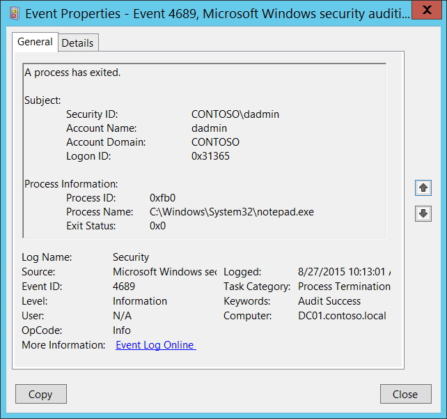

# 4689(S): プロセスが終了しました。



***サブカテゴリ:***&nbsp;[プロセス終了の監査](audit-process-termination.md)

***イベントの説明:***

このイベントはプロセスが終了するたびに生成されます。

> **注**&nbsp;&nbsp;推奨事項については、このイベントの[セキュリティ監視の推奨事項](#security-monitoring-recommendations)を参照してください。

<br clear="all">

***イベント XML:***
```xml
- <Event xmlns="http://schemas.microsoft.com/win/2004/08/events/event">
- <System>
 <Provider Name="Microsoft-Windows-Security-Auditing" Guid="{54849625-5478-4994-A5BA-3E3B0328C30D}" /> 
 <EventID>4689</EventID> 
 <Version>0</Version> 
 <Level>0</Level> 
 <Task>13313</Task> 
 <Opcode>0</Opcode> 
 <Keywords>0x8020000000000000</Keywords> 
 <TimeCreated SystemTime="2015-08-27T17:13:01.826339500Z" /> 
 <EventRecordID>187030</EventRecordID> 
 <Correlation /> 
 <Execution ProcessID="4" ThreadID="144" /> 
 <Channel>Security</Channel> 
 <Computer>DC01.contoso.local</Computer> 
 <Security /> 
 </System>
- <EventData>
 <Data Name="SubjectUserSid">S-1-5-21-3457937927-2839227994-823803824-1104</Data> 
 <Data Name="SubjectUserName">dadmin</Data> 
 <Data Name="SubjectDomainName">CONTOSO</Data> 
 <Data Name="SubjectLogonId">0x31365</Data> 
 <Data Name="Status">0x0</Data> 
 <Data Name="ProcessId">0xfb0</Data> 
 <Data Name="ProcessName">C:\\Windows\\System32\\notepad.exe</Data> 
 </EventData>
 </Event>

```

***必要なサーバー役割:*** なし。

***最小 OS バージョン:*** Windows Server 2008, Windows Vista。

***イベントバージョン:*** 0。

***フィールドの説明:***

**サブジェクト:**

-   **セキュリティ ID** \[タイプ = SID\]**:** 「プロセス終了」操作を要求したアカウントのSID。イベントビューアーは自動的にSIDを解決し、アカウント名を表示しようとします。SIDが解決できない場合、イベントにはソースデータが表示されます。

> **注**&nbsp;&nbsp;**セキュリティ識別子 (SID)** は、トラスティ (セキュリティプリンシパル) を識別するために使用される可変長の一意の値です。各アカウントには、Active Directoryドメインコントローラーなどの権限によって発行され、セキュリティデータベースに保存される一意のSIDがあります。ユーザーがログオンするたびに、システムはデータベースからそのユーザーのSIDを取得し、そのユーザーのアクセストークンに配置します。システムはアクセストークン内のSIDを使用して、以降のすべてのWindowsセキュリティとのやり取りでユーザーを識別します。SIDがユーザーまたはグループの一意の識別子として使用された場合、それは他のユーザーまたはグループを識別するために再利用されることはありません。SIDの詳細については、[セキュリティ識別子](/windows/access-protection/access-control/security-identifiers)を参照してください。

-   **アカウント名** \[型 = UnicodeString\]**:** 「プロセス終了」操作を要求したアカウントの名前。

-   **アカウントドメイン** \[型 = UnicodeString\]**:** サブジェクトのドメインまたはコンピュータ名。形式はさまざまで、以下のようなものが含まれます：

    -   ドメイン NETBIOS 名の例: CONTOSO

    -   小文字の完全ドメイン名: contoso.local

    -   大文字の完全ドメイン名: CONTOSO.LOCAL

    -   LOCAL SERVICE や ANONYMOUS LOGON などの[よく知られたセキュリティプリンシパル](/windows/security/identity-protection/access-control/security-identifiers)の場合、このフィールドの値は「NT AUTHORITY」となります。

    -   ローカルユーザーアカウントの場合、このフィールドにはこのアカウントが属するコンピュータまたはデバイスの名前が含まれます。例: 「Win81」。

-   **ログオンID** \[型 = HexInt64\]**:** 同じログオンIDを含む最近のイベントとこのイベントを関連付けるのに役立つ16進数の値。例: “[4624](event-4624.md): アカウントが正常にログオンされました。”

**プロセス情報:**

-   **プロセスID** \[型 = Pointer\]: 終了/終了したプロセスの16進数のプロセスID。プロセスID (PID) は、オペレーティングシステムがアクティブなプロセスを一意に識別するために使用する番号です。特定のプロセスのPIDを確認するには、例えばタスクマネージャー（詳細タブ、PID列）を使用します：

    

    16進数の値を10進数に変換すると、タスクマネージャーの値と比較することができます。

    また、このプロセスIDを他のイベントのプロセスIDと関連付けることもできます。例: “[4688](event-4688.md)(S): 新しいプロセスが作成されました” **新しいプロセスID** このコンピュータ上で。

-   **プロセス名** \[型 = UnicodeString\]**:** 終了/終了したプロセスのフルパスと実行可能ファイル名。

-   **終了ステータス** \[型 = HexInt32\]**:** 終了/終了したプロセスの16進数の終了コード。この終了コードは各アプリケーションに固有であり、詳細はアプリケーションのドキュメントを確認してください。プロセスの終了コードの値は、そのプロセスのためにアプリケーション開発者が実装した特定の規約を反映しています。

## セキュリティ監視の推奨事項

4689(S): プロセスが終了しました。

> **重要**&nbsp;&nbsp;このイベントについては、[付録A: 多くの監査イベントに対するセキュリティ監視の推奨事項](appendix-a-security-monitoring-recommendations-for-many-audit-events.md)も参照してください。

-   このイベントで報告されたプロセスに対して事前に定義された「**プロセス名**」がある場合、その定義された値と異なる「**プロセス名**」を持つすべてのイベントを監視します。

-   「**プロセス名**」が標準フォルダー（例えば、**System32** や **Program Files**）にないか、制限されたフォルダー（例えば、**Temporary Internet Files**）にあるかを監視することができます。

-   プロセス名に含まれる制限された部分文字列や単語の事前定義リストがある場合（例えば、「**mimikatz**」や「**cain.exe**」）、これらの部分文字列が「**プロセス名**」に含まれているかを確認します。

-   コンピューターの重要なプロセスリストがあり、これらのプロセスが常に実行されて停止しないことが要求される場合、[4689](event-4689.md) イベントの **プロセス名** フィールドでこれらのプロセス名を監視することができます。
