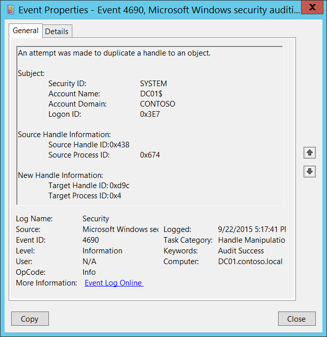

# 4690(S): オブジェクトへのハンドルを複製しようとしました。



***サブカテゴリ:***&nbsp;[ハンドル操作の監査](audit-handle-manipulation.md)

***イベントの説明:***

このイベントは、オブジェクトへのハンドルを複製しようとした場合に生成されます。

> **注**&nbsp;&nbsp;推奨事項については、このイベントの[セキュリティ監視の推奨事項](#security-monitoring-recommendations)を参照してください。

<br clear="all">

***イベント XML:***
```xml
- <Event xmlns="http://schemas.microsoft.com/win/2004/08/events/event">
- <System>
 <Provider Name="Microsoft-Windows-Security-Auditing" Guid="{54849625-5478-4994-A5BA-3E3B0328C30D}" /> 
 <EventID>4690</EventID> 
 <Version>0</Version> 
 <Level>0</Level> 
 <Task>12807</Task> 
 <Opcode>0</Opcode> 
 <Keywords>0x8020000000000000</Keywords> 
 <TimeCreated SystemTime="2015-09-23T00:17:41.755998800Z" /> 
 <EventRecordID>338632</EventRecordID> 
 <Correlation /> 
 <Execution ProcessID="4" ThreadID="1100" /> 
 <Channel>Security</Channel> 
 <Computer>DC01.contoso.local</Computer> 
 <Security /> 
 </System>
- <EventData>
 <Data Name="SubjectUserSid">S-1-5-18</Data> 
 <Data Name="SubjectUserName">DC01$</Data> 
 <Data Name="SubjectDomainName">CONTOSO</Data> 
 <Data Name="SubjectLogonId">0x3e7</Data> 
 <Data Name="SourceHandleId">0x438</Data> 
 <Data Name="SourceProcessId">0x674</Data> 
 <Data Name="TargetHandleId">0xd9c</Data> 
 <Data Name="TargetProcessId">0x4</Data> 
 </EventData>
 </Event>

```

***必要なサーバー役割:*** なし。

***最小 OS バージョン:*** Windows Server 2008, Windows Vista。

***イベントバージョン:*** 0。

***フィールドの説明:***

**サブジェクト:**

-   **セキュリティ ID** \[タイプ = SID\]**:** オブジェクトへのハンドルを複製しようとしたアカウントの SID。イベントビューアーは自動的に SID を解決し、アカウント名を表示しようとします。SID を解決できない場合、イベントにソースデータが表示されます。

> **注**&nbsp;&nbsp;**セキュリティ識別子 (SID)** は、トラスティ (セキュリティプリンシパル) を識別するために使用される可変長の一意の値です。各アカウントには、Active Directory ドメインコントローラーなどの権限によって発行され、セキュリティデータベースに保存される一意の SID があります。ユーザーがログオンするたびに、システムはデータベースからそのユーザーの SID を取得し、そのユーザーのアクセス トークンに配置します。システムは、アクセス トークン内の SID を使用して、以降のすべての Windows セキュリティとのやり取りでユーザーを識別します。SID がユーザーまたはグループの一意の識別子として使用された場合、それは他のユーザーまたはグループを識別するために再利用されることはありません。SID の詳細については、[セキュリティ識別子](/windows/access-protection/access-control/security-identifiers)を参照してください。

-   **アカウント名** \[タイプ = UnicodeString\]**:** オブジェクトのハンドルを複製しようとしたアカウントの名前。

-   **アカウントドメイン** \[タイプ = UnicodeString\]**:** サブジェクトのドメインまたはコンピュータ名。形式はさまざまで、以下のようなものが含まれます：

    -   ドメイン NETBIOS 名の例: CONTOSO

    -   小文字の完全なドメイン名: contoso.local

    -   大文字の完全なドメイン名: CONTOSO.LOCAL

    -   LOCAL SERVICE や ANONYMOUS LOGON などの[よく知られたセキュリティプリンシパル](/windows/security/identity-protection/access-control/security-identifiers)の場合、このフィールドの値は「NT AUTHORITY」となります。

    -   ローカルユーザーアカウントの場合、このフィールドにはこのアカウントが属するコンピュータまたはデバイスの名前が含まれます。例: “Win81”。

-   **ログオンID** \[タイプ = HexInt64\]**:** 16進数の値で、同じログオンIDを含む最近のイベントとこのイベントを関連付けるのに役立ちます。例: “[4624](event-4624.md): アカウントが正常にログオンされました。”

**ソースハンドル情報:**

-   **ソースハンドルID** \[タイプ = ポインタ\]: 複製されたハンドルの16進数値。このフィールドは、他のイベントとこのイベントを関連付けるのに役立ちます。例: [監査ファイルシステム](audit-file-system.md)、[監査カーネルオブジェクト](audit-kernel-object.md)、[監査レジストリ](audit-registry.md)、[監査リムーバブルストレージ](audit-removable-storage.md)、または[監査SAM](audit-sam.md)のサブカテゴリの「4663: オブジェクトにアクセスしようとしました」。

-   **ソースプロセスID** \[タイプ = ポインタ\]: 複製される前に**ソースハンドルID**を開いたプロセスの16進数のプロセスID。プロセスID (PID) は、オペレーティングシステムがアクティブなプロセスを一意に識別するために使用する番号です。特定のプロセスのPIDを確認するには、例えばタスクマネージャー（詳細タブ、PID列）を使用できます：

    

    16進数の値を10進数に変換すると、タスクマネージャーの値と比較できます。

    また、このプロセスIDを他のイベントのプロセスIDと関連付けることもできます。例: “[4688](event-4688.md): 新しいプロセスが作成されました” **プロセス情報\\新しいプロセスID**。

**新しいハンドル情報:**

-   **ターゲットハンドルID** \[タイプ = ポインタ\]: 新しいハンドルの16進数値（**ソースハンドルID**のコピー）。このフィールドは、他のイベントとこのイベントを関連付けるのに役立ちます。例えば、[監査ファイルシステム](audit-file-system.md)、[監査カーネルオブジェクト](audit-kernel-object.md)、[監査レジストリ](audit-registry.md)、[監査リムーバブルストレージ](audit-removable-storage.md) または [監査SAM](audit-sam.md) のサブカテゴリで「4663: オブジェクトにアクセスしようとしました」というイベントと関連付けることができます。

-   **ターゲットプロセスID** \[タイプ = ポインタ\]: **ターゲットハンドルID**を開いたプロセスの16進数のプロセスID。プロセスID（PID）は、オペレーティングシステムがアクティブなプロセスを一意に識別するために使用する番号です。このプロセスIDを他のイベントのプロセスIDと関連付けることもできます。例えば、「[4688](event-4688.md): 新しいプロセスが作成されました」**プロセス情報\\新しいプロセスID**フィールド。

## セキュリティ監視の推奨事項

4690(S): オブジェクトへのハンドルを複製しようとしました。

-   通常、このイベントはセキュリティにほとんど関係がなく、解析や分析が難しいです。このイベントに対する推奨事項はありませんが、何を監視する必要があるかを正確に把握している場合を除きます。

-   このイベントは、特定のオブジェクトハンドルに関連するすべてのアクションや操作を追跡するために使用できます。
