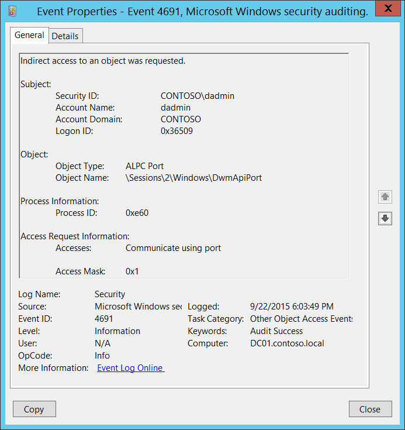

# 4691(S): オブジェクトへの間接アクセスが要求されました。



***サブカテゴリ:***&nbsp;[他のオブジェクト アクセス イベントの監査](audit-other-object-access-events.md)

***イベントの説明:***

このイベントは、オブジェクトへの間接アクセスが要求されたことを示します。

これらのイベントは、[ALPC ポート](/windows/win32/etw/alpc) アクセス要求アクションに対して生成されます。

> **注**&nbsp;&nbsp;推奨事項については、このイベントの[セキュリティ監視の推奨事項](#security-monitoring-recommendations)を参照してください。

<br clear="all">

***イベント XML:***
```xml
- <Event xmlns="http://schemas.microsoft.com/win/2004/08/events/event">
- <System>
 <Provider Name="Microsoft-Windows-Security-Auditing" Guid="{54849625-5478-4994-A5BA-3E3B0328C30D}" /> 
 <EventID>4691</EventID> 
 <Version>0</Version> 
 <Level>0</Level> 
 <Task>12804</Task> 
 <Opcode>0</Opcode> 
 <Keywords>0x8020000000000000</Keywords> 
 <TimeCreated SystemTime="2015-09-23T01:03:49.834912100Z" /> 
 <EventRecordID>344382</EventRecordID> 
 <Correlation /> 
 <Execution ProcessID="4" ThreadID="2928" /> 
 <Channel>Security</Channel> 
 <Computer>DC01.contoso.local</Computer> 
 <Security /> 
 </System>
- <EventData>
 <Data Name="SubjectUserSid">S-1-5-21-3457937927-2839227994-823803824-1104</Data> 
 <Data Name="SubjectUserName">dadmin</Data> 
 <Data Name="SubjectDomainName">CONTOSO</Data> 
 <Data Name="SubjectLogonId">0x36509</Data> 
 <Data Name="ObjectType">ALPC Port</Data> 
 <Data Name="ObjectName">\\Sessions\\2\\Windows\\DwmApiPort</Data> 
 <Data Name="AccessList">%%4464</Data> 
 <Data Name="AccessMask">0x1</Data> 
 <Data Name="ProcessId">0xe60</Data> 
 </EventData>
 </Event>

```

***必要なサーバー ロール:*** なし。

***最小 OS バージョン:*** Windows Server 2008、Windows Vista。

***イベント バージョン:*** 0。

***フィールドの説明:***

**サブジェクト:**

-   **セキュリティ ID** \[タイプ = SID\]**:** オブジェクトへのアクセスを要求したアカウントの SID。イベント ビューアーは自動的に SID を解決し、アカウント名を表示しようとします。SID を解決できない場合は、イベントにソース データが表示されます。

> **注**&nbsp;&nbsp;**セキュリティ識別子 (SID)** は、トラスティ (セキュリティ プリンシパル) を識別するために使用される可変長の一意の値です。各アカウントには、Active Directory ドメイン コントローラーなどの権限によって発行され、セキュリティ データベースに保存される一意の SID があります。ユーザーがログオンするたびに、システムはデータベースからそのユーザーの SID を取得し、そのユーザーのアクセス トークンに配置します。システムは、アクセス トークン内の SID を使用して、以降のすべての Windows セキュリティとのやり取りでユーザーを識別します。SID がユーザーまたはグループの一意の識別子として使用された場合、それが再び別のユーザーまたはグループを識別するために使用されることはありません。SID の詳細については、[セキュリティ識別子](/windows/access-protection/access-control/security-identifiers)を参照してください。

-   **アカウント名** \[タイプ = UnicodeString\]**:** オブジェクトへのアクセスを要求したアカウントの名前。

-   **アカウントドメイン** \[タイプ = UnicodeString\]**:** サブジェクトのドメインまたはコンピュータ名。形式はさまざまで、以下を含みます：

    -   ドメイン NETBIOS 名の例: CONTOSO

    -   小文字の完全ドメイン名: contoso.local

    -   大文字の完全ドメイン名: CONTOSO.LOCAL

    -   一部の[よく知られたセキュリティプリンシパル](/windows/security/identity-protection/access-control/security-identifiers)の場合、例えば LOCAL SERVICE や ANONYMOUS LOGON、このフィールドの値は “NT AUTHORITY” です。

    -   ローカルユーザーアカウントの場合、このフィールドにはこのアカウントが属するコンピュータまたはデバイスの名前が含まれます。例えば: “Win81”。

-   **ログオンID** \[タイプ = HexInt64\]**:** 16進数の値で、同じログオンIDを含む最近のイベントとこのイベントを関連付けるのに役立ちます。例えば、 “[4624](event-4624.md): アカウントが正常にログオンされました。”

**オブジェクト**:

-   **オブジェクトタイプ** \[タイプ = UnicodeString\]: アクセスが要求されたオブジェクトのタイプ。

    以下の表には、最も一般的な**オブジェクトタイプ**のリストが含まれています：

| ディレクトリ           | イベント      | タイマー            | デバイス      |
|-------------------------|--------------|----------------------|--------------|
| ミュータント            | タイプ        | ファイル             | トークン      |
| スレッド                | セクション    | ウィンドウステーション | デバッグオブジェクト |
| フィルター通信ポート    | イベントペア  | ドライバー           | IoCompletion |
| コントローラー          | シンボリックリンク | WmiGuid              | プロセス      |
| プロファイル            | デスクトップ  | キードイベント       | アダプター    |
| キー                    | 待機可能ポート | コールバック         | セマフォ      |
| ジョブ                  | ポート        | フィルター接続ポート | ALPC ポート   |

-   **オブジェクト名** \[タイプ = UnicodeString\]: アクセスが要求されたオブジェクトのフルパスと名前。

**プロセス情報**:

-   **プロセスID** \[タイプ = ポインタ\]: アクセスが要求されたプロセスの16進数のプロセスID。プロセスID (PID) は、オペレーティングシステムがアクティブなプロセスを一意に識別するために使用する番号です。特定のプロセスのPIDを確認するには、例えばタスクマネージャー（詳細タブ、PID列）を使用できます。

    

    16進数の値を10進数に変換すると、タスクマネージャーの値と比較することができます。

    また、このプロセスIDを他のイベントのプロセスIDと関連付けることもできます。例えば、「[4688](event-4688.md): 新しいプロセスが作成されました」**プロセス情報\\新しいプロセスID**。

**アクセス要求情報:**

-   **アクセス** \[タイプ = UnicodeString\]: **サブジェクト\\セキュリティID**によって要求されたアクセス権のリスト。これらのアクセス権は**オブジェクトタイプ**に依存します。[ファイルアクセスコードの表](/windows/security/threat-protection/auditing/event-5145#table-of-file-access-codes)には、ファイルシステムオブジェクトの最も一般的なアクセス権に関する情報が含まれています。ALPCポートのアクセス権に関する情報については、<https://technet.microsoft.com/>または他の情報リソースを使用してください。

-   **アクセスマスク** \[タイプ = HexInt32\]: 要求または実行された操作の16進数マスク。ファイルアクセス権に関する詳細については、[ファイルアクセスコードの表](/windows/security/threat-protection/auditing/event-5145#table-of-file-access-codes)を参照してください。ALPCポートのアクセス権に関する情報については、<https://technet.microsoft.com/>または他の情報リソースを使用してください。

## セキュリティ監視の推奨事項

4691(S): オブジェクトへの間接アクセスが要求されました。

-   通常、このイベントはセキュリティ関連性がほとんどなく、解析や分析が難しいです。ALPCポートで監視する必要がある場合を除き、このイベントに対する推奨事項はありません。
