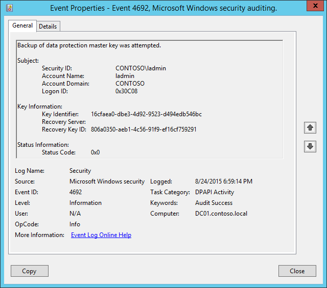

# 4692(S, F): データ保護マスターキーのバックアップが試みられました。




***サブカテゴリ:***&nbsp;[DPAPI アクティビティの監査](audit-dpapi-activity.md)

***イベントの説明:***

このイベントは、[DPAPI](/previous-versions/ms995355(v=msdn.10)) マスターキーのバックアップが試みられるたびに生成されます。

コンピューターがドメインのメンバーである場合、DPAPIにはデータの保護解除を可能にするバックアップメカニズムがあります。マスターキーが生成されると、DPAPIはドメインコントローラーと通信します。ドメインコントローラーは、DPAPIにのみ関連付けられたドメイン全体の公開/秘密鍵ペアを持っています。ローカルのDPAPIクライアントは、相互認証およびプライバシー保護されたRPC呼び出しを使用して、ドメインコントローラーからドメインコントローラーの公開鍵を取得します。クライアントはドメインコントローラーの公開鍵でマスターキーを暗号化します。その後、このバックアップマスターキーをユーザーのパスワードで保護されたマスターキーと共に保存します。

定期的に、ドメインに参加しているマシンは、ユーザーのパスワードをリセットする必要がある場合に秘密を回復できるように、ユーザーのマスターキーをバックアップするためにドメインコントローラーにRPCリクエストを送信しようとします。ユーザーのキーはユーザープロファイルに保存されますが、マスターキーをドメイン回復キーで暗号化するためにドメインコントローラーに連絡する必要があります。

このイベントは、新しいDPAPIマスターキーが生成されるたびにも生成されます。

このイベントは、ドメインコントローラー、メンバーサーバー、およびワークステーションで生成されます。

失敗イベントは、何らかの理由でマスターキーのバックアップ操作が失敗した場合に生成されます。

> **注**&nbsp;&nbsp;推奨事項については、このイベントの[セキュリティ監視の推奨事項](#security-monitoring-recommendations)を参照してください。

<br clear="all">

***イベント XML:***
```xml
- <Event xmlns="http://schemas.microsoft.com/win/2004/08/events/event">
- <System>
 <Provider Name="Microsoft-Windows-Security-Auditing" Guid="{54849625-5478-4994-A5BA-3E3B0328C30D}" /> 
 <EventID>4692</EventID> 
 <Version>0</Version> 
 <Level>0</Level> 
 <Task>13314</Task> 
 <Opcode>0</Opcode> 
 <Keywords>0x8020000000000000</Keywords> 
 <TimeCreated SystemTime="2015-08-25T01:59:14.573672700Z" /> 
 <EventRecordID>176964</EventRecordID> 
 <Correlation /> 
 <Execution ProcessID="520" ThreadID="540" /> 
 <Channel>Security</Channel> 
 <Computer>DC01.contoso.local</Computer> 
 <Security /> 
 </System>
- <EventData>
 <Data Name="SubjectUserSid">S-1-5-21-3457937927-2839227994-823803824-500</Data> 
 <Data Name="SubjectUserName">ladmin</Data> 
 <Data Name="SubjectDomainName">CONTOSO</Data> 
 <Data Name="SubjectLogonId">0x30c08</Data> 
 <Data Name="MasterKeyId">16cfaea0-dbe3-4d92-9523-d494edb546bc</Data> 
 <Data Name="RecoveryServer" /> 
 <Data Name="RecoveryKeyId">806a0350-aeb1-4c56-91f9-ef16cf759291</Data> 
 <Data Name="FailureReason">0x0</Data> 
 </EventData>
 </Event>

```

***必要なサーバー ロール:*** なし。

***最小 OS バージョン:*** Windows Server 2008, Windows Vista。

***イベント バージョン:*** 0。

***フィールドの説明:***

**サブジェクト:**

-   **セキュリティ ID** \[タイプ = SID\]**:** バックアップ操作を要求したアカウントの SID。イベント ビューアーは自動的に SID を解決し、アカウント名を表示しようとします。SID を解決できない場合、イベントにソース データが表示されます。

> **注**&nbsp;&nbsp;**セキュリティ識別子 (SID)** は、トラスティ (セキュリティ プリンシパル) を識別するために使用される可変長の一意の値です。各アカウントには、Active Directory ドメイン コントローラーなどの権限によって発行され、セキュリティ データベースに格納される一意の SID があります。ユーザーがログオンするたびに、システムはデータベースからそのユーザーの SID を取得し、そのユーザーのアクセストークンに配置します。システムはアクセストークン内の SID を使用して、以降のすべての Windows セキュリティとのやり取りでユーザーを識別します。SID がユーザーまたはグループの一意の識別子として使用された場合、それは他のユーザーまたはグループを識別するために再び使用されることはありません。SID の詳細については、[セキュリティ識別子](/windows/access-protection/access-control/security-identifiers) を参照してください。

-   **アカウント名** \[タイプ = UnicodeString\]**:** バックアップ操作を要求したアカウントの名前。

-   **アカウント ドメイン** \[タイプ = UnicodeString\]**:** サブジェクトのドメインまたはコンピューター名。以下は形式の例です:

    -   ドメイン NETBIOS 名の例: CONTOSO

    -   小文字の完全なドメイン名: contoso.local

    -   大文字の完全なドメイン名: CONTOSO.LOCAL

    -   [よく知られたセキュリティ プリンシパル](/windows/security/identity-protection/access-control/security-identifiers) の場合、例えば LOCAL SERVICE や ANONYMOUS LOGON、このフィールドの値は “NT AUTHORITY” です。

    -   ローカル ユーザー アカウントの場合、このフィールドにはこのアカウントが属するコンピューターまたはデバイスの名前が含まれます。例えば: “Win81”。

-   **ログオン ID** \[タイプ = HexInt64\]**:** このイベントを、同じログオン ID を含む可能性のある最近のイベントと関連付けるのに役立つ 16 進数の値。例えば、"[4624](event-4624.md): アカウントが正常にログオンされました。"

**重要な情報:**

-   **キー識別子** \[タイプ = UnicodeString\]: バックアップが作成されたマスターキーの一意の識別子。マスターキーは、追加のデータと共に、DPAPIを使用してデータを暗号化/復号化するための実際の対称セッションキーを生成するために使用されます。すべてのユーザーのマスターキーは、ユーザープロファイル -> %APPDATA%\\Roaming\\Microsoft\\Windows\\Protect\\%SID% フォルダーにあります。各マスターキーファイルの名前はそのIDです。

-   **リカバリーサーバー** \[タイプ = UnicodeString\]: マスターキーをバックアップするために接続したコンピューターの名前（通常はDNS名）。ドメインに参加しているマシンの場合、通常はドメインコントローラーの名前です。このパラメーターはイベントでキャプチャされない場合があり、その場合は空になります。

-   **リカバリーキーID** \[タイプ = UnicodeString\]**:** リカバリーキーの一意の識別子。リカバリーキーは、ユーザーがコントロールパネルからパスワードリセットディスク（PRD）を作成することを選択したとき、または最初のマスターキーが生成されたときに生成されます。最初に、DPAPIはRSA公開/秘密鍵ペアを生成し、これがリカバリーキーとなります。このフィールドには、マスターキーバックアップ操作に使用された一意のリカバリーキーIDが表示されます。

    失敗イベントの場合、このフィールドは通常空です。

**ステータス情報:**

-   **ステータスコード** \[タイプ = HexInt32\]**:** 実行された操作の16進数の一意のステータスコード。成功イベントの場合、このフィールドは通常「**0x0**」です。ステータスコードの意味を確認するには、10進数に変換し、「**net helpmsg STATUS\_CODE**」コマンドを使用して特定のSTATUS\_CODEの説明を確認する必要があります。以下は、ステータスコード0x3Aの「net helpmsg」コマンドの出力例です:

> \[Net helpmsg 58 の例](..images/net-helpmsg-58.png)

## セキュリティ監視の推奨事項

4692(S, F): データ保護マスターキーのバックアップが試行されました。

-   このイベントは通常、情報提供のためのイベントであり、このイベントを使用して悪意のある活動を検出するのは困難です。主にDPAPIのトラブルシューティングに使用されます。

> **重要**&nbsp;&nbsp;このイベントについては、[付録A: 多くの監査イベントに対するセキュリティ監視の推奨事項](appendix-a-security-monitoring-recommendations-for-many-audit-events.md)も参照してください。
