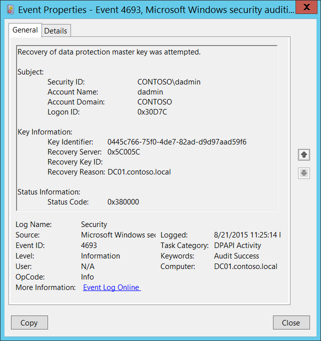

# 4693(S, F): データ保護マスターキーの回復が試みられました。



***サブカテゴリ:***&nbsp;[DPAPI アクティビティの監査](audit-dpapi-activity.md)

***イベントの説明:***

このイベントは、[DPAPI](/previous-versions/ms995355(v=msdn.10)) マスターキーの回復が試みられるたびに生成されます。

データの保護解除中に、DPAPI がユーザーのパスワードで保護されたマスターキーを使用できない場合、バックアップマスターキーを相互認証およびプライバシー保護された RPC コールを使用してドメインコントローラーに送信します。ドメインコントローラーはプライベートキーでマスターキーを復号し、同じ保護された RPC コールを使用してクライアントに返します。この保護された RPC コールは、ネットワーク上で誰もマスターキーを取得できないようにするために使用されます。

このイベントは、ドメインコントローラー、メンバーサーバー、およびワークステーションで生成されます。

マスターキーの復元操作が何らかの理由で失敗した場合、失敗イベントが生成されます。

> **注**&nbsp;&nbsp;推奨事項については、このイベントの[セキュリティ監視の推奨事項](#security-monitoring-recommendations)を参照してください。

<br clear="all">

***イベント XML:***
```xml
- <Event xmlns="http://schemas.microsoft.com/win/2004/08/events/event">
- <System>
 <Provider Name="Microsoft-Windows-Security-Auditing" Guid="{54849625-5478-4994-A5BA-3E3B0328C30D}" /> 
 <EventID>4693</EventID> 
 <Version>0</Version> 
 <Level>0</Level> 
 <Task>13314</Task> 
 <Opcode>0</Opcode> 
 <Keywords>0x8020000000000000</Keywords> 
 <TimeCreated SystemTime="2015-08-22T06:25:14.589407700Z" /> 
 <EventRecordID>175809</EventRecordID> 
 <Correlation /> 
 <Execution ProcessID="520" ThreadID="1340" /> 
 <Channel>Security</Channel> 
 <Computer>DC01.contoso.local</Computer> 
 <Security /> 
 </System>
- <EventData>
 <Data Name="SubjectUserSid">S-1-5-21-3457937927-2839227994-823803824-1104</Data> 
 <Data Name="SubjectUserName">dadmin</Data> 
 <Data Name="SubjectDomainName">CONTOSO</Data> 
 <Data Name="SubjectLogonId">0x30d7c</Data> 
 <Data Name="MasterKeyId">0445c766-75f0-4de7-82ad-d9d97aad59f6</Data> 
 <Data Name="RecoveryReason">0x5c005c</Data> 
 <Data Name="RecoveryServer">DC01.contoso.local</Data> 
 <Data Name="RecoveryKeyId" /> 
 <Data Name="FailureId">0x380000</Data> 
 </EventData>
 </Event>

```

***必要なサーバーロール:*** なし。

***最小 OS バージョン:*** Windows Server 2008, Windows Vista。

***イベントバージョン:*** 0。

***フィールドの説明:***

**サブジェクト:**

-   **セキュリティ ID** \[タイプ = SID\]**:** 「回復」操作を要求したアカウントの SID。イベントビューアーは自動的に SID を解決し、アカウント名を表示しようとします。SID を解決できない場合、イベントにソースデータが表示されます。

> **注**&nbsp;&nbsp;**セキュリティ識別子 (SID)** は、トラスティ (セキュリティプリンシパル) を識別するために使用される可変長の一意の値です。各アカウントには、Active Directory ドメインコントローラーなどの権限によって発行され、セキュリティデータベースに保存される一意の SID があります。ユーザーがログオンするたびに、システムはデータベースからそのユーザーの SID を取得し、そのユーザーのアクセス トークンに配置します。システムは、アクセス トークン内の SID を使用して、Windows セキュリティとのすべての後続のやり取りでユーザーを識別します。SID がユーザーまたはグループの一意の識別子として使用された場合、それは他のユーザーまたはグループを識別するために再び使用されることはありません。SID の詳細については、[セキュリティ識別子](/windows/access-protection/access-control/security-identifiers)を参照してください。

-   **アカウント名** \[タイプ = UnicodeString\]**:** 「回復」操作を要求したアカウントの名前。

-   **アカウントドメイン** \[タイプ = UnicodeString\]**:** サブジェクトのドメインまたはコンピュータ名。形式はさまざまで、以下を含みます：

    -   ドメインのNETBIOS名の例: CONTOSO

    -   小文字の完全なドメイン名: contoso.local

    -   大文字の完全なドメイン名: CONTOSO.LOCAL

    -   LOCAL SERVICEやANONYMOUS LOGONなどの[よく知られたセキュリティプリンシパル](/windows/security/identity-protection/access-control/security-identifiers)の場合、このフィールドの値は「NT AUTHORITY」となります。

    -   ローカルユーザーアカウントの場合、このフィールドにはこのアカウントが属するコンピュータまたはデバイスの名前が含まれます。例: 「Win81」。

-   **ログオンID** \[タイプ = HexInt64\]**:** 16進数の値で、最近のイベントと同じログオンIDを含む可能性のあるイベントとこのイベントを関連付けるのに役立ちます。例: 「[4624](event-4624.md): アカウントが正常にログオンされました。」

**キー情報:**

-   **キー識別子** \[タイプ = UnicodeString\]**:** 回復されたマスターキーの一意の識別子。マスターキーは、追加のデータと共に使用され、DPAPIを使用してデータを暗号化/復号化するための実際の対称セッションキーを生成します。すべてのユーザーのマスターキーはユーザープロファイル -> %APPDATA%\\Roaming\\Microsoft\\Windows\\Protect\\%SID% フォルダーにあります。各マスターキーファイルの名前はそのIDです。

-   **回復サーバー** \[タイプ = UnicodeString\]: マスターキーを回復するために連絡したコンピュータの名前（通常はDNS名）。ドメインに参加しているマシンの場合、通常はドメインコントローラーの名前です。

> **注**&nbsp;&nbsp;このイベントの回復サーバーフィールドには、回復理由フィールドの情報が含まれています。

-   **回復キーID** \[タイプ = UnicodeString\]**:** 回復キーの一意の識別子。回復キーは、ユーザーがコントロールパネルからパスワードリセットディスク（PRD）を作成することを選択したとき、または最初のマスターキーが生成されたときに生成されます。最初に、DPAPIはRSA公開/秘密鍵ペアを生成し、これが回復キーとなります。このフィールドには、マスターキー回復操作に使用された一意の回復キーIDが表示されます。このパラメータはイベントでキャプチャされない場合があり、その場合は空になります。

-   **リカバリ理由** \[タイプ = HexInt32\]: リカバリ理由の16進コード。

> **注**&nbsp;&nbsp;このイベントのリカバリ理由フィールドには、リカバリサーバーフィールドの情報が含まれています。

**ステータス情報:**

-   **ステータスコード** \[タイプ = HexInt32\]**:** 16進の一意のステータスコード。成功イベントの場合、このフィールドは通常「**0x380000**」です。

## セキュリティ監視の推奨事項

4693(S, F): データ保護マスターキーのリカバリが試みられました。

-   このイベントは通常、情報提供のためのイベントであり、このイベントを使用して悪意のある活動を検出するのは難しいです。主にDPAPIのトラブルシューティングに使用されます。

-   ドメインに参加しているコンピュータの場合、**リカバリ理由**は通常、ドメインコントローラのDNS名であるべきです。

> **重要**&nbsp;&nbsp;このイベントについては、[付録A: 多くの監査イベントに対するセキュリティ監視の推奨事項](appendix-a-security-monitoring-recommendations-for-many-audit-events.md)も参照してください。
