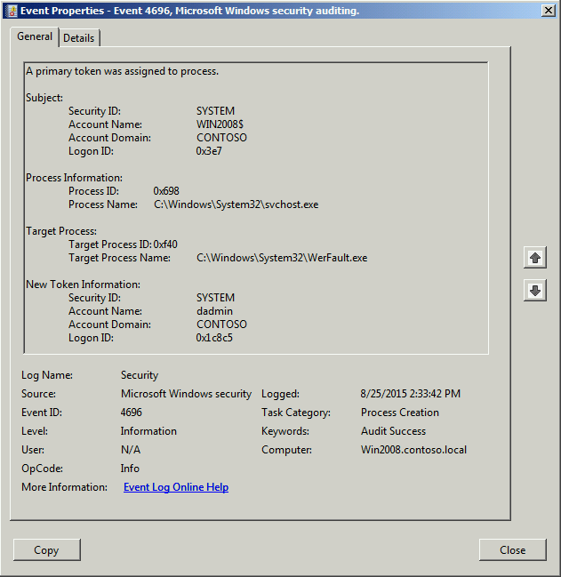

# 4696(S): プライマリ トークンがプロセスに割り当てられました。



***サブカテゴリ:***&nbsp;[プロセス作成の監査](audit-process-creation.md)

***イベントの説明:***

このイベントは、UAC昇格トークン、別のユーザーとして実行するアクション、定義されたユーザーでのスケジュールされたタスク、サービスなど、現在のアクセス トークンを使用しないプロセスが実行されるたびに生成されます。

***重要:*** このイベントは、Windows 7 および Windows 2008 R2 以降で非推奨となります。

> **注**&nbsp;&nbsp;推奨事項については、このイベントの[セキュリティ監視の推奨事項](#security-monitoring-recommendations)を参照してください。

<br clear="all">

***イベント XML:***
```xml
- <Event xmlns="http://schemas.microsoft.com/win/2004/08/events/event">
- <System>
 <Provider Name="Microsoft-Windows-Security-Auditing" Guid="{54849625-5478-4994-a5ba-3e3b0328c30d}" /> 
 <EventID>4696</EventID> 
 <Version>0</Version> 
 <Level>0</Level> 
 <Task>13312</Task> 
 <Opcode>0</Opcode> 
 <Keywords>0x8020000000000000</Keywords> 
 <TimeCreated SystemTime="2015-08-25T21:33:42.401Z" /> 
 <EventRecordID>561</EventRecordID> 
 <Correlation /> 
 <Execution ProcessID="4" ThreadID="88" /> 
 <Channel>Security</Channel> 
 <Computer>Win2008.contoso.local</Computer> 
 <Security /> 
 </System>
- <EventData>
 <Data Name="SubjectUserSid">S-1-5-18</Data> 
 <Data Name="SubjectUserName">WIN2008$</Data> 
 <Data Name="SubjectDomainName">CONTOSO</Data> 
 <Data Name="SubjectLogonId">0x3e7</Data> 
 <Data Name="TargetUserSid">S-1-5-18</Data> 
 <Data Name="TargetUserName">dadmin</Data> 
 <Data Name="TargetDomainName">CONTOSO</Data> 
 <Data Name="TargetLogonId">0x1c8c5</Data> 
 <Data Name="TargetProcessId">0xf40</Data> 
 <Data Name="TargetProcessName">C:\\Windows\\System32\\WerFault.exe</Data> 
 <Data Name="ProcessId">0x698</Data> 
 <Data Name="ProcessName">C:\\Windows\\System32\\svchost.exe</Data> 
 </EventData>
 </Event>

```

***必要なサーバー ロール:*** このイベントは、Windows 7 および Windows 2008 R2 以降で非推奨となります。

***最小 OS バージョン:*** Windows Server 2008, Windows Vista.

***イベント バージョン:*** 0.

***フィールドの説明:***

**サブジェクト:**

-   **セキュリティ ID** \[タイプ = SID\]**:** “プロセスにトークンを割り当てる”操作を要求したアカウントの SID。イベント ビューアーは自動的に SID を解決し、アカウント名を表示しようとします。SID を解決できない場合、イベントにソース データが表示されます。

> **注**&nbsp;&nbsp;**セキュリティ識別子 (SID)** は、信託者 (セキュリティ プリンシパル) を識別するために使用される可変長の一意の値です。各アカウントには、Active Directory ドメイン コントローラーなどの権限によって発行され、セキュリティ データベースに保存される一意の SID があります。ユーザーがログオンするたびに、システムはデータベースからそのユーザーの SID を取得し、そのユーザーのアクセス トークンに配置します。システムは、アクセス トークン内の SID を使用して、以降のすべての Windows セキュリティとのやり取りでユーザーを識別します。SID がユーザーまたはグループの一意の識別子として使用された場合、それは他のユーザーまたはグループを識別するために再利用されることはありません。SID の詳細については、[セキュリティ識別子](/windows/access-protection/access-control/security-identifiers)を参照してください。

-   **アカウント名** \[型 = UnicodeString\]**:** 「プロセスにトークンを割り当てる」操作を要求したアカウントの名前。

-   **アカウントドメイン** \[型 = UnicodeString\]**:** サブジェクトのドメインまたはコンピュータ名。形式は以下のように異なります：

    -   ドメイン NETBIOS 名の例: CONTOSO

    -   小文字の完全ドメイン名: contoso.local

    -   大文字の完全ドメイン名: CONTOSO.LOCAL

    -   一部の[よく知られたセキュリティプリンシパル](/windows/security/identity-protection/access-control/security-identifiers)の場合、例えば LOCAL SERVICE や ANONYMOUS LOGON、このフィールドの値は「NT AUTHORITY」となります。

    -   ローカルユーザーアカウントの場合、このフィールドにはこのアカウントが属するコンピュータまたはデバイスの名前が含まれます。例えば、「Win81」。

-   **ログオンID** \[型 = HexInt64\]**:** 同じログオンIDを含む最近のイベントとこのイベントを関連付けるのに役立つ16進数の値。例えば、「[4624](event-4624.md): アカウントが正常にログオンされました。」

**プロセス情報:**

-   **プロセスID** \[型 = Pointer\]: 新しいセキュリティトークンで新しいプロセスを開始したプロセスの16進数のプロセスID。プロセスID (PID) は、オペレーティングシステムがアクティブなプロセスを一意に識別するために使用する番号です。特定のプロセスのPIDを確認するには、例えばタスクマネージャー（詳細タブ、PID列）を使用できます：

    

    16進数の値を10進数に変換すると、タスクマネージャーの値と比較できます。

    また、このプロセスIDを他のイベントのプロセスIDと関連付けることもできます。例えば、「[4688](event-4688.md): 新しいプロセスが作成されました」 **プロセス情報\\新しいプロセスID**。

-   **プロセス名** \[型 = UnicodeString\]: 新しいセキュリティトークンで新しいプロセスを実行したプロセスの実行可能ファイルのフルパスと名前。

**ターゲットプロセス:**

-   **ターゲットプロセスID** \[型 = Pointer\]**:** 新しいセキュリティトークンを持つ新しいプロセスの16進数のプロセスID。16進数の値を10進数に変換すると、タスクマネージャーの値と比較できます。

> また、このプロセスIDを他のイベントのプロセスIDと関連付けることができます。例えば、「[4688](event-4688.md): 新しいプロセスが作成されました」 **プロセス情報\\新しいプロセスID**。

-   **ターゲットプロセス名** \[タイプ = UnicodeString\]**:** 新しいプロセスの実行可能ファイルのフルパスと名前。

**新しいトークン情報:**

-   **セキュリティID** \[タイプ = SID\]**:** 新しいプロセスにセキュリティトークンが割り当てられるアカウントのSID。イベントビューアーは自動的にSIDを解決し、アカウント名を表示しようとします。SIDが解決できない場合、イベントにはソースデータが表示されます。

> **注**&nbsp;&nbsp;**セキュリティ識別子 (SID)** は、トラスティ (セキュリティプリンシパル) を識別するために使用される可変長の一意の値です。各アカウントには、Active Directoryドメインコントローラーなどの権限によって発行され、セキュリティデータベースに保存される一意のSIDがあります。ユーザーがログオンするたびに、システムはデータベースからそのユーザーのSIDを取得し、そのユーザーのアクセス トークンに配置します。システムは、アクセス トークン内のSIDを使用して、以降のすべてのWindowsセキュリティとのやり取りでユーザーを識別します。SIDがユーザーまたはグループの一意の識別子として使用された場合、それは他のユーザーまたはグループを識別するために再利用されることはありません。SIDの詳細については、[セキュリティ識別子](/windows/access-protection/access-control/security-identifiers)を参照してください。

-   **アカウント名** \[タイプ = UnicodeString\]**:** 新しいプロセスにセキュリティトークンが割り当てられるアカウントの名前。

-   **アカウントドメイン** \[タイプ = UnicodeString\]**:** サブジェクトのドメインまたはコンピュータ名。形式はさまざまで、以下のようなものがあります:

    -   ドメインNETBIOS名の例: CONTOSO

    -   小文字のフルドメイン名: contoso.local

    -   大文字のフルドメイン名: CONTOSO.LOCAL

    -   一部の[よく知られたセキュリティプリンシパル](/windows/security/identity-protection/access-control/security-identifiers)の場合、例えばLOCAL SERVICEやANONYMOUS LOGON、このフィールドの値は「NT AUTHORITY」となります。

    -   ローカルユーザーアカウントの場合、このフィールドにはこのアカウントが属するコンピュータまたはデバイスの名前が含まれます。例えば、「Win81」。

-   **ログオンID** \[Type = HexInt64\]**:** 16進数の値で、最近のイベントとこのイベントを関連付けるのに役立ちます。例えば、「[4624](event-4624.md): アカウントが正常にログオンされました。」などです。

## セキュリティ監視の推奨事項

4696(S): プライマリトークンがプロセスに割り当てられました。

| **必要な監視の種類**                                                                                                                                                                                                                                                                                   | **推奨事項**                                                                                                                                                                                                      |
|-------------------------------------------------------------------------------------------------------------------------------------------------------------------------------------------------------------------------------------------------------------------------------------------------------------------|-------------------------------------------------------------------------------------------------------------------------------------------------------------------------------------------------------------------------|
| **高価値アカウント**: 各アクションを監視する必要がある高価値のドメインまたはローカルアカウントがあるかもしれません。<br>高価値アカウントの例としては、データベース管理者、組み込みのローカル管理者アカウント、ドメイン管理者、サービスアカウント、ドメインコントローラーアカウントなどがあります。 | 高価値アカウントに対応する**「Subject\\Security ID」**または**「New Token Information\\Security ID」**でこのイベントを監視します。                                                              |
| **異常または悪意のある行動**: 異常を検出したり、潜在的な悪意のある行動を監視するための特定の要件があるかもしれません。例えば、勤務時間外のアカウント使用を監視する必要があるかもしれません。                                                                                | 異常や悪意のある行動を監視する際には、特定のアカウントがどのようにまたはいつ使用されているかを監視するために、**「Subject\\Security ID」**または**「New Token Information\\Security ID」**（他の情報と共に）を使用します。 |
| **非アクティブアカウント**: 非アクティブ、無効、またはゲストアカウント、その他使用されるべきでないアカウントがあるかもしれません。                                                                                                                                                                                     | 使用されるべきでないアカウントに対応する**「Subject\\Security ID」**または**「New Token Information\\Security ID」**でこのイベントを監視します。                                                          |
| **アカウント許可リスト**: 特定のイベントに対応するアクションを実行することが許可されているアカウントの特定の許可リストがあるかもしれません。                                                                                                                                                      | このイベントが「許可リストのみ」のアクションに対応する場合、許可リスト外のアカウントについて**「Subject\\Security ID」**および**「New Token Information\\Security ID」**を確認します。                                 |
| **異なる種類のアカウント**: 特定のアクションが特定のアカウント種類（例えば、ローカルまたはドメインアカウント、マシンまたはユーザーアカウント、ベンダーまたは従業員アカウントなど）によってのみ実行されることを確認したいかもしれません。                                                                                 | このイベントが特定のアカウント種類に対して監視したいアクションに対応する場合、アカウント種類が期待通りであるかどうかを確認するために**「Subject\\Security ID」**または**「New Token Information\\Security ID」**を確認します。 |
| **外部アカウント**: 別のドメインからのアカウントや、特定のアクション（特定のイベントで表される）を実行することが許可されていない「外部」アカウントを監視しているかもしれません。                                                                                                                     | 別のドメインからのアカウントや「外部」アカウントに対応する**「Subject\\Security ID」**または**「New Token Information\\Security ID」**でこのイベントを監視します。                                                 |
| **使用が制限されたコンピュータやデバイス**: 特定の人（アカウント）が通常はアクションを実行すべきでない特定のコンピュータ、マシン、デバイスがあるかもしれません。                                                                                                                                      | 懸念されるアクションを実行する**「Subject\\Security ID」**または**「New Token Information\\Security ID」**について、対象の**コンピュータ:**（または他の対象デバイス）を監視します。                             |
| **アカウント命名規則**: 組織にはアカウント名に関する特定の命名規則があるかもしれません。                                                                                                                                                                                                       | 命名規則に従わない名前について**「Subject\\Security ID」**または**「New Token Information\\Security ID」**を監視します。                                                                                     |

-   このイベントで報告されたプロセスに対して、事前に定義された「**プロセス名**」または「**ターゲットプロセス名**」がある場合、定義された値と異なる「**プロセス名**」または「**ターゲットプロセス名**」を持つすべてのイベントを監視します。

-   「**プロセス名**」または「**ターゲットプロセス名**」が標準フォルダ（例えば、**System32** や **Program Files** ではない）にないか、制限されたフォルダ（例えば、**Temporary Internet Files**）にあるかを監視することができます。

-   プロセス名に含まれる制限された部分文字列や単語の事前定義リスト（例えば、「**mimikatz**」や「**cain.exe**」）がある場合、「**プロセス名**」または「**ターゲットプロセス名**」にこれらの部分文字列が含まれているかを確認します。

-   ローカルアカウントを使用してプロセスが実行されることは一般的ではないかもしれません。
