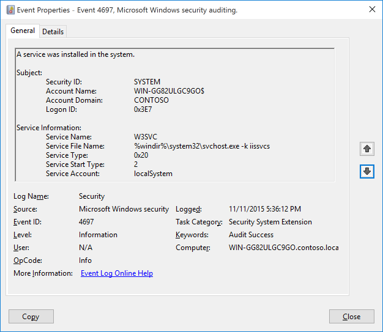
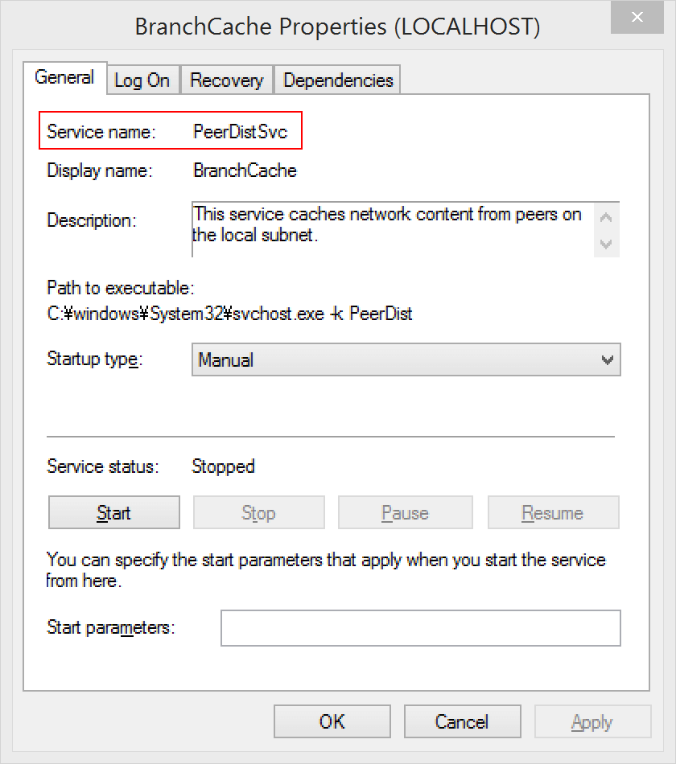

# 4697(S): システムにサービスがインストールされました。



***サブカテゴリ:***&nbsp;[セキュリティシステム拡張の監査](audit-security-system-extension.md)

***イベントの説明:***

このイベントは、新しいサービスがシステムにインストールされたときに生成されます。

> **注**&nbsp;&nbsp;推奨事項については、このイベントの[セキュリティ監視の推奨事項](#security-monitoring-recommendations)を参照してください。

<br clear="all">

***イベント XML:***
```xml
- <Event xmlns="http://schemas.microsoft.com/win/2004/08/events/event">
- <System>
 <Provider Name="Microsoft-Windows-Security-Auditing" Guid="{54849625-5478-4994-A5BA-3E3B0328C30D}" /> 
 <EventID>4697</EventID> 
 <Version>0</Version> 
 <Level>0</Level> 
 <Task>12289</Task> 
 <Opcode>0</Opcode> 
 <Keywords>0x8020000000000000</Keywords> 
 <TimeCreated SystemTime="2015-11-12T01:36:11.991070500Z" /> 
 <EventRecordID>2778</EventRecordID> 
 <Correlation ActivityID="{913FBE70-1CE6-0000-67BF-3F91E61CD101}" /> 
 <Execution ProcessID="736" ThreadID="2800" /> 
 <Channel>Security</Channel> 
 <Computer>WIN-GG82ULGC9GO.contoso.local</Computer> 
 <Security /> 
 </System>
- <EventData>
 <Data Name="SubjectUserSid">S-1-5-18</Data> 
 <Data Name="SubjectUserName">WIN-GG82ULGC9GO$</Data> 
 <Data Name="SubjectDomainName">CONTOSO</Data> 
 <Data Name="SubjectLogonId">0x3e7</Data> 
 <Data Name="ServiceName">AppHostSvc</Data> 
 <Data Name="ServiceFileName">%windir%\\system32\\svchost.exe -k apphost</Data> 
 <Data Name="ServiceType">0x20</Data> 
 <Data Name="ServiceStartType">2</Data> 
 <Data Name="ServiceAccount">localSystem</Data> 
 </EventData>
</Event>

```

***必要なサーバーの役割:*** なし。

***最小 OS バージョン:*** Windows Server 2016, Windows 10。

***イベントバージョン:*** 0。

***フィールドの説明:***

**サブジェクト:**

-   **セキュリティ ID** \[タイプ = SID\]**:** サービスのインストールに使用されたアカウントの SID。イベントビューアーは自動的に SID を解決し、アカウント名を表示しようとします。SID を解決できない場合、イベントにソースデータが表示されます。

> **注**&nbsp;&nbsp;**セキュリティ識別子 (SID)** は、トラスティ (セキュリティプリンシパル) を識別するために使用される可変長の一意の値です。各アカウントには、Active Directory ドメインコントローラーなどの権限によって発行され、セキュリティデータベースに保存される一意の SID があります。ユーザーがログオンするたびに、システムはデータベースからそのユーザーの SID を取得し、そのユーザーのアクセス トークンに配置します。システムは、アクセス トークン内の SID を使用して、以降のすべての Windows セキュリティとのやり取りでユーザーを識別します。SID がユーザーまたはグループの一意の識別子として使用された場合、それ以降は別のユーザーまたはグループを識別するために再利用することはできません。SID の詳細については、[セキュリティ識別子](/windows/access-protection/access-control/security-identifiers)を参照してください。

-   **アカウント名** \[タイプ = UnicodeString\]**:** サービスのインストールに使用されたアカウントの名前。

-   **アカウントドメイン** \[タイプ = UnicodeString\]**:** サブジェクトのドメインまたはコンピュータ名。形式はさまざまで、以下を含みます：

    -   ドメイン NETBIOS 名の例: CONTOSO

    -   小文字の完全ドメイン名: contoso.local

    -   大文字の完全ドメイン名: CONTOSO.LOCAL

    -   一部の[よく知られたセキュリティプリンシパル](/windows/security/identity-protection/access-control/security-identifiers)の場合、例えば LOCAL SERVICE や ANONYMOUS LOGON、このフィールドの値は「NT AUTHORITY」となります。

    -   ローカルユーザーアカウントの場合、このフィールドにはこのアカウントが属するコンピュータまたはデバイスの名前が含まれます。例えば「Win81」。

-   **ログオンID** \[タイプ = HexInt64\]**:** 16進数の値で、同じログオンIDを含む最近のイベントとこのイベントを関連付けるのに役立ちます。例えば、「[4624](event-4624.md): アカウントが正常にログオンされました。」

**サービス情報:**

-   **サービス名** \[タイプ = UnicodeString\]: インストールされたサービスの名前。



-   **サービスファイル名** \[タイプ = UnicodeString\]: サービスコントロールマネージャがサービスを開始するために実行するファイルへの完全なパス。コマンドラインパラメータがイメージパスの一部として指定されている場合、それらも記録されます。

    これはサービスが作成されたときのファイルへのパスであることに注意してください。パスが後で変更された場合、その変更は記録されません。これはプロセス作成イベントを通じて追跡する必要があります。

-   **サービスタイプ** \[タイプ = HexInt32\]: サービスコントロールマネージャに登録された[サービスのタイプ](/dotnet/api/system.serviceprocess.servicetype?cs-lang=csharp&cs-save-lang=1#code-snippet-1)を示します。以下のいずれかです：

| 値    | サービスタイプ              | 説明                                                                                                                                                                                   |
|-------|---------------------------|----------------------------------------------------------------------------------------------------------------------------------------------------------------------------------------|
| 0x1   | ​カーネルドライバ            | ​ハードディスクや他の低レベルのハードウェアデバイスドライバなどのカーネルデバイスドライバ。                                                                                                        |
| 0x2   | ​ファイルシステムドライバ       | ​カーネルデバイスドライバでもあるファイルシステムドライバ。                                                                                                                                  |
| 0x8   | ​レコグナイザドライバ        | ​システム起動時にシステム上のファイルシステムを判別するために使用されるファイルシステムドライバ。                                                                                                |
| 0x10  | ​Win32 独自プロセス        | ​サービスコントローラによって開始され、サービスコントロールプロトコルに従う Win32 プログラム。このタイプの Win32 サービスは単独のプロセスで実行されます（これが最も一般的です）。 |
| 0x20  | ​Win32 共有プロセス      | ​他の Win32 サービスとプロセスを共有できる Win32 サービス。<br>(参照: <https://msdn.microsoft.com/library/windows/desktop/ms685967(v=vs.85).aspx>)                          |
| 0x110 | ​インタラクティブ独自プロセス  | ​スタンドアロンプロセスとして実行され、デスクトップと通信できるサービス。<br>(参照: <https://msdn.microsoft.com/library/windows/desktop/ms683502(v=vs.85).aspx>)  |
| 0x120 | インタラクティブ共有プロセス | 同じタイプの他のサービスとアドレス空間を共有でき、デスクトップと通信できるサービス。                                                                             |

-   **サービス開始タイプ** \[Type = HexInt32\]: サービス開始タイプは次のいずれかの値を持つことができます (参照: <https://msdn.microsoft.com/library/windows/desktop/ms682450(v=vs.85).aspx)>:

| 値    | サービスタイプ      | 説明                                                                                                                                                     |
|-------|---------------------|---------------------------------------------------------------------------------------------------------------------------------------------------------|
| 0     | ​ Boot              | ​システムローダーによって開始されるデバイスドライバー。この値はドライバーサービスにのみ有効です。                                                        |
| 1     | ​ System            | ​IoInitSystem() 関数によって開始されるデバイスドライバー。この値はドライバーサービスにのみ有効です。                                                      |
| 2     | ​ Automatic         | ​システム起動時にサービスコントロールマネージャーによって自動的に開始されるサービス。                                                                    |
| 2     | ​ Automatic Delayed | ​すべての自動開始サービスが開始された後、さらに遅延して開始されるサービス。遅延自動開始サービスは、1つずつ順番に開始されます。                             |
| 3     | ​ Manual            | ​手動開始。StartService 関数が呼び出されたときにサービスコントロールマネージャーによって開始されるサービス。                                             |
| 4     | ​ Disabled          | ​開始できないサービス。サービスを開始しようとすると、エラーコード ERROR\_SERVICE\_DISABLED が返されます。                                               |

ほとんどのインストールされたサービスは **自動読み込み** に設定されており、Services.exe プロセスが開始された後に自動的に開始されます。

-   **サービスアカウント** \[Type = UnicodeString\]: サービスが開始されたときに実行されるセキュリティコンテキスト。これはサービスがインストールされたときに設定されたものであり、後でアカウントが変更された場合はログに記録されません。

    サービスアカウントパラメータは、サービスタイプが「Win32 Own Process」または「Win32 Share Process」（「ユーザーモードサービス」と表示される）である場合にのみ設定されます。カーネルドライバーにはサービスアカウント名が記録されません。

サービス (Win32 Own/Share プロセス) がインストールされているが、アカウントが提供されていない場合、LocalSystem が使用されます。

ログオンを実行しているトークンが検査され、SID がある場合、その SID 値がイベント (System/Security ノード内) に入力されます。SID がない場合は空白になります。

## セキュリティ監視の推奨事項

4697(S): システムにサービスがインストールされました。

> **重要**&nbsp;&nbsp;このイベントについては、[付録 A: 多くの監査イベントに対するセキュリティ監視の推奨事項](appendix-a-security-monitoring-recommendations-for-many-audit-events.md)も参照してください。

- このイベントを監視することをお勧めします。特に高価値の資産やコンピュータでは、新しいサービスのインストールは計画され、予期されるべきです。予期しないサービスのインストールはアラートをトリガーするべきです。

- **「サービスファイル名」**が **%windir%** または **「Program Files/Program Files (x86)」** フォルダにないすべてのイベントを監視します。通常、新しいサービスはこれらのフォルダに配置されます。

<!-- -->

- 「**サービスの種類**」が「**0x1**」、「**0x2**」または「**0x8**」に等しいすべてを報告します。これらのサービスの種類は最初に開始され、オペレーティングシステムの起動時からほぼ無制限のアクセスを持ちます。これらの種類は非常にまれにインストールされます。

- 「**サービス開始の種類**」が「**0**」または「**1**」に等しいすべてを報告します。これらのサービス開始の種類は、オペレーティングシステムに無制限のアクセスを持つドライバによって使用されます。

- 「**サービス開始の種類**」が「**4**」に等しいすべてを報告します。**無効**状態で新しいサービスをインストールすることは一般的ではありません。

- 「**サービスアカウント**」が「**localSystem**」、「**localService**」または「**networkService**」に等しくないすべてを報告して、ユーザーアカウントで実行されているサービスを特定します。
