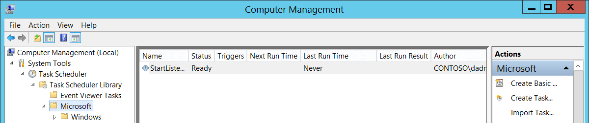

# 4699(S): スケジュールされたタスクが削除されました。


***サブカテゴリ:***&nbsp;[その他のオブジェクトアクセスイベントの監査](audit-other-object-access-events.md)

***イベントの説明:***

このイベントは、スケジュールされたタスクが削除されるたびに生成されます。

> **注**&nbsp;&nbsp;推奨事項については、このイベントの[セキュリティ監視の推奨事項](#security-monitoring-recommendations)を参照してください。

<br clear="all">

***イベント XML:***
```
- <Event xmlns="http://schemas.microsoft.com/win/2004/08/events/event">
- <System>
 <Provider Name="Microsoft-Windows-Security-Auditing" Guid="{54849625-5478-4994-A5BA-3E3B0328C30D}" /> 
 <EventID>4699</EventID> 
 <Version>0</Version> 
 <Level>0</Level> 
 <Task>12804</Task> 
 <Opcode>0</Opcode> 
 <Keywords>0x8020000000000000</Keywords> 
 <TimeCreated SystemTime="2015-09-23T02:13:30.044244500Z" /> 
 <EventRecordID>344827</EventRecordID> 
 <Correlation /> 
 <Execution ProcessID="516" ThreadID="5048" /> 
 <Channel>Security</Channel> 
 <Computer>DC01.contoso.local</Computer> 
 <Security /> 
 </System>
- <EventData>
 <Data Name="SubjectUserSid">S-1-5-21-3457937927-2839227994-823803824-1104</Data> 
 <Data Name="SubjectUserName">dadmin</Data> 
 <Data Name="SubjectDomainName">CONTOSO</Data> 
 <Data Name="SubjectLogonId">0x364eb</Data> 
 <Data Name="TaskName">\\Microsoft\\My</Data> 
 <Data Name="TaskContent"><?xml version="1.0" encoding="UTF-16"?> <Task version="1.2" xmlns="http://schemas.microsoft.com/windows/2004/02/mit/task"> <RegistrationInfo> <Date>2015-08-25T13:56:10.5315552</Date> <Author>CONTOSO\\dadmin</Author> </RegistrationInfo> <Triggers /> <Principals> <Principal id="Author"> <RunLevel>LeastPrivilege</RunLevel> <UserId>CONTOSO\\dadmin</UserId> <LogonType>Password</LogonType> </Principal> </Principals> <Settings> <MultipleInstancesPolicy>IgnoreNew</MultipleInstancesPolicy> <DisallowStartIfOnBatteries>false</DisallowStartIfOnBatteries> <StopIfGoingOnBatteries>true</StopIfGoingOnBatteries> <AllowHardTerminate>false</AllowHardTerminate> <StartWhenAvailable>false</StartWhenAvailable> <RunOnlyIfNetworkAvailable>false</RunOnlyIfNetworkAvailable> <IdleSettings> <StopOnIdleEnd>true</StopOnIdleEnd> <RestartOnIdle>false</RestartOnIdle> </IdleSettings> <AllowStartOnDemand>true</AllowStartOnDemand> <Enabled>true</Enabled> <Hidden>false</Hidden> <RunOnlyIfIdle>false</RunOnlyIfIdle> <WakeToRun>false</WakeToRun> <ExecutionTimeLimit>PT0S</ExecutionTimeLimit> <Priority>7</Priority> </Settings> <Actions Context="Author"> <Exec> <Command>C:\\Windows\\notepad.exe</Command> </Exec> </Actions> </Task></Data> 
 </EventData>
 </Event>

```
>[!NOTE]
> Windows 10 バージョン 1903 以降では、以下の追加プロパティがイベントに追加されます:
> イベントバージョン 1.
>  ***イベント XML:***
>```
>  <Data Name="ClientProcessStartKey">5066549580796854</Data> 
>  <Data Name="ClientProcessId">3932</Data> 
>  <Data Name="ParentProcessId">5304</Data> 
>  <Data Name="RpcCallClientLocality">0</Data> 
>  <Data Name="FQDN">DESKTOP-Name</Data> 

***必要なサーバー役割:*** なし。

***最小 OS バージョン:*** Windows Server 2008, Windows Vista.

***イベントバージョン:*** 0.

***フィールドの説明:***

**サブジェクト:**

-   **セキュリティ ID** \[タイプ = SID\]**:** 「スケジュールされたタスクの削除」操作を要求したアカウントの SID。イベントビューアーは自動的に SID を解決してアカウント名を表示しようとします。SID を解決できない場合、イベントにはソースデータが表示されます。

> **注**&nbsp;&nbsp;**セキュリティ識別子 (SID)** は、信託者 (セキュリティプリンシパル) を識別するために使用される可変長の一意の値です。各アカウントには、Active Directory ドメインコントローラーなどの権限によって発行され、セキュリティデータベースに保存される一意の SID があります。ユーザーがログオンするたびに、システムはデータベースからそのユーザーの SID を取得し、そのユーザーのアクセストークンに配置します。システムは、アクセストークン内の SID を使用して、以降のすべての Windows セキュリティとのやり取りでユーザーを識別します。SID がユーザーまたはグループの一意の識別子として使用された場合、それは他のユーザーまたはグループを識別するために再利用されることはありません。SID の詳細については、[セキュリティ識別子](/windows/access-protection/access-control/security-identifiers)を参照してください。

-   **アカウント名** \[タイプ = UnicodeString\]**:** 「スケジュールされたタスクの削除」操作を要求したアカウントの名前。

-   **アカウントドメイン** \[タイプ = UnicodeString\]**:** サブジェクトのドメインまたはコンピュータ名。形式はさまざまで、以下を含みます：

    -   ドメインのNETBIOS名の例: CONTOSO

    -   小文字の完全ドメイン名: contoso.local

    -   大文字の完全ドメイン名: CONTOSO.LOCAL

    -   [既知のセキュリティプリンシパル](/windows/security/identity-protection/access-control/security-identifiers)の場合、例えばLOCAL SERVICEやANONYMOUS LOGON、このフィールドの値は「NT AUTHORITY」となります。

    -   ローカルユーザーアカウントの場合、このフィールドにはこのアカウントが属するコンピュータまたはデバイスの名前が含まれます。例えば、「Win81」。

-   **ログオンID** \[タイプ = HexInt64\]**:** 16進数の値で、最近のイベントと同じログオンIDを含む可能性のあるイベントとこのイベントを関連付けるのに役立ちます。例えば、「[4624](event-4624.md): アカウントが正常にログオンされました。」

**タスク情報**:

-   **タスク名** \[タイプ = UnicodeString\]**:** 削除されたスケジュールタスクの名前。この値の形式は「\\task\_path\\task\_name」で、task\_pathは「**タスクスケジューラライブラリ**」ノードから始まるMicrosoft **タスクスケジューラ**ツリー内のパスです：



-   **タスクコンテンツ** \[タイプ = UnicodeString\]: 削除されたタスクの[XML](/previous-versions/aa286548(v=msdn.10))。ここで「[XMLタスク定義形式](/openspecs/windows_protocols/ms-tsch/0d6383e4-de92-43e7-b0bb-a60cfa36379f)」について、スケジュールされたタスクのXML形式について詳しく読むことができます。

## セキュリティ監視の推奨事項

4699(S): スケジュールされたタスクが削除されました。

> **重要**&nbsp;&nbsp;このイベントについては、[付録A: 多くの監査イベントに対するセキュリティ監視の推奨事項](appendix-a-security-monitoring-recommendations-for-many-audit-events.md)も参照してください。

-   すべてのスケジュールタスク削除イベントを監視することをお勧めします。特に重要なコンピュータやデバイスで。スケジュールタスクは、再起動後にシステムに留まるためや他の悪意のある行動のためにマルウェアによってよく使用されます。しかし、このイベントは頻繁には発生しません。

-   **タスク スケジューラ ライブラリ**のルート ノードにある削除されたタスクを監視します。つまり、**タスク名**が‘\\TASK\_NAME’のように見える場所です。手動で作成されたスケジュールされたタスクやマルウェアによって作成されたタスクは、しばしば**タスク スケジューラ ライブラリ**のルート ノードにあります。このようなタスクの削除は、悪意のある活動の兆候である可能性があります。

-   いくつかのコンピュータに非常に重要なスケジュールされたタスクが存在し、それが決して削除されるべきでない場合、対応する**タスク名**を持つ[4699](event-4699.md)イベントを監視します。
