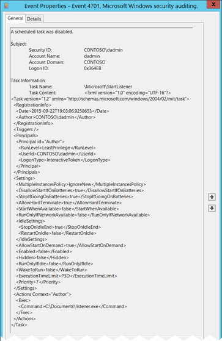

# 4701(S): スケジュールされたタスクが無効化されました。



***サブカテゴリ:***&nbsp;[その他のオブジェクトアクセスイベントの監査](audit-other-object-access-events.md)

***イベントの説明:***

このイベントは、スケジュールされたタスクが無効化されるたびに生成されます。

> **注**&nbsp;&nbsp;推奨事項については、このイベントの[セキュリティ監視の推奨事項](#security-monitoring-recommendations)を参照してください。

<br clear="all">

***イベント XML:***
```
- <Event xmlns="http://schemas.microsoft.com/win/2004/08/events/event">
- <System>
 <Provider Name="Microsoft-Windows-Security-Auditing" Guid="{54849625-5478-4994-A5BA-3E3B0328C30D}" /> 
 <EventID>4701</EventID> 
 <Version>0</Version> 
 <Level>0</Level> 
 <Task>12804</Task> 
 <Opcode>0</Opcode> 
 <Keywords>0x8020000000000000</Keywords> 
 <TimeCreated SystemTime="2015-09-23T02:32:45.844066600Z" /> 
 <EventRecordID>344860</EventRecordID> 
 <Correlation /> 
 <Execution ProcessID="516" ThreadID="4364" /> 
 <Channel>Security</Channel> 
 <Computer>DC01.contoso.local</Computer> 
 <Security /> 
 </System>
- <EventData>
 <Data Name="SubjectUserSid">S-1-5-21-3457937927-2839227994-823803824-1104</Data> 
 <Data Name="SubjectUserName">dadmin</Data> 
 <Data Name="SubjectDomainName">CONTOSO</Data> 
 <Data Name="SubjectLogonId">0x364eb</Data> 
 <Data Name="TaskName">\\Microsoft\\StartListener</Data> 
 <Data Name="TaskContent"><?xml version="1.0" encoding="UTF-16"?> <Task version="1.2" xmlns="http://schemas.microsoft.com/windows/2004/02/mit/task"> <RegistrationInfo> <Date>2015-09-22T19:03:06.9258653</Date> <Author>CONTOSO\\dadmin</Author> </RegistrationInfo> <Triggers /> <Principals> <Principal id="Author"> <RunLevel>LeastPrivilege</RunLevel> <UserId>CONTOSO\\dadmin</UserId> <LogonType>InteractiveToken</LogonType> </Principal> </Principals> <Settings> <MultipleInstancesPolicy>IgnoreNew</MultipleInstancesPolicy> <DisallowStartIfOnBatteries>true</DisallowStartIfOnBatteries> <StopIfGoingOnBatteries>true</StopIfGoingOnBatteries> <AllowHardTerminate>true</AllowHardTerminate> <StartWhenAvailable>false</StartWhenAvailable> <RunOnlyIfNetworkAvailable>false</RunOnlyIfNetworkAvailable> <IdleSettings> <StopOnIdleEnd>true</StopOnIdleEnd> <RestartOnIdle>false</RestartOnIdle> </IdleSettings> <AllowStartOnDemand>true</AllowStartOnDemand> <Enabled>false</Enabled> <Hidden>false</Hidden> <RunOnlyIfIdle>false</RunOnlyIfIdle> <WakeToRun>false</WakeToRun> <ExecutionTimeLimit>P3D</ExecutionTimeLimit> <Priority>7</Priority> </Settings> <Actions Context="Author"> <Exec> <Command>C:\\Documents\\listener.exe</Command> </Exec> </Actions> </Task></Data> 
 </EventData>
 </Event>

```
>[!NOTE]
> Windows 10 バージョン 1903 以降では、以下の追加プロパティがイベントに追加されます:
> イベントバージョン 1.
>  ***イベント XML:***
>```
>  <Data Name="ClientProcessStartKey">5066549580796854</Data> 
>  <Data Name="ClientProcessId">3932</Data> 
>  <Data Name="ParentProcessId">5304</Data> 
>  <Data Name="RpcCallClientLocality">0</Data> 
>  <Data Name="FQDN">DESKTOP-Name</Data> 

***必要なサーバーロール:*** なし。

***最小 OS バージョン:*** Windows Server 2008, Windows Vista。

***イベントバージョン:*** 0。

***フィールドの説明:***

**サブジェクト:**

-   **セキュリティ ID** \[タイプ = SID\]**:** 「スケジュールされたタスクの有効化」操作を要求したアカウントの SID。イベントビューアーは自動的に SID を解決し、アカウント名を表示しようとします。SID を解決できない場合、イベントにはソースデータが表示されます。

> **注**&nbsp;&nbsp;**セキュリティ識別子 (SID)** は、トラスティ (セキュリティプリンシパル) を識別するために使用される可変長の一意の値です。各アカウントには、Active Directory ドメインコントローラーなどの権限によって発行され、セキュリティデータベースに保存される一意の SID があります。ユーザーがログオンするたびに、システムはデータベースからそのユーザーの SID を取得し、そのユーザーのアクセストークンに配置します。システムはアクセストークン内の SID を使用して、以降のすべての Windows セキュリティとのやり取りでユーザーを識別します。SID がユーザーまたはグループの一意の識別子として使用された場合、それは他のユーザーまたはグループを識別するために再利用されることはありません。SID についての詳細は、[セキュリティ識別子](/windows/access-protection/access-control/security-identifiers)を参照してください。

-   **アカウント名** \[タイプ = UnicodeString\]**:** 「スケジュールされたタスクを有効にする」操作を要求したアカウントの名前。

-   **アカウント ドメイン** \[タイプ = UnicodeString\]**:** サブジェクトのドメインまたはコンピュータ名。形式はさまざまで、以下を含みます：

    -   ドメイン NETBIOS 名の例: CONTOSO

    -   小文字の完全なドメイン名: contoso.local

    -   大文字の完全なドメイン名: CONTOSO.LOCAL

    -   LOCAL SERVICE や ANONYMOUS LOGON などの[よく知られたセキュリティ プリンシパル](/windows/security/identity-protection/access-control/security-identifiers)の場合、このフィールドの値は「NT AUTHORITY」となります。

    -   ローカル ユーザー アカウントの場合、このフィールドにはこのアカウントが属するコンピュータまたはデバイスの名前が含まれます。例: 「Win81」。

-   **ログオン ID** \[タイプ = HexInt64\]**:** 16 進数の値で、最近のイベントと同じログオン ID を含む可能性のあるイベントとこのイベントを関連付けるのに役立ちます。例: 「[4624](event-4624.md): アカウントのログオンに成功しました。」

**タスク情報**:

-   **タスク名** \[タイプ = UnicodeString\]**:** 無効にされたスケジュールされたタスクの名前。この値の形式は「\\task\_path\\task\_name」であり、task\_path は「**タスク スケジューラ ライブラリ**」ノードから始まる Microsoft **タスク スケジューラ** ツリー内のパスです：


-   **タスク コンテンツ** \[タイプ = UnicodeString\]: 無効にされたタスクの[XML](/previous-versions/aa286548(v=msdn.10))。ここで「[XML タスク定義形式](/openspecs/windows_protocols/ms-tsch/0d6383e4-de92-43e7-b0bb-a60cfa36379f)」について、スケジュールされたタスクの XML 形式について詳しく読むことができます。

## セキュリティ監視の推奨事項

4701(S): スケジュールされたタスクが無効にされました。

> **重要**&nbsp;&nbsp;このイベントについては、[付録 A: 多くの監査イベントに対するセキュリティ監視の推奨事項](appendix-a-security-monitoring-recommendations-for-many-audit-events.md)も参照してください。

-   いくつかのコンピュータに非常に重要なスケジュールされたタスクが存在し、それが決して無効にされるべきでない場合、対応する**タスク名**を持つ[4701](event-4701.md)イベントを監視します。
