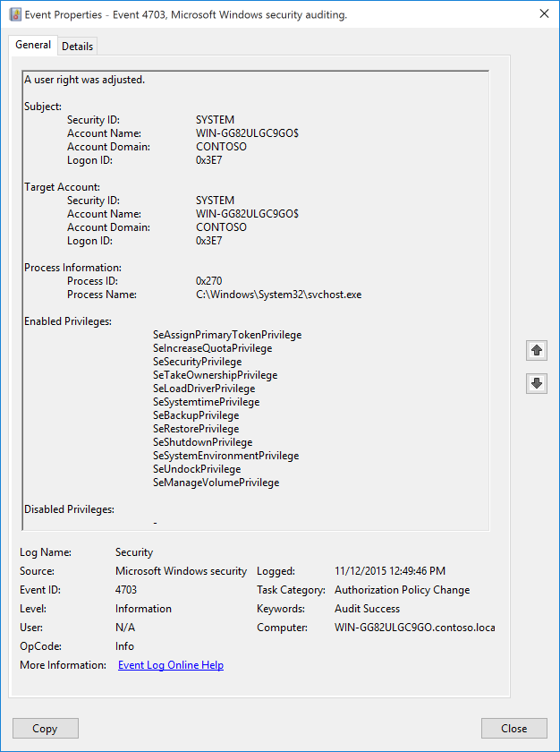
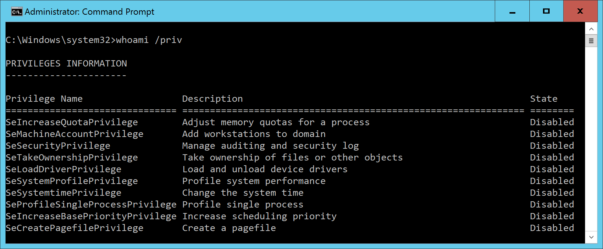
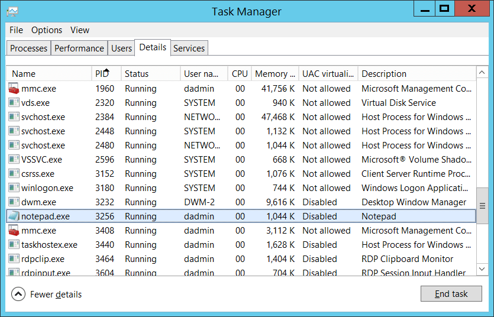

# 4703(S): ユーザー権利が調整されました。



***サブカテゴリ:***&nbsp;[監査認可ポリシーの変更](audit-authorization-policy-change.md)

***イベントの説明:***

このイベントは、特定のアカウントのトークンに対して[トークン特権](/windows/win32/secauthz/enabling-and-disabling-privileges-in-c--)が有効または無効にされたときに生成されます。Windows 10以降、イベント4703は動的にトークン特権を調整するアプリケーションやサービスによっても記録されます。例えば、Microsoft Configuration Managerは定期的にWMIクエリを実行し、短時間で大量の4703イベントを生成します（WMIアクティビティはsvchost.exeからのものとしてリストされます）。AdjustPrivilegesToken APIを使用してシステム特権を変更するアプリケーションやシステムサービスを使用している場合、このサブカテゴリ（監査認可ポリシーの変更）の成功監査を無効にするか、非常に大量の4703イベントを処理する必要があるかもしれません。

> **注**&nbsp;&nbsp;このイベントに関する推奨事項については、[セキュリティ監視の推奨事項](#security-monitoring-recommendations)を参照してください。

トークン特権は、特定の瞬間にのみ必要なシステムレベルのアクションを実行する能力を提供します。例えば、誰でもコンピュータを再起動できますが、オペレーティングシステムはデフォルトでその特権を有効にしません。代わりに、**シャットダウン**をクリックしたときにその特権が有効になります。**whoami /priv**コマンドを使用して、ユーザーのトークン特権の現在の状態を確認できます。



<br clear="all">

***イベント XML:***
```
- <Event xmlns="http://schemas.microsoft.com/win/2004/08/events/event">
- <System>
 <Provider Name="Microsoft-Windows-Security-Auditing" Guid="{54849625-5478-4994-A5BA-3E3B0328C30D}" /> 
 <EventID>4703</EventID> 
 <Version>0</Version> 
 <Level>0</Level> 
 <Task>13570</Task> 
 <Opcode>0</Opcode> 
 <Keywords>0x8020000000000000</Keywords> 
 <TimeCreated SystemTime="2015-11-12T20:49:46.365958700Z" /> 
 <EventRecordID>5245</EventRecordID> 
 <Correlation /> 
 <Execution ProcessID="4" ThreadID="3632" /> 
 <Channel>Security</Channel> 
 <Computer>WIN-GG82ULGC9GO.contoso.local</Computer> 
 <Security /> 
 </System>
- <EventData>
 <Data Name="SubjectUserSid">S-1-5-18</Data> 
 <Data Name="SubjectUserName">WIN-GG82ULGC9GO$</Data> 
 <Data Name="SubjectDomainName">CONTOSO</Data> 
 <Data Name="SubjectLogonId">0x3e7</Data> 
 <Data Name="TargetUserSid">S-1-5-18</Data> 
 <Data Name="TargetUserName">WIN-GG82ULGC9GO$</Data> 
 <Data Name="TargetDomainName">CONTOSO</Data> 
 <Data Name="TargetLogonId">0x3e7</Data> 
 <Data Name="ProcessName">C:\\Windows\\System32\\svchost.exe</Data> 
 <Data Name="ProcessId">0x270</Data> 
 <Data Name="EnabledPrivilegeList">SeAssignPrimaryTokenPrivilege SeIncreaseQuotaPrivilege SeSecurityPrivilege SeTakeOwnershipPrivilege SeLoadDriverPrivilege SeSystemtimePrivilege SeBackupPrivilege SeRestorePrivilege SeShutdownPrivilege SeSystemEnvironmentPrivilege SeUndockPrivilege SeManageVolumePrivilege</Data> 
 <Data Name="DisabledPrivilegeList">-</Data> 
 </EventData>
</Event>

```

***必要なサーバー ロール:*** なし。

***最小 OS バージョン:*** Windows Server 2016, Windows 10。

***イベント バージョン:*** 0。

***フィールドの説明:***

**サブジェクト:**

-   **セキュリティ ID** \[タイプ = SID\]**:** **ターゲット アカウント**の特権に対して「有効化」または「無効化」操作を要求したアカウントの SID。イベント ビューアーは自動的に SID を解決してアカウント名を表示しようとします。SID を解決できない場合、イベントにソース データが表示されます。

> **注**&nbsp;&nbsp;**セキュリティ識別子 (SID)** は、トラスティ (セキュリティ プリンシパル) を識別するために使用される可変長の一意の値です。各アカウントには、Active Directory ドメイン コントローラーなどの権限によって発行され、セキュリティ データベースに格納される一意の SID があります。ユーザーがログオンするたびに、システムはデータベースからそのユーザーの SID を取得し、そのユーザーのアクセス トークンに配置します。システムは、アクセス トークン内の SID を使用して、以降のすべての Windows セキュリティとのやり取りでユーザーを識別します。SID がユーザーまたはグループの一意の識別子として使用された場合、それは他のユーザーまたはグループを識別するために再利用されることはありません。SID の詳細については、[セキュリティ識別子](/windows/access-protection/access-control/security-identifiers) を参照してください。

-   **アカウント名** \[タイプ = UnicodeString\]**:** **ターゲット アカウント**の特権に対して「有効化」または「無効化」操作を要求したアカウントの名前。

-   **アカウント ドメイン** \[タイプ = UnicodeString\]**:** サブジェクトのドメインまたはコンピューター名。形式はさまざまで、次のようなものがあります:

    -   ドメイン NETBIOS 名の例: CONTOSO

    -   小文字の完全なドメイン名: contoso.local

    -   大文字の完全なドメイン名: CONTOSO.LOCAL

    -   LOCAL SERVICE や ANONYMOUS LOGON などの[よく知られたセキュリティ プリンシパル](/windows/security/identity-protection/access-control/security-identifiers)の場合、このフィールドの値は「NT AUTHORITY」となります。

    -   ローカル ユーザー アカウントの場合、このフィールドにはこのアカウントが属するコンピューターまたはデバイスの名前が含まれます。例: 「Win81」。

- **ログオンID** \[タイプ = HexInt64\]**:** このイベントを最近のイベントと関連付けるのに役立つ16進数の値。例えば、"[4624](event-4624.md): アカウントが正常にログオンされました"のように、同じログオンIDを含む可能性のあるイベントと関連付けることができます。

**ターゲットアカウント:**

- **セキュリティID** \[タイプ = SID\]**:** 特権が有効または無効にされたアカウントのSID。イベントビューアは自動的にSIDを解決し、アカウント名を表示しようとします。SIDが解決できない場合、イベントにソースデータが表示されます。

> **注**&nbsp;&nbsp;**セキュリティ識別子 (SID)** は、トラスティ (セキュリティプリンシパル) を識別するために使用される可変長の一意の値です。各アカウントには、Active Directoryドメインコントローラーなどの権限によって発行され、セキュリティデータベースに保存される一意のSIDがあります。ユーザーがログオンするたびに、システムはデータベースからそのユーザーのSIDを取得し、そのユーザーのアクセス トークンに配置します。システムは、アクセス トークン内のSIDを使用して、以降のすべてのWindowsセキュリティとのやり取りでユーザーを識別します。ユーザーまたはグループの一意の識別子としてSIDが使用された場合、それは他のユーザーまたはグループを識別するために再利用されることはありません。SIDの詳細については、[セキュリティ識別子](/windows/access-protection/access-control/security-identifiers)を参照してください。

- **アカウント名** \[タイプ = UnicodeString\]**:** 特権が有効または無効にされたアカウントの名前。

- **アカウントドメイン** \[タイプ = UnicodeString\]**:** サブジェクトのドメインまたはコンピュータ名。形式はさまざまで、以下を含みます:

    - ドメインNETBIOS名の例: CONTOSO

    - 小文字の完全なドメイン名: contoso.local

    - 大文字の完全なドメイン名: CONTOSO.LOCAL

    - LOCAL SERVICEやANONYMOUS LOGONなどの[よく知られたセキュリティプリンシパル](/windows/security/identity-protection/access-control/security-identifiers)の場合、このフィールドの値は「NT AUTHORITY」です。

    - ローカルユーザーアカウントの場合、このフィールドにはこのアカウントが属するコンピュータまたはデバイスの名前が含まれます。例えば、「Win81」のように。

-   **ログオンID** \[タイプ = HexInt64\]**:** 16進数の値で、最近のイベントとこのイベントを関連付けるのに役立ちます。例えば、"[4624](event-4624.md): アカウントが正常にログオンされました"のように、同じログオンIDを含む可能性のあるイベントと関連付けることができます。

**プロセス情報:**

-   **プロセスID** \[タイプ = ポインタ\]: トークン権限を有効または無効にしたプロセスの16進数のプロセスID。プロセスID (PID) は、オペレーティングシステムがアクティブなプロセスを一意に識別するために使用する番号です。特定のプロセスのPIDを確認するには、例えばタスクマネージャー（詳細タブ、PID列）を使用できます。

    

    16進数の値を10進数に変換すると、タスクマネージャーの値と比較できます。

    また、このプロセスIDを他のイベントのプロセスIDと関連付けることもできます。例えば、"[4688](event-4688.md): 新しいプロセスが作成されました" **プロセス情報\\新しいプロセスID**。

-   **プロセス名** \[タイプ = UnicodeString\]**:** プロセスの実行可能ファイルのフルパスと名前。

<!-- -->

-   **有効な特権** \[タイプ = UnicodeString\]**:** 有効なユーザー権限のリスト。このイベントは*ユーザー*権限のみに対して生成され、ログオン権限には生成されません。以下は考えられるユーザー権限のリストです:

| 特権名                          | ユーザー権利グループポリシー名                                   | 説明                                                                                                                                                                                                                                                                                                                                                                                                                                                                                                                                                                                                                                                                                                                                                                                                                                                           |
|---------------------------------|----------------------------------------------------------------|-----------------------------------------------------------------------------------------------------------------------------------------------------------------------------------------------------------------------------------------------------------------------------------------------------------------------------------------------------------------------------------------------------------------------------------------------------------------------------------------------------------------------------------------------------------------------------------------------------------------------------------------------------------------------------------------------------------------------------------------------------------------------------------------------------------------------------------------------------------------------|
| SeAssignPrimaryTokenPrivilege   | プロセスレベルのトークンを置き換える                            | プロセスの[*プライマリトークン*](/windows/win32/secgloss/p-gly#_security_primary_token_gly)を割り当てるために必要です。<br>この特権を持つユーザーは、開始されたサブプロセスに関連付けられたデフォルトのトークンを置き換えるためにプロセスを開始できます。                                                                                                                                                                                                                                                                                                                                                                                                                                                                                                                                                                 |
| SeAuditPrivilege                | セキュリティ監査を生成する                                     | この特権を持つユーザーは、セキュリティログにエントリを追加できます。                                                                                                                                                                                                                                                                                                                                                                                                                                                                                                                                                                                                                                                                                                                                                                                                    |
| SeBackupPrivilege               | ファイルとディレクトリをバックアップする                        | - バックアップ操作を実行するために必要です。<br>この特権を持つユーザーは、システムをバックアップする目的でファイルやディレクトリ、レジストリ、その他の永続的なオブジェクトの権限をバイパスできます。<br>この特権により、システムはファイルに指定された[*アクセス制御リスト*](/windows/win32/secgloss/a-gly#_security_access_control_list_gly) (ACL)に関係なく、すべての読み取りアクセス権を付与します。読み取り以外のアクセス要求はACLで評価されます。この特権を持つ場合、以下のアクセス権が付与されます:<br>READ\_CONTROL<br>ACCESS\_SYSTEM\_SECURITY<br>FILE\_GENERIC\_READ<br>FILE\_TRAVERSE                                                                                                                |
| SeChangeNotifyPrivilege         | トラバースチェックをバイパスする                                | ファイルやディレクトリの変更通知を受け取るために必要です。この特権により、システムはすべてのトラバースアクセスチェックをスキップします。<br>この特権を持つユーザーは、トラバースされたディレクトリに対する権限がなくてもディレクトリツリーをトラバースできます。この特権は、ユーザーがディレクトリの内容をリストすることを許可するものではなく、ディレクトリをトラバースするだけです。                                                                                                                                                                                                                                                                                                                                                                                                                                                             |
| SeCreateGlobalPrivilege         | グローバルオブジェクトを作成する                                | ターミナルサービスセッション中にグローバル名前空間に名前付きファイルマッピングオブジェクトを作成するために必要です。                                                                                                                                                                                                                                                                                                                                                                                                                                                                                                                                                                                                                                                                                                                                                              |
| SeCreatePagefilePrivilege       | ページファイルを作成する                                        | この特権を持つユーザーは、ページファイルを作成およびサイズを変更できます。                                                                                                                                                                                                                                                                                                                                                                                                                                                                                                                                                                                                                                                                                                                                                                                           |
| SeCreatePermanentPrivilege      | 永続的な共有オブジェクトを作成する                              | 永続的なオブジェクトを作成するために必要です。<br>この特権は、オブジェクト名前空間を拡張するカーネルモードコンポーネントに役立ちます。カーネルモードで実行されているコンポーネントはすでにこの特権を持っているため、特権を割り当てる必要はありません。                                                                                                                                                                                                                                                                                                                                                                                                                                                                                                                                                                                            |
| SeCreateSymbolicLinkPrivilege   | シンボリックリンクを作成する                                    | シンボリックリンクを作成するために必要です。                                                                                                                                                                                                                                                                                                                                                                                                                                                                                                                                                                                                                                                                                                                                                                                                                                   |
| SeCreateTokenPrivilege          | トークンオブジェクトを作成する                                  | プロセスがNtCreateToken()や他のトークン作成APIを使用して、任意のローカルリソースにアクセスするために使用できるトークンを作成することを許可します。<br>プロセスがこの特権を必要とする場合、別のユーザーアカウントを作成してこの特権を割り当てるのではなく、ローカルシステムアカウント（すでにこの特権を含む）を使用することをお勧めします。                                                                                                                                                                                                                                                                                                                                                                                                                                                                                |
| SeDebugPrivilege                | プログラムをデバッグする                                        | 他のアカウントが所有するプロセスのメモリをデバッグおよび調整するために必要です。<br>この特権を持つユーザーは、任意のプロセスまたはカーネルにデバッガをアタッチできます。自分のアプリケーションをデバッグする開発者はこのユーザー権利を必要としません。新しいシステムコンポーネントをデバッグする開発者はこのユーザー権利を必要とします。このユーザー権利は、敏感で重要なオペレーティングシステムコンポーネントへの完全なアクセスを提供します。                                                                                                                                                                                                                                                                                                                                                                                                                                |
| SeEnableDelegationPrivilege     | 委任のためにコンピュータおよびユーザーアカウントを信頼する      | ユーザーおよびコンピュータアカウントを委任のために信頼されるようにマークするために必要です。<br>この特権を持つユーザーは、ユーザーまたはコンピュータオブジェクトに**委任のために信頼**設定を設定できます。<br>この特権を持つユーザーまたはオブジェクトは、ユーザーまたはコンピュータオブジェクトのアカウント制御フラグに書き込みアクセス権を持っている必要があります。委任のために信頼されているコンピュータ（またはユーザーコンテキストで実行されている）で実行されているサーバープロセスは、クライアントの委任された資格情報を使用して別のコンピュータ上のリソースにアクセスできます。ただし、クライアントのアカウントに**アカウントは委任できません**アカウント制御フラグが設定されていない場合に限ります。                                                                                                                                                                                                                      |
| SeImpersonatePrivilege          | 認証後にクライアントを偽装する                                  | この特権を持つユーザーは、他のアカウントを偽装できます。                                                                                                                                                                                                                                                                                                                                                                                                                                                                                                                                                                                                                                                                                                                                                                                                         |
| SeIncreaseBasePriorityPrivilege | スケジューリング優先度を上げる                                  | プロセスの基本優先度を上げるために必要です。<br>この特権を持つユーザーは、別のプロセスに書き込みプロパティアクセスを持つプロセスを使用して、他のプロセスに割り当てられた実行優先度を上げることができます。この特権を持つユーザーは、タスクマネージャーのユーザーインターフェイスを通じてプロセスのスケジューリング優先度を変更できます。                                                                                                                                                                                                                                                                                                                                                                                                                                                                                                                     |
| SeIncreaseQuotaPrivilege        | プロセスのメモリクォータを調整する                              | プロセスに割り当てられたクォータを増やすために必要です。<br>この特権を持つユーザーは、プロセスが消費できる最大メモリを変更できます。                                                                                                                                                                                                                                                                                                                                                                                                                                                                                                                                                                                                                                                                                                        |
| SeIncreaseWorkingSetPrivilege   | プロセスのワーキングセットを増やす                              | ユーザーのコンテキストで実行されるアプリケーションに対して、より多くのメモリを割り当てるために必要です。                                                                                                                                                                                                                                                                                                                                                                                                                                                                                                                                                                                                                                                                                                                                                                                   |
| SeLoadDriverPrivilege           | デバイスドライバをロードおよびアンロードする                    | デバイスドライバをロードまたはアンロードするために必要です。<br>この特権を持つユーザーは、デバイスドライバや他のコードをカーネルモードに動的にロードおよびアンロードできます。このユーザー権利は、プラグアンドプレイデバイスドライバには適用されません。                                                                                                                                                                                                                                                                                                                                                                                                                                                                                                                                                                                                                                    |
| SeLockMemoryPrivilege           | メモリ内のページをロックする                                    | 物理ページをメモリにロックするために必要です。<br>この特権を持つユーザーは、プロセスを使用してデータを物理メモリに保持し、システムがデータをディスク上の仮想メモリにページングするのを防ぎます。この特権を行使すると、利用可能なランダムアクセスメモリ（RAM）の量が減少するため、システムパフォーマンスに大きな影響を与える可能性があります。                                                                                                                                                                                                                                                                                                                                                                                                                                                                                                             |
| SeMachineAccountPrivilege       | ドメインにワークステーションを追加する                          | この特権を持つユーザーは、コンピュータアカウントを作成できます。<br>この特権はドメインコントローラーでのみ有効です。                                                                                                                                                                                                                                                                                                                                                                                                                                                                                                                                                                                                                                                                                                                                             |
| SeManageVolumePrivilege         | ボリュームメンテナンスタスクを実行する                          | リモートデフラグメンテーションなどのボリュームメンテナンスタスクを実行するために必要です。                                                                                                                                                                                                                                                                                                                                                                                                                                                                                                                                                                                                                                                                                                                                                                                        |
| SeProfileSingleProcessPrivilege | 単一プロセスのプロファイルを作成する                            | 単一プロセスのプロファイル情報を収集するために必要です。<br>この特権を持つユーザーは、パフォーマンスモニタリングツールを使用して非システムプロセスのパフォーマンスを監視できます。                                                                                                                                                                                                                                                                                                                                                                                                                                                                                                                                                                                                                                                                       |
| SeRelabelPrivilege              | オブジェクトラベルを変更する                                    | オブジェクトの強制整合性レベルを変更するために必要です。                                                                                                                                                                                                                                                                                                                                                                                                                                                                                                                                                                                                                                                                                                                                                                                                        |
| SeRemoteShutdownPrivilege       | リモートシステムからのシャットダウンを強制する                  | ネットワーク要求を使用してシステムをシャットダウンするために必要です。                                                                                                                                                                                                                                                                                                                                                                                                                                                                                                                                                                                                                                                                                                                                                                                                               |
| SeRestorePrivilege              | ファイルとディレクトリを復元する                                | 復元操作を実行するために必要です。この特権により、システムはファイルに指定されたACLに関係なく、すべての書き込みアクセス権を付与します。書き込み以外のアクセス要求はACLで評価されます。さらに、この特権により、任意の有効なユーザーまたはグループSIDをファイルの所有者として設定できます。この特権を持つ場合、以下のアクセス権が付与されます:<br>WRITE\_DAC<br>WRITE\_OWNER<br>ACCESS\_SYSTEM\_SECURITY<br>FILE\_GENERIC\_WRITE<br>FILE\_ADD\_FILE<br>FILE\_ADD\_SUBDIRECTORY<br>DELETE<br>この特権を持つユーザーは、バックアップされたファイルやディレクトリを復元する際にファイル、ディレクトリ、レジストリ、その他の永続的なオブジェクトの権限をバイパスでき、任意の有効なセキュリティプリンシパルをオブジェクトの所有者として設定できるユーザーを決定します。 |
| SeSecurityPrivilege             | 監査およびセキュリティログを管理する                            | セキュリティイベントログでの監査イベントの制御および表示など、いくつかのセキュリティ関連機能を実行するために必要です。<br>この特権を持つユーザーは、ファイル、Active Directoryオブジェクト、レジストリキーなどの個々のリソースに対してオブジェクトアクセス監査オプションを指定できます。<br>この特権を持つユーザーは、セキュリティログを表示およびクリアすることもできます。                                                                                                                                                                                                                                                                                                                                                                                                                                                                                 |
| SeShutdownPrivilege             | システムをシャットダウンする                                    | ローカルシステムをシャットダウンするために必要です。                                                                                                                                                                                                                                                                                                                                                                                                                                                                                                                                                                                                                                                                                                                                                                                                                                 |
| SeSyncAgentPrivilege            | ディレクトリサービスデータを同期する                            | この特権により、保持者はオブジェクトおよびプロパティの保護に関係なく、ディレクトリ内のすべてのオブジェクトおよびプロパティを読み取ることができます。デフォルトでは、ドメインコントローラーの管理者およびローカルシステムアカウントに割り当てられています。<br>この特権を持つユーザーは、すべてのディレクトリサービスデータを同期できます。これはActive Directoryの同期とも呼ばれます。                                                                                                                                                                                                                                                                                                                                                                                                                                                                        |
| SeSystemEnvironmentPrivilege    | ファームウェア環境値を変更する                                  | このタイプのメモリを使用して構成情報を保存するシステムの不揮発性RAMを変更するために必要です。                                                                                                                                                                                                                                                                                                                                                                                                                                                                                                                                                                                                                                                                                                                                                    |
| SeSystemProfilePrivilege        | システムパフォーマンスをプロファイルする                        | システム全体のプロファイル情報を収集するために必要です。<br>この特権を持つユーザーは、パフォーマンスモニタリングツールを使用してシステムプロセスのパフォーマンスを監視できます。                                                                                                                                                                                                                                                                                                                                                                                                                                                                                                                                                                                                                                                                          |
| SeSystemtimePrivilege           | システム時間を変更する                                          | システム時間を変更するために必要です。<br>この特権を持つユーザーは、コンピュータの内部時計の時間と日付を変更できます。このユーザー権利が割り当てられているユーザーは、イベントログの表示に影響を与える可能性があります。システム時間が変更されると、ログに記録されるイベントは実際に発生した時間ではなく、この新しい時間を反映します。                                                                                                                                                                                                                                                                                                                                                                                                                                                                                                       |
| SeTakeOwnershipPrivilege        | ファイルや他のオブジェクトの所有権を取得する                    | 任意のアクセスを付与されることなくオブジェクトの所有権を取得するために必要です。この特権により、所有者の値を保持者が正当に所有者として割り当てることができる値にのみ設定できます。<br>この特権を持つユーザーは、Active Directoryオブジェクト、ファイルおよびフォルダ、プリンタ、レジストリキー、プロセス、およびスレッドを含むシステム内の任意のセキュリティオブジェクトの所有権を取得できます。                                                                                                                                                                                                                                                                                                                                                                                                                                  |
| SeTcbPrivilege                  | オペレーティングシステムの一部として動作する                    | この特権は、保持者を信頼されたコンピュータベースの一部として識別します。<br>このユーザー権利により、プロセスは認証なしで任意のユーザーを偽装できます。したがって、プロセスはそのユーザーと同じローカルリソースにアクセスできます。                                                                                                                                                                                                                                                                                                                                                                                                                                                                                                                                                                                                                  |
| SeTimeZonePrivilege             | タイムゾーンを変更する                                          | コンピュータの内部時計に関連付けられたタイムゾーンを調整するために必要です。                                                                                                                                                                                                                                                                                                                                                                                                                                                                                                                                                                                                                                                                                                                                                                                       |
| SeTrustedCredManAccessPrivilege | 信頼された呼び出し元として資格情報マネージャーにアクセスする    | 信頼された呼び出し元として資格情報マネージャーにアクセスするために必要です。                                                                                                                                                                                                                                                                                                                                                                                                                                                                                                                                                                                                                                                                                                                                                                                                            |
| SeUndockPrivilege               | ドッキングステーションからコンピュータを取り外す                | ラップトップを取り外すために必要です。<br>この特権を持つユーザーは、ログオンせずにポータブルコンピュータをドッキングステーションから取り外すことができます。                                                                                                                                                                                                                                                                                                                                                                                                                                                                                                                                                                                                                                                                                                                       |
| SeUnsolicitedInputPrivilege     | 該当なし                                                       | [*端末*](/windows/win32/secgloss/t-gly#_security_terminal_gly)デバイスからの未承諾の入力を読み取るために必要です。                                                                                                                                                                                                                                                                                                                                                                                                                                                                                                                                                                                                                                                                                                |

**無効な特権** \[Type = UnicodeString\]**:** 無効にされたユーザー権利のリスト。可能な値については上記の表を参照してください。

## セキュリティ監視の推奨事項

4703(S): ユーザー権利が調整されました。

Windows 10以降、イベント4703はトークン特権を動的に調整するアプリケーションやサービスによって生成されます。このようなアプリケーションの例としては、Microsoft Configuration Managerがあり、これは定期的にWMIクエリを実行し、短時間で大量の4703イベントを生成します（WMIアクティビティはsvchost.exeからのものとしてリストされます）。AdjustPrivilegesToken APIを使用してシステム特権を変更するアプリケーションやシステムサービスを使用している場合、このサブカテゴリの成功監査を無効にする必要があるかもしれません。[監査認可ポリシーの変更](audit-authorization-policy-change.md)を参照するか、非常に大量の4703イベントに対処する必要があります。

それ以外の場合は、以下の表の推奨事項を参照してください。

| **必要な監視の種類**                                                                                                                                                                                                                                                                                   | **推奨事項**                                                                                                                                                                                                                                                                                              |
|-------------------------------------------------------------------------------------------------------------------------------------------------------------------------------------------------------------------------------------------------------------------------------------------------------------------|-----------------------------------------------------------------------------------------------------------------------------------------------------------------------------------------------------------------------------------------------------------------------------------------------------------------|
| **高価値アカウント**: 各アクションを監視する必要がある高価値のドメインまたはローカルアカウントがあるかもしれません。<br>高価値アカウントの例としては、データベース管理者、組み込みのローカル管理者アカウント、ドメイン管理者、サービスアカウント、ドメインコントローラーアカウントなどがあります。 | 高価値アカウントに対応する**“Subject\\Security ID”**でこのイベントを監視します。                                                                                                                                                                                                  |
| **異常または悪意のある行動**: 異常を検出したり、潜在的な悪意のある行動を監視するための特定の要件があるかもしれません。例えば、勤務時間外のアカウント使用を監視する必要があるかもしれません。                                                                                | 異常や悪意のある行動を監視する場合、**“Subject\\Security ID”**（および他の情報）を使用して特定のアカウントがどのように、またはいつ使用されているかを監視します。                                                                                                                                     |
| **非アクティブアカウント**: 非アクティブ、無効、またはゲストアカウント、その他使用されるべきでないアカウントがあるかもしれません。                                                                                                                                                                                     | 使用されるべきでないアカウントに対応する**“Subject\\Security ID”**または**“Target Account\\Security ID”**でこのイベントを監視します。                                                                                                                                                          |
| **アカウント許可リスト**: 特定のイベントに対応するアクションを実行することが許可されているアカウントの特定の許可リストがあるかもしれません。                                                                                                                                                      | このイベントが「許可リストのみ」のアクションに対応する場合、許可リスト外のアカウントに対して**“Subject\\Security ID”**を確認します。また、**“Target Account\\Security ID”**および**“Enabled Privileges”**を確認して、何が有効になったかを確認します。                                                               |
| **異なる種類のアカウント**: 特定のアクションが特定のアカウント種類（例えば、ローカルまたはドメインアカウント、マシンまたはユーザーアカウント、ベンダーまたは従業員アカウントなど）によってのみ実行されることを確認したいかもしれません。                                                                                 | このイベントが特定のアカウント種類に対して監視したいアクションに対応する場合、**“Subject\\Security ID”**を確認してアカウント種類が期待通りであるかを確認します。                                                                                                                                     |
| **外部アカウント**: 別のドメインからのアカウントや、特定のアクションを実行することが許可されていない「外部」アカウント（特定のイベントで表される）を監視しているかもしれません。                                                                                                                     | 別のドメインからのアカウントや「外部」アカウントに対応する**“Subject\\Account Domain”**でこのイベントを監視します。                                                                                                                                                                                  |
| **使用が制限されたコンピューターやデバイス**: 特定の人（アカウント）が限られたアクションのみを実行するか、まったくアクションを実行しない特定のコンピューター、マシン、またはデバイスがあるかもしれません。                                                                                                                     | 関心のある**“Subject\\Security ID”**によって実行されたアクションについて、対象の**コンピューター:**（または他の対象デバイス）を監視します。<br>また、そのアカウントに対してそのコンピューターで特権の変更が行われるべきかどうかを確認するために**“Target Account\\Security ID”**を確認します。                |
| **制限または監視されるべきユーザー権利**: 制限または監視したいユーザー権利のリストがあるかもしれません。                                                                                                                                                                                | このイベントを監視し、**“Enabled Privileges”**をユーザー権利のリストと比較します。有効にされるべきでないユーザー権利に対してアラートをトリガーします。特に高価値サーバーや他のコンピューターでのユーザー権利については注意が必要です。<br>例えば、**SeDebugPrivilege**が制限されるべきユーザー権利のリストに含まれているかもしれません。 |
| **アカウント命名規則**: 組織にはアカウント名の特定の命名規則があるかもしれません。                                                                                                                                                                                                       | 命名規則に従わない名前について**“Subject\\Account Name”**を監視します。                                                                                                                                                                                                                        |
