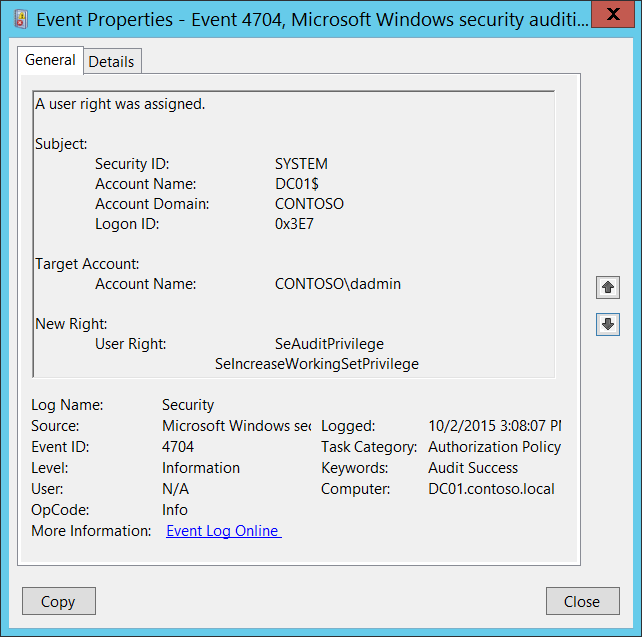

# 4704(S): ユーザー権限が割り当てられました。



***サブカテゴリ:***&nbsp;[監査認可ポリシー変更](audit-authorization-policy-change.md)

***イベントの説明:***

このイベントは、ローカルユーザー権限ポリシーが変更され、ユーザー権限がアカウントに割り当てられるたびに生成されます。

各ユーザーごとに一意のイベントが表示されます。

> **注**&nbsp;&nbsp;推奨事項については、このイベントの[セキュリティ監視の推奨事項](#security-monitoring-recommendations)を参照してください。

<br clear="all">

***イベント XML:***
```
- <Event xmlns="http://schemas.microsoft.com/win/2004/08/events/event">
- <System>
 <Provider Name="Microsoft-Windows-Security-Auditing" Guid="{54849625-5478-4994-A5BA-3E3B0328C30D}" /> 
 <EventID>4704</EventID> 
 <Version>0</Version> 
 <Level>0</Level> 
 <Task>13570</Task> 
 <Opcode>0</Opcode> 
 <Keywords>0x8020000000000000</Keywords> 
 <TimeCreated SystemTime="2015-10-02T22:08:07.136050600Z" /> 
 <EventRecordID>1049866</EventRecordID> 
 <Correlation /> 
 <Execution ProcessID="500" ThreadID="1216" /> 
 <Channel>Security</Channel> 
 <Computer>DC01.contoso.local</Computer> 
 <Security /> 
 </System>
- <EventData>
 <Data Name="SubjectUserSid">S-1-5-18</Data> 
 <Data Name="SubjectUserName">DC01$</Data> 
 <Data Name="SubjectDomainName">CONTOSO</Data> 
 <Data Name="SubjectLogonId">0x3e7</Data> 
 <Data Name="TargetSid">S-1-5-21-3457937927-2839227994-823803824-1104</Data> 
 <Data Name="PrivilegeList">SeAuditPrivilege SeIncreaseWorkingSetPrivilege</Data> 
 </EventData>
 </Event>

```

***必要なサーバー役割:*** なし。

***最小 OS バージョン:*** Windows Server 2008, Windows Vista。

***イベントバージョン:*** 0。

***フィールドの説明:***

**サブジェクト:**

-   **セキュリティ ID** \[タイプ = SID\]**:** ローカルユーザー権限ポリシーに変更を加えたアカウントの SID。イベントビューアーは自動的に SID を解決し、アカウント名を表示しようとします。SID を解決できない場合、イベントにソースデータが表示されます。

> **注**&nbsp;&nbsp;**セキュリティ識別子 (SID)** は、トラスティ (セキュリティプリンシパル) を識別するために使用される可変長の一意の値です。各アカウントには、Active Directory ドメインコントローラーなどの権限によって発行され、セキュリティデータベースに保存される一意の SID があります。ユーザーがログオンするたびに、システムはデータベースからそのユーザーの SID を取得し、そのユーザーのアクセス トークンに配置します。システムは、アクセス トークン内の SID を使用して、以降のすべての Windows セキュリティとのやり取りでユーザーを識別します。SID がユーザーまたはグループの一意の識別子として使用された場合、それは他のユーザーまたはグループを識別するために再利用されることはありません。SID の詳細については、[セキュリティ識別子](/windows/access-protection/access-control/security-identifiers)を参照してください。

-   **アカウント名** \[タイプ = UnicodeString\]**:** ローカルユーザー権利ポリシーに変更を加えたアカウントの名前。

-   **アカウントドメイン** \[タイプ = UnicodeString\]**:** サブジェクトのドメインまたはコンピュータ名。形式はさまざまで、以下を含みます：

    -   ドメイン NETBIOS 名の例: CONTOSO

    -   小文字の完全なドメイン名: contoso.local

    -   大文字の完全なドメイン名: CONTOSO.LOCAL

    -   一部の[よく知られたセキュリティプリンシパル](/windows/security/identity-protection/access-control/security-identifiers)の場合、例えば LOCAL SERVICE や ANONYMOUS LOGON、このフィールドの値は “NT AUTHORITY” です。

    -   ローカルユーザーアカウントの場合、このフィールドにはこのアカウントが属するコンピュータまたはデバイスの名前が含まれます。例えば: “Win81”。

-   **ログオンID** \[タイプ = HexInt64\]**:** 16進数の値で、最近のイベントと同じログオンIDを含む可能性のあるこのイベントを関連付けるのに役立ちます。例えば、 “[4624](event-4624.md): アカウントが正常にログオンされました。”

**ターゲットアカウント:**

-   **アカウント名** \[タイプ = SID\]: ユーザー権利が割り当てられたセキュリティプリンシパルのSID。イベントビューアーは自動的にSIDを解決し、アカウント名を表示しようとします。SIDが解決できない場合、イベントにソースデータが表示されます。

**新しい権利:**

-   **ユーザー権利** \[タイプ = UnicodeString\]: 割り当てられたユーザー権利のリスト。このイベントは*ユーザー*権利のみに対して生成され、ログオン権利には生成されません。以下は可能なユーザー権利のリストです:

| 特権名                          | ユーザー権利グループポリシー名                                   | 説明                                                                                                                                                                                                                                                                                                                                                                                                                                                                                                                                                                                                                                                                                                                                                                                                                                                           |
|---------------------------------|----------------------------------------------------------------|-----------------------------------------------------------------------------------------------------------------------------------------------------------------------------------------------------------------------------------------------------------------------------------------------------------------------------------------------------------------------------------------------------------------------------------------------------------------------------------------------------------------------------------------------------------------------------------------------------------------------------------------------------------------------------------------------------------------------------------------------------------------------------------------------------------------------------------------------------------------------|
| SeAssignPrimaryTokenPrivilege   | プロセスレベルのトークンを置き換える                            | プロセスの[*プライマリトークン*](/windows/win32/secgloss/p-gly#_security_primary_token_gly)を割り当てるために必要です。<br>この特権を持つユーザーは、開始されたサブプロセスに関連付けられたデフォルトのトークンを置き換えるためにプロセスを開始できます。                                                                                                                                                                                                                                                                                                                                                                                                                                                                                                                                                                 |
| SeAuditPrivilege                | セキュリティ監査を生成する                                     | この特権を持つユーザーは、セキュリティログにエントリを追加できます。                                                                                                                                                                                                                                                                                                                                                                                                                                                                                                                                                                                                                                                                                                                                                                                                    |
| SeBackupPrivilege               | ファイルとディレクトリをバックアップする                        | - バックアップ操作を実行するために必要です。<br>この特権を持つユーザーは、システムをバックアップする目的でファイルやディレクトリ、レジストリ、その他の永続的なオブジェクトの権限をバイパスできます。<br>この特権は、システムがファイルに指定された[*アクセス制御リスト*](/windows/win32/secgloss/a-gly#_security_access_control_list_gly) (ACL) に関係なく、すべての読み取りアクセス権を付与する原因となります。読み取り以外のアクセス要求は、ACLで評価されます。この特権を持つ場合、次のアクセス権が付与されます:<br>READ\_CONTROL<br>ACCESS\_SYSTEM\_SECURITY<br>FILE\_GENERIC\_READ<br>FILE\_TRAVERSE                                                                                                                |
| SeChangeNotifyPrivilege         | トラバースチェックをバイパスする                                | ファイルやディレクトリの変更通知を受け取るために必要です。この特権は、システムがすべてのトラバースアクセスチェックをスキップする原因となります。<br>この特権を持つユーザーは、トラバースされたディレクトリに対する権限がなくてもディレクトリツリーをトラバースできます。この特権は、ユーザーがディレクトリの内容を一覧表示することを許可するものではなく、ディレクトリをトラバースすることのみを許可します。                                                                                                                                                                                                                                                                                                                                                                                                                                                             |
| SeCreateGlobalPrivilege         | グローバルオブジェクトを作成する                                | ターミナルサービスセッション中にグローバル名前空間に名前付きファイルマッピングオブジェクトを作成するために必要です。                                                                                                                                                                                                                                                                                                                                                                                                                                                                                                                                                                                                                                                                                                                                                              |
| SeCreatePagefilePrivilege       | ページファイルを作成する                                        | この特権を持つユーザーは、ページファイルを作成およびサイズを変更できます。                                                                                                                                                                                                                                                                                                                                                                                                                                                                                                                                                                                                                                                                                                                                                                                           |
| SeCreatePermanentPrivilege      | 永続的な共有オブジェクトを作成する                              | 永続的なオブジェクトを作成するために必要です。<br>この特権は、オブジェクト名前空間を拡張するカーネルモードコンポーネントに役立ちます。カーネルモードで実行されているコンポーネントはすでにこの特権を持っているため、特権を割り当てる必要はありません。                                                                                                                                                                                                                                                                                                                                                                                                                                                                                                                                                                                            |
| SeCreateSymbolicLinkPrivilege   | シンボリックリンクを作成する                                    | シンボリックリンクを作成するために必要です。                                                                                                                                                                                                                                                                                                                                                                                                                                                                                                                                                                                                                                                                                                                                                                                                                                   |
| SeCreateTokenPrivilege          | トークンオブジェクトを作成する                                  | プロセスがトークンを作成し、その後NtCreateToken()や他のトークン作成APIを使用して任意のローカルリソースにアクセスするために使用できます。<br>プロセスがこの特権を必要とする場合、別のユーザーアカウントを作成してこの特権を割り当てるのではなく、LocalSystemアカウント（すでにこの特権を含む）を使用することをお勧めします。                                                                                                                                                                                                                                                                                                                                                                                                                                                                                |
| SeDebugPrivilege                | プログラムをデバッグする                                        | 他のアカウントが所有するプロセスのメモリをデバッグおよび調整するために必要です。<br>この特権を持つユーザーは、任意のプロセスまたはカーネルにデバッガをアタッチできます。自分のアプリケーションをデバッグしている開発者はこのユーザー権利を必要としません。新しいシステムコンポーネントをデバッグしている開発者はこのユーザー権利を必要とします。このユーザー権利は、機密性が高く重要なオペレーティングシステムコンポーネントへの完全なアクセスを提供します。                                                                                                                                                                                                                                                                                                                                                                                                                                |
| SeEnableDelegationPrivilege     | 委任のために信頼されるコンピュータおよびユーザーアカウントを有効にする | ユーザーおよびコンピュータアカウントを委任のために信頼されるようにマークするために必要です。<br>この特権を持つユーザーは、ユーザーまたはコンピュータオブジェクトに**委任のために信頼される**設定を設定できます。<br>この特権を付与されたユーザーまたはオブジェクトは、ユーザーまたはコンピュータオブジェクトのアカウント制御フラグに書き込みアクセス権を持っている必要があります。委任のために信頼されるコンピュータ（またはユーザーコンテキストで実行されているサーバープロセス）は、クライアントの委任された資格情報を使用して別のコンピュータ上のリソースにアクセスできます。ただし、クライアントのアカウントに**アカウントは委任できません**アカウント制御フラグが設定されていない場合に限ります。                                                                                                                                                                                                                      |
| SeImpersonatePrivilege          | 認証後にクライアントを偽装する                                  | この特権を持つユーザーは、他のアカウントを偽装できます。                                                                                                                                                                                                                                                                                                                                                                                                                                                                                                                                                                                                                                                                                                                                                                                                         |
| SeIncreaseBasePriorityPrivilege | スケジューリング優先度を上げる                                  | プロセスの基本優先度を上げるために必要です。<br>この特権を持つユーザーは、他のプロセスに対して書き込みプロパティアクセスを持つプロセスを使用して、他のプロセスに割り当てられた実行優先度を上げることができます。この特権を持つユーザーは、タスクマネージャーのユーザーインターフェイスを通じてプロセスのスケジューリング優先度を変更できます。                                                                                                                                                                                                                                                                                                                                                                                                                                                                                                                     |
| SeIncreaseQuotaPrivilege        | プロセスのメモリクォータを調整する                              | プロセスに割り当てられたクォータを増やすために必要です。<br>この特権を持つユーザーは、プロセスが消費できる最大メモリを変更できます。                                                                                                                                                                                                                                                                                                                                                                                                                                                                                                                                                                                                                                                                                                        |
| SeIncreaseWorkingSetPrivilege   | プロセスのワーキングセットを増やす                              | ユーザーのコンテキストで実行されるアプリケーションに対して、より多くのメモリを割り当てるために必要です。                                                                                                                                                                                                                                                                                                                                                                                                                                                                                                                                                                                                                                                                                                                                                                                   |
| SeLoadDriverPrivilege           | デバイスドライバをロードおよびアンロードする                    | デバイスドライバをロードまたはアンロードするために必要です。<br>この特権を持つユーザーは、デバイスドライバや他のコードをカーネルモードに動的にロードおよびアンロードできます。このユーザー権利は、プラグアンドプレイデバイスドライバには適用されません。                                                                                                                                                                                                                                                                                                                                                                                                                                                                                                                                                                                                                                    |
| SeLockMemoryPrivilege           | メモリ内のページをロックする                                    | 物理ページをメモリにロックするために必要です。<br>この特権を持つユーザーは、プロセスを使用してデータを物理メモリに保持し、システムがデータをディスク上の仮想メモリにページングするのを防ぐことができます。この特権を行使すると、利用可能なランダムアクセスメモリ（RAM）の量が減少するため、システムパフォーマンスに大きな影響を与える可能性があります。                                                                                                                                                                                                                                                                                                                                                                                                                                                                                                             |
| SeMachineAccountPrivilege       | ワークステーションをドメインに追加する                          | この特権を持つユーザーは、コンピュータアカウントを作成できます。<br>この特権は、ドメインコントローラーでのみ有効です。                                                                                                                                                                                                                                                                                                                                                                                                                                                                                                                                                                                                                                                                                                                                             |
| SeManageVolumePrivilege         | ボリュームのメンテナンスタスクを実行する                        | ボリューム上でメンテナンスタスクを実行するために必要です。例えば、リモートデフラグメンテーションなど。                                                                                                                                                                                                                                                                                                                                                                                                                                                                                                                                                                                                                                                                                                                                                                                        |
| SeProfileSingleProcessPrivilege | 単一プロセスのプロファイルを作成する                            | 単一プロセスのプロファイリング情報を収集するために必要です。<br>この特権を持つユーザーは、パフォーマンスモニタリングツールを使用して非システムプロセスのパフォーマンスを監視できます。                                                                                                                                                                                                                                                                                                                                                                                                                                                                                                                                                                                                                                                                       |
| SeRelabelPrivilege              | オブジェクトラベルを変更する                                    | オブジェクトの強制的な整合性レベルを変更するために必要です。                                                                                                                                                                                                                                                                                                                                                                                                                                                                                                                                                                                                                                                                                                                                                                                                        |
| SeRemoteShutdownPrivilege       | リモートシステムからのシャットダウンを強制する                  | ネットワーク要求を使用してシステムをシャットダウンするために必要です。                                                                                                                                                                                                                                                                                                                                                                                                                                                                                                                                                                                                                                                                                                                                                                                                               |
| SeRestorePrivilege              | ファイルとディレクトリを復元する                                | 復元操作を実行するために必要です。この特権は、システムがファイルに指定されたACLに関係なく、すべての書き込みアクセス権を付与する原因となります。書き込み以外のアクセス要求は、ACLで評価されます。さらに、この特権は、任意の有効なユーザーまたはグループSIDをファイルの所有者として設定することを可能にします。この特権を持つ場合、次のアクセス権が付与されます:<br>WRITE\_DAC<br>WRITE\_OWNER<br>ACCESS\_SYSTEM\_SECURITY<br>FILE\_GENERIC\_WRITE<br>FILE\_ADD\_FILE<br>FILE\_ADD\_SUBDIRECTORY<br>DELETE<br>この特権を持つユーザーは、バックアップされたファイルやディレクトリを復元する際にファイル、ディレクトリ、レジストリ、その他の永続的なオブジェクトの権限をバイパスでき、任意の有効なセキュリティプリンシパルをオブジェクトの所有者として設定できるユーザーを決定します。 |
| SeSecurityPrivilege             | 監査およびセキュリティログを管理する                            | 監査イベントの制御やセキュリティイベントログの表示など、多くのセキュリティ関連機能を実行するために必要です。<br>この特権を持つユーザーは、ファイル、Active Directoryオブジェクト、レジストリキーなどの個々のリソースに対してオブジェクトアクセス監査オプションを指定できます。<br>この特権を持つユーザーは、セキュリティログを表示およびクリアすることもできます。                                                                                                                                                                                                                                                                                                                                                                                                                                                                                 |
| SeShutdownPrivilege             | システムをシャットダウンする                                    | ローカルシステムをシャットダウンするために必要です。                                                                                                                                                                                                                                                                                                                                                                                                                                                                                                                                                                                                                                                                                                                                                                                                                                 |
| SeSyncAgentPrivilege            | ディレクトリサービスデータを同期する                            | この特権を持つユーザーは、オブジェクトやプロパティの保護に関係なく、ディレクトリ内のすべてのオブジェクトやプロパティを読み取ることができます。デフォルトでは、ドメインコントローラーのAdministratorおよびLocalSystemアカウントに割り当てられています。<br>この特権を持つユーザーは、すべてのディレクトリサービスデータを同期できます。これはActive Directoryの同期とも呼ばれます。                                                                                                                                                                                                                                                                                                                                                                                                                                                                        |
| SeSystemEnvironmentPrivilege    | ファームウェア環境値を変更する                                  | このタイプのメモリを使用して構成情報を保存するシステムの不揮発性RAMを変更するために必要です。                                                                                                                                                                                                                                                                                                                                                                                                                                                                                                                                                                                                                                                                                                                                                    |
| SeSystemProfilePrivilege        | システムパフォーマンスをプロファイルする                        | システム全体のプロファイリング情報を収集するために必要です。<br>この特権を持つユーザーは、パフォーマンスモニタリングツールを使用してシステムプロセスのパフォーマンスを監視できます。                                                                                                                                                                                                                                                                                                                                                                                                                                                                                                                                                                                                                                                                          |
| SeSystemtimePrivilege           | システム時間を変更する                                          | システム時間を変更するために必要です。<br>この特権を持つユーザーは、コンピュータの内部時計の時間と日付を変更できます。このユーザー権利が割り当てられているユーザーは、イベントログの表示に影響を与える可能性があります。システム時間が変更されると、ログに記録されたイベントは実際に発生した時間ではなく、この新しい時間を反映します。                                                                                                                                                                                                                                                                                                                                                                                                                                                                                                       |
| SeTakeOwnershipPrivilege        | ファイルや他のオブジェクトの所有権を取得する                    | 任意のアクセス権を付与されずにオブジェクトの所有権を取得するために必要です。この特権は、所有者の値をオブジェクトの所有者として正当に割り当てることができる値にのみ設定することを許可します。<br>この特権を持つユーザーは、システム内の任意のセキュリティ可能なオブジェクト（Active Directoryオブジェクト、ファイルとフォルダ、プリンタ、レジストリキー、プロセス、スレッドなど）の所有権を取得できます。                                                                                                                                                                                                                                                                                                                                                                                                                                  |
| SeTcbPrivilege                  | オペレーティングシステムの一部として動作する                    | この特権は、その所有者を信頼されたコンピュータベースの一部として識別します。<br>このユーザー権利は、プロセスが認証なしで任意のユーザーを偽装することを許可します。したがって、プロセスはそのユーザーと同じローカルリソースにアクセスできます。                                                                                                                                                                                                                                                                                                                                                                                                                                                                                                                                                                                                                  |
| SeTimeZonePrivilege             | タイムゾーンを変更する                                          | コンピュータの内部時計に関連付けられたタイムゾーンを調整するために必要です。                                                                                                                                                                                                                                                                                                                                                                                                                                                                                                                                                                                                                                                                                                                                                                                       |
| SeTrustedCredManAccessPrivilege | 信頼された呼び出し元として資格情報マネージャーにアクセスする    | 信頼された呼び出し元として資格情報マネージャーにアクセスするために必要です。                                                                                                                                                                                                                                                                                                                                                                                                                                                                                                                                                                                                                                                                                                                                                                                                            |
| SeUndockPrivilege               | ドッキングステーションからコンピュータを取り外す                | ラップトップをドッキングステーションから取り外すために必要です。<br>この特権を持つユーザーは、ログオンせずにポータブルコンピュータをドッキングステーションから取り外すことができます。                                                                                                                                                                                                                                                                                                                                                                                                                                                                                                                                                                                                                                                                                                                       |
| SeUnsolicitedInputPrivilege     | 該当なし                                                       | [*端末*](/windows/win32/secgloss/t-gly#_security_terminal_gly)デバイスからの未承諾の入力を読み取るために必要です。                                                                                                                                                                                                                                                                                                                                                                                                                                                                                                                                                                                                                                                                                                |

## セキュリティ監視の推奨事項

4704(S): ユーザー権利が割り当てられました。

| **必要な監視の種類**                                                                                                                                                                                                                                                                                   | **推奨事項**                                                                                                                                                                                                                                                                                                                                                                                                                                                                                                                                   |
|-------------------------------------------------------------------------------------------------------------------------------------------------------------------------------------------------------------------------------------------------------------------------------------------------------------------|------------------------------------------------------------------------------------------------------------------------------------------------------------------------------------------------------------------------------------------------------------------------------------------------------------------------------------------------------------------------------------------------------------------------------------------------------------------------------------------------------------------------------------------------------|
| **通常はSYSTEMアカウントによって実行されるアクション**: このイベントおよび特定の他のイベントは、SYSTEM以外のアカウントによってトリガーされているかどうかを監視する必要があります。                                                                                                                                     | このイベントは通常SYSTEMアカウントによってトリガーされるため、**「Subject\\Security ID」**がSYSTEMでない場合に報告することを推奨します。                                                                                                                                                                                                                                                                                                                                                                                                  |
| **高価値アカウント**: 各アクションを監視する必要がある高価値のドメインまたはローカルアカウントが存在する場合があります。<br>高価値アカウントの例としては、データベース管理者、組み込みのローカル管理者アカウント、ドメイン管理者、サービスアカウント、ドメインコントローラーアカウントなどがあります。 | 高価値アカウントに対応する**「Subject\\Security ID」**でこのイベントを監視します。                                                                                                                                                                                                                                                                                                                                                                                                                                       |
| **異常または悪意のあるアクション**: 異常を検出したり、潜在的な悪意のあるアクションを監視するための特定の要件がある場合があります。例えば、勤務時間外のアカウント使用を監視する必要があるかもしれません。                                                                                | 異常または悪意のあるアクションを監視する場合、特定のアカウントがどのようにまたはいつ使用されているかを監視するために**「Subject\\Security ID」**（および他の情報）を使用します。                                                                                                                                                                                                                                                                                                                                                                          |
| **非アクティブアカウント**: 非アクティブ、無効、またはゲストアカウント、または使用されるべきでない他のアカウントが存在する場合があります。                                                                                                                                                                                     | 使用されるべきでないアカウントに対応する**「Subject\\Security ID」**または**「Target Account\\ Account Name」**でこのイベントを監視します。                                                                                                                                                                                                                                                                                                                                                                                             |
| **アカウントの許可リスト**: 特定のイベントに対応するアクションを実行することが許可されているアカウントの特定の許可リストが存在する場合があります。                                                                                                                                                      | このイベントが「許可リストのみ」のアクションに対応する場合、許可リスト外のアカウントに対して**「Subject\\Security ID」**を確認します。また、**「Target Account\\Account Name」**および**「New Right」**を確認して、何が有効になったかを確認します。                                                                                                                                                                                                                                                                                                            |
| **異なる種類のアカウント**: 特定のアクションが特定のアカウントタイプ（例えば、ローカルまたはドメインアカウント、マシンまたはユーザーアカウント、ベンダーまたは従業員アカウントなど）によってのみ実行されることを確認したい場合があります。                                                                                 | このイベントが特定のアカウントタイプに対して監視したいアクションに対応する場合、アカウントタイプが予想通りであるかどうかを確認するために**「Subject\\Security ID」**を確認します。                                                                                                                                                                                                                                                                                                                                                                          |
| **外部アカウント**: 他のドメインからのアカウントや、特定のアクションを実行することが許可されていない「外部」アカウント（特定のイベントによって表される）を監視している場合があります。                                                                                                                     | 他のドメインからのアカウントや「外部」アカウントに対応する**「Subject\\Account Domain」**に対してこのイベントを監視します。                                                                                                                                                                                                                                                                                                                                                                                                                       |
| **使用が制限されたコンピューターまたはデバイス**: 特定の人（アカウント）が限られたアクションのみを実行するか、まったくアクションを実行しない特定のコンピューター、マシン、またはデバイスが存在する場合があります。                                                                                                                     | 関心のある**「Subject\\Security ID」**によって実行されたアクションに対してターゲット**コンピューター:**（または他のターゲットデバイス）を監視します。<br>また、そのアカウントに対してそのコンピューターで権利の変更が行われるべきかどうかを確認するために**「Target Account\\ Account Name」**を確認します。                                                                                                                                                                                                                                                       |
| **制限または監視されるべきユーザー権利**: 制限または監視したいユーザー権利のリストが存在する場合があります。                                                                                                                                                                                | このイベントを監視し、「**New Right\\User Right**」をユーザー権利のリストと比較して、その権利が**「Target Account\\Account Name」**に割り当てられるべきかどうかを確認します。特に高価値のサーバーや他のコンピューターで有効にされるべきでないユーザー権利に対してアラートをトリガーします。<br>例えば、制限された権利のリストには、管理アカウントのみが**SeAuditPrivilege**を持つべきであると記載されているかもしれません。別の例として、どのアカウントも**SeTcbPrivilege**や**SeDebugPrivilege**を持つべきでないと記載されているかもしれません。 |
| **アカウント命名規則**: 組織にはアカウント名に対する特定の命名規則が存在する場合があります。                                                                                                                                                                                                       | 命名規則に準拠していない名前に対して**「Subject\\Account Name」**を監視します。                                                                                                                                                                                                                                                                                                                                                                                                                                                             |
