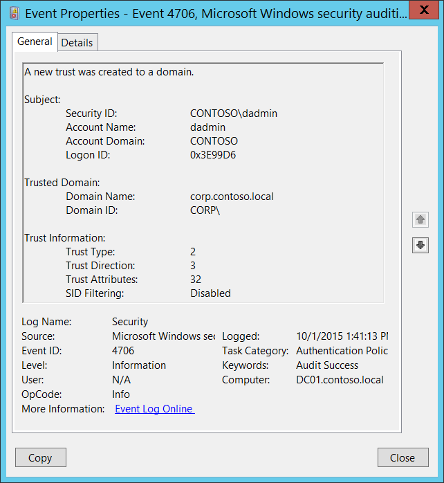

# 4706(S): ドメインに新しい信頼が作成されました。



***サブカテゴリ:***&nbsp;[認証ポリシー変更の監査](audit-authentication-policy-change.md)

***イベントの説明:***

このイベントは、ドメインに新しい信頼が作成されたときに生成されます。

このイベントはドメインコントローラーでのみ生成されます。

> **注**&nbsp;&nbsp;推奨事項については、このイベントの[セキュリティ監視の推奨事項](#security-monitoring-recommendations)を参照してください。

<br clear="all">

***イベント XML:***
```xml
- <Event xmlns="http://schemas.microsoft.com/win/2004/08/events/event">
- <System>
 <Provider Name="Microsoft-Windows-Security-Auditing" Guid="{54849625-5478-4994-A5BA-3E3B0328C30D}" /> 
 <EventID>4706</EventID> 
 <Version>0</Version> 
 <Level>0</Level> 
 <Task>13569</Task> 
 <Opcode>0</Opcode> 
 <Keywords>0x8020000000000000</Keywords> 
 <TimeCreated SystemTime="2015-10-01T20:41:13.189445500Z" /> 
 <EventRecordID>1049759</EventRecordID> 
 <Correlation /> 
 <Execution ProcessID="500" ThreadID="4900" /> 
 <Channel>Security</Channel> 
 <Computer>DC01.contoso.local</Computer> 
 <Security /> 
 </System>
- <EventData>
 <Data Name="DomainName">corp.contoso.local</Data> 
 <Data Name="DomainSid">S-1-5-21-2226861337-2836268956-2433141405</Data> 
 <Data Name="SubjectUserSid">S-1-5-21-3457937927-2839227994-823803824-1104</Data> 
 <Data Name="SubjectUserName">dadmin</Data> 
 <Data Name="SubjectDomainName">CONTOSO</Data> 
 <Data Name="SubjectLogonId">0x3e99d6</Data> 
 <Data Name="TdoType">2</Data> 
 <Data Name="TdoDirection">3</Data> 
 <Data Name="TdoAttributes">32</Data> 
 <Data Name="SidFilteringEnabled">%%1796</Data> 
 </EventData>
 </Event>

```

***必要なサーバー役割:*** Active Directory ドメインコントローラー。

***最小 OS バージョン:*** Windows Server 2008。

***イベントバージョン:*** 0。

***フィールドの説明:***

**サブジェクト:**

-   **セキュリティ ID** \[タイプ = SID\]**:** 「ドメイン信頼の作成」操作を要求したアカウントのSID。イベントビューアーは自動的にSIDを解決し、アカウント名を表示しようとします。SIDが解決できない場合、イベントにはソースデータが表示されます。

> **注**&nbsp;&nbsp;**セキュリティ識別子 (SID)** は、トラスティ (セキュリティプリンシパル) を識別するために使用される可変長の一意の値です。各アカウントには、Active Directory ドメインコントローラーなどの権限によって発行され、セキュリティデータベースに保存される一意のSIDがあります。ユーザーがログオンするたびに、システムはデータベースからそのユーザーのSIDを取得し、そのユーザーのアクセストークンに配置します。システムはアクセストークン内のSIDを使用して、以降のすべてのWindowsセキュリティとのやり取りでユーザーを識別します。SIDがユーザーまたはグループの一意の識別子として使用された場合、それは他のユーザーまたはグループを識別するために再利用されることはありません。SIDの詳細については、[セキュリティ識別子](/windows/access-protection/access-control/security-identifiers)を参照してください。

-   **アカウント名** \[タイプ = UnicodeString\]**:** 「ドメイン信頼の作成」操作を要求したアカウントの名前。

-   **アカウントドメイン** \[タイプ = UnicodeString\]**:** サブジェクトのドメインまたはコンピュータ名。形式は以下のように異なります：

    -   ドメインのNETBIOS名の例：CONTOSO

    -   小文字の完全なドメイン名：contoso.local

    -   大文字の完全なドメイン名：CONTOSO.LOCAL

    -   LOCAL SERVICEやANONYMOUS LOGONなどの[よく知られたセキュリティプリンシパル](/windows/security/identity-protection/access-control/security-identifiers)の場合、このフィールドの値は「NT AUTHORITY」となります。

    -   ローカルユーザーアカウントの場合、このフィールドにはこのアカウントが属するコンピュータまたはデバイスの名前が含まれます。例：「Win81」。

-   **ログオンID** \[タイプ = HexInt64\]**:** 16進数の値で、最近のイベントと同じログオンIDを含む可能性のあるこのイベントを関連付けるのに役立ちます。例：「[4624](event-4624.md): アカウントが正常にログオンされました。」

**信頼されたドメイン:**

-   **ドメイン名** \[タイプ = UnicodeString\]**:** 新しい信頼されたドメインの名前。

-   **ドメインID** \[タイプ = SID\]**:** 新しい信頼されたドメインのSID。イベントビューアーは自動的にSIDを解決し、アカウント名を表示しようとします。SIDが解決できない場合、イベントにソースデータが表示されます。

**信頼情報:**

-   **信頼タイプ** \[タイプ = UInt32\]**:** 新しい信頼のタイプ。以下の表には、このフィールドの可能な値が含まれています：

| 値   | 属性値                  | 説明                                                                                                                                                                                                                                                                                                                                                                                                                                                                                                                                |
|------|------------------------|-------------------------------------------------------------------------------------------------------------------------------------------------------------------------------------------------------------------------------------------------------------------------------------------------------------------------------------------------------------------------------------------------------------------------------------------------------------------------------------------------------------------------------------|
| 1    | TRUST\_TYPE\_DOWNLEVEL | 信頼されたドメインのドメインコントローラーは、Windows 2000以前のオペレーティングシステムを実行しているコンピュータです。                                                                                                                                                                                                                                                                                                                                                                                                                           |
| 2    | TRUST\_TYPE\_UPLEVEL   | 信頼されたドメインのドメインコントローラーは、Windows 2000以降を実行しているコンピュータです。                                                                                                                                                                                                                                                                                                                                                                                                                                                   |
| 3    | TRUST\_TYPE\_MIT       | 信頼されたドメインは、非WindowsのRFC4120準拠のKerberosディストリビューションを実行しています。このタイプの信頼は、(1) [SID](/openspecs/windows_protocols/ms-adts/b645c125-a7da-4097-84a1-2fa7cea07714#gt_83f2020d-0804-4840-a5ac-e06439d50f8d)が[TDO](/openspecs/windows_protocols/ms-adts/b645c125-a7da-4097-84a1-2fa7cea07714#gt_f2ceef4e-999b-4276-84cd-2e2829de5fc4)に必要ないこと、(2) デフォルトのキータイプにはDES-CBCおよびDES-CRC暗号化タイプが含まれること（[RFC4120](https://go.microsoft.com/fwlink/?LinkId=90458)セクション8.1を参照）によって区別されます。 |
| 4    | TRUST\_TYPE\_DCE       | 信頼されたドメインはDCE領域です。歴史的な参照であり、この値はWindowsでは使用されていません。                                                                                                                                                                                                                                                                                                                                                                                                                                                |

-   **信頼の方向** \[Type = UInt32\]**:** 新しい信頼の方向。以下の表にこのフィールドの可能な値が含まれています：

| 値   | 属性値                           | 説明                                                                                                 |
|------|----------------------------------|------------------------------------------------------------------------------------------------------|
| 0    | TRUST\_DIRECTION\_DISABLED       | 信頼関係は存在するが、無効化されています。                                                            |
| 1    | TRUST\_DIRECTION\_INBOUND        | 信頼されたドメインは、名前の検索や認証などの操作を実行するためにプライマリドメインを信頼します。         |
| 2    | TRUST\_DIRECTION\_OUTBOUND       | プライマリドメインは、名前の検索や認証などの操作を実行するために信頼されたドメインを信頼します。         |
| 3    | TRUST\_DIRECTION\_BIDIRECTIONAL  | 両方のドメインが名前の検索や認証などの操作を相互に信頼します。                                        |

-   **信頼属性** \[Type = UInt32\]**:** 新しい信頼の属性の10進値。10進値を16進値に変換し、以下の表で確認してください。以下の表にこのフィールドの可能な値が含まれています：

| 値    | 属性値                                                      | 説明                                                                                                                                                                                                                                                                                                                                                                                                                                                                                                                                                                                                                                                                                                                                                                                                                                                                                                                                                                                                                      |
|-------|-------------------------------------------------------------|---------------------------------------------------------------------------------------------------------------------------------------------------------------------------------------------------------------------------------------------------------------------------------------------------------------------------------------------------------------------------------------------------------------------------------------------------------------------------------------------------------------------------------------------------------------------------------------------------------------------------------------------------------------------------------------------------------------------------------------------------------------------------------------------------------------------------------------------------------------------------------------------------------------------------------------------------------------------------------------------------------------------------|
| 0x1   | TRUST\_ATTRIBUTE\_NON\_TRANSITIVE                           | このビットが設定されている場合、信頼は推移的に使用できません。例えば、ドメインAがドメインBを信頼し、BがドメインCを信頼している場合、A&lt;--&gt;Bの信頼にこの属性が設定されていると、ドメインAのクライアントはA&lt;--&gt;B&lt;--&gt;Cの信頼リンクを介してドメインCのサーバーに認証できません。                                                                                                                                                                                                                                                                                                                                                                                                                                                                                                                                                                                                                                                                                                                                                      |
| 0x2   | TRUST\_ATTRIBUTE\_UPLEVEL\_ONLY                             | このビットが属性に設定されている場合、Windows 2000以降のクライアントのみが信頼リンクを使用できます。[Netlogon](/openspecs/windows_protocols/ms-adts/b645c125-a7da-4097-84a1-2fa7cea07714#gt_70771a5a-04a3-447d-981b-e03098808c32)は、このフラグが設定された[信頼オブジェクト](/openspecs/windows_protocols/ms-adts/b645c125-a7da-4097-84a1-2fa7cea07714#gt_e81f6436-01d2-4311-93a4-4316bb67eabd)を消費しません。                                                                                                                                                                                                                                                                                                                                                                                                                                                                                                                                                                                                                      |
| 0x4   | TRUST\_ATTRIBUTE\_QUARANTINED\_DOMAIN                       | このビットが設定されている場合、信頼されたドメインは隔離され、[SID](/openspecs/windows_protocols/ms-adts/b645c125-a7da-4097-84a1-2fa7cea07714#gt_83f2020d-0804-4840-a5ac-e06439d50f8d)フィルタリングのルールに従います。詳細は[\[MS-PAC\]](/openspecs/windows_protocols/ms-pac/166d8064-c863-41e1-9c23-edaaa5f36962)セクション[4.1.2.2](/openspecs/windows_protocols/ms-pac/55fc19f2-55ba-4251-8a6a-103dd7c66280)を参照してください。                                                                                                                                                                                                                                                                                                                                                                                                                                                                                                                                                                                                                      |
| 0x8   | TRUST\_ATTRIBUTE\_FOREST\_TRANSITIVE                        | このビットが設定されている場合、信頼リンクは2つの[フォレスト](/openspecs/windows_protocols/ms-adts/b645c125-a7da-4097-84a1-2fa7cea07714#gt_fd104241-4fb3-457c-b2c4-e0c18bb20b62)のルートドメイン間の[クロスフォレスト信頼](/openspecs/windows_protocols/ms-adts/b645c125-a7da-4097-84a1-2fa7cea07714#gt_86f3dbf2-338f-462e-8c5b-3c8e05798dbc)です。両方のフォレストはDS\_BEHAVIOR\_WIN2003以上の[フォレスト機能レベル](/openspecs/windows_protocols/ms-adts/b645c125-a7da-4097-84a1-2fa7cea07714#gt_b3240417-ca43-4901-90ec-fde55b32b3b8)で動作しています。<br>Windows Server 2003、Windows Server 2008、Windows Server 2008 R2、Windows Server 2012、Windows Server 2012 R2、およびWindows Server 2016でのみ評価されます。<br>フォレストおよび信頼されたフォレストがDS\_BEHAVIOR\_WIN2003以上のフォレスト機能レベルで動作している場合にのみ設定できます。                                                                                                                                                                                                                                                                                                                                                      |
| 0x10  | TRUST\_ATTRIBUTE\_CROSS\_ORGANIZATION                       | このビットが設定されている場合、信頼は[組織](/openspecs/windows_protocols/ms-adts/b645c125-a7da-4097-84a1-2fa7cea07714#gt_6fae7775-5232-4206-b452-f298546ab54f)の一部ではないドメインまたはフォレストに対するものです。このビットによって制御される動作は、[\[MS-KILE\]](/openspecs/windows_protocols/ms-kile/2a32282e-dd48-4ad9-a542-609804b02cc9)セクション[3.3.5.7.5](/openspecs/windows_protocols/ms-kile/bac4dc69-352d-416c-a9f4-730b81ababb3)および[\[MS-APDS\]](/openspecs/windows_protocols/ms-apds/dd444344-fd7e-430e-b313-7e95ab9c338e)セクション[3.1.5](/openspecs/windows_protocols/ms-apds/f47e40e1-b9ca-47e2-b139-15a1e96b0e72)で説明されています。<br>Windows Server 2003、Windows Server 2008、Windows Server 2008 R2、Windows Server 2012、Windows Server 2012 R2、およびWindows Server 2016でのみ評価されます。<br>フォレストおよび信頼されたフォレストがDS\_BEHAVIOR\_WIN2003以上のフォレスト機能レベルで動作している場合にのみ設定できます。                                                                                                                                                                                                                      |
| 0x20  | TRUST\_ATTRIBUTE\_WITHIN\_FOREST                            | このビットが設定されている場合、信頼されたドメインは同じフォレスト内にあります。<br>Windows Server 2003、Windows Server 2008、Windows Server 2008 R2、Windows Server 2012、Windows Server 2012 R2、およびWindows Server 2016でのみ評価されます。                                                                                                                                                                                                                                                                                                                                                                                                                                                                                                                                                                                                                                                                                                                                                      |
| 0x40  | TRUST\_ATTRIBUTE\_TREAT\_AS\_EXTERNAL                       | このビットが設定されている場合、ドメインへのクロスフォレスト信頼はSIDフィルタリングの目的で外部信頼として扱われます。クロスフォレスト信頼は外部信頼よりも厳密に[フィルタリング](/openspecs/windows_protocols/ms-adts/b645c125-a7da-4097-84a1-2fa7cea07714#gt_ffbe7b55-8e84-4f41-a18d-fc29191a4cda)されます。この属性は、クロスフォレスト信頼を外部信頼と同等に緩和します。各信頼タイプがどのようにフィルタリングされるかの詳細は、[\[MS-PAC\]](/openspecs/windows_protocols/ms-pac/166d8064-c863-41e1-9c23-edaaa5f36962)セクション4.1.2.2を参照してください。<br>Windows Server 2003、Windows Server 2008、Windows Server 2008 R2、Windows Server 2012、Windows Server 2012 R2、およびWindows Server 2016でのみ評価されます。<br>SIDフィルタリングが使用されている場合にのみ評価されます。<br>TRUST\_ATTRIBUTE\_FOREST\_TRANSITIVEを持つクロスフォレスト信頼にのみ評価されます。<br>フォレストおよび信頼されたフォレストがDS\_BEHAVIOR\_WIN2003以上のフォレスト機能レベルで動作している場合にのみ設定できます。                                                                                                                                                                                                                      |
| 0x80  | TRUST\_ATTRIBUTE\_USES\_RC4\_ENCRYPTION                     | このビットは、RC4キーを使用できるTRUST\_TYPE\_MITに設定された信頼に設定されます。歴史的に、MIT KerberosディストリビューションはDESおよび3DESキーのみをサポートしていました（[\[RFC4120\]](https://go.microsoft.com/fwlink/?LinkId=90458)、[\[RFC3961\]](https://go.microsoft.com/fwlink/?LinkId=90450)）。MIT 1.4.1は、Windows 2000で一般的なRC4HMAC暗号化タイプを採用しました（[\[MS-KILE\]](/openspecs/windows_protocols/ms-kile/2a32282e-dd48-4ad9-a542-609804b02cc9)）、したがって、MITディストリビューションの後のバージョンを展開する信頼されたドメインにはこのビットが必要でした。詳細は「キーと信頼」、セクション[6.1.6.9.1](/openspecs/windows_protocols/ms-adts/c964fca9-c50e-426a-9173-5bf3cb720e2e)を参照してください。<br>TRUST\_TYPE\_MITでのみ評価されます。                                                                                                                                                                                                                      |
| 0x200 | TRUST\_ATTRIBUTE\_CROSS\_ORGANIZATION\_NO\_TGT\_DELEGATION  | このビットが設定されている場合、この信頼の下で発行されたチケットは委任のために信頼されてはなりません。このビットによって制御される動作は、[\[MS-KILE\]](/openspecs/windows_protocols/ms-kile/2a32282e-dd48-4ad9-a542-609804b02cc9)セクション3.3.5.7.5に指定されています。<br>Windows Server 2012、Windows Server 2012 R2、およびWindows Server 2016でのみサポートされています。                                                                                                                                                                                                                                                                                                                                                                                                                                                                                                                                                                                                                      |
| 0x400 | TRUST\_ATTRIBUTE\_PIM\_TRUST                                | このビットとTATEビットが設定されている場合、ドメインへのクロスフォレスト信頼はSIDフィルタリングの目的で特権ID管理信頼として扱われます。各信頼タイプがどのようにフィルタリングされるかの詳細は、[\[MS-PAC\]](/openspecs/windows_protocols/ms-pac/166d8064-c863-41e1-9c23-edaaa5f36962)セクション4.1.2.2を参照してください。<br>Windows Server 2016でのみ評価されます。<br>SIDフィルタリングが使用されている場合にのみ評価されます。<br>TRUST\_ATTRIBUTE\_FOREST\_TRANSITIVEを持つクロスフォレスト信頼にのみ評価されます。<br>フォレストおよび信頼されたフォレストがDS\_BEHAVIOR\_WINTHRESHOLD以上のフォレスト機能レベルで動作している場合にのみ設定できます。                                                                                                                                                                                                                      |

-   **SID フィルタリング** \[Type = UnicodeString\]: 新しい信頼のための [SID フィルタリング](/previous-versions/windows/it-pro/windows-server-2003/cc772633(v=ws.10)) の状態:

    -   有効

    -   無効

## セキュリティ監視の推奨事項

4706(S): ドメインへの新しい信頼が作成されました。

-   Active Directory ドメイン信頼に関連する変更（特に新しい信頼の作成）はすべて監視され、アラートがトリガーされるべきです。この変更が計画されていない場合は、変更の理由を調査してください。
