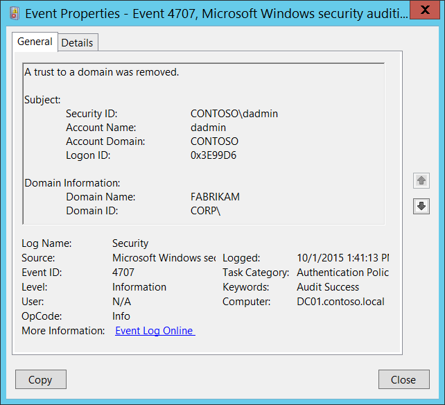

# 4707(S): ドメインへの信頼が削除されました。



***サブカテゴリ:***&nbsp;[認証ポリシー変更の監査](audit-authentication-policy-change.md)

***イベントの説明:***

このイベントは、ドメイン信頼が削除されたときに生成されます。

このイベントはドメインコントローラーでのみ生成されます。

> **注**&nbsp;&nbsp;推奨事項については、このイベントの[セキュリティ監視の推奨事項](#security-monitoring-recommendations)を参照してください。

<br clear="all">

***イベント XML:***
```
- <Event xmlns="http://schemas.microsoft.com/win/2004/08/events/event">
- <System>
 <Provider Name="Microsoft-Windows-Security-Auditing" Guid="{54849625-5478-4994-A5BA-3E3B0328C30D}" /> 
 <EventID>4707</EventID> 
 <Version>0</Version> 
 <Level>0</Level> 
 <Task>13569</Task> 
 <Opcode>0</Opcode> 
 <Keywords>0x8020000000000000</Keywords> 
 <TimeCreated SystemTime="2015-10-01T20:41:13.080444700Z" /> 
 <EventRecordID>1049754</EventRecordID> 
 <Correlation /> 
 <Execution ProcessID="500" ThreadID="580" /> 
 <Channel>Security</Channel> 
 <Computer>DC01.contoso.local</Computer> 
 <Security /> 
 </System>
- <EventData>
 <Data Name="DomainName">FABRIKAM</Data> 
 <Data Name="DomainSid">S-1-5-21-2226861337-2836268956-2433141405</Data> 
 <Data Name="SubjectUserSid">S-1-5-21-3457937927-2839227994-823803824-1104</Data> 
 <Data Name="SubjectUserName">dadmin</Data> 
 <Data Name="SubjectDomainName">CONTOSO</Data> 
 <Data Name="SubjectLogonId">0x3e99d6</Data> 
 </EventData>
 </Event>

```

***必要なサーバー役割:*** Active Directory ドメインコントローラー。

***最小 OS バージョン:*** Windows Server 2008。

***イベントバージョン:*** 0。

***フィールドの説明:***

**サブジェクト:**

-   **セキュリティ ID** \[タイプ = SID\]**:** 「ドメイン信頼の削除」操作を要求したアカウントの SID。イベントビューアーは自動的に SID を解決してアカウント名を表示しようとします。SID を解決できない場合、イベントにはソースデータが表示されます。

> **注**&nbsp;&nbsp;**セキュリティ識別子 (SID)** は、トラスティ (セキュリティプリンシパル) を識別するために使用される可変長の一意の値です。各アカウントには、Active Directory ドメインコントローラーなどの権限によって発行され、セキュリティデータベースに保存される一意の SID があります。ユーザーがログオンするたびに、システムはデータベースからそのユーザーの SID を取得し、そのユーザーのアクセス トークンに配置します。システムはアクセス トークン内の SID を使用して、以降のすべての Windows セキュリティとのやり取りでユーザーを識別します。SID がユーザーまたはグループの一意の識別子として使用された場合、それは他のユーザーまたはグループを識別するために再利用されることはありません。SID の詳細については、[セキュリティ識別子](/windows/access-protection/access-control/security-identifiers)を参照してください。

-   **アカウント名** \[タイプ = UnicodeString\]**:** 「ドメイン信頼の削除」操作を要求したアカウントの名前。

-   **アカウントドメイン** \[タイプ = UnicodeString\]**:** サブジェクトのドメインまたはコンピュータ名。形式はさまざまで、以下を含みます：

    -   ドメインのNETBIOS名の例: CONTOSO

    -   小文字の完全なドメイン名: contoso.local

    -   大文字の完全なドメイン名: CONTOSO.LOCAL

    -   一部の[既知のセキュリティプリンシパル](/windows/security/identity-protection/access-control/security-identifiers)（例えば、LOCAL SERVICEやANONYMOUS LOGONなど）の場合、このフィールドの値は「NT AUTHORITY」となります。

    -   ローカルユーザーアカウントの場合、このフィールドにはこのアカウントが属するコンピュータまたはデバイスの名前が含まれます。例えば、「Win81」のように。

-   **ログオンID** \[タイプ = HexInt64\]**:** 16進数の値で、最近のイベントと同じログオンIDを含む可能性のあるイベントとこのイベントを関連付けるのに役立ちます。例えば、「[4624](event-4624.md): アカウントが正常にログオンされました。」

**ドメイン情報:**

-   **ドメイン名** \[タイプ = UnicodeString\]**:** 削除された信頼されたドメインの名前。

-   **ドメインID** \[タイプ = SID\]**:** 削除された信頼されたドメインのSID。イベントビューアーは自動的にSIDを解決し、アカウント名を表示しようとします。SIDが解決できない場合、イベントにはソースデータが表示されます。

## セキュリティ監視の推奨事項

4707(S): ドメインへの信頼が削除されました。

-   Active Directoryドメイン信頼に関連する変更（特に信頼の削除）はすべて監視され、アラートがトリガーされるべきです。この変更が計画されていなかった場合、変更の理由を調査してください。
