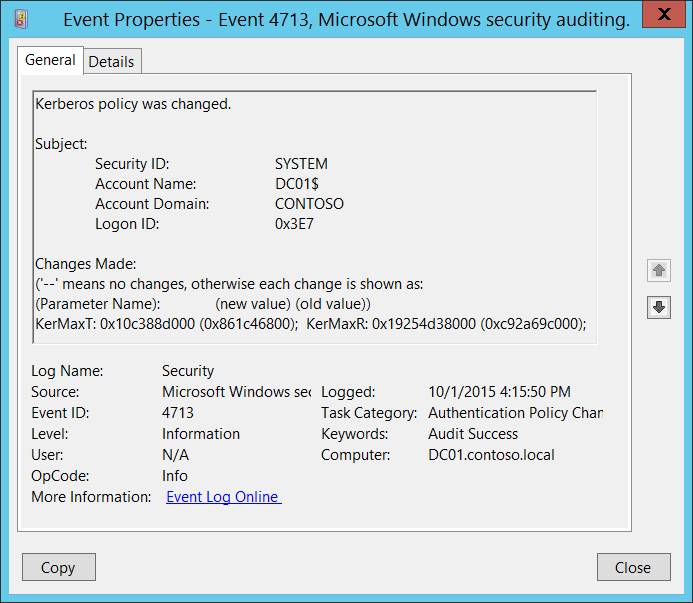
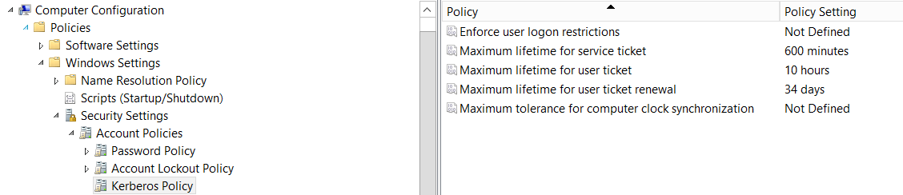

# 4713(S): Kerberos ポリシーが変更されました。



***サブカテゴリ:***&nbsp;[認証ポリシー変更の監査](audit-authentication-policy-change.md)

***イベントの説明:***

このイベントは [Kerberos](/windows/win32/secauthn/microsoft-kerberos) ポリシーが変更されたときに生成されます。

このイベントはドメイン コントローラーでのみ生成されます。

> **注**&nbsp;&nbsp;推奨事項については、このイベントの [セキュリティ監視の推奨事項](#security-monitoring-recommendations) を参照してください。

<br clear="all">

***イベント XML:***
```
- <Event xmlns="http://schemas.microsoft.com/win/2004/08/events/event">
- <System>
 <Provider Name="Microsoft-Windows-Security-Auditing" Guid="{54849625-5478-4994-A5BA-3E3B0328C30D}" /> 
 <EventID>4713</EventID> 
 <Version>0</Version> 
 <Level>0</Level> 
 <Task>13569</Task> 
 <Opcode>0</Opcode> 
 <Keywords>0x8020000000000000</Keywords> 
 <TimeCreated SystemTime="2015-10-01T23:15:50.811774300Z" /> 
 <EventRecordID>1049772</EventRecordID> 
 <Correlation /> 
 <Execution ProcessID="500" ThreadID="4116" /> 
 <Channel>Security</Channel> 
 <Computer>DC01.contoso.local</Computer> 
 <Security /> 
 </System>
- <EventData>
 <Data Name="SubjectUserSid">S-1-5-18</Data> 
 <Data Name="SubjectUserName">DC01$</Data> 
 <Data Name="SubjectDomainName">CONTOSO</Data> 
 <Data Name="SubjectLogonId">0x3e7</Data> 
 <Data Name="KerberosPolicyChange">KerMaxT: 0x10c388d000 (0x861c46800); KerMaxR: 0x19254d38000 (0xc92a69c000);</Data> 
 </EventData>
 </Event>

```

***必要なサーバー ロール:*** Active Directory ドメイン コントローラー。

***最小 OS バージョン:*** Windows Server 2008。

***イベント バージョン:*** 0。

***フィールドの説明:***

**サブジェクト:**

-   **セキュリティ ID** \[タイプ = SID\]**:** Kerberos ポリシーを変更したアカウントの SID。イベント ビューアーは自動的に SID を解決してアカウント名を表示しようとします。SID を解決できない場合、イベントにソース データが表示されます。

> **注**&nbsp;&nbsp;**セキュリティ識別子 (SID)** は、トラスティ (セキュリティ プリンシパル) を識別するために使用される可変長の一意の値です。各アカウントには、Active Directory ドメイン コントローラーなどの認証機関によって発行され、セキュリティ データベースに保存される一意の SID があります。ユーザーがログオンするたびに、システムはデータベースからそのユーザーの SID を取得し、そのユーザーのアクセス トークンに配置します。システムはアクセス トークン内の SID を使用して、以降のすべての Windows セキュリティとのやり取りでユーザーを識別します。SID がユーザーまたはグループの一意の識別子として使用された場合、それが再び別のユーザーまたはグループを識別するために使用されることはありません。SID の詳細については、[セキュリティ識別子](/windows/access-protection/access-control/security-identifiers) を参照してください。

-   **アカウント名** \[タイプ = UnicodeString\]**:** Kerberosポリシーに変更を加えたアカウントの名前。

-   **アカウントドメイン** \[タイプ = UnicodeString\]**:** 対象のドメインまたはコンピュータ名。形式は以下のように異なります：

    -   ドメインのNETBIOS名の例: CONTOSO

    -   小文字の完全なドメイン名: contoso.local

    -   大文字の完全なドメイン名: CONTOSO.LOCAL

    -   一部の[よく知られたセキュリティプリンシパル](/windows/security/identity-protection/access-control/security-identifiers)の場合、例えばLOCAL SERVICEやANONYMOUS LOGON、このフィールドの値は「NT AUTHORITY」となります。

    -   ローカルユーザーアカウントの場合、このフィールドにはこのアカウントが属するコンピュータまたはデバイスの名前が含まれます。例えば：「Win81」。

-   **ログオンID** \[タイプ = HexInt64\]**:** 16進数の値で、最近のイベントと同じログオンIDを含む可能性のあるイベントとこのイベントを関連付けるのに役立ちます。例えば、「[4624](event-4624.md): アカウントが正常にログオンされました。」

**変更内容** \[タイプ = UnicodeString\]**:** '--' は変更なしを意味し、それ以外の場合は各変更が次のように表示されます：Parameter\_Name: new\_value (old\_value)。以下は可能なパラメータ名のリストです：

| パラメータ名 | 説明                                                                                                                                                                                             |
|--------------|--------------------------------------------------------------------------------------------------------------------------------------------------------------------------------------------------|
| KerProxy     | 1.  コンピュータの時計同期の最大許容時間。<br>**KerProxy**を分に変換するには:<br>値を10進数に変換します。<br>値を600000000で割ります。 |
| KerMaxR      | 1.  ユーザーチケット更新の最大有効期間。<br>**KerProxy**を日に変換するには:<br>値を10進数に変換します。<br>値を864000000000で割ります。             |
| KerMaxT      | 1.  ユーザーチケットの最大有効期間。<br>**KerMaxT**を時間に変換するには:<br>値を10進数に変換します。<br>値を36000000000で割ります。                      |
| KerMinT      | 1.  サービスチケットの最大有効期間。<br>**KerMinT**を分に変換するには:<br>値を10進数に変換します。<br>値を600000000で割ります。                   |
| KerOpts      | -   ユーザーログオン制限を強制する:<br>0x80 – 有効<br>0x0 - 無効                                                                                                                    |

このイベントは「Kerberos ポリシー」の変更を示します。以下は、グループ ポリシー管理コンソールにおける Kerberos ポリシーの場所です：



## セキュリティ監視の推奨事項

4713(S): Kerberos ポリシーが変更されました。

-   現在のイベントによって報告された Kerberos ポリシーの変更はすべて監視され、アラートがトリガーされるべきです。この変更が計画されていなかった場合、変更の理由を調査してください。
