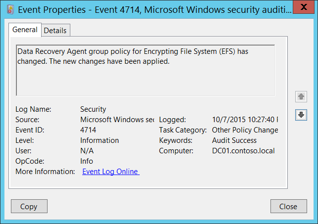

# 4714(S): 暗号化データ回復ポリシーが変更されました。



***サブカテゴリ:***&nbsp;[その他のポリシー変更イベントの監査](audit-other-policy-change-events.md)

***イベントの説明:***

このイベントは、暗号化ファイルシステム ([EFS](/previous-versions/tn-archive/cc700811(v=technet.10))) のデータ回復エージェントグループポリシーが変更されたときに生成されます。

このイベントは、コンピューターまたはデバイスのデータ回復エージェント証明書または[データ回復エージェントポリシー](/previous-versions/windows/it-pro/windows-server-2003/cc778208(v=ws.10))が変更されたときに生成されます。

バックグラウンドでは、このイベントはグループポリシーの更新中に[\\HKLM\\Software\\Policies\\Microsoft\\SystemCertificates\\EFS\\EfsBlob](/openspecs/windows_protocols/ms-gpef/34fd0504-84fc-4ad9-97ac-ee74b84419ac) レジストリ値が変更されたときに生成されます。

> **注**&nbsp;&nbsp;推奨事項については、このイベントの[セキュリティ監視の推奨事項](#security-monitoring-recommendations)を参照してください。

<br clear="all">

***イベント XML:***
```
- <Event xmlns="http://schemas.microsoft.com/win/2004/08/events/event">
- <System>
 <Provider Name="Microsoft-Windows-Security-Auditing" Guid="{54849625-5478-4994-a5ba-3e3b0328c30d}" /> 
 <EventID>4714</EventID> 
 <Version>0</Version> 
 <Level>0</Level> 
 <Task>13573</Task> 
 <Opcode>0</Opcode> 
 <Keywords>0x8020000000000000</Keywords> 
 <TimeCreated SystemTime="2015-10-08T05:27:40.740602500Z" /> 
 <EventRecordID>1080883</EventRecordID> 
 <Correlation /> 
 <Execution ProcessID="524" ThreadID="4856" /> 
 <Channel>Security</Channel> 
 <Computer>DC01.contoso.local</Computer> 
 <Security /> 
 </System>
- <ProcessingErrorData>
 <ErrorCode>13</ErrorCode> 
 <DataItemName>SubjectUserSid</DataItemName> 
 <EventPayload /> 
 </ProcessingErrorData>
 </Event>

```

***必要なサーバー役割:*** なし。

***最小 OS バージョン:*** Windows Server 2008, Windows Vista。

***イベントバージョン:*** 0。

## セキュリティ監視の推奨事項

4714(S): 暗号化データ回復ポリシーが変更されました。

-   このイベントを監視し、変更が計画されていなかった場合は、変更の理由を調査することをお勧めします。
