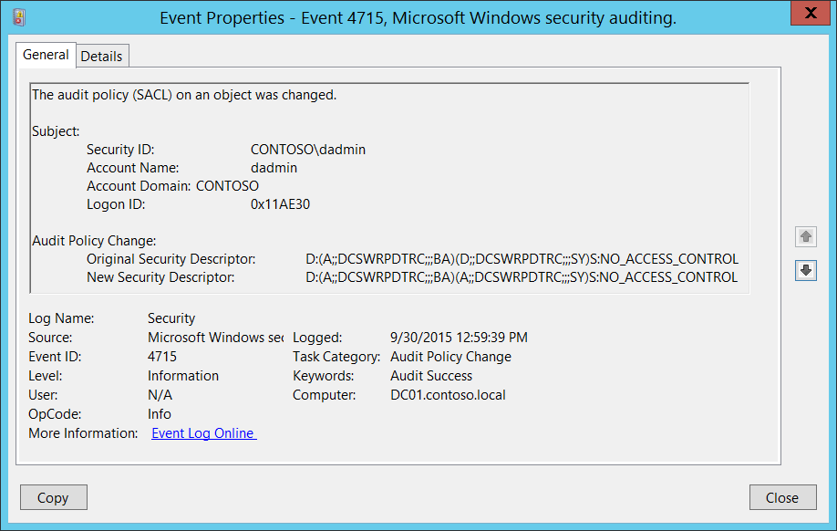

# 4715(S): オブジェクトの監査ポリシー (SACL) が変更されました。



***サブカテゴリ:***&nbsp;[監査ポリシーの変更](audit-audit-policy-change.md)

***イベントの説明:***

このイベントは、ローカル監査ポリシーのセキュリティ記述子が変更されるたびに生成されます。

このイベントは、「監査ポリシーの変更」サブカテゴリの設定に関係なく常に記録されます。

> **注**&nbsp;&nbsp;推奨事項については、このイベントの[セキュリティ監視の推奨事項](#security-monitoring-recommendations)を参照してください。

<br clear="all">

***イベント XML:***
```xml
- <Event xmlns="http://schemas.microsoft.com/win/2004/08/events/event">
- <System>
 <Provider Name="Microsoft-Windows-Security-Auditing" Guid="{54849625-5478-4994-A5BA-3E3B0328C30D}" /> 
 <EventID>4715</EventID> 
 <Version>0</Version> 
 <Level>0</Level> 
 <Task>13568</Task> 
 <Opcode>0</Opcode> 
 <Keywords>0x8020000000000000</Keywords> 
 <TimeCreated SystemTime="2015-09-30T19:59:39.964601800Z" /> 
 <EventRecordID>1049425</EventRecordID> 
 <Correlation /> 
 <Execution ProcessID="516" ThreadID="4668" /> 
 <Channel>Security</Channel> 
 <Computer>DC01.contoso.local</Computer> 
 <Security /> 
 </System>
- <EventData>
 <Data Name="SubjectUserSid">S-1-5-21-3457937927-2839227994-823803824-1104</Data> 
 <Data Name="SubjectUserName">dadmin</Data> 
 <Data Name="SubjectDomainName">CONTOSO</Data> 
 <Data Name="SubjectLogonId">0x11ae30</Data> 
 <Data Name="OldSd">D:(A;;DCSWRPDTRC;;;BA)(D;;DCSWRPDTRC;;;SY)S:NO\_ACCESS\_CONTROL</Data> 
 <Data Name="NewSd">D:(A;;DCSWRPDTRC;;;BA)(A;;DCSWRPDTRC;;;SY)S:NO\_ACCESS\_CONTROL</Data> 
 </EventData>
 </Event>
```

***必要なサーバー ロール:*** なし。

***最小 OS バージョン:*** Windows Server 2008、Windows Vista。

***イベント バージョン:*** 0。

***フィールドの説明:***

**サブジェクト:**

-   **セキュリティ ID** \[タイプ = SID\]**:** 「ローカル監査ポリシーのセキュリティ記述子 (SACL) の変更」操作を要求したアカウントの SID。イベント ビューアーは自動的に SID を解決し、アカウント名を表示しようとします。SID を解決できない場合、イベントにソース データが表示されます。

> **注**&nbsp;&nbsp;**セキュリティ識別子 (SID)** は、トラスティ (セキュリティ プリンシパル) を識別するために使用される可変長の一意の値です。各アカウントには、Active Directory ドメイン コントローラーなどの権限によって発行され、セキュリティ データベースに保存される一意の SID があります。ユーザーがログオンするたびに、システムはデータベースからそのユーザーの SID を取得し、そのユーザーのアクセストークンに配置します。システムは、アクセストークン内の SID を使用して、以降のすべての Windows セキュリティとのやり取りでユーザーを識別します。SID がユーザーまたはグループの一意の識別子として使用された場合、それが再び別のユーザーまたはグループを識別するために使用されることはありません。SID の詳細については、[セキュリティ識別子](/windows/access-protection/access-control/security-identifiers)を参照してください。

-   **アカウント名** \[タイプ = UnicodeString\]**:** 「ローカル監査ポリシーセキュリティ記述子 (SACL) の変更」操作を要求したアカウントの名前。

-   **アカウントドメイン** \[タイプ = UnicodeString\]**:** サブジェクトのドメインまたはコンピュータ名。形式は以下のように異なります：

    -   ドメイン NETBIOS 名の例: CONTOSO

    -   小文字の完全ドメイン名: contoso.local

    -   大文字の完全ドメイン名: CONTOSO.LOCAL

    -   一部の[よく知られたセキュリティプリンシパル](/windows/security/identity-protection/access-control/security-identifiers)の場合、例えば LOCAL SERVICE や ANONYMOUS LOGON、このフィールドの値は「NT AUTHORITY」となります。

    -   ローカルユーザーアカウントの場合、このフィールドにはこのアカウントが属するコンピュータまたはデバイスの名前が含まれます。例: 「Win81」。

-   **ログオン ID** \[タイプ = HexInt64\]**:** 16進数の値で、最近のイベントとこのイベントを関連付けるのに役立ちます。例えば、「[4624](event-4624.md): アカウントが正常にログオンされました。」

**監査ポリシーの変更:**

-   **元のセキュリティ記述子** \[タイプ = UnicodeString\]**:** 監査ポリシーの古いセキュリティ記述子定義言語 (SDDL) の値。

-   **新しいセキュリティ記述子** \[タイプ = UnicodeString\]**:** 監査ポリシーの新しいセキュリティ記述子定義言語 (SDDL) の値。

> **注**&nbsp;&nbsp;**セキュリティ記述子定義言語 (SDDL)** は、セキュリティ記述子に含まれる情報を列挙するための文字列要素を定義します。
> 
> 例:
> 
> *O*:BA*G*:SY*D*:(D;;0xf0007;;;AN)(D;;0xf0007;;;BG)(A;;0xf0007;;;SY)(A;;0×7;;;BA)*S*:ARAI(AU;SAFA;DCLCRPCRSDWDWO;;;WD)
> 
> - *O*: = オーナー。特定のセキュリティプリンシパルの SID、または予約済み（事前定義された）値。例: BA (BUILTIN\_ADMINISTRATORS)、WD (Everyone)、SY (LOCAL\_SYSTEM) など。可能な値のリストは以下の表を参照してください：

| 値    | 説明                                   | 値    | 説明                             |
|-------|----------------------------------------|-------|---------------------------------|
| "AO"  | アカウントオペレーター                 | "PA"  | グループポリシー管理者           |
| "RU"  | 以前の Windows 2000 を許可するエイリアス | "IU"  | インタラクティブにログオンしたユーザー |
| "AN"  | 匿名ログオン                           | "LA"  | ローカル管理者                   |
| "AU"  | 認証されたユーザー                     | "LG"  | ローカルゲスト                   |
| "BA"  | 組み込み管理者                         | "LS"  | ローカルサービスアカウント       |
| "BG"  | 組み込みゲスト                         | "SY"  | ローカルシステム                 |
| "BO"  | バックアップオペレーター               | "NU"  | ネットワークログオンユーザー     |
| "BU"  | 組み込みユーザー                       | "NO"  | ネットワーク構成オペレーター     |
| "CA"  | 証明書サーバー管理者                   | "NS"  | ネットワークサービスアカウント   |
| "CG"  | クリエイターグループ                   | "PO"  | プリンターオペレーター           |
| "CO"  | クリエイターオーナー                   | "PS"  | 個人自身                         |
| "DA"  | ドメイン管理者                         | "PU"  | パワーユーザー                   |
| "DC"  | ドメインコンピューター                 | "RS"  | RAS サーバーグループ             |
| "DD"  | ドメインコントローラー                 | "RD"  | ターミナルサーバーユーザー       |
| "DG"  | ドメインゲスト                         | "RE"  | レプリケーター                   |
| "DU"  | ドメインユーザー                       | "RC"  | 制限付きコード                   |
| "EA"  | エンタープライズ管理者                 | "SA"  | スキーマ管理者                   |
| "ED"  | エンタープライズドメインコントローラー | "SO"  | サーバーオペレーター             |
| "WD"  | すべてのユーザー                       | "SU"  | サービスログオンユーザー         |

- *G*: = プライマリグループ。
- *D*: = DACLエントリ。
- *S*: = SACLエントリ。

*DACL/SACLエントリ形式:* entry\_type:inheritance\_flags(ace\_type;ace\_flags;rights;object\_guid;inherit\_object\_guid;account\_sid)

例: D:(A;;FA;;;WD)

- entry\_type:

「D」 - DACL

「S」 - SACL

- inheritance\_flags:

「P」 - SDDL\_PROTECTED、フォルダ階層の上位にあるコンテナからの継承がブロックされます。

「AI」 - SDDL\_AUTO\_INHERITED、継承が許可されます。ただし、「P」が設定されていない場合に限ります。

「AR」 - SDDL\_AUTO\_INHERIT\_REQ、子オブジェクトはこのオブジェクトから権限を継承します。

- ace\_type:

「A」 - アクセス許可

「D」 - アクセス拒否

「OA」 - オブジェクトアクセス許可: オブジェクトのサブセットにのみ適用されます。

「OD」 - オブジェクトアクセス拒否: オブジェクトのサブセットにのみ適用されます。

「AU」 - システム監査

「A」 - システムアラーム

「OU」 - オブジェクトシステム監査

「OL」 - オブジェクトシステムアラーム

- ace\_flags:

「CI」 - コンテナ継承: ディレクトリなどのコンテナである子オブジェクトは、ACEを明示的なACEとして継承します。

「OI」 - オブジェクト継承: コンテナでない子オブジェクトは、ACEを明示的なACEとして継承します。

「NP」 - 継承しない: 直接の子オブジェクトのみがこのACEを継承します。

「IO」 - 継承のみ: ACEはこのオブジェクトには適用されませんが、継承を通じて子オブジェクトに影響を与える可能性があります。

「ID」 - ACEが継承されている

「SA」 - 成功したアクセス監査

「FA」 - 失敗したアクセス監査

- rights: アクセスマスクまたは予約値を示す16進文字列。例: FA (ファイル全アクセス), FX (ファイル実行), FW (ファイル書き込み) など。

| 値                        | 説明                             | 値                  | 説明                      |
|---------------------------|----------------------------------|---------------------|---------------------------|
| 一般的なアクセス権        | ディレクトリサービスアクセス権   |
| 「GA」                    | 一般全アクセス                   | 「RC」              | 読み取り権限              |
| 「GR」                    | 一般読み取り                     | 「SD」              | 削除                      |
| 「GW」                    | 一般書き込み                     | 「WD」              | 権限の変更                |
| 「GX」                    | 一般実行                         | 「WO」              | 所有者の変更              |
| ファイルアクセス権        | 「RP」                           | すべてのプロパティの読み取り |
| 「FA」                    | ファイル全アクセス               | 「WP」              | すべてのプロパティの書き込み |
| 「FR」                    | ファイル一般読み取り             | 「CC」              | すべての子オブジェクトの作成 |
| 「FW」                    | ファイル一般書き込み             | 「DC」              | すべての子オブジェクトの削除 |
| 「FX」                    | ファイル一般実行                 | 「LC」              | コンテンツの一覧表示      |
| レジストリキーアクセス権  | 「SW」                           | すべての検証済み書き込み |
| 「KA」                    | 「LO」                           | 「LO」              | オブジェクトの一覧表示    |
| 「K」                     | キー読み取り                     | 「DT」              | サブツリーの削除          |
| 「KW」                    | キー書き込み                     | 「CR」              | すべての拡張権限          |
| 「KX」                    | キー実行                         |                     |                           |

- object\_guid: 該当なし
- inherit\_object\_guid: 該当なし
- account\_sid: 特定のセキュリティプリンシパルのSID、または予約された値、例えば: AN (匿名)、WD (全員)、SY (LOCAL\_SYSTEM)など。詳細は上記の表を参照してください。

SDDL構文の詳細については、以下の記事を参照してください: <https://msdn.microsoft.com/library/cc230374.aspx>, <https://msdn.microsoft.com/library/windows/hardware/aa374892(v=vs.85).aspx>.

## セキュリティ監視の推奨事項

4715(S): オブジェクトの監査ポリシー (SACL) が変更されました。

- このタイプのすべてのイベントを監視し、特に高価値の資産やコンピュータに対しては注意が必要です。ローカル監査ポリシーのセキュリティ記述子の変更は計画的に行われるべきです。このアクションが計画されていなかった場合、変更の理由を調査してください。
