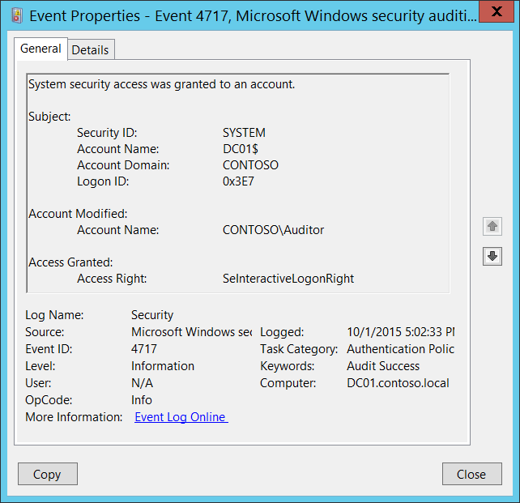

# 4717(S): システム セキュリティ アクセスがアカウントに付与されました。



***サブカテゴリ:***&nbsp;[認証ポリシー変更の監査](audit-authentication-policy-change.md)

***イベントの説明:***

このイベントは、ローカルの[ログオン ユーザー権限ポリシー](/previous-versions/windows/it-pro/windows-server-2003/cc728212(v=ws.10))が変更され、ログオン権限がアカウントに付与されるたびに生成されます。

複数のアカウントにログオン ユーザー権限が付与された場合、各ユーザーごとに一意のイベントが表示されます。

> **注**&nbsp;&nbsp;推奨事項については、このイベントの[セキュリティ監視の推奨事項](#security-monitoring-recommendations)を参照してください。

<br clear="all">

***イベント XML:***
```xml
- <Event xmlns="http://schemas.microsoft.com/win/2004/08/events/event">
- <System>
 <Provider Name="Microsoft-Windows-Security-Auditing" Guid="{54849625-5478-4994-A5BA-3E3B0328C30D}" /> 
 <EventID>4717</EventID> 
 <Version>0</Version> 
 <Level>0</Level> 
 <Task>13569</Task> 
 <Opcode>0</Opcode> 
 <Keywords>0x8020000000000000</Keywords> 
 <TimeCreated SystemTime="2015-10-02T00:02:33.213572000Z" /> 
 <EventRecordID>1049777</EventRecordID> 
 <Correlation /> 
 <Execution ProcessID="500" ThreadID="2064" /> 
 <Channel>Security</Channel> 
 <Computer>DC01.contoso.local</Computer> 
 <Security /> 
 </System>
- <EventData>
 <Data Name="SubjectUserSid">S-1-5-18</Data> 
 <Data Name="SubjectUserName">DC01$</Data> 
 <Data Name="SubjectDomainName">CONTOSO</Data> 
 <Data Name="SubjectLogonId">0x3e7</Data> 
 <Data Name="TargetSid">S-1-5-21-3457937927-2839227994-823803824-2104</Data> 
 <Data Name="AccessGranted">SeInteractiveLogonRight</Data> 
 </EventData>
 </Event>

```

***必要なサーバー ロール:*** なし。

***最小 OS バージョン:*** Windows Server 2008、Windows Vista。

***イベント バージョン:*** 0。

***フィールドの説明:***

**サブジェクト:**

-   **セキュリティ ID** \[タイプ = SID\]**:** ローカルのログオン権限ユーザー ポリシーを変更したアカウントの SID。イベント ビューアーは自動的に SID を解決してアカウント名を表示しようとします。SID を解決できない場合、イベントにソース データが表示されます。

> **注**&nbsp;&nbsp;**セキュリティ識別子 (SID)** は、トラスティ (セキュリティ プリンシパル) を識別するために使用される可変長の一意の値です。各アカウントには、Active Directory ドメイン コントローラーなどの権限によって発行され、セキュリティ データベースに保存される一意の SID があります。ユーザーがログオンするたびに、システムはデータベースからそのユーザーの SID を取得し、そのユーザーのアクセス トークンに配置します。システムはアクセス トークン内の SID を使用して、その後のすべての Windows セキュリティとのやり取りでユーザーを識別します。SID がユーザーまたはグループの一意の識別子として使用された場合、それは他のユーザーまたはグループを識別するために再び使用されることはありません。SID の詳細については、[セキュリティ識別子](/windows/access-protection/access-control/security-identifiers)を参照してください。

-   **アカウント名** \[タイプ = UnicodeString\]**:** ローカルログオン権限ユーザーポリシーに変更を加えたアカウントの名前。

-   **アカウントドメイン** \[タイプ = UnicodeString\]**:** サブジェクトのドメインまたはコンピュータ名。形式は以下のように異なります：

    -   ドメインのNETBIOS名の例: CONTOSO

    -   小文字の完全なドメイン名: contoso.local

    -   大文字の完全なドメイン名: CONTOSO.LOCAL

    -   一部の[よく知られたセキュリティプリンシパル](/windows/security/identity-protection/access-control/security-identifiers)の場合、例えばLOCAL SERVICEやANONYMOUS LOGON、このフィールドの値は「NT AUTHORITY」となります。

    -   ローカルユーザーアカウントの場合、このフィールドにはこのアカウントが属するコンピュータまたはデバイスの名前が含まれます。例えば：「Win81」。

-   **ログオンID** \[タイプ = HexInt64\]**:** 16進数の値で、同じログオンIDを含む最近のイベントとこのイベントを関連付けるのに役立ちます。例えば、「[4624](event-4624.md): アカウントが正常にログオンされました。」

**変更されたアカウント:**

-   **アカウント名** \[タイプ = SID\]: ログオン権限が付与されたセキュリティプリンシパルのSID。イベントビューアは自動的にSIDを解決し、アカウント名を表示しようとします。SIDが解決できない場合、イベントにソースデータが表示されます。

**付与されたアクセス:**

-   **アクセス権** \[タイプ = UnicodeString\]: 付与されたログオン権限の名前。このイベントは[ログオン権限](/previous-versions/windows/it-pro/windows-server-2003/cc728212(v=ws.10))に対してのみ生成されます。以下の通りです：

| 値                                 | グループポリシー名                             |
|-----------------------------------|-----------------------------------------------|
| SeNetworkLogonRight               | ネットワークからこのコンピュータにアクセスする |
| SeRemoteInteractiveLogonRight     | ターミナルサービスを介してログオンを許可する   |
| SeDenyNetworkLogonRight           | ネットワークからこのコンピュータへのアクセスを拒否する |
| SeDenyBatchLogonRight             | バッチジョブとしてのログオンを拒否する         |
| SeDenyServiceLogonRight           | サービスとしてのログオンを拒否する             |
| SeDenyInteractiveLogonRight       | ローカルでのログオンを拒否する                 |
| SeDenyRemoteInteractiveLogonRight | ターミナルサービスを介してのログオンを拒否する |
| SeBatchLogonRight                 | バッチジョブとしてログオンする                 |
| SeServiceLogonRight               | サービスとしてログオンする                     |
| SeInteractiveLogonRight           | ローカルでログオンする                         |

## セキュリティ監視の推奨事項

4717(S): システムセキュリティアクセスがアカウントに付与されました。

| **必要な監視の種類**                                                                                                                                                                                                                                                                                   | **推奨事項**                                                                                                                                                                                                                                                                                                                                                                                                                                                                                   |
|-------------------------------------------------------------------------------------------------------------------------------------------------------------------------------------------------------------------------------------------------------------------------------------------------------------------|------------------------------------------------------------------------------------------------------------------------------------------------------------------------------------------------------------------------------------------------------------------------------------------------------------------------------------------------------------------------------------------------------------------------------------------------------------------------------------------------------|
| **SYSTEMアカウントによって通常実行されるアクション**: このイベントおよび他の特定のイベントがSYSTEM以外のアカウントによってトリガーされているかどうかを監視する必要があります。                                                                                                                                     | このイベントは通常SYSTEMアカウントによってトリガーされるため、**「Subject\\Security ID」**がSYSTEMでない場合に報告することをお勧めします。                                                                                                                                                                                                                                                                                                                                                  |
| **高価値アカウント**: 各アクションを監視する必要がある高価値のドメインまたはローカルアカウントがあるかもしれません。<br>高価値アカウントの例としては、データベース管理者、組み込みのローカル管理者アカウント、ドメイン管理者、サービスアカウント、ドメインコントローラーアカウントなどがあります。 | 高価値アカウントに対応する**「Subject\\Security ID」**および「**Account Modified\\Account Name」**でこのイベントを監視します。                                                                                                                                                                                                                                                                                                                                               |
| **異常または悪意のあるアクション**: 異常を検出したり、潜在的な悪意のあるアクションを監視するための特定の要件があるかもしれません。例えば、勤務時間外のアカウント使用を監視する必要があるかもしれません。                                                                                | 異常または悪意のあるアクションを監視する場合、特定のアカウントがどのようにまたはいつ使用されているかを監視するために、**「Subject\\Security ID」**（および他の情報）を使用します。                                                                                                                                                                                                                                                                                                                          |
| **非アクティブアカウント**: 非アクティブ、無効、またはゲストアカウント、その他使用されるべきでないアカウントがあるかもしれません。                                                                                                                                                                                     | 使用されるべきでないアカウントに対応する**「Subject\\Security ID」**でこのイベントを監視します。                                                                                                                                                                                                                                                                                                                                                                                   |
| **アカウント許可リスト**: 特定のイベントに対応するアクションを実行することが許可されているアカウントの特定の許可リストがあるかもしれません。                                                                                                                                                      | このイベントが「許可リストのみ」のアクションに対応する場合、許可リスト外のアカウントに対して**「Subject\\Security ID」**を確認します。<br>特定のコンピュータにログオンできるアカウントの許可リストなど、特定のユーザーログオン権限ポリシーがある場合、このイベントを監視して、適切な「**Account Modified\\Account Name**」にのみ「**Access Right**」が付与されていることを確認します。                                                                                  |
| **異なる種類のアカウント**: 特定のアクションが特定のアカウントタイプ（例えば、ローカルまたはドメインアカウント、マシンまたはユーザーアカウント、ベンダーまたは従業員アカウントなど）によってのみ実行されることを確認したいかもしれません。                                                                                 | このイベントが特定のアカウントタイプに対して監視したいアクションに対応する場合、**「Subject\\Security ID」**および「**Account Modified\\Account Name」**を確認して、アカウントタイプが予想通りであるかどうかを確認します。<br>例えば、非サービスアカウントが特定のログオン権限（例えば、**SeServiceLogonRight**）を付与されるべきでない場合、これらのアカウントと権限に対してこのイベントを監視します。                                                                                            |
| **外部アカウント**: 別のドメインからのアカウントや、特定のアクション（特定のイベントによって表される）を実行することが許可されていない「外部」アカウントを監視しているかもしれません。                                                                                                                     | 別のドメインからのアカウントや「外部」アカウントに対応する**「Subject\\Account Domain」**に対してこのイベントを監視します。                                                                                                                                                                                                                                                                                                                                                                       |
| **使用が制限されたコンピュータまたはデバイス**: 特定の人（アカウント）が限られたアクションのみを実行するか、全くアクションを実行しないべき特定のコンピュータ、マシン、またはデバイスがあるかもしれません。                                                                                                                     | 関心のある**「Subject\\Security ID」**によって実行されたアクションに対してターゲット**コンピュータ:**（または他のターゲットデバイス）を監視します。また、「**Account Modified\\Account Name**」を確認して、そのアカウントにログオン権限が付与されるべきかどうかを確認します。<br>高価値のサーバーや他のコンピュータに対して、このイベントを追跡し、特定の「**Access Right**」が各ケースで「**Account Modified\\Account Name**」に付与されるべきかどうかを調査することをお勧めします。 |
| **制限されるべきログオン権限**: 監視したいユーザーログオン権限のリストがあるかもしれません（例えば、**SeServiceLogonRight**）。                                                                                                                                                           | このイベントを監視し、**「Access Right」**を制限された権限のリストと比較します。                                                                                                                                                                                                                                                                                                                                                                                                             |
| **アカウント命名規則**: 組織にはアカウント名の特定の命名規則があるかもしれません。                                                                                                                                                                                                       | 命名規則に従わない名前に対して「**Subject\\Account Name」**を監視します。                                                                                                                                                                                                                                                                                                                                                                                                             |
