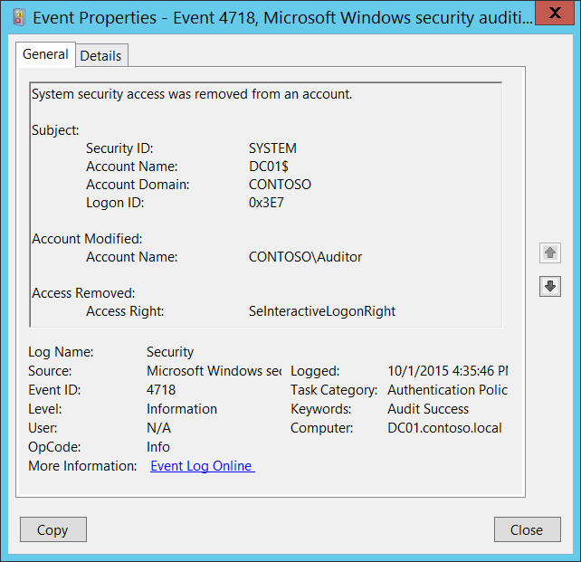

# 4718(S): システムセキュリティアクセスがアカウントから削除されました。



***サブカテゴリ:***&nbsp;[認証ポリシー変更の監査](audit-authentication-policy-change.md)

***イベントの説明:***

このイベントは、ローカルの[ログオンユーザー権利ポリシー](/previous-versions/windows/it-pro/windows-server-2003/cc728212(v=ws.10))が変更され、ログオン権利がアカウントから削除されるたびに生成されます。

複数のアカウントからログオンユーザー権利が削除された場合、各ユーザーごとに一意のイベントが表示されます。

> **注**&nbsp;&nbsp;推奨事項については、このイベントの[セキュリティ監視の推奨事項](#security-monitoring-recommendations)を参照してください。

<br clear="all">

***イベント XML:***
```
- <Event xmlns="http://schemas.microsoft.com/win/2004/08/events/event">
- <System>
 <Provider Name="Microsoft-Windows-Security-Auditing" Guid="{54849625-5478-4994-A5BA-3E3B0328C30D}" /> 
 <EventID>4718</EventID> 
 <Version>0</Version> 
 <Level>0</Level> 
 <Task>13569</Task> 
 <Opcode>0</Opcode> 
 <Keywords>0x8020000000000000</Keywords> 
 <TimeCreated SystemTime="2015-10-01T23:35:46.375134200Z" /> 
 <EventRecordID>1049773</EventRecordID> 
 <Correlation /> 
 <Execution ProcessID="500" ThreadID="5028" /> 
 <Channel>Security</Channel> 
 <Computer>DC01.contoso.local</Computer> 
 <Security /> 
 </System>
- <EventData>
 <Data Name="SubjectUserSid">S-1-5-18</Data> 
 <Data Name="SubjectUserName">DC01$</Data> 
 <Data Name="SubjectDomainName">CONTOSO</Data> 
 <Data Name="SubjectLogonId">0x3e7</Data> 
 <Data Name="TargetSid">S-1-5-21-3457937927-2839227994-823803824-2104</Data> 
 <Data Name="AccessRemoved">SeInteractiveLogonRight</Data> 
 </EventData>
 </Event>

```

***必要なサーバー役割:*** なし。

***最小 OS バージョン:*** Windows Server 2008, Windows Vista。

***イベントバージョン:*** 0。

***フィールドの説明:***

**サブジェクト:**

-   **セキュリティ ID** \[タイプ = SID\]**:** ローカルログオン権利ユーザーポリシーを変更したアカウントのSID。イベントビューアーは自動的にSIDを解決し、アカウント名を表示しようとします。SIDが解決できない場合、イベントにソースデータが表示されます。

> **注**&nbsp;&nbsp;**セキュリティ識別子 (SID)** は、トラスティ (セキュリティプリンシパル) を識別するために使用される可変長の一意の値です。各アカウントには、Active Directory ドメインコントローラーなどの権限によって発行され、セキュリティデータベースに保存される一意のSIDがあります。ユーザーがログオンするたびに、システムはデータベースからそのユーザーのSIDを取得し、そのユーザーのアクセス トークンに配置します。システムは、アクセス トークン内のSIDを使用して、以降のすべてのWindowsセキュリティとのやり取りでユーザーを識別します。SIDがユーザーまたはグループの一意の識別子として使用された場合、それは他のユーザーまたはグループを識別するために再利用されることはありません。SIDの詳細については、[セキュリティ識別子](/windows/access-protection/access-control/security-identifiers)を参照してください。

-   **アカウント名** \[タイプ = UnicodeString\]**:** ローカルログオン権限ユーザーポリシーに変更を加えたアカウントの名前。

-   **アカウントドメイン** \[タイプ = UnicodeString\]**:** サブジェクトのドメインまたはコンピュータ名。形式は以下のように異なります：

    -   ドメイン NETBIOS 名の例: CONTOSO

    -   小文字の完全ドメイン名: contoso.local

    -   大文字の完全ドメイン名: CONTOSO.LOCAL

    -   一部の[よく知られたセキュリティプリンシパル](/windows/security/identity-protection/access-control/security-identifiers)の場合、例えば LOCAL SERVICE や ANONYMOUS LOGON、このフィールドの値は “NT AUTHORITY” です。

    -   ローカルユーザーアカウントの場合、このフィールドにはこのアカウントが属するコンピュータまたはデバイスの名前が含まれます。例えば: “Win81”。

-   **ログオン ID** \[タイプ = HexInt64\]**:** 16進数の値で、最近のイベントと同じログオン ID を含む可能性のあるイベントとこのイベントを関連付けるのに役立ちます。例えば、 “[4624](event-4624.md): アカウントが正常にログオンされました。”

**変更されたアカウント:**

-   **アカウント名** \[タイプ = SID\]: ログオン権限が削除されたセキュリティプリンシパルの SID。イベントビューアーは自動的に SID を解決し、アカウント名を表示しようとします。SID が解決できない場合、イベントにソースデータが表示されます。

**削除されたアクセス:**

-   **アクセス権** \[タイプ = UnicodeString\]: 削除されたログオン権限の名前。このイベントは[ログオン権限](/previous-versions/windows/it-pro/windows-server-2003/cc728212(v=ws.10))に対してのみ生成されます。以下の通りです：

| 値                                 | グループポリシー名                             |
|-----------------------------------|-----------------------------------------------|
| SeNetworkLogonRight               | ネットワークからこのコンピュータへのアクセス         |
| SeRemoteInteractiveLogonRight     | ターミナルサービスを介したログオンを許可する         |
| SeDenyNetworkLogonRight           | ネットワークからこのコンピュータへのアクセスを拒否する |
| SeDenyBatchLogonRight             | バッチジョブとしてのログオンを拒否する             |
| SeDenyServiceLogonRight           | サービスとしてのログオンを拒否する               |
| SeDenyInteractiveLogonRight       | ローカルでのログオンを拒否する                   |
| SeDenyRemoteInteractiveLogonRight | ターミナルサービスを介したログオンを拒否する       |
| SeBatchLogonRight                 | バッチジョブとしてログオンする                   |
| SeServiceLogonRight               | サービスとしてログオンする                       |
| SeInteractiveLogonRight           | ローカルでログオンする                           |

## セキュリティ監視の推奨事項

4718(S): アカウントからシステムセキュリティアクセスが削除されました。

| **必要な監視の種類**                                                                                                                                                                                                                                                                                                      | **推奨事項**                                                                                                                                                                                                                                                                                                                                                                                                                                                                                                                                                                                                                                                                                                           |
|--------------------------------------------------------------------------------------------------------------------------------------------------------------------------------------------------------------------------------------------------------------------------------------------------------------------------------------|------------------------------------------------------------------------------------------------------------------------------------------------------------------------------------------------------------------------------------------------------------------------------------------------------------------------------------------------------------------------------------------------------------------------------------------------------------------------------------------------------------------------------------------------------------------------------------------------------------------------------------------------------------------------------------------------------------------------------|
| **通常SYSTEMアカウントによって実行されるアクション**: このイベントおよび他の特定のイベントがSYSTEM以外のアカウントによってトリガーされているかどうかを監視する必要があります。                                                                                                                                                        | このイベントは通常SYSTEMアカウントによってトリガーされるため、**「Subject\\Security ID」**がSYSTEMでない場合に報告することをお勧めします。                                                                                                                                                                                                                                                                                                                                                                                                                                                                                                                                                                          |
| **高価値アカウント**: ドメインまたはローカルの高価値アカウントがあり、それぞれのアクションを監視する必要があるかもしれません。<br>高価値アカウントの例としては、データベース管理者、組み込みのローカル管理者アカウント、ドメイン管理者、サービスアカウント、ドメインコントローラーアカウントなどがあります。                    | **「Subject\\Security ID」**および**「Account Modified\\Account Name」**が高価値アカウントに対応するこのイベントを監視します。                                                                                                                                                                                                                                                                                                                                                                                                                                                                                                                                                                       |
| **異常または悪意のあるアクション**: 異常を検出したり、潜在的な悪意のあるアクションを監視するための特定の要件があるかもしれません。例えば、勤務時間外のアカウント使用を監視する必要があるかもしれません。                                                                                                   | 異常や悪意のあるアクションを監視する際には、**「Subject\\Security ID」**（および他の情報）を使用して特定のアカウントがどのように、またはいつ使用されているかを監視します。                                                                                                                                                                                                                                                                                                                                                                                                                                                                                                                                                  |
| **非アクティブアカウント**: 非アクティブ、無効、またはゲストアカウント、その他使用されるべきでないアカウントがあるかもしれません。                                                                                                                                                                                                        | 使用されるべきでないアカウントに対応する**「Subject\\Security ID」**でこのイベントを監視します。                                                                                                                                                                                                                                                                                                                                                                                                                                                                                                                                                                                                           |
| **アカウントの許可リスト**: 特定のイベントに対応するアクションを実行することが許可されているアカウントの特定の許可リストがあるかもしれません。                                                                                                                                                                         | このイベントが「許可リストのみ」のアクションに対応する場合、許可リスト外のアカウントに対して**「Subject\\Security ID」**を確認します。<br>特定のコンピュータにログオンできるアカウントの許可リストなど、特定のユーザーログオン権限ポリシーがある場合、このイベントを監視して「**Access Right**」が「**Account Modified\\Account Name**」から削除されることが適切であったかどうかを確認します。                                                                                                                                                                                                                                                                                                     |
| **異なる種類のアカウント**: 特定のアクションが特定のアカウント種類（例えば、ローカルまたはドメインアカウント、マシンまたはユーザーアカウント、ベンダーまたは従業員アカウントなど）によってのみ実行されることを確認したいかもしれません。                                                                                                    | このイベントが特定のアカウント種類に対して監視したいアクションに対応する場合、**「Subject\\Security ID」**および**「Account Modified\\Account Name」**を確認してアカウント種類が期待通りであるかどうかを確認します。<br>例えば、重要なリモートネットワークサービスアカウントが削除されるべきでないユーザーログオン権限（例えば、**SeNetworkLogonRight**）を持っている場合、このイベントを**「Account Modified\\Account Name」**および適切な権限に対して監視します。<br>別の例として、非サービスアカウントが特定のログオン権限（例えば、**SeServiceLogonRight**）を付与されるべきでない場合、このイベントを監視するかもしれません。なぜなら、権限は以前に付与された後にのみ削除されることができるからです。 |
| **外部アカウント**: 別のドメインからのアカウントや、特定のアクションを実行することが許可されていない「外部」アカウント（特定のイベントによって表される）を監視しているかもしれません。                                                                                                                                        | 別のドメインからのアカウントや「外部」アカウントに対応する**「Subject\\Account Domain」**に対してこのイベントを監視します。                                                                                                                                                                                                                                                                                                                                                                                                                                                                                                                                                                                               |
| **使用が制限されたコンピュータやデバイス**: 特定のコンピュータ、マシン、またはデバイスで特定の人（アカウント）が限られたアクションのみを実行するか、まったくアクションを実行しないようにする必要があるかもしれません。                                                                                                                                        | 関心のある**「Subject\\Security ID」**によって実行されたアクションに対してターゲット**コンピュータ:**（または他のターゲットデバイス）を監視します。また、そのアカウントからログオン権限が削除されるべきかどうかを確認するために**「Account Modified\\Account Name」**を必ず確認します。<br>高価値のサーバーや他のコンピュータに対して、このイベントを追跡し、特定の「**Access Right**」が各ケースで「**Account Modified\\Account Name**」から削除されるべきかどうかを調査することをお勧めします。                                                                                                                                                                                                                     |
| **制限されるべきログオン権限**: 監視したいユーザーログオン権限のリストがあるかもしれません（例えば、**SeServiceLogonRight**）。<br>**削除されるべきでない「拒否」権限**: 組織が使用する削除されるべきでない「拒否」権限があるかもしれません。例えば、SeDenyRemoteInteractiveLogonRight。 | -   このイベントを監視し、**「Access Right」**を制限された権限のリストと比較します。<br>付与されるべきでなかった権限の削除を発見し、さらに調査できるようにこのイベントを監視します。<br>また、このイベントを監視して「拒否」権限の削除を発見することもできます。これらの権限が削除されると、それは承認されたアクション、誤って行われたもの、または悪意のある活動の一部である可能性があります。これらの権限には以下が含まれます:<br>SeDenyNetworkLogonRight:<br>SeDenyBatchLogonRight<br>SeDenyServiceLogonRight<br>SeDenyInteractiveLogonRight<br>SeDenyRemoteInteractiveLogonRight                                                                              |
| **アカウント命名規則**: 組織にはアカウント名に対する特定の命名規則があるかもしれません。                                                                                                                                                                                                                          | 命名規則に従わない名前に対して「**Subject\\Account Name」**を監視します。                                                                                                                                                                                                                                                                                                                                                                                                                                                                                                                                                                                                                                     |
